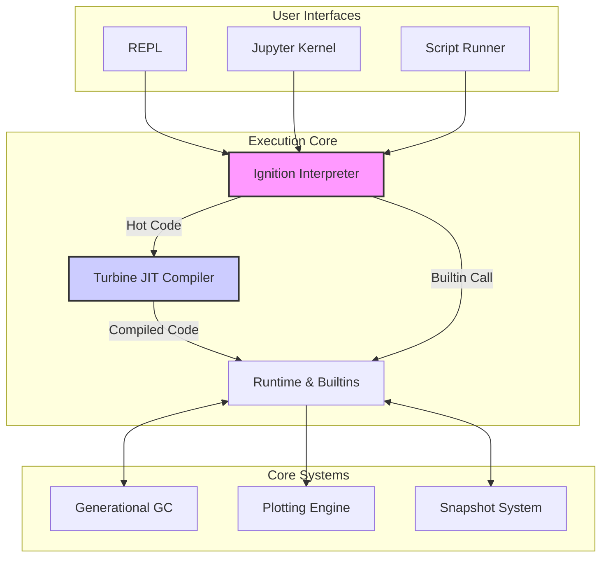

# RustMat: High-Performance MATLAB/Octave Runtime in Rust

## Developed by Dystr Inc. (dystr.com)

[
[
[

**RustMat is a modern, high-performance runtime for MATLAB® and GNU Octave code, built from the ground up in Rust.** It features a V8-inspired tiered execution engine with a baseline interpreter and an optimizing JIT compiler, a high-performance generational garbage collector, a world-class interactive plotting library, and seamless Jupyter kernel integration. RustMat is designed to be blazingly fast, memory-safe, and highly extensible.

Whether you're running complex numerical simulations, executing scripts in a high-performance environment, or looking for a modern interactive experience in a Jupyter notebook, RustMat provides the power and safety of Rust with the familiar syntax of MATLAB.

---

### ✨ World-Class Interactive Plotting

RustMat includes a GPU-accelerated plotting library with a beautiful, modern aesthetic.

*(Image placeholder: A screenshot of the interactive plot window showing a multi-plot figure with the `ModernDark` theme, demonstrating lines, scatters, and bars with smooth anti-aliasing and a clean UI.)*

---

## Why RustMat?

RustMat isn't just another MATLAB clone; it's a complete rethinking of the runtime, designed for the modern era of computing.

-   🚀 **Blazing Fast Performance**: At its core is a V8-inspired, multi-tier execution engine. Code starts in the `Ignition` interpreter for fast startup, and a `Turbine` profiler identifies "hot" functions to be compiled to highly-optimized native machine code with our Cranelift-based JIT compiler.
-   🎨 **Modern, Interactive Plotting**: Our `rustmat-plot` library provides a GPU-accelerated plotting experience powered by `wgpu`. Create beautiful, interactive 2D and 3D plots that are more responsive and aesthetically pleasing than traditional backends.
-   🪐 **Full Jupyter Kernel Integration**: RustMat works as a first-class Jupyter kernel, allowing you to run MATLAB/Octave code in JupyterLab and Jupyter Notebooks with full support for plotting and interactive widgets.
-   ⚡ **Instant Startup with Snapshots**: We've eliminated slow startup times. The `rustmat-snapshot` system pre-compiles the entire standard library into a binary blob that can be memory-mapped at launch, providing a near-instantaneous REPL and kernel startup.
-   🛡️ **Memory Safe & Concurrent**: Built in Rust, RustMat guarantees memory safety, eliminating entire classes of bugs. Its generational garbage collector is designed for the demands of numerical computing, efficiently managing memory for large matrices and temporary objects.
-   兼容 **MATLAB/Octave Compatibility**: The parser and runtime are designed to be highly compatible with existing MATLAB and GNU Octave scripts, making it easy to migrate your existing codebase.
-   🔧 **Extensible Standard Library**: Adding new high-performance functions is trivial. Simply write a standard Rust function and add a `#[runtime_builtin]` macro. The runtime handles the rest, making it easy to extend RustMat with your own custom, high-performance code.

## 🏁 Getting Started

Getting up and running with RustMat is simple.

### Prerequisites

You need the Rust toolchain (>= 1.70) installed. You can get it from [rustup.rs](https://rustup.rs/).

```bash
# For Debian/Ubuntu-based systems (for plotting dependencies)
sudo apt-get install build-essential pkg-config libgtk-3-dev

# For Fedora/CentOS-based systems
sudo dnf install clang gcc-c++ pkg-config gtk3-devel

# For macOS (Xcode command line tools are sufficient)
xcode-select --install
```

### 1. Installation

Install RustMat directly from Crates.io using Cargo:

```bash
cargo install rustmat --features gui
```

To build from source for development:

```bash
git clone https://github.com/rustmat/rustmat.git
cd rustmat
cargo build --release --features gui
```

### 2. Running the REPL

Start the interactive Read-Eval-Print Loop (REPL):

```bash
rustmat
```

You'll be greeted with the RustMat prompt:

```
RustMat Interactive Console v0.0.1
High-performance MATLAB/Octave runtime with JIT compilation
JIT compiler: enabled (Cranelift optimization level: Speed)
Garbage collector: default
Type 'help' for help, 'exit' to quit, '.info' for system information

rustmat>
```

### 3. Running a Script

Execute any `.m` file directly:

```bash
rustmat run your_script.m
```

### 4. Using the Jupyter Kernel

To use RustMat in JupyterLab or Jupyter Notebook, you need to register its kernelspec.

1.  **Ensure Jupyter is installed**: `pip install jupyterlab`
2.  **Register the kernel**: _(Note: A dedicated installer is planned. For now, this is a manual process.)_

    Create a file `kernel.json` in a directory like `~/.local/share/jupyter/kernels/rustmat/`:

    ```json
    {
     "argv": ["/path/to/your/rustmat/binary", "kernel-connection", "{connection_file}"],
     "display_name": "RustMat",
     "language": "matlab"
    }
    ```

    Replace `/path/to/your/rustmat/binary` with the path to the compiled `rustmat` executable. Now, when you launch JupyterLab, "RustMat" will appear as an available kernel.

## 📖 Usage Examples

### Basic Arithmetic & Matrices

```matlab
% Variables are dynamically typed
x = 10.5;
y = [1, 2, 3; 4, 5, 6]; % Create a 2x3 matrix

% Element-wise operations and matrix multiplication
z = y .* 2;       % Element-wise multiplication
A = [1 1; 2 2];
B = [3 3; 4 4];
C = A * B;        % Matrix multiplication

% Display results
disp(C);
```

### Loops & Control Flow

```matlab
% Calculate the sum of the first 10 squares
total = 0;
for i = 1:10
    if mod(i, 2) == 0
        % Only sum even squares
        total = total + i^2;
    end
end

fprintf('Sum of even squares: %d\n', total);
```

### Interactive Plotting

Create a beautiful, multi-plot figure with just a few lines of code.

```matlab
% Generate data
x = 0:0.1:2*pi;
y1 = sin(x);
y2 = cos(x);

% Create a new figure and plot
figure;
plot(x, y1, 'LineWidth', 2, 'DisplayName', 'sin(x)');
hold on; % Overlay the next plot
scatter(x, y2, 'filled', 'DisplayName', 'cos(x)');
hold off;

% Add labels and a legend
title('Sine and Cosine Waves');
xlabel('Angle [rad]');
ylabel('Value');
grid on;
legend('show');
```

When run with RustMat, this will open a GPU-accelerated interactive window displaying the plot.

## 🏗️ Architecture & Key Components

RustMat's power comes from its highly modular, multi-crate architecture.



-   `rustmat-repl` / `rustmat-kernel`: User-facing interfaces for the command line and Jupyter.
-   `rustmat-parser` & `rustmat-hir`: The frontend that transforms source code into a semantic-rich High-level IR.
-   `rustmat-ignition`: The baseline bytecode interpreter, ensuring all code runs from the start.
-   `rustmat-turbine`: The optimizing JIT compiler that recompiles hot code for native performance.
-   `rustmat-runtime`: Implements all the builtin functions (`sin`, `plot`, matrix ops) and provides optional BLAS/LAPACK integration.
-   `rustmat-gc`: The high-performance generational garbage collector.
-   `rustmat-plot`: The world-class, GPU-accelerated interactive plotting library.
-   `rustmat-snapshot`: The build-time system for creating fast-loading startup snapshots.

For a deeper dive, see our full [Architecture Document](./crates/rustmat/ARCHITECTURE.md).

## ⚙️ Configuration

RustMat is highly configurable. You can create a `.rustmat.yaml` file in your project or home directory to tune the JIT, GC, plotting, and more.

Run `rustmat config generate` to create a sample configuration file with all available options.

## 🤝 Contributing

We welcome contributions of all kinds! Whether you're interested in improving the parser, adding new standard library functions, or enhancing the JIT compiler, there are many ways to get involved.

1.  Check out our [open issues](https://github.com/rustmat/rustmat/issues).
2.  Read our [Architecture Document](./crates/rustmat/ARCHITECTURE.md) to understand how the system works.
3.  Fork the repository and submit a pull request!

A great place to start is by adding a new builtin function in `crates/rustmat-runtime`—it's incredibly easy thanks to our `#[runtime_builtin]` macro.

## 📜 License

RustMat is dual-licensed under the terms of both the MIT License and the Apache License (Version 2.0).

---

*MATLAB® is a registered trademark of The MathWorks, Inc.*