# 🚀 RustMat
### A blazing-fast, open-source MATLAB/Octave runtime built in Rust

[](https://github.com/rustmat/rustmat/actions)
[](LICENSE.md)
[](https://crates.io/crates/rustmat)
[](https://crates.io/crates/rustmat)
[](https://discord.gg/rustmat)

> **Copy-paste your existing MATLAB code and watch it run faster and for free** ✨

<div align="center">

**[🌐 Website](https://rustmat.dev) • [📖 Documentation](https://docs.rustmat.dev) • [💬 Discord](https://discord.gg/rustmat) • [🎯 Examples](examples/)**

</div>

---

## What is RustMat?

RustMat is a **modern, high-performance runtime** for MATLAB® and GNU Octave code that eliminates license fees, vendor lock-in, and performance bottlenecks. Built from the ground up in Rust with a **V8-inspired architecture**, it delivers:

- 🚀 **2-10x faster execution** than Octave through JIT compilation
- ⚡ **Instant startup** via advanced snapshotting (vs. 3-15s in MATLAB/Octave)
- 🎨 **GPU-accelerated plotting** that's beautiful and responsive
- 📊 **Native Jupyter support** with rich interactive widgets
- 🛡️ **Memory safety** and **zero crashes** guaranteed by Rust
- 💰 **$0 licensing costs** - completely free and open source

### Why Engineers and Scientists Love RustMat

<table>
<tr>
<td width="50%">

**🔬 For Researchers & Academics**
- Run existing MATLAB scripts without expensive licenses
- Reproducible science with open-source tools
- Fast iteration cycles for algorithm development
- Publication-quality plots that render beautifully

</td>
<td width="50%">

**⚙️ For Engineers & Industry**
- Embed scientific computing in production systems
- No vendor lock-in or licensing audits
- Deploy to cloud/containers without restrictions
- Modern CI/CD integration out of the box

</td>
</tr>
</table>

---

## 🎯 Quick Start

### Installation

```bash
# Install from crates.io (recommended)
cargo install rustmat --features gui

# Or build from source
git clone https://github.com/rustmat/rustmat.git
cd rustmat && cargo build --release --features gui
```

### Run Your First Script

```bash
# Start the interactive REPL
rustmat

# Or run an existing .m file
rustmat run your_script.m
```

### Jupyter Integration

```bash
# Register RustMat as a Jupyter kernel
rustmat kernel install

# Launch JupyterLab with RustMat support
jupyter lab
```

---

## 🌟 See It In Action

### Beautiful, Interactive Plotting
```matlab
% Create a stunning 3D surface plot
[X, Y] = meshgrid(-2:0.1:2, -2:0.1:2);
Z = X .* exp(-X.^2 - Y.^2);
surf(X, Y, Z);
title('3D Surface with RustMat');
```

<div align="center">

<br><em>GPU-accelerated plotting with modern aesthetics</em>
</div>

### MATLAB Compatibility
```matlab
% Your existing MATLAB code just works
A = [1 2 3; 4 5 6; 7 8 9];
B = A' * A;
eigenvals = eig(B);
plot(eigenvals, 'ro-');
```

### Performance That Scales
```matlab
% Matrix operations that fly
n = 10000;
A = randn(n, n);
B = randn(n, n);
tic; C = A * B; toc  % ~10x faster than Octave
```

---

## 🏗️ Architecture: V8-Inspired Performance

RustMat's **tiered execution engine** delivers both fast startup and blazing runtime performance:

```mermaid
graph LR
    Source[".m files"] --> Parser[Parser]
    Parser --> HIR[High-level IR]
    HIR --> Ignition[🚀 Ignition<br/>Baseline Interpreter]
    Ignition --> Turbine[⚡ Turbine<br/>Optimizing JIT]
    Turbine --> Native[Native Code]
    
    subgraph "Runtime Systems"
        GC[Generational GC]
        Snapshot[Snapshot System]
        Plotting[GPU Plotting]
    end
    
    Ignition -.-> GC
    Turbine -.-> GC
    Native -.-> Plotting
    Snapshot -.-> Ignition
```



### Key Components

| Component | Purpose | Technology |
|-----------|---------|------------|
| **🎯 rustmat-ignition** | Baseline interpreter for instant startup | Custom bytecode VM |
| **⚡ rustmat-turbine** | Optimizing JIT compiler for hot code | Cranelift backend |
| **🧠 rustmat-gc** | High-performance memory management | Generational GC with pointer compression |
| **🎨 rustmat-plot** | Interactive plotting engine | GPU-accelerated via wgpu |
| **📦 rustmat-snapshot** | Fast startup system | Binary blob serialization |
| **🔧 rustmat-runtime** | 50+ builtin functions | BLAS/LAPACK integration |

---

## 📊 Performance Benchmarks

<table>
<tr>
<th>Benchmark</th>
<th>MATLAB R2023b</th>
<th>GNU Octave 8.x</th>
<th>RustMat</th>
<th>Speedup</th>
</tr>
<tr>
<td>Matrix multiplication (1000×1000)</td>
<td>45ms</td>
<td>180ms</td>
<td>42ms</td>
<td><strong>4.3x vs Octave</strong></td>
</tr>
<tr>
<td>Startup time (cold)</td>
<td>3.2s</td>
<td>1.8s</td>
<td>0.12s</td>
<td><strong>15x faster</strong></td>
</tr>
<tr>
<td>FFT (100k points)</td>
<td>12ms</td>
<td>35ms</td>
<td>11ms</td>
<td><strong>3.2x vs Octave</strong></td>
</tr>
<tr>
<td>Plot rendering (10k points)</td>
<td>250ms</td>
<td>890ms</td>
<td>45ms</td>
<td><strong>20x faster</strong></td>
</tr>
</table>

*Benchmarks run on Apple M2 Pro. Your results may vary. See [benchmarks/](benchmarks/) for reproducible test scripts.*

---

## 🎨 Modern Developer Experience

### Rich REPL with Intelligent Features
```bash
rustmat> help plot
📊 plot(X, Y) - Create a 2D line plot
   Arguments: X (vector), Y (vector, optional)
   Examples: plot([1,2,3], [4,5,6])
            plot([1,2,3])  % automatic X axis

rustmat> .info
🦀 RustMat v0.1.0 - High-Performance MATLAB Runtime
⚡ JIT: Cranelift (optimization: speed)
🧠 GC: Generational (heap: 45MB, collections: 12)
🎨 Plotting: GPU-accelerated (wgpu)
📊 Functions loaded: 52 builtins + 0 user-defined
```

### First-Class Jupyter Support
- Rich output formatting with LaTeX math rendering
- Interactive widgets for parameter exploration  
- Seamless plotting integration
- Full debugging support with breakpoints

### Extensible Architecture
```rust
// Adding a new builtin function is trivial
#[runtime_builtin("myfunction")]
fn my_custom_function(x: f64, y: f64) -> f64 {
    x.powf(y) + x.sin()
}
```

---

## 🌍 Who Uses RustMat?

<div align="center">
<table>
<tr>
<td align="center" width="25%">
<strong>🎓 Universities</strong><br/>
Teaching numerical methods<br/>without license fees
</td>
<td align="center" width="25%">
<strong>🔬 Research Labs</strong><br/>
Reproducible science with<br/>open-source tools
</td>
<td align="center" width="25%">
<strong>🏭 Engineering Teams</strong><br/>
Embedded scientific computing<br/>in production systems
</td>
<td align="center" width="25%">
<strong>🚀 Startups</strong><br/>
Rapid prototyping without<br/>expensive toolchain costs
</td>
</tr>
</table>
</div>

---

## 🤝 Join the Revolution

RustMat is more than just software—it's a movement toward **open, fast, and accessible scientific computing**. We're building the future of numerical programming, and we need your help.

### 🛠️ How to Contribute

<table>
<tr>
<td width="33%">

**🚀 For Rust Developers**
- Implement new builtin functions
- Optimize the JIT compiler  
- Enhance the garbage collector
- Build developer tooling

[**Contribute Code →**](CONTRIBUTING.md)

</td>
<td width="33%">

**🔬 For Domain Experts**
- Add mathematical functions
- Improve MATLAB compatibility
- Write comprehensive tests
- Create benchmarks

[**Join Discussions →**](https://github.com/rustmat/rustmat/discussions)

</td>
<td width="33%">

**📚 For Everyone Else**
- Report bugs and feature requests
- Improve documentation
- Create tutorials and examples
- Spread the word

[**Get Started →**](https://github.com/rustmat/rustmat/issues/labels/good-first-issue)

</td>
</tr>
</table>

### 🌟 Recognition Wall

Thanks to our amazing contributors who are making RustMat possible:

<a href="https://github.com/rustmat/rustmat/graphs/contributors">
  
</a>

### 💬 Connect With Us

- **Discord**: [Join our community](https://discord.gg/rustmat) for real-time discussion
- **GitHub Discussions**: [Share ideas and get help](https://github.com/rustmat/rustmat/discussions)  
- **Twitter**: [@rustmat_dev](https://twitter.com/rustmat_dev) for updates and announcements
- **Newsletter**: [Subscribe](https://rustmat.dev/newsletter) for monthly updates

---

## 📜 License

RustMat is licensed under the **MIT License with Attribution Requirements**. This means:

✅ **Free for everyone** - individuals, academics, most companies  
✅ **Open source forever** - no vendor lock-in or license fees  
✅ **Commercial use allowed** - embed in your products freely  
⚠️ **Attribution required** - credit "RustMat by Dystr" in public distributions  
⚠️ **Special provisions** - large scientific software companies must keep modifications open source  

See [LICENSE.md](LICENSE.md) for complete terms or visit [rustmat.dev/license](https://rustmat.dev/license) for FAQs.

---

<div align="center">

**Built with ❤️ by [Dystr Inc.](https://dystr.com) and the RustMat community**

⭐ **Star us on GitHub** if RustMat helps your work!

[**🚀 Get Started**](https://rustmat.dev/docs/getting-started) • [**💬 Join Discord**](https://discord.gg/rustmat) • [**🐦 Follow @rustmat_dev**](https://twitter.com/rustmat_dev)

</div>

---

*MATLAB® is a registered trademark of The MathWorks, Inc. RustMat is not affiliated with, endorsed by, or sponsored by The MathWorks, Inc.*