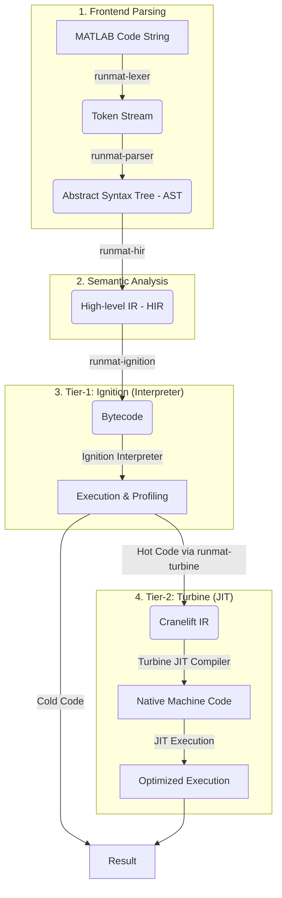
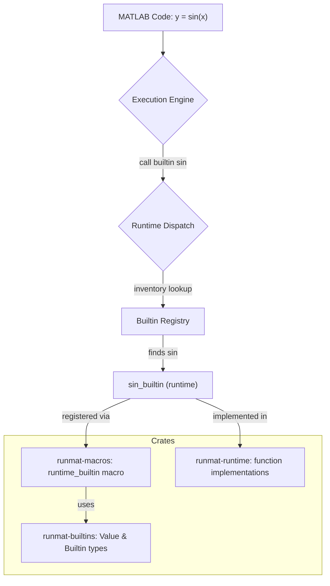

# RunMat Architecture

RunMat is a high-performance, MATLAB-compatible runtime built in Rust. Its design is heavily inspired by modern high-performance language runtimes like the V8 JavaScript engine, adapting concepts like tiered execution and snapshotting to the specific needs of a numerical computing environment.

This document provides a comprehensive overview of the RunMat architecture. It is intended for current and future contributors who wish to understand the internal workings of the system, its design principles, and how its various components fit together.

## Core Philosophy

The architecture is guided by a few key principles:

1.  **Performance from the Ground Up**: Every component is designed with performance in mind. This includes a tiered JIT compiler, a high-performance generational garbage collector, zero-copy data structures where possible, and optional integration with native BLAS/LAPACK libraries.
2.  **Safety and Modularity**: By leveraging Rust's safety guarantees and a highly modular crate-based architecture, we aim for a robust and maintainable system. Each core component (parser, interpreter, JIT, GC) is an independent crate, enabling focused development and testing.
3.  **V8-Inspired Tiered Execution**: We believe that the optimal execution strategy for a dynamic language involves multiple tiers. Code begins execution in a simple, fast-to-start interpreter. "Hot" code paths are then identified and promoted to an optimizing JIT compiler for native-level performance.
4.  **Fast Startup**: A key pain point of traditional MATLAB environments is slow startup time. RunMat addresses this with a sophisticated snapshotting system that pre-compiles and serializes the entire standard library into a binary blob that can be loaded into memory nearly instantaneously.
5.  **Excellent Ergonomics**: From the evolving GPU-accelerated plotting layer to the helpful REPL and configuration system, the goal is to provide a powerful and pleasant user experience even while the project is in pre-release.

---

## The Execution Pipeline: A Code's Journey

The lifecycle of a piece of MATLAB code in RunMat involves a multi-stage pipeline, transforming it from a raw string into optimized native machine code.

### 1. Frontend: Lexer & Parser (`runmat-lexer`, `runmat-parser`)

-   **Lexing**: The process begins in `runmat-lexer`. Using the `logos` library, the raw source code string is broken down into a stream of `Token`s. This stage is highly optimized for raw speed, handling keywords, operators, literals, and stripping comments and whitespace.
-   **Parsing**: The `runmat-parser` crate consumes the token stream and constructs an **Abstract Syntax Tree (AST)**. The AST is a direct, hierarchical representation of the code's structure, but it lacks semantic understanding.

### 2. Semantic Analysis: High-Level IR (`runmat-hir`)

The AST is "lowered" into a **High-level Intermediate Representation (HIR)**. This is a critical step for semantic analysis in a language like MATLAB, which has complex scoping rules.
-   **Variable Resolution**: The `runmat-hir` crate walks the AST and resolves all variable identifiers. It builds and manages scopes (global, function, loop), replacing string-based names with unique `VarId`s. This ensures that every variable access is unambiguous from this point forward.
-   **Basic Type Inference**: While the system is dynamic, the HIR pass performs a preliminary type inference, annotating expressions with types like `Scalar` or `Matrix`. This provides early information for later optimization stages.

### 3. Tier-1 Execution: Ignition (`runmat-ignition`)

Ignition is the baseline execution engine. It serves two roles:
-   **Compiler**: It takes the HIR and compiles it into a simple, portable **Bytecode**.
-   **Interpreter**: It can directly execute this bytecode. All code begins its life running in the Ignition interpreter. The interpreter is designed for fast startup and low overhead.

### 4. Tier-2 Execution: Turbine (`runmat-turbine`)

Turbine is the optimizing JIT (Just-In-Time) compiler, forming the top performance tier.
-   **Hotspot Profiling**: As code runs in Ignition, the `HotspotProfiler` in Turbine tracks the execution frequency of bytecode sequences.
-   **JIT Compilation**: When a function or loop is identified as "hot" (i.e., executed many times), Turbine's `BytecodeCompiler` takes over. It translates the hot bytecode into **Cranelift IR**, a machine-independent representation.
-   **Optimization & Code Generation**: Cranelift performs numerous optimizations on this IR before compiling it down to native machine code for the host architecture (e.g., x86-64, AArch64).
-   **Optimized Execution**: The resulting native code is cached. Subsequent calls to the hot function will bypass the interpreter entirely and execute the highly-optimized machine code directly, yielding significant performance gains. This tiered approach ensures that RunMat spends time optimizing only the code that matters most.

---

## Memory Management: `runmat-gc`

RunMat features a sophisticated, high-performance, generational garbage collector. This avoids the manual memory management pitfalls of languages like C++ and provides better performance for numerical workloads than simple reference counting.

-   **Generational Collection**: The heap is divided into multiple generations. New, short-lived objects are allocated in a "young" generation, which is collected frequently and quickly (a minor GC). Objects that survive multiple minor GCs are promoted to an "old" generation, which is collected less frequently (a major GC). This strategy is highly effective for typical MATLAB workloads where many temporary matrices are created and quickly discarded.
-   **Safe Handles (`GcPtr<T>`, `GcHandle`)**: To ensure safety and prevent dangling pointers, the GC system uses safe handles. The `HighPerformanceGC` employs a central object table, and user code interacts with objects via a `GcHandle` (a unique ID). This handle-based system is safer than raw pointers, as the GC can move objects in memory without invalidating user code.
-   **Write Barriers**: To efficiently track pointers from the old generation to the young generation, the GC implements write barriers. This is crucial for ensuring that a minor GC can run without scanning the entire old-generation heap.
-   **Configurability**: The GC is highly tunable through `GcConfig`, with presets for different workloads like `LowLatency` and `HighThroughput`.

---

## The Runtime and Standard Library

The power of RunMat comes from its extensive and performant standard library, which is managed by a trio of crates.

-   **`runmat-builtins`**: This is the foundational crate. It defines the core `Value` enum, which represents all possible data types in the RunMat runtime (integers, floats, strings, matrices, etc.). It also defines the `Builtin` struct and uses the `inventory` crate to create a global, self-registering list of all available standard library functions.
-   **`runmat-macros`**: To make extending the standard library trivial, this crate provides the `#[runtime_builtin]` procedural macro. A developer can simply write a standard Rust function that operates on native types (e.g., `fn sin(x: f64) -> f64`) and annotate it with `#[runtime_builtin(name = "sin")]`. The macro automatically generates the wrapper code to handle `Value` type conversions and registers the function with the `inventory` system.
-   **`runmat-runtime`**: This is where the actual implementations of the standard library functions reside. It includes:
    -   Basic mathematical functions.
    -   Matrix manipulation and comparison operators.
    -   Wrappers for the plotting library.
    -   **BLAS/LAPACK Integration**: Through the optional `blas-lapack` feature, this crate provides high-performance linear algebra operations by linking against native libraries like Apple's Accelerate framework or OpenBLAS.

## Host-Agnostic Execution (`runmat-core`)

To make the CLI, tests, and upcoming WebAssembly host share the same interpreter stack, the project routes all frontend + execution orchestration through the `runmat-core` crate.

-   **Purpose**: `runmat-core` packages the lexer, parser, HIR lowering, Ignition interpreter, optional Turbine JIT, GC configuration, snapshot loading, and builtin dispatch into a single embeddable `RunMatSession`.
-   **Feature gating**: The crate exposes a `jit` feature (on by default). Desktop builds keep Turbine enabled, while wasm targets or lightweight embeds can disable it and run interpreter-only without dragging in Cranelift.
-   **Embedding surface**: `RunMatSession` provides ergonomic helpers (`execute`, `reset_stats`, `show_system_info`, etc.) so consumers can drive the runtime without depending on CLI plumbing or OS-specific services (filesystems, sockets, threads).
-   **Reuse across binaries**: The `runmat` CLI, the standalone REPL binary, integration tests, and future browser bindings all depend on `runmat-core`, ensuring that fixes to execution semantics immediately benefit every host environment.

The previous `runmat-repl` crate re-exports the session from `runmat-core`, keeping the public `ReplEngine` alias for compatibility while delegating all heavy lifting to the shared core.

---

## Fast Startup: `runmat-snapshot`

The snapshot system is a key architectural feature for providing a fast, responsive user experience.

-   **The Problem**: A rich standard library requires parsing and compiling hundreds of `.m` files, which can lead to slow startup times.
-   **The Solution**: At build time, the `SnapshotBuilder` executes the entire pipeline for all standard library components—parsing, HIR generation, and bytecode compilation.
-   **Serialization**: The resulting state (HIR, bytecode, builtin metadata, etc.) is serialized into a single, optimized binary file (`.snapshot`).
-   **Fast Loading**: At runtime, the `SnapshotLoader` can load this binary blob. By using memory-mapping (`mmap`), the snapshot can be brought into the process's address space almost instantly, with zero copy overhead. The runtime can then use the pre-compiled components directly, skipping the entire parsing and compilation pipeline for the standard library and achieving startup times in milliseconds.

---

## Visualization: `runmat-plot`

RunMat includes an in-progress GPU-accelerated plotting layer aimed at eventually rivaling MATLAB's Handle Graphics, but today it focuses on simple 2D line/scatter plots with richer chart types still under development.

-   **GPU-Accelerated**: The entire rendering pipeline is built on `wgpu`, a modern, cross-platform graphics API. This provides smooth, high-performance rendering for complex 2D and 3D scenes.
-   **Layered Architecture**:
    -   **Core (`renderer`, `scene`, `camera`)**: A low-level engine that manages `wgpu` pipelines, a scene graph for organizing renderable objects, and an interactive camera.
    -   **Plots (`LinePlot`, `SurfacePlot`, etc.)**: High-level, user-facing structs that encapsulate the data and styling for a specific plot type.
    -   **GUI (`PlotWindow`, `PlotOverlay`)**: An interactive window built with `winit` and `egui` that provides camera controls, zooming, panning, and UI overlays like axes, grids, and titles.
-   **MATLAB-Compatible API**: Provides a familiar API (`plot()`, `scatter()`, `surf()`) for ease of use.
-   **Jupyter Integration**: Can render plots as static images or interactive HTML widgets directly within Jupyter notebooks.
-   **Modern Theming**: A professional and configurable styling system with beautiful presets like `ModernDark`.

---

## Contributing to RunMat

The modular architecture is designed to make contributions straightforward. Here are some common ways to extend the system:

-   **Adding a New Builtin Function**:
    1.  Navigate to `crates/runmat-runtime`.
    2.  Find the appropriate module (e.g., `matrix.rs`, `blas.rs`).
    3.  Write a standard Rust function that takes and returns native Rust types.
    4.  Add the `#[runtime_builtin(name = "your_matlab_name")]` attribute.
    5.  The macro and `inventory` system will handle the rest.

-   **Improving the JIT Compiler**:
    1.  The core logic is in `crates/runmat-turbine/src/compiler.rs`.
    2.  Focus on the `compile_instructions` function, which translates `runmat_ignition::Instr` into Cranelift IR.
    3.  You can add new instruction handlers or optimize existing ones by emitting more efficient Cranelift IR sequences. For example, recognizing patterns that can be mapped to specific machine instructions (e.g., fused multiply-add).

-   **Adding a New Plot Type**:
    1.  Create a new file in `crates/runmat-plot/src/plots/`, e.g., `my_plot.rs`.
    2.  Define a struct `MyPlot` that holds the plot's data and styling options.
    3.  Implement a `render_data(&mut self) -> RenderData` method on your struct. This method is responsible for generating the `Vec<Vertex>` and `Vec<u32>` (if using an index buffer) that the `wgpu` renderer will consume.
    4.  Add your plot to the `PlotElement` enum in `crates/runmat-plot/src/plots/figure.rs` and add a corresponding `add_my_plot` method to the `Figure` struct.
