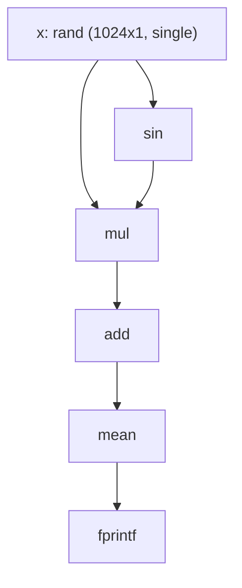
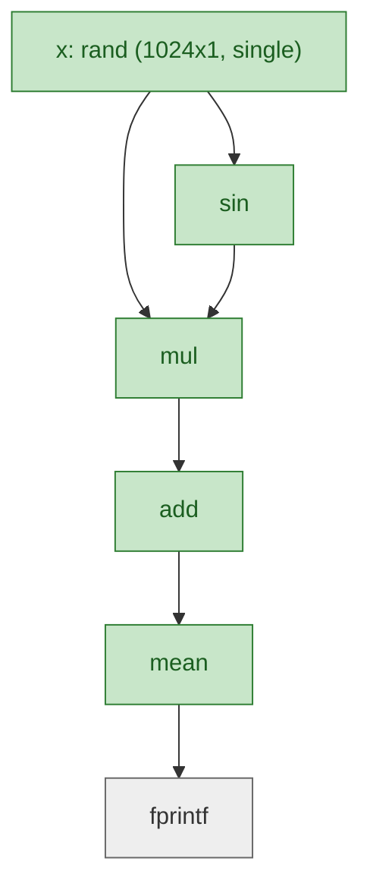
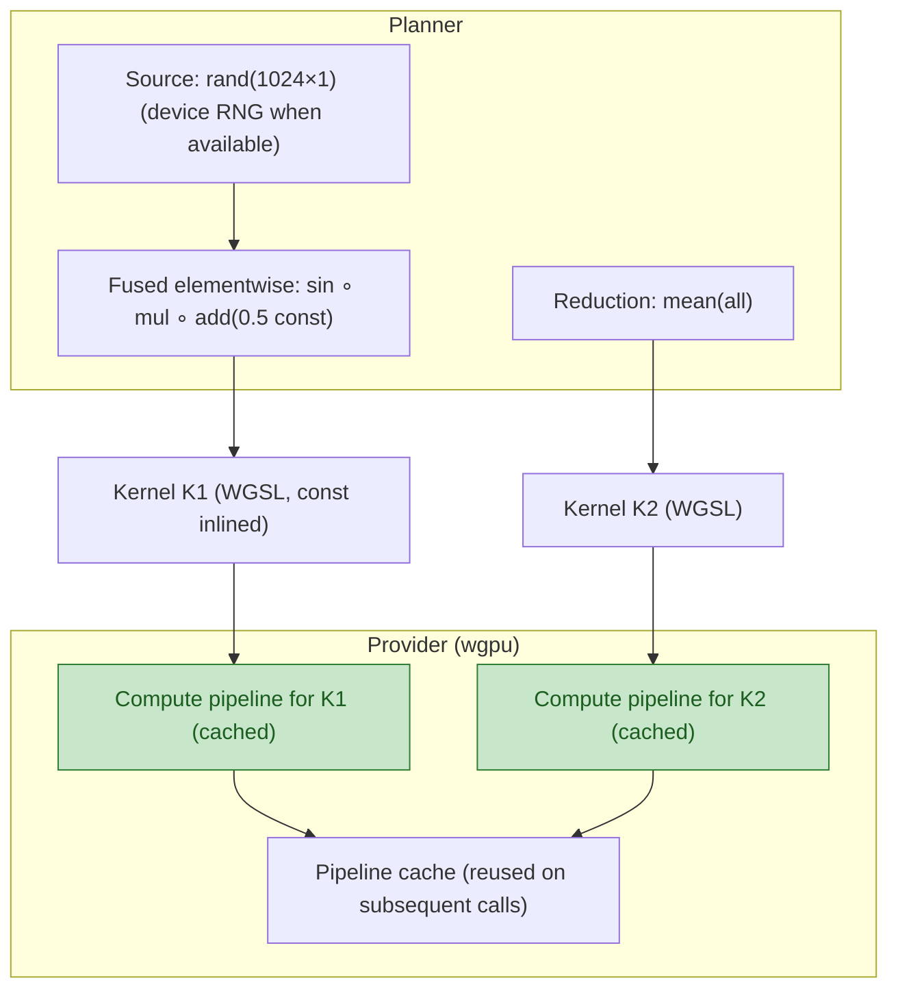
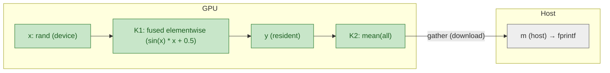

# Introduction to RunMat Fusion

This guide explains how RunMat turns ordinary MATLAB-syntax scripts into GPU-accelerated workloads without asking you to write kernels, pick drivers, or think in CUDA. It is written for engineers who already understand vectors, matrices, and throughput bottlenecks, but may not live in Rust or GPU SDKs.

---

## Why RunMat pushes work to the GPU

Modern GPUs are wide data engines: thousands of arithmetic lanes, fed by high-bandwidth memory, designed to chew through the same operation applied to many values. Monte Carlo risk paths, image and signal processing, large matrix statistics—are exactly that: repeat the same math across millions of elements, punctuated by a few reductions or matrix multiplies.

Today’s reality:

- MATLAB / NumPy users stick to CPU because GPU setups are brittle (CUDA vs ROCm vs vendor quirks) and require specialized code.
- PyTorch / TensorFlow can use GPUs, but expect you to reason about devices, tensors, and explicit transfers.
- Engineers lose time either rewriting code for GPU frameworks or waiting for CPU loops to finish.


If you use MATLAB with NVIDIA GPUs today, see our [gpuArray guide and RunMat integration](/blog/matlab-nvidia-gpu).

RunMat’s promise is “write MATLAB-syntax code, let the runtime discover and execute GPU-friendly pieces automatically.” To understand how it works, picture a four-stage pipeline.

---

## Stage 1 — Capture the math, not the syntax

When you run a RunMat script, the runtime translates your high-level operations into an “acceleration graph.” Think of it as a block diagram where each block is an operation (`+`, `exp`, `mean`, `matmul`) and the wires are data flowing between them. The graph keeps track of:

- **Shapes** (How big is each array? Are we looking at a 16×2160×3840 tile batch?)
- **Categories** (Is this a pointwise operation, a reduction, a matrix multiply?)
- **Dependencies** (Does operation B depend on the output of operation A?)
- **Constants and variables** (Which inputs are from the user? Which are literals like `0.5`?)

Capturing the graph costs almost nothing, but gives RunMat a full view of what your script intends to compute.

For example, the following script:

```matlab:runnable
x = rand(1024, 1, 'single');

y = sin(x) .* x + 0.5;
m = mean(y);

fprintf('m=%.6f', m);
```

produces the following acceleration graph:



---

## Stage 2 — Decide what should live on the GPU

With the graph in hand, RunMat asks: “Which parts deliver a speedup on a GPU, and are big enough to be worth the trip?”

Key ideas:

- **Fusion detection** looks for long chains of elementwise math and linked reductions. Instead of launching ten kernels (subtract, divide, multiply, raise to a power, etc.), it plans to execute them as one combined GPU program. This slashes memory traffic and launch latency.
- **Auto-offload heuristics** estimate the break-even point using calibration data. They consider the number of elements, reduction sizes, and whether a matrix multiply will saturate GPU cores. If a dataset is tiny, RunMat stays on the CPU to avoid GPU overhead.
- **Residency awareness** keeps tensors on device once they are worth it. If a value is already on the GPU, downstream operations try to stay there.

The outcome is a schedule: some blocks tagged “stay on CPU,” others “ship to GPU together.”

Continuing the example above, the planner makes a costed decision for `rand`:

- If the provider exposes GPU RNG hooks, `rand` is generated on the device to avoid uploads and keep residency on GPU.
- If hooks are unavailable, RunMat generates on the host and uploads once to preserve downstream GPU residency.

For this example (1024×1), `rand` is produced on device when supported; the fused elementwise chain and the reduction are offloaded to the GPU (green):

Note: In this guide, “provider” refers to the active acceleration backend (currently wgpu). It’s a portable layer that targets Metal (macOS), DirectX 12 (Windows), and Vulkan (Linux) without code changes. The provider:
- Selects the right GPU API for your OS/device.
- Compiles WGSL into native compute pipelines and caches them.
- Manages GPU device/queue, buffers, and timings.
- Exposes hooks RunMat calls the same way regardless of GPU vendor.



---

## Stage 3 — Translate into GPU-native work

RunMat ships with a portable GPU backend built on WebGPU (via wgpu). Conceptually, it plays the role of a translator:

- **Portable driver selection.** The backend picks the right low-level API for the machine you’re on—Metal on macOS, DirectX 12 on Windows, Vulkan on Linux. No user configuration is needed.
- **Kernel assembly.** For fused elementwise sections, the planner generates a short GPU program (WGSL) that reads each input array element, runs the fused math, and writes the result. For reductions or matrix multiplies, it picks optimized templates with shared-memory tiling and the right workgroup sizes.
- **Pipeline caching.** Once a fused kernel is compiled, it gets cached. Re-running the same script hits the cache, so the first-launch cost amortizes away.
- **Fallbacks.** If a requested operation is not yet supported on the GPU (say, a specialized signal-processing routine), RunMat automatically uses the CPU version without you changing the script.

For engineers, the mental model is “RunMat creates and compiles cross-platform GPU kernels dynamically based on what I wrote, then reuses them when possible.”

Continuing the example, the planner produces two WGSL kernels and the provider caches their pipelines:


Pipelines are cached by shader+layout+workgroup so future runs skip compile time.

---

## Stage 4 — Execute and keep data moving efficiently

Execution is where the pieces come together:

1. Host tensors are **uploaded** once to GPU memory. Scalars get “broadcast” as small auxiliary buffers when needed.
2. The fused kernels run, pulling data directly from GPU memory and writing outputs back without visiting the CPU.
3. Outputs stay resident on the device. Only when you ask for something like `disp(result)` or export to disk does RunMat **gather** data back.
4. Residency flags are updated so the planner knows which values already live on the GPU for later calls.

Because transfers are minimized, you realize the raw throughput advantage of the GPU instead of losing it to PCIe copies.

Continuing the example, uploads, residency, and the final gather look like this:



If GPU RNG hooks are unavailable, RunMat falls back to host sampling and uploads once to keep downstream work on the GPU.

 ---
 
## How this maps to real workloads

The pipeline above pays off in all regimes in which mathematical operations can be fused and offloaded to the GPU. Versus CPUs, using GPUs with RunMat can expect to see:

- **10× or greater speedups** in realms like image processing, computer vision, and DSP pre/post, where you're doing lots of pointwise math and small reductions. Fusing long chains of pointwise math and small reductions trims memory traffic.
- **100× or greater speedups** in realms like quant finance, simulation, and batched linear algebra, where you're doing lots of matrix multiplies and reductions. Monte Carlo loops or covariance calculations spend almost all their time inside the fused kernels. RunMat detects that the time loop touches only elementwise math, keeps the entire loop on device, and leverages cached GPU kernels.
- **1000× or greater speedups** in realms like massively parallel telemetry, where you're running independent channels in parallel. RunMat keeps the time dimension on device, so a million EMA filters with 4,000 steps execute as one GPU job instead of a million CPU loops.

In each case, you're able to capture your logic with MATLAB-syntax code, allowing a compact and readable implementation that LLMs are already familiar with. RunMat handles device selection, fusion, kernel generation, and residency under the hood, so you can focus on the math, and provides a high performance, open source runtime for your code.

---

## Practical takeaways for non-GPU specialists

- **No device flags.** RunMat chooses GPU or CPU automatically.
- **One script, all platforms.** Metal/DX12/Vulkan with CPU fallback.
- **Same numerics as CPU.** GPU is an acceleration path, not a new algorithm.
- **Keeps improving.** New builtins speed up existing scripts; you can inspect what fused/offloaded when needed.

---

## When to expect the biggest wins

Biggest wins when:

- **Long elementwise chains** with small reductions over the same data.
- **Large batched matmuls** with cheap pre/post ops (center/scale/activations).
- **Time-series/Monte Carlo loops** where each step depends only on the previous state.

Caveat: gains are modest for tiny arrays or when you pull data back to the CPU mid‑loop.

---

## Cross‑platform portability

RunMat + accelerate/fusion run your MATLAB-syntax scripts across platforms via the wgpu provider. Same code, no changes required.

- macOS: Metal. Windows: DirectX 12. Linux (x86/ARM): Vulkan.
- ARM/embedded: Works on ARM Mali/Immortalis GPUs via Vulkan (driver quality varies by SoC/OS). Device-resident loops enable on-device signal processing (e.g., satellite payloads, field radios) when a Vulkan-capable GPU is present.
- Cloud: Runs on AWS/GCP/Azure across vendors; use GPU-enabled images and drivers—the same scripts run unchanged.

When no GPU is available, RunMat automatically falls back to CPU, preserving correctness and portability.

---

## Summary

RunMat’s GPU acceleration is best understood as a system that:

1. **Captures** — what your script intends (the acceleration graph).
2. **Decides** — whether the GPU is a net win (fusion + auto-offload).
3. **Emits** — the right GPU kernels via a portable backend (e.g. GPU agnostic via wgpu).
4. **Updates** — residency state so future decisions are informed.

By working at this higher level, RunMat gives you the throughput benefits of modern GPUs while preserving the simplicity of MATLAB-syntax array programming. You focus on the math; RunMat operates the accelerator.

Next, see the [Fusion Guide](/docs/fusion-guide) for detailed fusion patterns and GPU residency rules.

---
 
## Advanced — Managing memory and transfers
 
Most users can ignore device management; RunMat keeps values resident and transfers only at the edges. If you do want to reason about it:
 
- What the provider manages
  - Chooses the GPU API (Metal/DX12/Vulkan), owns the device/queue, allocates/frees buffers, and measures upload/compute/download times.
  - Compiles WGSL into native compute pipelines and caches them so repeated shapes run without recompile cost.
 
- Manual gathers (host materialization)
  - Any host-only builtin (e.g., `fprintf` or converting with `gather`) triggers a gather of its inputs.

  - To force an early gather:
    ```matlab
    y = sin(x) .* x + 0.5;           % runs on GPU
    y_host = gather(y);              % gather to host now
    m = mean(y_host, 'all');
    fprintf('m=%.6f\n', m);
    ```
  - To keep residency until the end:
    ```matlab
    y = sin(x) .* x + 0.5;           % stays on GPU if x is on the GPU (or net benefit calculated to be profitable)
    m = mean(y, 'all');              % stays on GPU
    fprintf('m=%.6f\n', gather(m));  % single download at the sink
    ```
 
- Capacity and large arrays
  - GPU memory is finite. The provider attempts allocations; if they fail, the runtime surfaces a clear error. Practical remedies:
    - Prefer `single` precision when acceptable (halves buffer size vs `double`).
    - Process in tiles/chunks and accumulate on device or host:
      ```matlab
      tile = 1_000_000; acc = 0;
      for i = 1:tile:numel(x)
        j = min(i+tile-1, numel(x));
        acc = acc + sum( sin(x(i:j)) .* x(i:j) + 0.5 );
      end
      ```
    - Avoid holding duplicate intermediates; reuse variables to reduce pressure.
  - Host RAM is also finite. Large gathers can spike usage; prefer keeping intermediates device‑resident and only gather reduced results.
 
- Transfers vs compute (rule of thumb)
  - Upload/download cost scales with bytes moved; compute scales with FLOPs. Small arrays are usually faster on CPU; large, compute‑heavy segments benefit from GPU—especially when data stays resident between kernels.