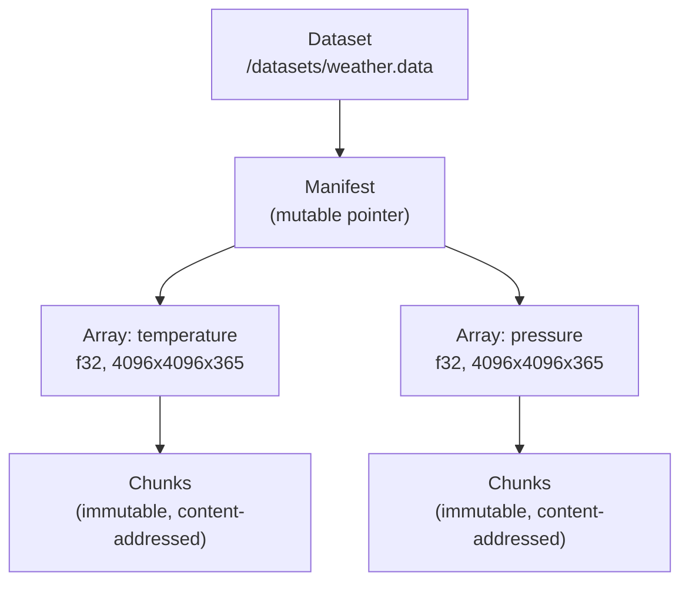
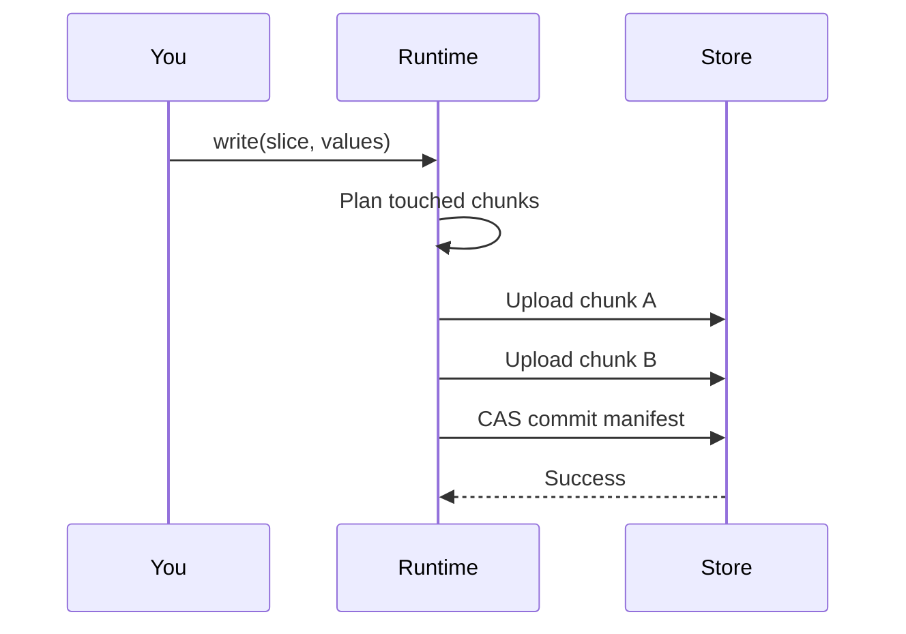
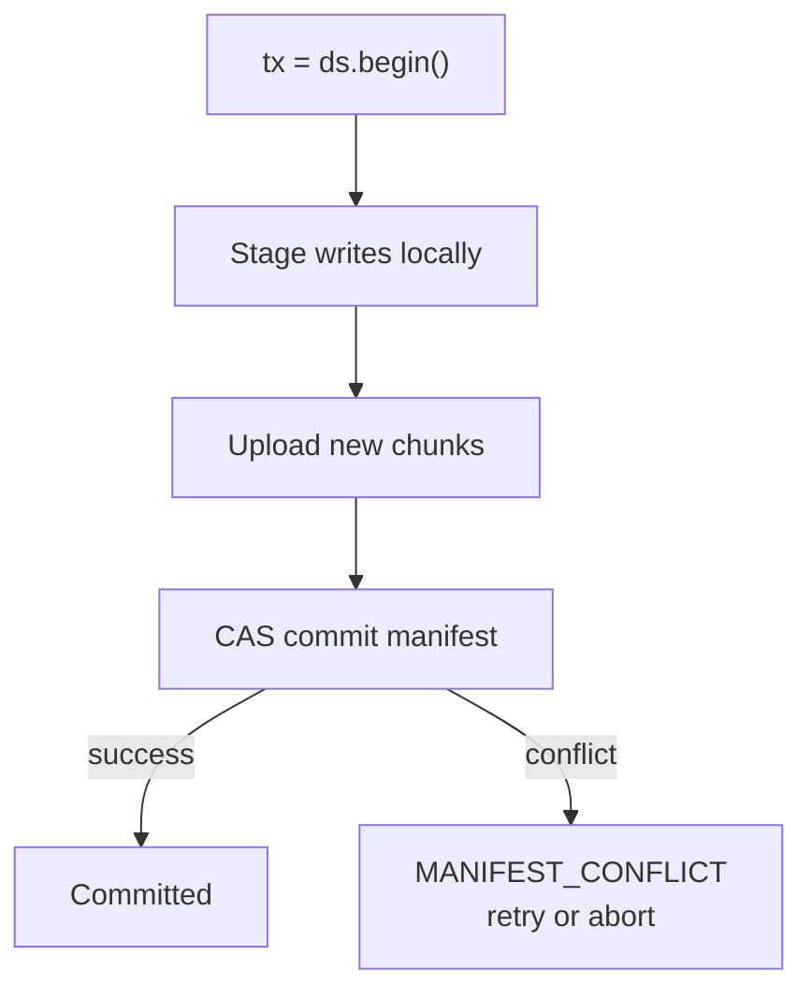

# Large Dataset Persistence in RunMat

RunMat stores large numerical datasets as chunked, content-addressed objects. You read and write subregions of multi-terabyte arrays without loading or rewriting the full file. The same code works on local projects and cloud-backed projects with no changes.

This page covers the `.data` format, how reads and writes work, transactions, the API surface, and how datasets integrate with plotting and collaboration.

---

## How it works

A dataset is a logical container at a path like `/datasets/weather.data`. Inside, each named array (temperature, pressure, velocity) is divided into fixed-shape chunks stored as immutable objects. A manifest ties everything together: it records which arrays exist, where their chunks live, and what version the dataset is at.



Chunks are immutable and identified by their SHA-256 content hash. The manifest pointer is the only mutable piece. When you write new data, RunMat uploads the new chunks and atomically swaps the manifest to reference the updated chunk set. Old chunks remain available for snapshots and history.

### On-disk structure

A `.data` path maps to this layout on disk:

```
/datasets/weather.data/
  manifest.json
  arrays/
    temperature/
      meta.json
      chunks/
        0.0.0
        0.0.1
        ...
    pressure/
      meta.json
      chunks/
```

On cloud-backed projects, chunk payloads map to object-store keys. You don't need to manage the directory layout yourself.

### Terminology

- **Dataset**: logical container at a path like `/datasets/weather.data`.
- **Array**: named N-dimensional tensor inside a dataset.
- **Chunk**: fixed-shape subregion of an array, stored as one immutable object.
- **Manifest**: metadata document defining arrays, chunk grid, codec, and references.
- **Snapshot**: project-level immutable checkpoint (already provided by RunMat's versioning system).

---

## Reading data

Reads are lazy and slice-oriented. When you request a subregion like `T(1:1024, :, 10)`, a planner maps your slice to the minimal set of chunks that contain the requested data, fetches them in parallel with bounded concurrency, and assembles the result.

If you've read the same chunks recently, they come from a local cache keyed by content hash. Sequential scans can use optional read-ahead hints to prefetch the next chunk batch before you ask for it.

---

## Writing data

Region writes touch only the chunks that overlap your write. If you update rows 1-256 of a 4096x4096 array, RunMat rewrites the affected chunks and leaves the rest untouched.

The commit is a two-phase process:



New chunk objects are uploaded first. Then the manifest pointer is atomically updated via compare-and-swap (CAS). If another writer committed between your read and your write, the commit fails with `MANIFEST_CONFLICT` and no partial state is visible. You can retry or abort cleanly.

---

## Transactions

For a single write, RunMat handles the commit automatically. When you need multiple related writes to succeed or fail together, use an explicit transaction:

```matlab
ds = data.open("/datasets/weather.data");

tx = ds.begin();
tx.write("temperature", {1:256, :, 1}, rand(256, 4096));
tx.write("pressure", {1:256, :, 1}, rand(256, 4096));
tx.set_attr("stage", "calibrated");
ok = tx.commit();
```

All writes in the transaction are staged locally. On `commit()`, RunMat uploads new chunks and performs a single atomic manifest swap. If the manifest changed since `begin()`, the commit fails with `MANIFEST_CONFLICT`.



---

## Working with the API

### Module functions

| Function | What it does |
|---|---|
| `data.create(path, schema)` | Create a new dataset with a typed schema |
| `data.open(path)` | Open an existing dataset |
| `data.exists(path)` | Check if a dataset exists at a path |
| `data.delete(path)` | Delete a dataset |
| `data.copy(from, to)` | Copy a dataset to a new path |
| `data.move(from, to)` | Move or rename a dataset |
| `data.import(path, "mat", source)` | Import from `.mat` or other formats |
| `data.export(path, "mat", target)` | Export to `.mat` or other formats |
| `data.list(prefix?)` | List datasets under a path |
| `data.inspect(path)` | Return metadata about a dataset |

### Dataset object

Once you have a dataset handle, you can list arrays, read and write attributes, and start transactions:

- `ds.arrays()` -- list array names
- `ds.array("temperature")` -- get a typed array handle
- `ds.attrs()` -- read dataset attributes
- `ds.set_attr(key, value)` -- write an attribute
- `ds.begin()` -- start a transaction
- `ds.snapshot(label?)` -- capture a dataset snapshot
- `ds.version()` -- current manifest version
- `ds.refresh()` -- reload manifest from storage

### Array object

Array handles support direct indexing:

```matlab
A = ds.array("temperature");
block = A(1:1024, :, 10);      % read a slice
A(1:1024, :, 10) = new_block;  % write a slice
```

And explicit method calls:

- `A.shape()` -- array dimensions
- `A.dtype()` -- element type (f32, f64, i64, u8, bool, ...)
- `A.chunk_shape()` -- chunk dimensions
- `A.read(slice)` -- read a subregion
- `A.write(slice, values)` -- write a subregion
- `A.resize(newShape)` -- resize the array
- `A.fill(value)` -- fill with a constant

### Creating a dataset from scratch

```matlab
schema = data.schema(struct(
  "arrays", struct(
    "temperature", struct("dtype", "f32", "shape", [4096, 4096, 365], "chunk", [256, 256, 1]),
    "pressure", struct("dtype", "f32", "shape", [4096, 4096, 365], "chunk", [256, 256, 1])
  ),
  "attrs", struct("owner", "string", "stage", "string")
));

ds = data.create("/datasets/weather.data", schema);
```

### Dynamic paths with explicit schema

```matlab
path = strcat("/datasets/", run_id, ".data");
ds = data.open(path, schema);
```

Supplying a schema to `data.open` keeps compile-time type safety even when the path isn't a literal constant.

---

## How `save/load` relates to `data.*`

`save` and `load` remain available and stable. They work well for small matrices and local workflows where you don't need subregion access or collaboration.

For large arrays, collaborative datasets, or workflows that need transactions and conflict handling, use `data.*`. The two APIs coexist in the same project. `data.import` and `data.export` bridge between `.mat` files and `.data` datasets when you need interoperability.

---

## Type safety

When you open a dataset with a literal path, the typechecker resolves the schema at compile time. `ds.array("temperature")` returns a typed handle with known dtype and shape, and writes are checked for compatible dimensions and element types before they run.

For dynamic paths, supply an explicit schema to `data.open(path, schema)` to get the same checks. Without a schema, the handle is dynamically typed and validated at runtime.

### Lint rules

The default data lint profile catches common mistakes at compile time:

- Writing to an array name that doesn't exist in the schema
- Slice dimensions that don't match the array rank
- Multiple related writes without a transaction
- Full materialization of a large array without explicit opt-in
- Tight loops of small random reads (suggests batching or prefetch)
- Ignoring the result of `tx.commit()`

---

## Compression and performance

### Chunk sizing

Chunk dimensions are configurable per array. Defaults are dimensionality-aware: 1D arrays target 8-32 MB per chunk, 2D arrays use roughly square chunks targeting 8-16 MB, and 3D+ arrays default to slab chunks favoring the leading two dimensions with shallow depth. You can override at create time.

### Compression

The default codec is `zstd` (level 3) for good compression ratio and bandwidth efficiency. For interactive workflows where read latency matters more than storage size, use `lz4`. Already-compressed data can skip compression entirely.

### Caching

A local object cache stores chunks by content hash. Repeated reads of the same data hit the cache regardless of which array or dataset the chunk belongs to. Memory-constrained clients can configure cache size limits and eviction policy explicitly.

---

## Plotting and large scenes

Large 3D figure scenes (dense surface grids, large scatter3 point clouds) reference dataset-backed buffers instead of embedding numeric payloads directly in the scene descriptor. A scene that would be 500 MB with inline mesh data becomes a ~2 KB JSON document with typed references (`runmat-data-array-v1`) to chunked storage.

During replay, the renderer reads the scene JSON, resolves each reference by its stable artifact ID, and streams the geometry from chunked storage on demand. A 512x512 surface scene decodes and rehydrates in about 165 ms on a debug build.

Scenes include capability metadata (`full` vs `preview-only`) so hosts can fall back to a PNG preview when the full scene kind isn't supported, rather than showing a blank canvas.

---

## Collaboration

Concurrent writers use the same optimistic compare-and-swap model as single-user writes. If two users write to non-overlapping regions simultaneously, the first commit succeeds and the second gets `MANIFEST_CONFLICT`. The second writer can refresh the manifest and retry.

The system separates two planes: the data plane (immutable chunks, CAS-committed manifests) and an annotation plane for lightweight mutable operations like shared view state and camera positions. Annotation ops don't require a full manifest commit.

---

## Security and governance

Dataset paths follow project ACLs. Chunk uploads and downloads use short-lived signed URLs. Every chunk upload requires a SHA-256 checksum match. Manifest commits and snapshot/restore events are audit-logged. Retention policies account for object references from snapshots, so referenced data is never garbage-collected.

---

## Error handling

Errors fall into three categories:

Recoverable conflicts: `MANIFEST_CONFLICT`, `TXN_ABORTED`, `QUOTA_EXCEEDED`. Your code can catch these and retry or prompt the user.

Input and type errors: `INVALID_SLICE`, `DTYPE_MISMATCH`, `SHAPE_MISMATCH`, `ARRAY_NOT_FOUND`, `DATASET_NOT_FOUND`. These indicate a bug in the calling code.

Integrity and storage errors: `CHECKSUM_MISMATCH`, `CHUNK_MISSING`, `PERMISSION_DENIED`, `INTERNAL_ERROR`. These indicate a storage or access problem.

Every error includes a structured payload with a stable `code`, a human-readable `message`, a `retryable` flag, and a `traceId`:

```json
{
  "code": "MANIFEST_CONFLICT",
  "message": "manifest changed since transaction start",
  "retryable": true,
  "details": {
    "path": "/datasets/weather.data",
    "expectedManifest": "sha256:aaa...",
    "actualManifest": "sha256:bbb..."
  },
  "traceId": "4f87..."
}
```

You can pattern-match on `err.code` reliably across runtime and server-backed execution.

---

## How this compares to what you're used to

| | Traditional (HDF5 / .mat files) | RunMat `data.*` |
|---|---|---|
| **Reading subregions** | Full file load or manual chunk math | Slice-oriented, auto-planned |
| **Writing subregions** | Full rewrite or complex append | Only touched chunks rewritten |
| **Integrity** | Manual checksums | Content-addressed, SHA-256 on every chunk |
| **Versioning** | Filename conventions (results_v2_final.mat) | Manifest versioning with snapshots |
| **Local/cloud parity** | Different code paths | Same API, provider-neutral |
| **Concurrent access** | File locks or hope | Optimistic CAS with explicit conflicts |
| **Large 3D scenes** | Embedded in scene file | Dataset-referenced, streamed on demand |
| **Interop** | Native format lock-in | Import/export bridges for .mat and others |

---

## Summary

- **Chunked and content-addressed.** Large arrays are split into immutable chunks identified by SHA-256 hash. Reads and writes touch only the chunks they need.
- **Atomic commits.** Every write, whether single or transactional, ends with an atomic manifest swap. No partial state is ever visible.
- **Same API everywhere.** `data.open`, `data.create`, and array indexing work identically on local and cloud-backed projects.
- **Typed and linted.** Compile-time schema inference catches shape mismatches, unknown arrays, and unsafe patterns before your code runs.
- **Built for collaboration.** Concurrent writers get explicit conflict signals, not silent overwrites or corrupted files.
- **Integrated with plotting.** Large 3D scenes reference dataset chunks instead of embedding payloads, keeping scene descriptors small and replay fast.
