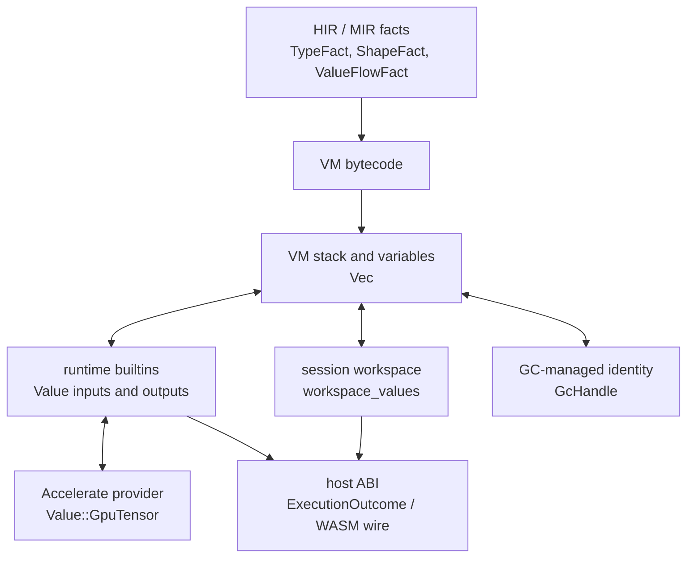

# Runtime Values & Type Model

`Value` is the concrete runtime representation used for values produced, stored, and passed around during RunMat execution. The VM stack, VM variables, builtin calls, workspace state, session results, GC roots, GPU residency paths, and WASM wire adapters all exchange this value type.

The compiler does not execute `Value` directly. HIR and MIR use static facts to approximate value type, shape, flow, and async state before bytecode runs. At execution time, those facts become concrete `Value` instances moving through the VM and runtime.

## Value Families

The `Value` enum groups loosely into scalars, dense arrays, aggregates, objects/handles, callables, the GPU handle, and a couple of internal execution helpers:

```rust
pub enum Value {
    // Scalars
    Int(IntValue), Num(f64), Complex(f64, f64), Bool(bool), String(String),
    // Dense arrays
    Tensor(Tensor), ComplexTensor(ComplexTensor),
    LogicalArray(LogicalArray), StringArray(StringArray), CharArray(CharArray),
    // Aggregates
    Cell(CellArray), Struct(StructValue),
    // Objects and handles
    Object(ObjectInstance), HandleObject(HandleRef), Listener(Listener),
    ClassRef(String), MException(MException),
    // Callables
    FunctionHandle(String), ExternalFunctionHandle(String),
    MethodFunctionHandle(String), BoundFunctionHandle { name: String, function: usize },
    Closure(Closure),
    // Acceleration
    GpuTensor(GpuTensorHandle),
    // Execution helper (internal multi-output/destructuring)
    OutputList(Vec<Value>),
}
```

| Family | Runtime variants | Notes |
| --- | --- | --- |
| Scalars | `Int`, `Num`, `Complex`, `Bool`, `String` | Scalar `Num` is a MATLAB double. Integer scalars preserve their integer class through `IntValue`. |
| Dense arrays | `Tensor`, `ComplexTensor`, `LogicalArray`, `StringArray`, `CharArray` | Dense array payloads own Rust buffers directly. Shapes follow MATLAB column-major semantics. |
| Aggregates | `Cell`, `Struct` | Cells own `Value` elements directly. Struct fields preserve insertion order through `IndexMap`. |
| Objects and handles | `Object`, `HandleObject`, `Listener`, `ClassRef`, `MException` | These carry class, identity, event, metaclass, or exception semantics for object-oriented and diagnostic paths. |
| Callables | `FunctionHandle`, `ExternalFunctionHandle`, `MethodFunctionHandle`, `BoundFunctionHandle`, `Closure` | Callable values preserve different resolution policies for builtins, semantic functions, methods, closures, and external-boundary calls. |
| Acceleration | `GpuTensor` | GPU-resident tensor handle owned by an acceleration provider. Host materialization happens only when an operation requires it. |
| Execution helpers | `OutputList` | Internal multi-output/destructuring helper used while shaping results. |

The enum lives in `runmat-builtins` because builtins, VM dispatch, runtime services, GC, session state, and WASM all need the same value vocabulary. `runmat-runtime` owns most operations over values, while `runmat-vm` owns instruction-level movement and mutation.

## Dense Arrays And Shape

### Integer literals

Hexadecimal literals begin with `0x` or `0X`, and binary literals begin with `0b` or `0B`. An unsuffixed literal uses the smallest unsigned integer class that can hold its value. The suffixes `u8`, `u16`, `u32`, and `u64` select unsigned classes; `s8`, `s16`, `s32`, and `s64` select signed classes and interpret the written bits using two's-complement representation.

```matlab
small = 0x2A                 % uint8 value 42
signed = 0xFFs8              % int8 value -1
wide = 0xFFFFFFFFFFFFFFFFu64 % exact uint64 maximum
bits = 0b101010u16           % uint16 value 42
```

The lexer, compiler IR, bytecode, runtime values, array construction, and host/device transfers preserve these literals as integers. In particular, a 64-bit literal does not pass through `double`, so values above `flintmax` remain exact. Invalid digits, unknown suffixes, and values whose written width exceeds the selected class are syntax errors.

RunMat stores dense real numeric arrays as `Tensor` and dense complex numeric arrays as `ComplexTensor`. Each value owns one private homogeneous payload whose Rust element type matches its RunMat numeric class:

```rust
pub struct Tensor {
    storage: TensorStorage,
    pub shape: Vec<usize>,
    pub rows: usize,
    pub cols: usize,
}

enum TensorStorage {
    F64(Vec<f64>),
    F32(Vec<f32>),
    Integer(IntegerStorage),
}
```

`IntegerStorage` has native variants for `int8`, `int16`, `int32`, `int64`, `uint8`, `uint16`, `uint32`, and `uint64`. The storage variant determines the numeric class, so wide integer values retain their full precision through indexing, comparison, ordering, hashing, class-preserving arithmetic, serialization, and host/device transfer.

`NumericStorage`, `NumericScalar`, `NumericStorageView`, and `NumericStorageViewMut` provide the exhaustive all-class APIs used by runtime code. Constructors validate that payload length matches shape. Scalar access, same-class mutation, allocation, clone, gather, and reorder preserve the class. Operations that intentionally enter a floating computation use explicitly named materialization methods at that boundary.

`ComplexTensor` follows the same model with private `F64`, `F32`, and paired same-class integer component storage. `SparseTensor` stores CSC column pointers and row indices with one private `F64`, `F32`, integer, or logical value payload. Dense, sparse, and complex containers share numeric class semantics while retaining layouts appropriate to their representation.

Column-major shape semantics are preserved across construction, indexing, builtin dispatch, workspace inspection, serialization, and provider transfer. `rows` and `cols` cache the first two dimensions for common matrix paths; the complete N-D shape remains authoritative.

### Numeric conversion boundaries

An operation that produces floating results from integer input declares that behavior at the operation boundary. Structural controls such as dimensions and indices are decoded into their bounded host representation after range validation. Class-preserving operations remain in the input class, and unsupported integer forms reject before conversion. This keeps numeric conversion local to the behavior that requires it and prevents unrelated structural or data-movement operations from changing a value's class or precision.

Logical arrays use `LogicalArray`. Logical scalars use `Bool`, while logical N-D arrays store normalized `0` or `1` bytes with an explicit shape.

Text has three representations:

| Runtime value | MATLAB concept |
| --- | --- |
| `String` | Scalar string value. |
| `StringArray` | N-D string array. |
| `CharArray` | 2-D character array for single-quoted text and char-matrix behavior. |

## Identity And GC

Most `Value` payloads are ordinary Rust-owned data. They are cloned, moved through the VM stack, stored in workspace maps, and dropped by normal Rust ownership.

Values that need stable identity, cycle reachability, finalizers, or bridge identity use opaque `GcHandle` tokens. The main cases are handle-object targets, listener targets/callbacks, selected object/struct payloads, provider-owned resources that need finalizers, and bridge values that must remain address-stable while runtime code holds references. Cell arrays own their elements as ordinary `Value`s; a cell element may contain a handle, but cells do not GC-allocate every element.

The GC owns the outer `Value` allocation. Nested buffers such as tensor data, strings, vectors, and maps remain owned by Rust values inside that allocation. The collector is non-moving, so surviving `GcHandle` identities stay stable. A `GcHandle` is not a Rust reference; value access goes through checked GC APIs and guarded `GcValueRef` / `GcValueMut` borrows.

For details on allocation, roots, barriers, and finalizers, see [Memory Management](/docs/runtime/gc).

## GPU Residency

`Value::GpuTensor` is a handle to provider-owned device data. The handle itself contains shape, device identity, and buffer identity. Provider/API registries carry precision, real/complex layout, logical status, and exact integer element type.

Runtime and builtin paths gather GPU tensors only when host materialization is required. Device-capable builtins and fusion paths can keep data resident and return another `Value::GpuTensor`. Host-only builtins gather explicitly before operating.

Exact integer transfers use the provider's `upload_integer` and `download_integer` methods. Providers that cannot preserve native integer storage must reject those methods; they must not substitute the floating upload/download path. The WGPU provider uses packed `u32` words, with two words per `int64`/`uint64` element.

The current handle metadata does not distinguish a tensor created by explicit `gpuArray` syntax from one created by automatic promotion. Host fallback is therefore an acceleration policy over the shared representation, not proof of MATLAB `gpuArray` unsupported-call parity.

The migration target embeds authoritative numeric element metadata in the durable handle/provider state and converges floating and integer host transfer views on one exhaustive numeric type contract. Backend storage remains specialized.

For details on residency and fusion planning, see [GPU Acceleration & Fusion Engine](/docs/runtime/gpu).

## Callables And Multi-Output Values

Function-like values preserve the policy needed to call them later:

| Value | Purpose |
| --- | --- |
| `FunctionHandle` | Name-shaped function handle that can resolve through normal callable lookup. |
| `ExternalFunctionHandle` | Handle whose resolution must stay at the external boundary. |
| `MethodFunctionHandle` | Handle that preserves typed method identity. |
| `BoundFunctionHandle` | Handle already bound to a semantic function ID by the compiler/session. |
| `Closure` | Callable plus captured runtime values. |

`OutputList` is different. It is an internal value used to carry multiple outputs through bytecode, builtin dispatch, and destructuring. Session outcome assembly turns public results into `RuntimeFlow` shapes such as single value, output list, comma list, dynamic list, or no value.

## Static Facts

Compile-time type information is deliberately separate from runtime `Value`.

| Layer | Representation | Purpose |
| --- | --- | --- |
| HIR/MIR facts | `TypeFact`, `ShapeFact`, `ValueFlowFact`, `AsyncValueFact` | Dataflow reasoning, diagnostics, spawn safety, and lowering decisions before execution. |
| Builtin metadata | `runmat_builtins::Type` and type resolvers | Describes builtin signatures and inferred outputs for tooling and validation. |
| Runtime execution | `runmat_builtins::Value` | Concrete values passed through the VM, runtime, session, GC, GPU, and host adapters. |

Static facts may say that a local is a numeric tensor with a known shape. The runtime value might then be a host `Tensor`, a `ComplexTensor`, or a `GpuTensor` depending on execution path and residency. Compiler facts should guide checks and optimization, but runtime code must still validate actual `Value` variants at boundaries.

For details on static facts, see [MIR & Static Analysis](/docs/runtime/compiler/static-analysis). For builtin authoring rules, see [Authoring Builtins](/docs/runtime/builtins/authoring).

## Host Metadata

Hosts usually do not need the full internal value graph for presentation layers, such as a variable inspector. Session and WASM APIs derive host-facing metadata from `Value`:

| Metadata | Source |
| --- | --- |
| MATLAB class name | `matlab_class_name(value)` maps variants to labels such as `double`, `logical`, `cell`, `struct`, `gpuArray`, or `function_handle`. |
| Shape | `value_shape(value)` reads scalar, array, cell, string, object, and GPU shapes when available. |
| Numeric dtype | `numeric_dtype_label(value)` reports scalar and tensor numeric classes. |
| Size estimate | `approximate_size_bytes(value)` estimates directly owned host payload bytes when meaningful. |
| Preview | `preview_numeric_values(value, limit)` extracts bounded numeric previews for workspace inspection. |

Workspace inspection uses those helpers to avoid materializing large values unnecessarily. GPU tensors are previewed through provider-aware gather paths so hosts can inspect slices without downloading an entire device buffer.

## Where Values Flow


```mermaid
flowchart TD
  HIR["HIR / MIR facts<br/>TypeFact, ShapeFact, ValueFlowFact"]
  Bytecode["VM bytecode"]
  VM["VM stack and variables<br/>Vec<Value>"]
  Builtins["runtime builtins<br/>Value inputs and outputs"]
  Workspace["session workspace<br/>workspace_values"]
  GC["GC-managed identity<br/>GcHandle"]
  GPU["Accelerate provider<br/>Value::GpuTensor"]
  Host["host ABI<br/>ExecutionOutcome / WASM wire"]

  HIR --> Bytecode --> VM
  VM <--> Builtins
  VM <--> Workspace
  VM <--> GC
  Builtins <--> GPU
  Workspace --> Host
  Builtins --> Host
```
