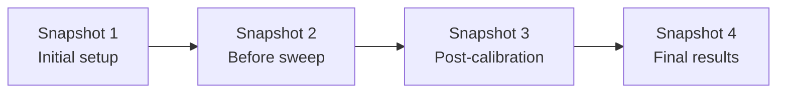

# Versioning in RunMat

RunMat versions your work automatically. Every time you save a file, RunMat creates an immutable version record -- who changed it, when, and a content hash of the file. There's no staging, no committing, no separate tool to learn. Your history just exists.

This page covers how versioning works, how snapshots let you capture and restore project state, and how to export your history to git when you need it.

---

## How it works

### Automatic file versions

Every file write in a RunMat project creates a **version record** with:

- The content hash of the file
- File size
- Who made the change (actor)
- Timestamp

You don't do anything to make this happen. It's part of the filesystem -- not a plugin, not an integration, not a separate workflow.

### What gets versioned

Not every file needs a full history. RunMat applies a smart policy:

- **Code and config files** (`.m`, `.py`, `.rs`, `.json`, `.yaml`, `.toml`, `.md`, `.txt`) are always versioned.
- **Large files** above the size threshold (default: 50 MB) are only versioned if they match the extension allowlist.
- **Dataset manifests** are always versioned, regardless of size -- so you get full lineage on large datasets without storing duplicate copies of the data itself.

This means your scripts and configuration always have complete history, while large binary outputs don't bloat your project.

### Viewing history

From the desktop app, open any file and view its version history in the sidebar.

### Restoring a previous version

Pick any version from the timeline and restore it. The file reverts to that version's content immediately. The restore itself creates a new version record, so your history is never lost -- you can always see that a restore happened and undo it.

---

## Snapshots

Snapshots capture the **entire project** at a point in time -- every file, every path, pinned to specific versions. Think of them as save states for your whole project.

### Creating a snapshot

One action captures the full project tree. You can add a message to describe what the snapshot represents.

From the desktop app, click **Snapshot** in the project toolbar.

### Restoring a snapshot

Restoring a snapshot rewires your project back to the exact state it was in when the snapshot was taken. This is instant -- no data is copied, just pointers. And like file restores, the restore itself is recorded in history.

### How snapshots protect your history

RunMat can automatically prune old file versions to keep storage lean (configurable per project). But any version referenced by a snapshot is **never pruned**. Snapshots are your guarantee that important project states are preserved permanently.

### Snapshot chain

Snapshots form a simple, linear chain -- each snapshot has one parent. There's no branching, no merge conflicts, no DAG to reason about. It's a clean timeline of project states.



---

## Git export

Snapshots can be exported as a **git-compatible history**. Each snapshot becomes a git commit. Snapshot tags become git tags.

This is useful when you need to:

- Hand off an audit trail to a reviewer who expects git
- Archive a project in a git repository
- Interface with CI/CD systems that consume git

Git is an export format -- a way to get your history *out* -- not a requirement for daily work.

### Git sync (two-way)

For teams that want git as a secondary record, RunMat supports two-way sync on a single linear branch (`refs/heads/main`):

- **Push to git:** Upload streams your snapshot chain as a git fast-import.
- **Pull from git:** Receive accepts a git fast-import for linear history.

Non-fast-forward updates are rejected to keep the history clean.

---

## Versioning for large datasets

Scientific projects often include files that are gigabytes or larger. RunMat handles this with **sharded files**: your large dataset is split into shards, and a manifest at the original path records their order and location.

The key insight: **RunMat versions the manifest, not the shards.** When your dataset changes, only the affected shards are rewritten. The manifest gets a new version pointing to the updated shard list. You get full dataset history -- which shards changed, when, by whom -- without duplicating terabytes of data on every update.

---

## Automation & Headless Usage

RunMat is designed to run in CI/CD pipelines and headless environments. You can perform all versioning actions via the API.

### File history

```bash
GET /v1/projects/{projectId}/history?path=/analysis/main.m
```

### Restore file version

```bash
POST /v1/projects/{projectId}/history/restore
{ "versionId": "ver_abc123" }
```

### Create snapshot

```bash
POST /v1/projects/{projectId}/fs/snapshots
{ "message": "Before parameter sweep" }
```

### Restore snapshot

```bash
POST /v1/projects/{projectId}/fs/snapshots/{snapshotId}/restore
```

### Export to git

```bash
GET /v1/projects/{projectId}/fs/snapshots/{snapshotId}/git-export
```

### Configure retention

```bash
POST /v1/projects/{projectId}/fs/retention
{ "maxVersions": 50 }
```

---

## Retention and cleanup

By default, RunMat keeps unlimited version history. For projects where storage matters, you can configure a maximum version count per project.

Rules:
- When the limit is reached, the oldest versions are pruned first.
- Versions referenced by snapshots are **never** pruned.
- Setting `maxVersions` to `0` disables pruning (unlimited history).

---

## How this compares to what you're used to

| | Traditional (git + MATLAB/Python) | RunMat |
|---|---|---|
| **When versioning happens** | Manually -- you stage, commit, push | Automatically -- every save is a version |
| **What gets versioned** | Everything equally, or nothing at all | Smart policy: code always, large binaries only when useful |
| **Large files** | git-lfs bolt-on, painful to configure | Shard manifests: version the pointer, not the data |
| **Project-level state** | Commits capture repo state, but require discipline | Snapshots: one click, captures everything |
| **Branching / merging** | Full DAG, merge conflicts, rebasing | Linear snapshot chain, no merge conflicts |
| **Learning curve** | Significant (staging, branches, remotes, force-push) | None -- versioning happens in the background |
| **Offline / airgap** | Requires git to be installed and configured | Built into the filesystem, works everywhere RunMat runs |
| **Audit trail** | Commit log (if people write good messages) | Automatic: actor, timestamp, content hash on every change |

---

## Summary

- **Every save is a version.** No workflow, no commands, no forgetting.
- **Snapshots capture full project state.** One click. Instant restore.
- **Git when you need it.** Export for audit, archive, or CI -- not as a daily workflow tax.
- **Smart about large data.** Version the manifest, not the terabytes.
- **Works offline.** The entire system runs on local Postgres and storage. No cloud required.
