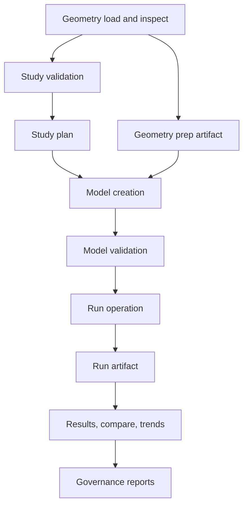

# Evidence & Artifacts

RunMat writes records at each workflow boundary: geometry import, geometry prep, study validation, planning, solving, result queries, and governance checks.

These records explain what happened, what was checked, and what automation can inspect. For solver verification, known-answer benchmarks, external references, and production-grade FEA criteria, see [FEA Verification & Validation](/docs/runtime/analysis/validation).

## Evidence Flow



## What Gets Checked

| Stage | Checks | Evidence |
| --- | --- | --- |
| Geometry import | Format support, parse success, capacity limits, asset structure. | Geometry operation envelope, importer diagnostics, geometry asset metadata. |
| Geometry prep | Prep profile validity, region mapping, mesh quality, retention health. | Prep artifact id, prep quality metrics, health operation data. |
| Study validation | Study id, model id, embedded geometry, units, profile/run-kind pairing, electromagnetic option rules. | `issue_codes`, structured `issues`, study-validation artifact. |
| Study plan | Valid study shape, selected operation sequence, selected run operation/version. | Study fingerprint, operation sequence, plan artifact. |
| Model creation | Geometry presence, units, prep-context compatibility, region and mesh references. | Created model or typed operation error. |
| Model validation | Materials, loads, constraints, units, reference frame compatibility. | `analysis.validate/v1` result or typed validation error. |
| Run operation | Family-specific model shape and run options. | Typed operation error, or run result with diagnostics, gates, quality reasons, provenance, and persisted run artifact. |
| Results and trends | Run id lookup, requested field availability, comparable run setup. | Result query payload, comparison deltas, trend summaries. |
| Governance | Fixture coverage, benchmark schema, thresholds, readiness, calibration drift. | Governance reports and pass/fail verdicts. |

## Record Types

| Record | Meaning | Typical use |
| --- | --- | --- |
| Study issue code | A stable authoring issue found by `analysis.validate_study/v1`. | Show a user what to fix in a study file. |
| Operation error envelope | A typed failure at an operation boundary. | Stop execution, preserve operation/version, error code, severity, retryability, trace id, and context. |
| Diagnostic | Domain-specific data emitted by a solver or runtime path. | Explain observed behavior and feed trend/governance metrics. |
| Quality reason | Machine-readable reason a run became degraded or rejected. | Decide whether a result can be published or promoted. |
| Artifact | JSON file persisted for study validation, planning, running, prep, or governance. | Audit, replay, compare, and promote analysis workflows. |
| Provenance | Execution context such as backend, solver backend, precision, deterministic mode, preconditioner, and fallback events. | Compare runs and explain performance or result differences. |

## Study Artifacts

Use `analysis.validate_study/v1` before planning or running a study. It returns a normal operation envelope even when the study is invalid:

- `valid`,
- `issue_codes`,
- structured `issues`,
- `evidence_artifact_path`.

Common issue families include:

| Issue | Meaning |
| --- | --- |
| `ANALYSIS_STUDY_ID_EMPTY` | `study_id` is empty. |
| `ANALYSIS_STUDY_MODEL_ID_EMPTY` | `create_model_intent.model_id` is empty. |
| `ANALYSIS_STUDY_GEOMETRY_MESHES_EMPTY` | The embedded geometry has no meshes. |
| `ANALYSIS_STUDY_GEOMETRY_UNITS_UNSPECIFIED` | The embedded geometry does not declare units. |
| `ANALYSIS_STUDY_RUN_KIND_PROFILE_MISMATCH` | The selected profile cannot run with the selected physics family. |
| `ANALYSIS_STUDY_ELECTROMAGNETIC_OPTIONS_UNUSED` | Electromagnetic options were supplied for a non-electromagnetic run. |
| `ANALYSIS_STUDY_ELECTROMAGNETIC_*_INVALID` | Electromagnetic run options failed range or shape checks. |

Planning and running require a valid study. If invalid input reaches `analysis.plan_study/v1` or `analysis.run_study/v1`, those operations return typed validation errors with `issue_codes` in the error context.

## Run Records

Every `analysis.run_*` operation performs family-specific checks before solving. A successful operation can still return a degraded or rejected run. That distinction is carried by:

- `model_validity`,
- `solver_convergence`,
- `result_quality`,
- `run_status`,
- `publishable`,
- `quality_reasons`.

Those fields describe the observed run. They do not, by themselves, prove that the underlying physics implementation is production-grade. The V&V process described in [FEA Verification & Validation](/docs/runtime/analysis/validation) defines that higher bar.

## Artifact Roots

Study operations write these artifacts:

| Artifact | Contents |
| --- | --- |
| Study validate artifact | Study id, study fingerprint, validity, issue codes, issues, electromagnetic options. |
| Study plan artifact | Study id, model id, run kind, backend, fingerprint, operation sequence, selected run operation/version. |
| Study run artifact | Study id, model id, run kind, backend, operation sequence, run id, run status, publishable flag, gates, quality reasons, provenance. |
| Study sweep artifacts | Aggregate sweep validation, plan, run entries, and failure entries. |
| Run artifact | Persisted `AnalysisRunResult` for result queries, comparisons, trends, and governance. |
| Prep artifact | Geometry prep result, quality metrics, mapping data, and health/retention data. |

Project runtime config controls the main artifact roots:

```toml
[runtime.analysis]
artifact_store = "filesystem"
artifact_root = "target/runmat-analysis-store"
study_artifact_root = "target/runmat-analysis-artifacts/studies"
geometry_prep_artifact_root = "target/runmat-analysis-artifacts/geometry-prep"
thermo_field_artifact_root = "target/runmat-analysis-artifacts/thermo-fields"
```

Environment variables remain supported as fallbacks for existing integrations.

## Governance Inputs

Governance scripts consume run artifacts, benchmark reports, external-reference baselines, threshold ratchets, promotion calibration artifacts, prep calibration summaries, and thermo-field artifacts.

| Script area | Role |
| --- | --- |
| `scripts/analysis/governance/validate_analysis_report_nonlinear.py` | Validate nonlinear and multiphysics benchmark reports. |
| `scripts/analysis/governance/generate_external_reference_benchmark.py` | Generate comparator artifacts from benchmark reports and references. |
| `scripts/analysis/governance/validate_external_reference_benchmark.py` | Enforce comparator coverage and pass/fail envelopes. |
| `scripts/analysis/governance/release_readiness_nonlinear.py` | Produce branch readiness verdicts and posture/trend summaries. |
| `scripts/analysis/governance/generate_threshold_ratchet_report.py` | Generate threshold ratchet proposals. |
| `scripts/analysis/governance/validate_threshold_ratchet_report.py` | Validate threshold ratchet reports. |
| `scripts/analysis/governance/generate_promotion_threshold_calibration.py` | Generate promotion calibration artifacts. |
| `scripts/analysis/governance/validate_promotion_threshold_calibration.py` | Validate promotion calibration artifacts. |
| `scripts/analysis/prep_calibration/*` | Evaluate prep drift, summarize prep artifacts, and promote calibration evidence. |
| `scripts/analysis/thermo_artifacts/*` | Generate, promote, and validate thermo field artifacts. |
| `scripts/analysis/reporting/*` | Summarize analysis reports and trend artifacts. |

Governance checks answer workflow questions:

| Question | Records used |
| --- | --- |
| Is the operation contract stable? | Operation envelopes, typed errors, payload shape, artifact schema. |
| Is this fixture within accepted thresholds? | Diagnostics, quality gates, quality reasons, benchmark metrics. |
| Is a domain ready to promote? | Readiness reports, missing-evidence checks, trend posture, performance SLOs. |
| Did calibration drift? | Prep and promotion calibration artifacts. |
| Are references still coherent? | External-reference comparator artifacts and validation reports. |

For result interpretation, see [Results & Trust](/docs/runtime/analysis/trust). For current support boundaries by family, see [Current Status](/docs/runtime/analysis/status).

## Collecting Records

For a study workflow:

1. Load or generate the normalized geometry asset.
2. Run `analysis.validate_study/v1`.
3. Fix any study issues.
4. Run `analysis.plan_study/v1` to inspect the operation sequence and fingerprint.
5. Run `analysis.run_study/v1`.
6. Inspect the run id, gates, `publishable`, quality reasons, and provenance.
7. Query results, compare runs, or include artifacts in governance reports.

For direct runtime integration:

1. Call geometry operations.
2. Optionally create a prep artifact.
3. Call `analysis.create_model/v1`.
4. Call `analysis.validate/v1`.
5. Call the selected `analysis.run_*` operation.
6. Persist and query run records through `analysis.results/v1`, `analysis.results_compare/v1`, and `analysis.trends/v1`.

## Update Rule

When artifact or diagnostic behavior changes, update this page with the implementation and tests. The update should state which stage changed, which record shape changed, and whether the change affects authoring issues, operation errors, diagnostics, quality reasons, artifacts, or governance checks.
