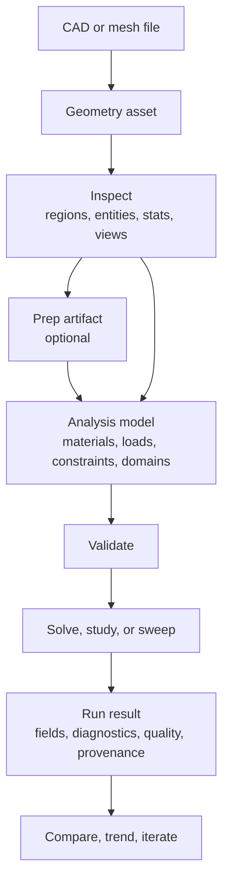

# FEA and Math on Geometry

RunMat lets you load geometry, attach analysis data, run supported physics models, and inspect the results. Use it to:

1. Load CAD and mesh files into structured geometry assets.
2. Inspect regions, entities, dimensions, mesh statistics, and view captures.
3. Prepare geometry for numerical analysis and save deterministic prep artifacts.
4. Build analysis models with materials, loads, constraints, physics domains, interfaces, and analysis steps.
5. Run structural, modal, thermal, nonlinear, electromagnetic, acoustic, fluid, and coupled physics solves.
6. Save result fields, diagnostics, solver status, quality reasons, and provenance.
7. Compare runs, sweep inputs, and summarize trends across repeated analyses.
8. Save the artifacts needed to reproduce, compare, and validate runs.

You can drive the same workflow from `runmat run` with study files, from `.m` code with geometry and study builtins, or from host code through versioned runtime operations.

## Typical Flow

Exploratory workflows can load geometry, create a model, validate it, and run a solve. Review and release workflows should keep the prep artifacts, run artifacts, comparisons, trends, and validation records.

## Core Concepts

| Concept | Meaning |
| --- | --- |
| Geometry asset | Structured representation of imported CAD or mesh data. |
| Prep artifact | Saved geometry-prep output used to carry topology, region, and meshing data into later steps. |
| Analysis model | Solver-agnostic model containing geometry identity, materials, assignments, loads, constraints, domains, interfaces, and steps. |
| Physics family | The mathematical model being solved, such as structural, thermal, electromagnetic, acoustic, fluid, or coupled physics. |
| Run | One execution of a physics family against a validated model. |
| Study | A named, repeatable model-create, validate, and run workflow. |
| Sweep | A deterministic sequence of studies used to explore variants. |
| Run result | Saved fields, domain payloads, diagnostics, quality gates, quality reasons, and provenance. |

## Topics

| Task | Read |
| --- | --- |
| Run analysis from the CLI, RunMat code, study files, or host operations. | [Using Analysis](/docs/runtime/analysis/using-analysis) |
| Import, inspect, and prepare geometry. | [Geometry](/docs/runtime/analysis/geometry) |
| Build models from geometry. | [Models](/docs/runtime/analysis/models) |
| Choose a physics family. | [Physics Models](/docs/runtime/analysis/physics) |
| Run direct solves, studies, and sweeps. | [Solves, Studies, and Sweeps](/docs/runtime/analysis/solves) |
| Review saved artifacts, provenance, diagnostics, and governance inputs. | [Evidence & Artifacts](/docs/runtime/analysis/evidence) |
| Understand how FEA correctness is verified and validated. | [FEA Verification & Validation](/docs/runtime/analysis/validation) |
| Interpret results, diagnostics, quality, and provenance. | [Results & Trust](/docs/runtime/analysis/trust) |
| Check current support and boundaries. | [Current Status](/docs/runtime/analysis/status) |
| Integrate with runtime operation contracts. | [Operation Reference](/docs/runtime/analysis/operation-reference) |

For the runtime execution path that invokes operations, see [Execution](/docs/runtime/execution). For host session behavior, see [Session Engine](/docs/runtime/session). For GPU backend behavior used by some analysis runs, see [GPU Acceleration & Fusion Engine](/docs/runtime/gpu).
