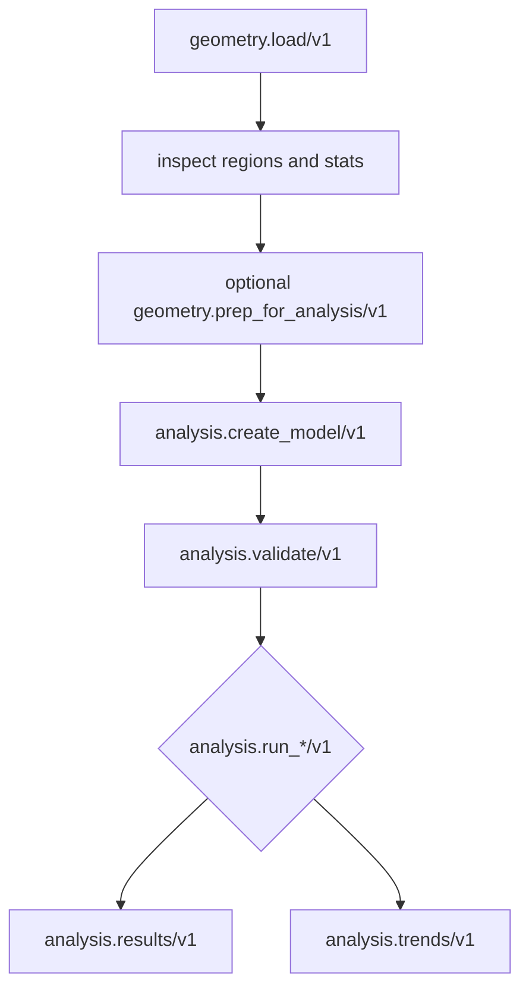

# Solves, Studies, and Sweeps

After geometry has been loaded and a model has been created, the execution path is:

1. validate the model,
2. choose run options,
3. run the selected physics family,
4. persist the result,
5. inspect results, diagnostics, quality, and provenance.

For setup choices, including direct runtime calls and reusable study specs, see [Using Analysis](/docs/runtime/analysis/using-analysis).

## Direct Solve Flow



Exploratory runs can skip prep. Runs that need reproducible geometry setup should pass a prep artifact into model creation or run options.

## Run Options

Run option structs select execution policy. Common controls include:

- deterministic mode,
- precision mode,
- preconditioner mode,
- quality policy,
- prep artifact or prep context.

Some families add solver-specific controls, such as nonlinear iteration policy, transient time stepping, or electromagnetic harmonic and sweep options.

Quality policy affects whether a run with warnings is publishable, degraded, or rejected. Diagnostics and provenance remain available either way.

## Studies

Use studies when one run should be repeatable as a named unit of work.

From the CLI:

```sh
runmat run studies/bracket.study.yaml
runmat run bracket_static
```

The second form uses a named entrypoint whose `path` points at the study file. Study files can be JSON or YAML and can hold either one study or a sweep.

From RunMat code:

```matlab
validation = analysis_validate_study("studies/bracket.study.yaml");
plan = analysis_plan_study("studies/bracket.study.yaml");
run = analysis_run_study("studies/bracket.study.yaml");
```

Study operations package the direct flow:

| Operation | Use |
| --- | --- |
| `analysis.validate_study/v1` | Check the study spec and emit structured issues. |
| `analysis.plan_study/v1` | Produce the operation sequence, run operation, fingerprint, and plan artifact path. |
| `analysis.run_study/v1` | Execute the planned study and return run identity, quality, provenance, and run artifact path. |

Study fingerprints are deterministic for the normalized study payload. Study artifacts are saved under the study artifact root.

## Sweeps

Use sweeps when you want to run several studies as one deterministic sequence.

| Operation | Use |
| --- | --- |
| `analysis.validate_study_sweep/v1` | Validate the full set of studies and return aggregate and per-study issues. |
| `analysis.plan_study_sweep/v1` | Produce per-study plan entries and failure entries. |
| `analysis.run_study_sweep/v1` | Execute studies sequentially and return run and failure entries. |

Sweeps execute sequentially in `v1`. Hosts that need parallel execution should orchestrate separate sessions or processes while preserving artifact roots and trace ids.

## Results After A Run

All run operations persist an `AnalysisRunResult`. Use:

| Operation | Use |
| --- | --- |
| `analysis.results/v1` | Query fields, diagnostics, summaries, domain payloads, quality reasons, and provenance. |
| `analysis.results_compare/v1` | Compare selected quality, domain, and timing fields between two persisted runs. |
| `analysis.trends/v1` | Summarize persisted runs by run kind over a bounded window. |

For how to interpret quality, diagnostics, and provenance, see [Results & Trust](/docs/runtime/analysis/trust).
