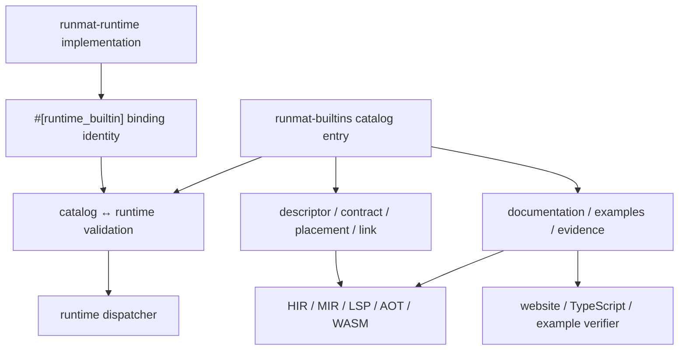

# Authoring Builtins

A builtin is complete when its catalog contract, runtime implementation, documentation, examples, and verification agree. The compiler and tooling read the dependency-light catalog without linking the runtime. The runtime supplies executable bindings and is validated against the same stable builtin identities.

## Registration Flow



Catalog builtins live in private `crates/runmat-builtins/src/catalog/entries/<domain>/<family>/<builtin>/` packages. The tree follows the public builtin taxonomy, while the crate root re-exports entry constants so consumers do not depend on its physical layout. A builtin package keeps contract assembly in `mod.rs`, substantive prose and executable examples in `documentation.rs`, and identity-specific inference in `inference.rs` only when the logic does not belong in a reusable typed semantic-family module. Split an oversized package by meaningful local concerns such as examples, errors, or capabilities; do not build parallel contract and documentation trees. Each family owns its local `ENTRIES` slice, domain modules compose families, and the root composes domains. Adding a builtin does not require a second global identity list.

Executable implementations live under `crates/runmat-runtime/src/builtins/<category>`. Category modules re-export their children through the existing runtime tree so native and WASM builds link the required bindings.

## Catalog and Binding Contract

The catalog owns identity, signatures, requested-output inference, diagnostics, effects, capabilities, placement, linking, compatibility, documentation, and examples. Runtime code implements the contract and declares only the binding variant and identity spelling needed to join executable code and emit its stable native symbol. That spelling is linkage input, not a second semantic declaration. Catalog validation rejects missing, duplicate, and undeclared bindings.

The catalog and runtime trees are separate because static consumers must not link the runtime or its native dependencies. They do not contain two copies of the builtin definition: the catalog family owns every public fact, and the runtime family owns executable algorithms and backend mechanics. Runtime code imports catalog-owned diagnostics or extension records when behavior must enforce them; it must not restate those records locally.

Use `#[runtime_builtin]` for runtime-visible implementations. Do not add descriptors, documentation, type rules, placement rules, or capability metadata to the runtime annotation for a catalog-backed builtin.

When adding a builtin, provide:

| Catalog item | Requirement |
| --- | --- |
| identity | The source-visible function identity, resolved once and retained through HIR, MIR, bytecode, Native IR, artifacts, and runtime dispatch. |
| descriptor | Public signatures, output-count behavior, completion policy, and stable errors. |
| contract | Requested-output-aware inference, effects, capabilities, compatibility, purity, and dynamic reasons. |
| placement and link | Portability, residency, acceleration/fusion eligibility, distributed policy, reachability, and artifact requirements. |
| documentation | Complete public prose, related resources, media, examples, and verification evidence. |
| binding | The runtime implementation variant associated with the catalog identity. |

## Descriptors

`BuiltinDescriptor` is the structured API contract for a builtin. It describes signatures, completion policy, output mode, and known errors. This metadata feeds validation and editor features without executing user code.

Good descriptors should include:

- Accepted argument shapes and arity through `BuiltinSignatureDescriptor`.
- Output behavior through `BuiltinOutputMode`.
- Stable error identifiers through `BuiltinErrorDescriptor`.
- Completion policy when the function should or should not appear in suggestions.

Avoid treating descriptors as comments. If an error identifier is listed in metadata, the implementation should raise that identifier on the corresponding failure path.

## Integer Capability Audit

Public builtins selected by the integer-capability census must eventually carry exactly one settled disposition. Use `integer_capabilities(path)` for APIs with integer data, control, class-preserving output, or backend behavior, and describe every distinct call form through `BuiltinIntegerCapabilityDescriptor`. Use `integer_audit(path)` only after review proves that the API has no integer surface or is an exact alias of a capability-bearing canonical builtin; an audit disposition must not coexist with positive capability records.

`BuiltinIntegerAuditKind::NotApplicable` is reserved for APIs whose broad descriptor types represent callbacks, handles, objects, or other nonnumeric values and whose runtime rejects numeric values in those positions. Do not use it merely because an integer form is unsupported: a numeric API that rejects integer input still needs a capability record with a rejected input mask. `AliasOf` requires an exact semantic alias, not just a recommended replacement or a shared implementation helper.

Run `scripts/development/integer-capability-census.sh` after changing these records. Its signature screen is a conservative triage population because `Any` intentionally covers many unrelated value families; the untriaged count is not a defect count or proof that every selected builtin accepts integers.

For cohort work, use `scripts/development/integer-capability-audit.sh queue` to obtain a deterministic catalog-order worklist, filter it with `--name-regex` or `--input-type`, and select 8–25 semantically related names. Run `scripts/development/integer-capability-audit.sh packet NAME...` before research or implementation; it rejects duplicate, unknown, settled, or out-of-size selections and emits the exact descriptor labels, screened input types, one-based queue/catalog positions, and available reference paths needed for a bounded evidence packet. The legacy census command delegates to the same query definitions, so dashboard and worklist counts cannot drift.

After exporting live descriptors for a completed cohort, use `scripts/development/integer-capability-catalog-sync.sh --live LIVE.json --in-place NAME...` to replace or add exactly those 8–25 checked records. The command rejects missing live or duplicate names, proves the canonical target records equal the live export, proves every non-target checked record is unchanged, and prints the before/after hashes required by the cohort closure record; use `--output` instead of `--in-place` when reviewing the candidate file before replacement.

## Documentation and Examples

`BuiltinDocumentation` is the canonical public documentation source for a migrated identity. Do not add a second JSON record or repeat machine facts in prose. Signatures, arguments, outputs, errors, compatibility, GPU/fusion behavior, and availability are rendered from their typed catalog fields. Documentation content supplies the summary, detailed explanation, behaviors, options, limitations, FAQs, related resources, media, and implementation notes that help a user apply the function correctly.

Every public builtin needs a useful example unless an explicit reviewed exemption explains why one cannot be provided. Each `BuiltinExample` has:

- a stable ID within its builtin;
- a title and complete RunMat program;
- optional presentation output for the documentation page;
- an execution harness such as portable native/browser, browser graphics, native filesystem, loopback networking, WGPU, or a foreign runtime;
- a semantic verification policy: successful execution, postcondition assertions, a stable expected error identifier, or figure assertions.

Presentation output is not the correctness oracle. Prefer assertions that verify values, classes, shapes, residency, or other documented behavior. Error examples verify identifiers. Host-dependent examples use deterministic fixtures and isolated resources.

Run the opt-in example inventory separately from ordinary Cargo tests:

```bash
node scripts/runtime/verify-builtin-examples.mjs
```

The runner consumes the deterministic catalog documentation export, applies declared harnesses and resource ceilings, and writes machine-readable and human-readable reports. Filters are useful for local iteration, but cohort and final closure use the complete affected inventory.

`Portable` runs the same catalog-authored program and assertions through both a native RunMat binary and the browser/WASM runtime. `Native`, `NativeFilesystem`, and `NativeForeignRuntime` use isolated native workspaces; `Browser`, `BrowserGraphics`, and `Wgpu` use the browser adapter. Legacy sidecar examples remain browser-only during migration. Inventory validation fails when a canonical catalog example selects a harness without an executable adapter. Set `RUNMAT_EXAMPLE_NATIVE_BINARY` to reuse an already built binary; otherwise the runner builds the current checkout once. Per-lane timeout environment variables and identity filters support focused iteration without weakening the complete closure run.

During the C00–C07 catalog migration, an unmigrated identity may still use its existing `docs/builtins/reference/*.json` sidecar. The transitional exporter makes that ownership explicit and rejects an identity that claims canonical catalog documentation while retaining a sidecar. Delete the sidecar in the same change that imports and improves its content. The sidecar path and migration mode disappear after the final identity moves.

Audit each cutover against its pre-slice Git baseline after deleting the old editable files:

```bash
node scripts/development/audit-builtin-documentation-cutover.mjs NAME \
  --baseline HEAD \
  --reviewed description,behaviors,examples,faqs,links,source \
  --output /tmp/NAME-documentation-cutover.json
```

The audit verifies direct fields, complete typed examples, catalog authority, sidecar removal, and the destination for every populated legacy field. Fields whose meaning cannot be compared mechanically must be named with `--reviewed` only after their source and catalog values have been read. Use `--new` when the public identity had no sidecar or runtime shadow; this is an explicit assertion, and the command rejects it when the baseline contains an old source. The report is temporary migration evidence, not another builtin-definition file. Record its result and any justified corrections in the progress ledger rather than committing the report.

## Runtime Semantics

Builtins receive and return `runmat_value::Value`. Keep MATLAB compatibility at the boundary:

- Preserve scalar versus array behavior.
- Respect requested output count for multi-output functions.
- Return output lists only when the caller expects multiple values.
- Use runtime error builders with stable identifiers for user-facing failures.
- Gather GPU-resident values only when the builtin has no device implementation or must inspect host-only metadata.
- Keep filesystem, networking, and interactive builtins compatible with async suspend/resume where applicable.

For the runtime value families, GC ownership rules, GPU residency, and host metadata helpers, see [Runtime Values & Type Model](/docs/runtime/values).

## GPU and Fusion Metadata

Acceleration metadata should describe real runtime behavior, not a future intent. If a builtin can run on device, document which provider hook or fusion pattern owns that path. If a builtin is host-only but accepts GPU inputs, it should gather explicitly and preserve the expected value semantics.

Use the same fusion categories as the library matrix:

| Code | Meaning |
| --- | --- |
| `E` | Elementwise. |
| `R` | Reduction. |
| `S` | Stencil or convolution. |
| `M` | Matrix multiply. |
| `T` | Transpose or permutation. |
| `P` | Pipeline or fuse-friendly operation. |

## Tests

Every builtin should have focused tests for:

- MATLAB-compatible success cases.
- Scalar, vector, matrix, empty, logical, string, cell, or struct cases relevant to that builtin.
- Error identifiers and invalid arity/type behavior.
- Multi-output behavior when applicable.
- GPU residency and gather/offload behavior when the builtin advertises acceleration.
- WASM-safe behavior for builtins available in browser builds.
- GPU parity with host behavior when the builtin advertises acceleration.

Prefer deterministic tests. For filesystem, networking, and random-number builtins, use temporary resources and explicit seeds.

## Documentation Updates

When adding or changing a builtin:

1. Update its canonical catalog contract and domain-local documentation.
2. Add or update typed, separately runnable examples and focused semantic tests.
3. Update the runtime implementation and binding without duplicating catalog metadata.
4. Run catalog validation, the affected example inventory, native/WASM parity, and any declared provider or host harness.
5. Regenerate product documentation and confirm that a second generation has no diff.
6. Update broader runtime guides only when the change affects concepts beyond the builtin reference page.
