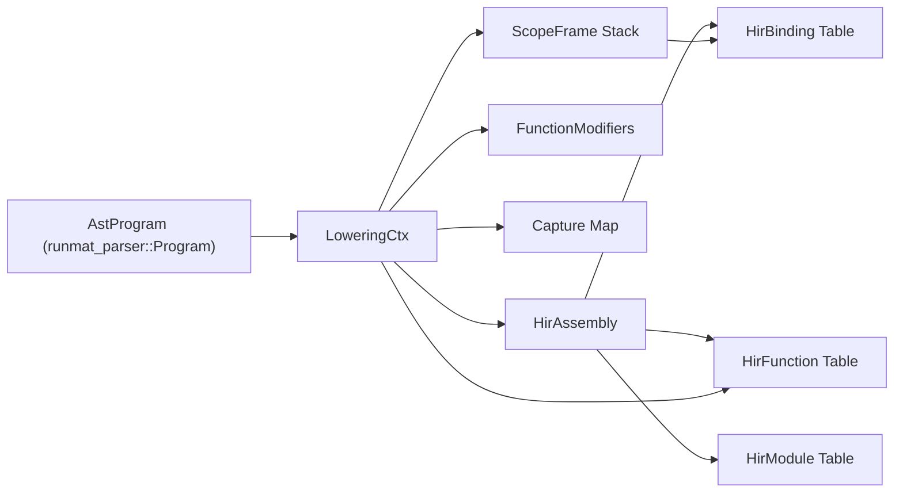
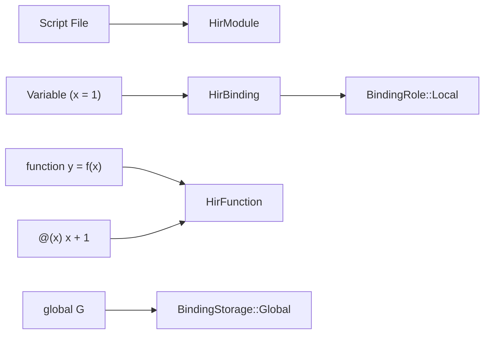

# High-Level IR (HIR)

The High-Level IR (HIR) stage is the second phase of the RunMat compilation pipeline. It transforms the Abstract Syntax Tree (AST) produced by the parser into a semantically resolved representation. This stage is responsible for scope resolution, binding management, closure capture analysis, and flattening the nested MATLAB source structure into a canonical `HirAssembly`.

## Purpose and Scope

The primary goal of HIR lowering is to move from "Syntax Space" (where names are just strings) to "Entity Space" (where names are resolved to specific bindings, functions, or built-ins). Unlike the AST, the HIR is a structured collection of tables where entities reference each other via stable IDs (`BindingId`, `FunctionId`, etc.).

Key responsibilities include:

- Scope Resolution: Determining the owner and visibility of every identifier.
- Binding System: Distinguishing between local variables, parameters, globals, and persistents.
- Closure Capture: Identifying which variables from parent scopes are accessed by nested or anonymous functions.
- Lowering: Converting complex MATLAB constructs (like `global` declarations or multi-assignments) into simplified semantic nodes.

## The Lowering Context (`LoweringCtx`)

Lowering is driven by the `LoweringCtx` state machine. It maintains the current state of the assembly being built, the stack of lexical scopes, and the mapping of names to semantic entities.

### State Machine Structure

The `LoweringCtx` tracks:

- `assembly`: The `HirAssembly` being populated
- `scopes`: A `Vec<ScopeFrame>` representing the lexical stack
- `captures`: A map tracking which `BindingId`s are captured by which `FunctionId`
- `next_*` counters: Monotonic counters for generating unique IDs within the assembly

### Scope Management

Each `ScopeFrame` tracks bindings for a specific function or script. It maps string names to `BindingId`s and manages `WorkspaceVisibility`.

Lowering Data Flow The following diagram illustrates how the `LoweringCtx` bridges the gap between the Parser's AST and the final HIR Assembly.



## The Binding System

RunMat uses a robust binding system to represent MATLAB's complex variable semantics. A `HirBinding` is a unique semantic identity for a name.

### Binding Metadata

Three small enums capture the semantics of a binding:

```rust
pub enum BindingRole {
    Parameter, Output, Local, ModuleBinding, ImplicitAns,
}

pub enum BindingStorage {
    Lexical, Global, Persistent,
}

pub enum WorkspaceVisibility {
    Hidden, TopLevel, ModuleVisible, ImplicitAns,
}
```

- `BindingRole`: Defines the purpose of the binding (parameter, output, ordinary local, module-level binding, or the implicit `ans`).
- `BindingStorage`: Defines the lifetime and storage class.
- `WorkspaceVisibility`: Controls whether the binding is exported to the user's workspace.

### Resolution Logic

When the lowerer encounters an identifier:

1. It searches the `scopes` stack from top to bottom.
2. If found, it returns the existing `BindingId`.
3. If not found, it checks if the name refers to a known function or built-in.
4. If it is a new variable, it creates a new `HirBinding` and adds it to the current scope.

## Closure Capture Analysis

MATLAB supports nested functions and anonymous functions that capture variables from their enclosing lexical scopes. During lowering, the `LoweringCtx` performs capture analysis.

1. Detection: When a function accesses a `BindingId` that is not owned by itself, the lowerer identifies it as a potential capture.
2. Tracking: The access is recorded in the `captures` map of the `LoweringCtx`
3. Finalization: The captures are stored in the `HirFunction` as a `Vec<CapturedBinding>`, which includes both the `BindingId` and the `FunctionId` it was captured from

## HirAssembly Structure

The `HirAssembly` is the final product of the HIR stage. It is a flat, serializable structure containing all semantic information required for MIR lowering.

| Table | Description |
| --- | --- |
| modules | Metadata for source units (Scripts, Functions, Classes) crates/runmat-hir/src/hir.rs#27-36 |
| functions | All executable blocks (named, anonymous, methods, entrypoints) crates/runmat-hir/src/hir.rs#87-102 |
| classes | Semantic definitions of MATLAB classes, properties, and methods crates/runmat-hir/src/hir.rs#16 |
| bindings | The global table of all unique variable identities crates/runmat-hir/src/hir.rs#139-147 |
| entrypoints | Defined targets for execution (e.g., script start, specific function) crates/runmat-hir/src/hir.rs#50-56 |

Code Entity Mapping: HIR Components The following diagram maps MATLAB language concepts to their corresponding Rust structs in the `runmat-hir` crate.



## Callable Resolution and Fallback Policies

During lowering, calls are resolved into `HirCall` nodes. Because MATLAB allows functions to be shadowed by variables or resolved at runtime, the HIR uses `CallableIdentity` and `CallableFallbackPolicy` to guide the VM.

### CallableIdentity

This enum defines how a callee is identified:

```rust
pub enum CallableIdentity {
    BoundFunction(FunctionId),     // direct reference to a function in the assembly
    Builtin(BuiltinId),            // host-provided built-in function
    Imported(DefPath),             // resolved through an import
    Method(MethodId),              // typed method identity
    AnonymousFunction(FunctionId), // @(...) lambda lowered to a function
    DynamicName(SymbolName),       // resolved only at runtime (e.g. eval, shadowing)
    ExternalName(QualifiedName),   // resolved across module boundaries
}
```

### CallableFallbackPolicy

Determines what the VM should do if the primary identity fails to resolve:

```rust
pub enum CallableFallbackPolicy {
    None,                   // no fallback allowed
    RuntimeNameResolution,  // full workspace/path search at runtime
    ObjectDispatch,         // resolve through object method dispatch
    ExternalBoundary,       // look for the function in the external project/path
}
```

## Next Steps

From here, the HIR is passed to the MIR stage. For more details, see the [MIR stage](/docs/runtime/compiler/mir).