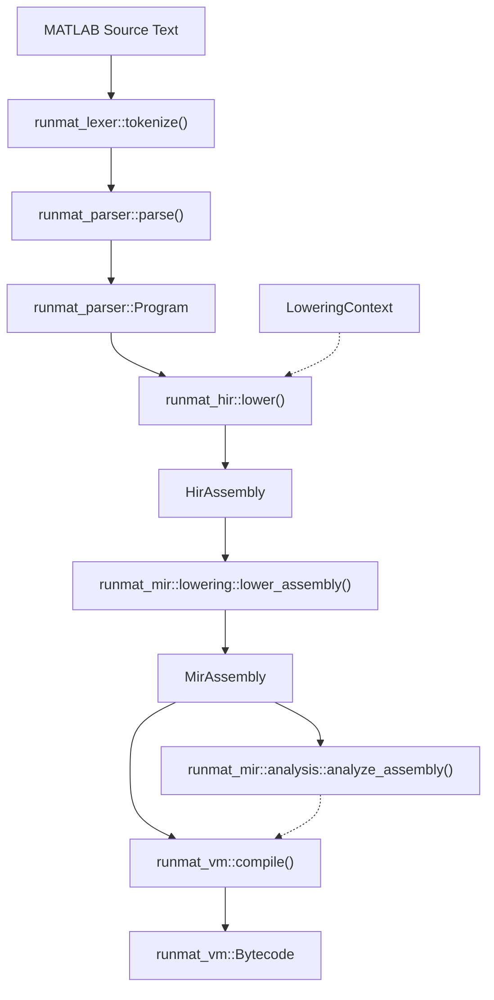

# Compilation Pipeline

The RunMat compilation pipeline is a multi-stage transformation process that converts MATLAB source text into executable bytecode. This pipeline is designed to support MATLAB's dynamic semantics while enabling optimizations like static analysis, type inference, and JIT compilation. The pipeline is primarily orchestrated by the `RunMatSession` within the `runmat-core` crate.

### Pipeline Overview

The pipeline follows a linear progression through several intermediate representations (IRs), each serving a specific purpose in the lifecycle of a MATLAB program:

1. Lexer & Parser: Converts raw text into a Concrete Syntax Tree (CST) and then an Abstract Syntax Tree (AST).
2. High-Level IR (HIR): Resolves scopes, performs variable binding, and handles MATLAB-specific constructs like command-form syntax and closure captures.
3. Mid-Level IR (MIR): Lowers the HIR into a Control-Flow Graph (CFG) consisting of basic blocks, suitable for dataflow analysis.
4. Static Analysis: Performs type/shape inference and definite assignment checks on the MIR.
5. Bytecode Compilation: Translates the MIR and analysis facts into optimized bytecode for the RunMat Virtual Machine (VM).

### System Architecture Diagram

The following diagram maps the logical pipeline stages to the specific code entities and crates responsible for each transformation.

See [crates/runmat-core/src/session/compile.rs](https://github.com/runmat-org/runmat/blob/main/crates/runmat-core/src/session/compile.rs) [crates/runmat-core/src/session/mod.rs](https://github.com/runmat-org/runmat/blob/main/crates/runmat-core/src/session/mod.rs) for more details.

---

### Pipeline Stages

#### 2.1 Lexer & Parser

The first stage uses the `runmat-lexer` crate (powered by the `logos` library) to tokenize input. The `runmat-parser` then consumes these tokens to produce a `Program` AST. This stage handles MATLAB's unique syntax rules, such as the distinction between row vectors and matrix rows based on whitespace or semicolons.

For details, see [Lexer & Parser](/docs/runtime/compiler/lexer-and-parser).

#### 2.2 High-Level IR (HIR)

The HIR lowering stage transforms the AST into a `HirAssembly`. This process uses a `LoweringContext` to resolve variable bindings (`HirBinding`) and determine whether an identifier refers to a local variable, a global, or a function call.

For details, see [High-Level IR (HIR)](/docs/runtime/compiler/hir).

#### 2.3 Mid-Level IR (MIR)

The `runmat-mir` crate flattens the HIR into a Control-Flow Graph (CFG). The MIR is organized into `BasicBlock` structures and uses `MirLocal` slots to represent stack locations. This representation is critical for optimizations and subsequent JIT lowering.

For details, see [Mid-Level IR (MIR)](/docs/runtime/compiler/mir).

#### 2.4 MIR Analysis & Static Analysis

Before bytecode generation, the `AnalysisStore` is populated by running dataflow passes over the MIR. This includes:

- Definite Assignment: Ensuring variables are initialized before use.
- Type/Shape Inference: Predicting tensor dimensions and numeric types to select optimized VM opcodes.

For details, see [MIR Analysis & Static Analysis](/docs/runtime/compiler/static-analysis).

---

### Execution Preparation

Once the bytecode is generated, the `RunMatSession` prepares it for the VM by integrating it with the `FunctionRegistry`. This allows the interactive REPL to maintain state and function definitions across multiple execution requests.

For next steps from the compilation pipeline from here, see [VM Interpreter & Bytecode](/docs/runtime/vm).
