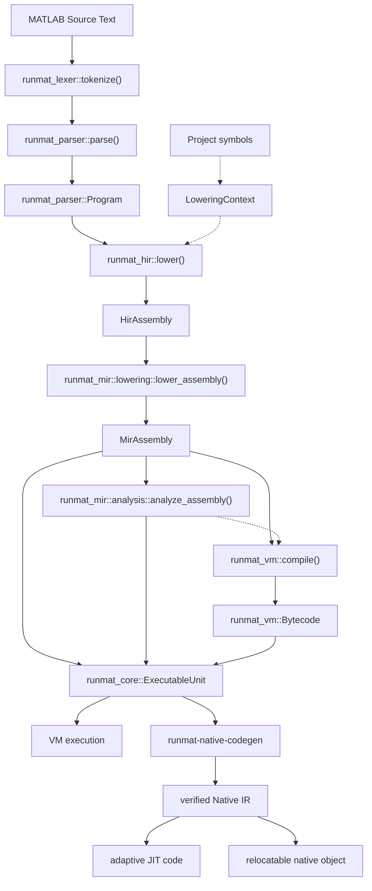

# Compilation Pipeline

The RunMat compilation pipeline converts MATLAB source text into shared semantic and executable products. Static analysis, VM bytecode, adaptive JIT compilation, and native object emission consume those products without defining separate source-language pipelines. `RunMatSession` in `runmat-core` orchestrates compilation for a project and execution request.

### Pipeline Overview

Source passes through several intermediate representations before branching into execution-specific products:

1. Lexer & Parser: Converts raw text into a Concrete Syntax Tree (CST) and then an Abstract Syntax Tree (AST).
2. High-Level IR (HIR): Resolves scopes, performs variable binding, and handles MATLAB-specific constructs like command-form syntax and closure captures.
3. Module Composition: Applies project source roots, package folders, class folders, private functions, dependencies, and entrypoints to source-aware resolution.
4. Mid-Level IR (MIR): Lowers the HIR into a Control-Flow Graph (CFG) consisting of basic blocks, suitable for dataflow analysis.
5. Static Analysis: Performs type/shape inference and definite assignment checks on the MIR.
6. Executable Preparation: Packages MIR, analysis facts, bytecode, source maps, and stable identities for the VM, JIT, native compilation, and tooling.

### System Architecture Diagram

The following diagram maps the logical pipeline stages to the specific code entities and crates responsible for each transformation.

```mermaid
flowchart TD
  Input["MATLAB Source Text"]
  Lexer["runmat_lexer::tokenize()"]
  Parser["runmat_parser::parse()"]
  AST["runmat_parser::Program"]
  LoweringCtx["LoweringContext"]
  ProjectSymbols["Project symbols"]
  HIR_Lower["runmat_hir::lower()"]
  Assembly["HirAssembly"]
  MIR_Lower["runmat_mir::lowering::lower_assembly()"]
  MIR_Data["MirAssembly"]
  Analysis["runmat_mir::analysis::analyze_assembly()"]
  VMCompiler["runmat_vm::compile()"]
  Bytecode["runmat_vm::Bytecode"]
  Unit["runmat_core::ExecutableUnit"]
  VM["VM execution"]
  NativeLower["runmat-native-codegen"]
  NativeIR["verified Native IR"]
  JIT["adaptive JIT code"]
  AOT["relocatable native object"]
  Input --> Lexer
  Lexer --> Parser
  Parser --> AST
  ProjectSymbols -.-> LoweringCtx
  AST --> HIR_Lower
  LoweringCtx -.-> HIR_Lower
  HIR_Lower --> Assembly
  Assembly --> MIR_Lower
  MIR_Lower --> MIR_Data
  MIR_Data --> Analysis
  MIR_Data --> VMCompiler
  Analysis -.-> VMCompiler
  VMCompiler --> Bytecode
  MIR_Data --> Unit
  Analysis --> Unit
  Bytecode --> Unit
  Unit --> VM
  Unit --> NativeLower
  NativeLower --> NativeIR
  NativeIR --> JIT
  NativeIR --> AOT
```

See [crates/runmat-core/src/session/compile.rs](https://github.com/runmat-org/runmat/blob/main/crates/runmat-core/src/session/compile.rs) [crates/runmat-core/src/session/mod.rs](https://github.com/runmat-org/runmat/blob/main/crates/runmat-core/src/session/mod.rs) for more details.

---

### Pipeline Stages

#### 2.1 Lexer & Parser

The first stage uses the `runmat-lexer` crate (powered by the `logos` library) to tokenize input. The `runmat-parser` then consumes these tokens to produce a `Program` AST. This stage handles MATLAB's unique syntax rules, such as the distinction between row vectors and matrix rows based on whitespace or semicolons.

For details, see [Lexer & Parser](/docs/runtime/compiler/lexer-and-parser).

#### 2.2 High-Level IR (HIR)

The HIR lowering stage transforms the AST into a `HirAssembly`. This process uses a `LoweringContext` to resolve variable bindings (`HirBinding`) and determine whether an identifier refers to a local variable, a global, or a function call.

For details, see [High-Level IR (HIR)](/docs/runtime/compiler/hir).

#### 2.3 Module Composition

Project source roots and dependencies provide the known symbols used for cross-file calls, package-qualified names, class-folder methods, private functions, imports, and named entrypoints.

For details, see [Module Composition](/docs/runtime/compiler/modules).

#### 2.4 Mid-Level IR (MIR)

The `runmat-mir` crate flattens the HIR into a Control-Flow Graph (CFG). The MIR is organized into `BasicBlock` structures and uses `MirLocal` slots to represent stack locations. VM bytecode, static analysis, JIT compilation, and native object emission retain its control-flow and binding identities.

For details, see [Mid-Level IR (MIR)](/docs/runtime/compiler/mir).

#### 2.5 MIR Analysis & Static Analysis

The `AnalysisStore` is populated by running dataflow passes over the MIR. This includes:

- Definite Assignment: Ensuring variables are initialized before use.
- Type/Shape Inference: Recording tensor dimensions and numeric types for diagnostics, VM lowering, native specialization, and placement.

For details, see [MIR Analysis & Static Analysis](/docs/runtime/compiler/static-analysis).

---

#### 2.6 Executable Preparation

`RunMatSession` packages MIR, analysis facts, bytecode, source maps, program identities, and the environment revision into an immutable executable unit. The VM executes its bytecode. The JIT and `runmat compile` lower the retained MIR and analysis through verified Native IR.

Continue with [VM Interpreter & Bytecode](/docs/runtime/vm), [JIT Compiler](/docs/runtime/jit), or [Native Compilation](/docs/runtime/compiler/native-compilation).
