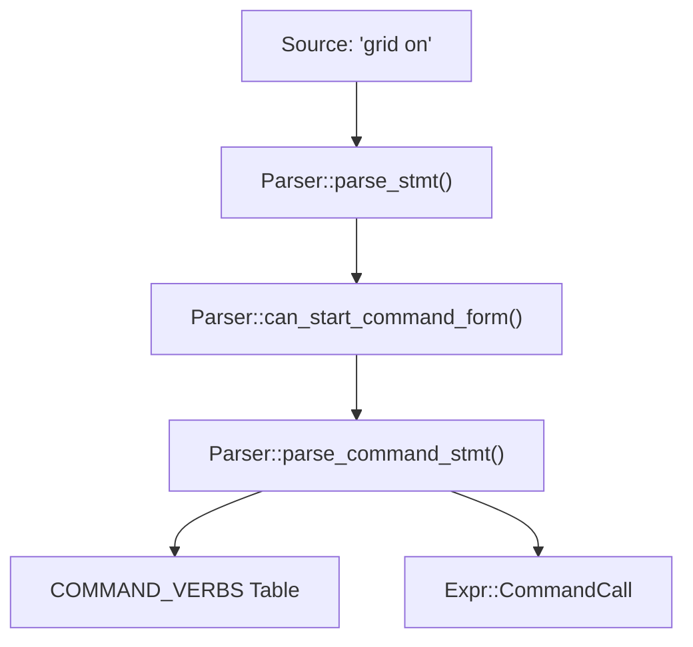
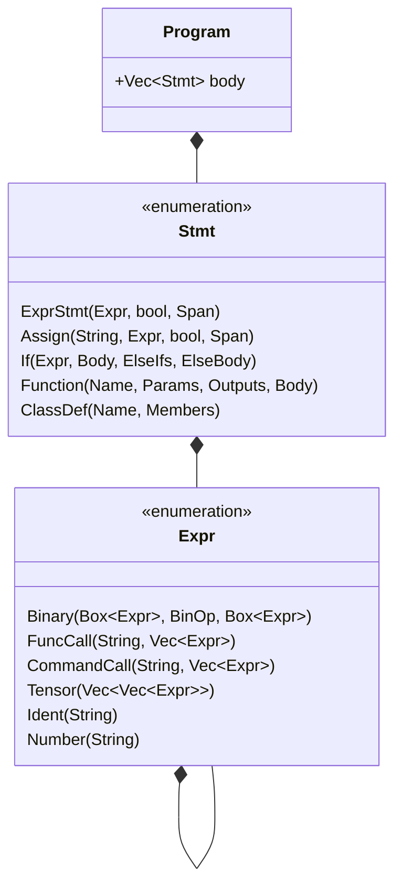

# Lexer & Parser

The RunMat compilation pipeline begins with the transformation of raw MATLAB source text into a structured Abstract Syntax Tree (AST). This process is handled by two primary components: `runmat-lexer`, which tokenizes the input using the `logos` library, and `runmat-parser`, a hand-written recursive descent parser that handles the unique ambiguities of MATLAB syntax, including command-form calls and matrix literals.

## Tokenization (runmat-lexer)

The lexer converts source text into a stream of `Token` variants. It is built on the `logos` Rust crate for high-performance regular expression matching.

### Key Token Categories

- Keywords: Standard MATLAB control flow tokens such as `if`, `for`, `while`, `function`, `classdef`, and `try`
- Operators: Arithmetic (`+`, `-`, `*`, `./`), logical (`&&`, `||`), and comparison (`==`, `>=`, `~=`)
- Structural: Brackets `[]`, braces `{}`, and parentheses `()` used for arrays, cell arrays, and indexing/calls
- MATLAB Specifics: The `transpose` operator (`'`), the `colon` operator (`:`), and the `ellipsis` (`...`) for line continuation

### Data Flow: Lexer to Parser

The parser consumes `TokenInfo` structures, which wrap a `Token` with its `Span` (byte offsets) and the original `lexeme` string

## Parser Implementation (runmat-parser)

The `Parser` struct maintains the state of the current token stream, the current position, and the configuration `CompatMode` It implements a recursive descent strategy to build the `Program` AST

### Statement Parsing & Semicolons

MATLAB uses newlines or semicolons to terminate statements. The parser distinguishes between these to determine if the result of an expression should be printed to the console (suppressed vs. unsuppressed)

| Terminator | Stmt Metadata | Result |
| --- | --- | --- |
| ; | suppressed: true | Value is computed but not displayed. |
| , or \n | suppressed: false | Value is displayed in the command window. |

### Command-Form Syntax

One of the most complex aspects of the MATLAB grammar is the "command-form" call (e.g., `hold on` vs `hold('on')`). The parser uses a lookahead mechanism `can_start_command_form` to decide if an identifier should be treated as a function call with stringified arguments.

#### Command Verb Resolution

The parser maintains a list of `COMMAND_VERBS` that dictate how arguments are stringified.

Parser to AST Entity Mapping

### Expression Grammar

The expression parser follows standard operator precedence, starting from logical OR and descending to primary expressions (literals and identifiers)

Expression Precedence Hierarchy

1. Logical: `||` (OR), `&&` (AND)
2. Bitwise: `|`, `&`
3. Relational: `<`, `<=`, `>`, `>=`, `==`, `~=`
4. Additive: `+`, `-`
5. Multiplicative: `*`, `/`, `\`, `.*`, `./`, `.\`
6. Power: `^`, `.^`
7. Unary: `+`, `-`, `~`

### Matrix and Cell Array Parsing

The parser handles matrix literals `[]` and cell arrays `{}` by tracking "rows" of expressions. It uses a specialized `in_matrix_expr` flag to handle the whitespace-as-separator ambiguity (e.g., `[1 +2]` is `[3]` but `[1 + 2]` is `[1, 2]`)

## Abstract Syntax Tree (AST)

The resulting AST is defined in `crates/runmat-parser/src/ast.rs`. It consists of `Stmt` (Statements) and `Expr` (Expressions).

AST Structure Overview

## Compatibility Modes

The parser behavior changes based on the `CompatMode` provided in `ParserOptions`

- Matlab: Standard behavior, allows command-form syntax and permissive parsing
- Strict: Disables command-form syntax; functions must be called with parentheses
- RunMat: Enables extended features like `async` and `isolated` function modifiers

## Next Steps

After the parser, the AST is passed to the HIR lowering stage. See [High-Level IR (HIR)](/docs/runtime/compiler/hir) for the next stage in the compilation pipeline.