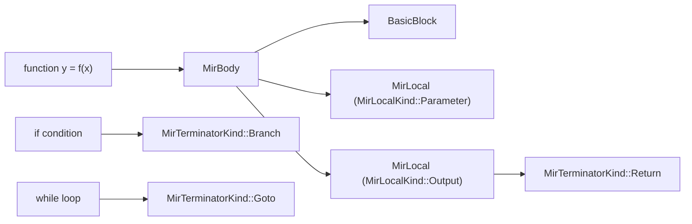
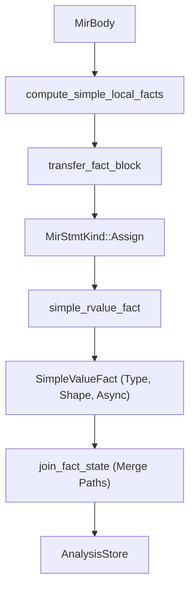

# Mid-Level IR (MIR)

The Mid-Level IR (MIR) represents the stage in the RunMat compilation pipeline where High-Level IR (HIR) is lowered into a Control-Flow Graph (CFG) of Basic Blocks. While HIR maintains a structure close to the original MATLAB AST (nested loops, if-statements), MIR flattens these into explicit jumps, branch targets, and local variable slots (locals). This representation is used for dataflow analysis, type inference, and as the primary input for bytecode generation.

Lowering HIR to MIR mirrors the approach used by modern compilers such as the Rust compiler. The flattened control-flow graph lets RunMat perform dataflow analysis and type inference, and it serves as the primary input for bytecode generation, enabling static analysis and optimization of runtime branches before execution.

---

## MIR Structure & CFG

A MIR program is organized into a `MirAssembly`, which contains a collection of `MirBody` objects indexed by their `FunctionId`. Each `MirBody` consists of a list of `MirLocal` declarations and a graph of `BasicBlock` nodes.

### Basic Blocks and Control Flow

Every `BasicBlock` contains a sequence of `MirStmt` and exactly one `MirTerminator`.

- `MirStmt`: Linear operations like assignments (`Assign`), multi-assignments (`MultiAssign`), or expressions evaluated for side effects (`Expr`).
- `MirTerminator`: Dictates the transfer of control out of the block.

The terminator kind makes every exit edge explicit:

```rust
pub enum MirTerminatorKind {
    Goto(BasicBlockId),
    Branch { cond, then_block, else_block },
    Switch { discr, cases, otherwise },
    For { binding, iterable, body_block, exit_block },
    TryCatch { try_block, catch_block, catch_binding },
    Return(Vec<MirOperand>),
    Await { future, result, resume },
    Unreachable,
}
```

### MIR Data Entity Mapping

The following diagram bridges the conceptual MATLAB control flow to the internal MIR representation.



---

## MIR Lowering (HIR to MIR)

Lowering is performed by the `lower_assembly` function, which iterates through HIR functions and utilizes a `ControlFlowBuilder` to construct the CFG.

### ControlFlowBuilder & Continuation Passing

The `ControlFlowBuilder` handles the conversion of nested HIR structures into flat blocks using a continuation-passing approach. When encountering a branch or an `await` point, the builder:

1. Allocates a `fresh_block()` for the continuation.
2. Lowers the "current" block's terminator to point to the new block.
3. Recursively lowers the remaining statements into the continuation block.

### MirLocal Slots

MIR replaces HIR `BindingId` references with `MirLocalId` slots. Locals are categorized by `MirLocalKind`:

- `Parameter`: Input arguments to the function.
- `Output`: Variables that will be returned.
- `Binding`: Standard local variables.
- `Capture`: Variables captured from an outer scope (closures).
- `Temporary`: Compiler-generated slots for intermediate expression results.

---

## Rvalues and Indexing Plans

MIR expressions are represented as `MirRvalue`. Unlike HIR expressions, `MirRvalue` is shallow; its operands are usually `MirOperand::Local` or `MirOperand::Constant`.

### Indexing Operations

MATLAB indexing is complex (supporting `end`, `:`, and logical masks). MIR lowers these into a `MirIndexing` structure containing `MirIndexComponent`s.

- `MirIndexPlan`: Determines if the access is `Scalar`, `Slice`, or `Cell`.
- `MirRvalue::Index`: Represents a read operation.
- `MirStmtKind::Assign` with `MirPlace::Index`: Represents a write/mutation operation.

### Rvalue Kinds

| Kind | Description |
| --- | --- |
| Use | Simple move or copy of an operand. |
| Binary / Unary | Arithmetic and logical operations. |
| Call | Function invocation with MirCallee (Static or Dynamic). |
| Aggregate | Construction of Tensors or Cell arrays. |
| ShortCircuit | Short-circuit logical `&&` and `\|\|` with their own branch evaluation. |

---

## MIR Dataflow Analysis

Once lowered, the `AnalysisStore` tracks facts about `MirLocal` slots across the CFG using a fixed-point iteration engine in `compute_simple_local_facts`.

### Analysis Logic Flow

The diagram below illustrates how the analysis engine processes a `MirBody` to produce type and shape facts.



### Key Analysis Facts

- `InitFact`: Tracks if a local is `Unassigned`, `MaybeAssigned`, or `DefinitelyAssigned`. Used for definite assignment validation.
- `SimpleValueFact`: Aggregates `TypeFact` (e.g., Double, Struct), `ShapeFact` (dimensions), and `ValueFlowFact`.
- `SpawnSafetyFact`: Analyzes if a closure or function is safe to `spawn` on a background thread based on its captures and effects.
