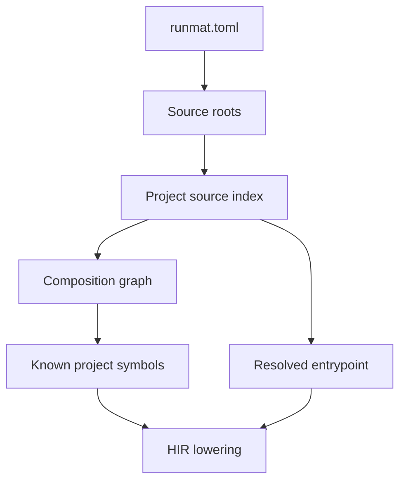

# Module Composition

RunMat composes source files into a project-aware module graph before HIR lowering resolves calls, imports, function handles, and entrypoints. This gives the compiler a stable view of a project without changing the MATLAB folder conventions users already write.

The composition layer starts from a project manifest, scans configured source roots, records qualified source names, and passes known project symbols into the compiler, CLI, and LSP analysis paths.

## Source Index

The source index is built from `[sources].roots` in `runmat.toml` or `runmat.json`.

```toml
[package]
name = "image_pipeline"

[sources]
roots = ["src"]
```

For each `.m` file under a source root, RunMat records:

| Field | Meaning |
| --- | --- |
| Source root | The configured root that contributed the file. |
| Relative path | The file path under that source root. |
| Qualified name | The dotted name used for project-aware resolution. |
| Package path | The package prefix from `+pkg` folders, when present. |
| Class name | The class folder name from `@ClassName`, when present. |
| Private flag | Whether the file was discovered under a `private` folder. |

Directory names determine the qualified name:

| File | Qualified name | Notes |
| --- | --- | --- |
| `src/main.m` | `main` | Plain source file. |
| `src/utils/normalizeRows.m` | `utils.normalizeRows` | Ordinary directories contribute module segments. |
| `src/+stats/summarize.m` | `stats.summarize` | Package folders contribute package segments without the `+`. |
| `src/@Report/title.m` | `Report.title` | Class folders contribute the class name without the `@`. |
| `src/+stats/@Series/mean.m` | `stats.Series.mean` | Package and class folders compose. |
| `src/private/localScale.m` | `localScale` | `private` is recorded as visibility metadata, not as a name segment. |

The index also records package directories, class directories, and private directories so later resolver stages can enforce the right lookup behavior.

## Composition Graph

Project composition begins at the discovered root manifest. The root package contributes its source index, then each local dependency contributes its own package and source index.

```toml
[package]
name = "app"

[sources]
roots = ["src"]

[dependencies]
tools = { path = "deps/tools", version = "0.1.0" }
```

The composition graph keeps:

- the root package name
- one package record for the root project and each dependency
- each package manifest path and project root
- each package source index
- the root dependency alias map

For symbol discovery, RunMat records several useful forms. A dependency file such as `deps/tools/src/+format/titleCase.m` can be surfaced as:

| Form | Example |
| --- | --- |
| Raw qualified name | `format.titleCase` |
| Package-qualified name | `shared_tools.format.titleCase` |
| Root dependency alias | `tools.format.titleCase` |

The exact package-qualified form uses the dependency package name from its own `[package].name`. The alias-qualified form uses the alias chosen by the root project under `[dependencies]`.

## Entrypoint Resolution

Entrypoints select source for execution. They are host-facing selectors over project source, not a separate source language feature.

A path entrypoint resolves directly to a file:

```toml
[entrypoints.analysis]
path = "src/analyze_sales"
```

A module/function entrypoint resolves through the source index:

```toml
[entrypoints.summary]
module = "stats"
function = "summarize"
```

For module/function targets, RunMat looks for a source file whose qualified name matches either the module name or the module plus function name. This supports both file-shaped functions and class-folder targets discovered from the same source index.



## Imports And Dependencies

Dependencies make external project symbols available. `import` changes how source names are visible inside a file.

That distinction matters:

- `[dependencies]` decides which external packages participate in composition.
- `import` decides whether a source file may refer to a qualified symbol with a shorter name.
- Internal identities remain qualified even when source code uses an imported short name.

This lets wildcard imports and function handles resolve through the same project symbol inventory used by ordinary calls.

## HIR Boundary

Composition happens before HIR lowering, but it does not make project paths into runtime slots. The compiler receives known symbols and entrypoint context; HIR then owns the semantic assembly of modules, functions, classes, bindings, and entrypoints.

Important boundaries:

- Source indexes use stable names and paths from the project.
- HIR IDs such as `FunctionId` and `BindingId` are local to one compiler product.
- VM slots and frame indexes are runtime layout details derived after lowering.
- Workspace export is based on semantic binding visibility, not on source path strings.

The LSP uses the same source-context discovery path as execution where possible, so diagnostics and completion see project symbols consistently with CLI execution. Remote or virtual source names do not inherit local project symbols unless they resolve to an actual local path.

## Related Docs

- [Projects](/docs/runtime/getting-started/projects)
- [High-Level IR (HIR)](/docs/runtime/compiler/hir)
- [Callable Resolution & Function Dispatch](/docs/runtime/vm/dispatch)
