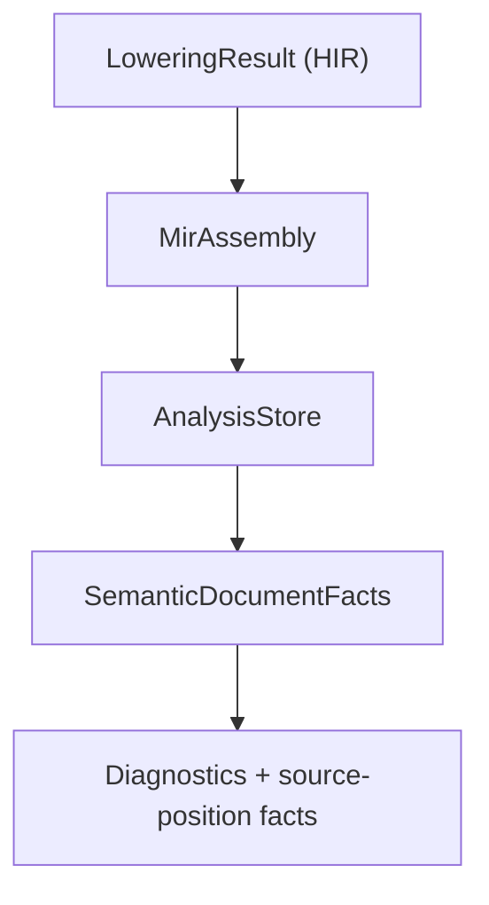
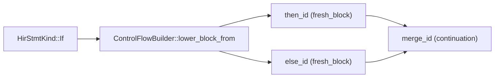

# MIR Analysis & Static Analysis

Mid-Level IR (MIR) Analysis is the primary stage for dataflow reasoning and validation in the RunMat compilation pipeline. This layer bridges the gap between the structural representation of the High-Level IR (HIR) and the execution-ready bytecode. It performs type/shape inference, definite assignment checking, and spawn-safety validation to ensure program correctness before runtime.

These facts approximate runtime values; they are not the runtime value representation itself. For the concrete `Value` type passed through the VM, builtins, session, GC, GPU, and host adapters, see [Runtime Values & Type Model](/docs/runtime/values).

## Diagnostic identifiers

RunMat diagnostic identifiers describe the subsystem and kind of failure.

- Compiler diagnostics use `RM-<DOMAIN><NNNN>`. Current domains include `RES`
  for name resolution, `CAT` for source-catalog construction, and `MIR` for MIR
  validation. Numbers are stable within a domain and are not reused.
- Runtime errors use MATLAB-compatible `RunMat:<operation>:<condition>`
  identifiers because callers can inspect and catch them at execution time.
- Optional static-analysis lints use the hierarchical `lint.<area>.<rule>`
  namespace.

For example, `RM-RES0001` means a callable could not be resolved from the
statically known program and source catalog. `RM-RES0002` means a preceding
runtime environment mutation prevents a sound static answer; it does not claim
that the function is absent at execution time. `RM-CAT0001` means RunMat could
not construct the catalog that resolution depends on.

## MIR Analysis Architecture

The analysis system operates on the `MirAssembly` structure, iterating through `MirBody` objects. The core of the analysis is a fixed-point dataflow engine that propagates "facts" across the Control Flow Graph (CFG).

### Analysis Data Structures

The results of these analyses are aggregated into an `AnalysisStore`, which serves as a central repository for metadata about MIR locals and global function properties.

| Entity | Role | Source |
| --- | --- | --- |
| `AnalysisStore` | Versioned, deterministic program-point, region, function, class, dependency, and diagnostic product. | `crates/runmat-mir/src/analysis/store/mod.rs` |
| `ProgramPointFacts` | Stable source span plus assignment and `ValueFact` state for every region value at one CFG point. | `crates/runmat-mir/src/analysis/store/program_point.rs` |
| `RegionAnalysis` | A portable pure-region contract plus the exact MIR operations and later consumer points that justify it. | `crates/runmat-mir/src/analysis/store/region.rs` |
| `FlowState` | Internal fixed-point state for locals, retained literals, effects, capabilities, and distributed values. | `crates/runmat-mir/src/analysis/engine/state.rs` |
| `ValueFact` | Shared presentation-neutral value taxonomy and shape/storage/placement facts. | `crates/runmat-types/src/fact/value.rs` |
| `SemanticDocumentFacts` | Portable source-binding projection consumed by native LSP, WASM, and Desktop. | `crates/runmat-static-analysis/src/semantic/model.rs` |

### Dataflow Engine Implementation

The dataflow engine uses a worklist algorithm to compute facts for each `BasicBlock`.

1. Initialization: `FlowState::entry` seeds parameters and captures, then `analyze_body` establishes block-entry states.
2. Transfer: `transfer_statement` applies canonical operand/operator/aggregate/call/index/mutation rules and retains literals needed by later contracts.
3. Join and widening: `FlowState::join_from` combines assignment, value, literal, effect, capability, and distributed-value lattices at CFG edges; bounded iterations widen safely.
4. Region discovery: after facts converge, the analyzer finds maximal pure statement runs, computes CFG liveness and reachable future consumers, and rejects operations with effects, mutation, or parallel and distributed execution requirements.
5. Publication: `analyze_assembly` records ordered `ProgramPointFacts`, stable region contracts, interprocedural summaries, class products, dependencies, revision fingerprints, and diagnostics in `AnalysisStore`.

## Key Analysis Domains

### 1. Definite Assignment (InitFact)

The `InitFact` analysis determines if a `MirLocal` is assigned before use. It tracks three states: `Unassigned`, `MaybeAssigned`, and `DefinitelyAssigned` This is critical for MATLAB semantics where accessing an uninitialized variable triggers a runtime error.

### 2. Type & Shape Inference

`ValueFact` tracks the evolution of value kind, numeric class/domain, shape, storage, layout, residency, aliasing, mutation, certainty, and invalidation at each program point.

- Rvalue Inference: canonical `runmat-types` rules determine facts and structured diagnostics from constants, operators, indexing, aggregates, mutation, and calls
- Shape Propagation: For operations like `MirRvalue::Binary`, the system attempts to resolve resulting shapes (e.g., matrix multiplication dimensions)

### 3. Spawn-Safety Checking

RunMat performs static validation on `spawn` expressions to ensure that closures captured for parallel execution do not violate memory safety or MATLAB's execution model.

- Capture Scanning: `analyze_capture_facts` walks the MIR to find all `reads_captures` and `writes_captures`
- Safety Fact: It produces a `SpawnSafetyFact`, identifying if a task is `RequiresIsolation` or is safe for shared execution

### 4. Pure Execution Regions

Pure-region discovery identifies deterministic computation boundaries that later execution tiers may evaluate without replaying effects. A region contains only consecutive local assignments or expressions whose inferred effect set is empty; workspace and environment operations, place mutation, async work, distributed or parallel operations, and impure calls split or exclude a candidate. Runs may join across a linear, single-predecessor `goto` edge, but never across a branch merge or cycle.

Each published region carries a stable function-scoped ID, source span, entry and exit program points, sorted live-in and live-out values, available value facts, effects, capabilities, and provenance. Analysis-only evidence retains the exact member operations and reachable future consumer sites. The same contract is copied unchanged into the portable executable manifest; the VM maps its program-point boundaries to bytecode PCs, and Native IR maps them to verified entry and exit boundaries. If any exact VM boundary is unavailable, executable construction fails instead of publishing an approximate region.

## Static Analysis & Linting (runmat-static-analysis)

The `runmat-static-analysis` crate owns the source-facing frontend and portable semantic projection. It consumes the one `AnalysisStore` authority to produce user-facing diagnostics and source-position facts for native and browser tooling.

### Shared Fact and Diagnostic Workflow

Type, shape, and call-contract validation happens while MIR dataflow applies the canonical rules. There is no separate sequential shape walker.

#### Logic to Code Mapping: Shape Inference

Implementation Details:

- Literal retention: MIR flow retains source-known numeric and aggregate literals needed by shape transforms such as `reshape`, `repmat`, and `permute`.
- Diagnostic generation: `FactInference` diagnostics are attached to the exact MIR statement span and surfaced by the shared frontend.
- Tooling projection: bindings map to stable region values and ordered program-point observations. Hover, completion, signature help, semantic tokens, native LSP, WASM LSP, and Desktop query this same portable projection rather than recomputing facts.

## Control Flow Lowering to MIR

The analysis relies on a well-formed CFG generated by the `ControlFlowBuilder`. This builder transforms nested HIR structures into `BasicBlock` sequences.

#### Logic to Code Mapping: CFG Construction

Key Builder Functions:

- `lower_function_body`: Entry point that initializes the `BlockLoweringEnv` and creates the first `BasicBlock`
- `lower_block_from`: Recursive function that handles statement-by-statement lowering. When it encounters control-flow (like `If` or `Await`), it splits the current block and creates continuations
- `lower_continuation_target`: Manages the "continuation-passing" style of the builder, ensuring that the code following a block (like the code after an `if/end`) is correctly linked via a `Goto` terminator
