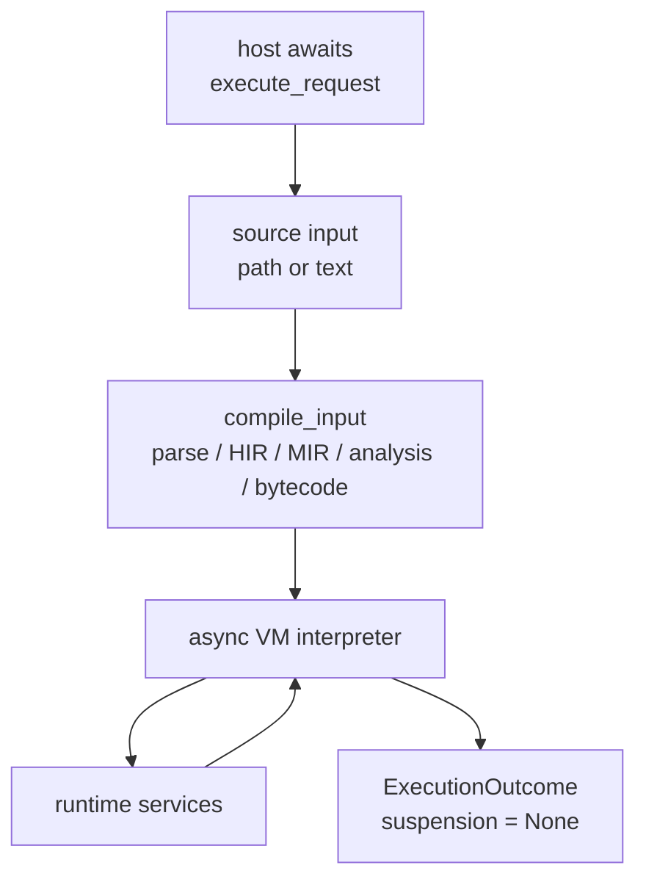

# Async Execution

RunMat's execution entrypoints are async so a host can await a complete request while the VM and runtime await host interaction, builtin futures, GPU/provider work, and selected host/provider callbacks.

The current session path still returns one `ExecutionOutcome` for each request. `ExecutionOutcome::suspension` is reserved in the ABI, but normal execution awaits internally and returns `None`.

## Request Flow



`RunMatSession::execute_request` is async at the host boundary. It resolves the request source, compiles the request synchronously with respect to that execution, and then awaits the interpreter and any runtime operations reached by the bytecode.

A session allows one active execution at a time. The active execution guard prevents overlapping requests from mutating the same workspace concurrently.

## Runtime Await Points

| Boundary | What can be awaited |
| --- | --- |
| Builtins | Runtime builtins dispatched through `call_builtin_async_with_outputs`, including async Rust builtin implementations. |
| Host input | `request_line_async` and `wait_for_key_async`, with prompts recorded as `StdinEvent` entries. |
| GPU/provider work | Provider gathers, downloads, and builtin dispatch paths that need to materialize GPU-resident values. |
| Filesystem, remote I/O, and HTTP | Async API surfaces for source/data I/O and network-backed work. Some native local, remote, and HTTP paths still use blocking internals; remote filesystem reads parallelize chunks for throughput. |
| Semantic callbacks | Runtime paths such as `feval`, closures, object dispatch, and builtin callbacks can call bytecode-defined functions through async semantic-function hooks. |

Runtime builtins can be plain synchronous Rust functions or `async fn` implementations registered through the builtin macro system. The dispatcher keeps the call surface uniform: VM call instructions await the runtime dispatcher, and the dispatcher awaits the selected implementation when needed.

If a host-only builtin receives GPU values and the first implementation fails on GPU input, the dispatcher can gather arguments and retry a compatible implementation. `gather_if_needed_async` recursively materializes tensors, logical arrays, cells, structs, objects, closures, and output lists.

## RunMat Async Language Extensions (Beta)

RunMat accepts `async function` and `await(...)` as RunMat extensions to the MATLAB language. MATLAB-strict compatibility mode rejects these forms before execution (see [Configuration Reference](/docs/runtime/getting-started/config) for more details on setting the compatibility mode).

Calling an async function returns a future. The function body does not run when the future is created; it runs when the future is awaited.

`await(value)` is allowed inside async functions and at top level when the host policy enables top-level await. It resolves a future or spawn handle, and passes through ordinary values.

```matlab
async function y = ask()
  input("ready: ");
  y = 1;
end

f = ask();    % no prompt yet
y = await(f); % prompt happens here
```

## Spawn Handles

`spawn(value)` is also a RunMat language extension to the MATLAB language. It accepts a future and returns a single-use spawn handle. It currently resolves the future before returning the handle, but this will change in a future release to return the future itself.

```matlab
async function y = ask()
  input("ready: ");
  y = 1;
end

f = ask();      % no prompt yet
t = spawn(f);   % prompt happens here in the current runtime
y = await(t);   % consumes the spawn handle
```

Spawn handles are retired when they are awaited, replaced, dropped from the stack, or removed from scope. Awaiting the same spawn handle twice is an error.

## Host Interaction

Each execution installs the session's async interaction handler as a scoped runtime guard. If the host provides a handler, the runtime awaits it and records the prompt, input kind, echo flag, returned value, or error. If no handler exists, native execution falls back to terminal helpers. WASM execution has no default stdin, so browser or JavaScript hosts provide interaction through the WASM API.

`input()` expression parsing uses a separate eval hook. When expression mode is needed, the hook compiles the typed expression through the normal parser, HIR, MIR, and bytecode path. Native hosts run that nested interpretation on a dedicated thread with a larger stack and return the result through a one-shot channel. WASM awaits the nested interpreter directly.

## Current Limits

`ExecutionOutcome::suspension` is not active for normal execution. Await points complete inside `execute_request`; hosts do not receive a resumable execution token today.

`spawn` is not a background scheduler yet; it resolves work before returning the spawn handle.

Native local filesystem, native remote filesystem, and native HTTP code expose async-shaped APIs but can block internally. The remote filesystem path is still designed for throughput: large reads can be split across worker threads and issued in parallel chunks.

Cancellation is cooperative. `RunMatSession` owns an interrupt flag, resets it for each execution, and installs it into the runtime interrupt hook. Long native calls, provider kernels, filesystem work, or JIT code stop only after control reaches a polling boundary.
