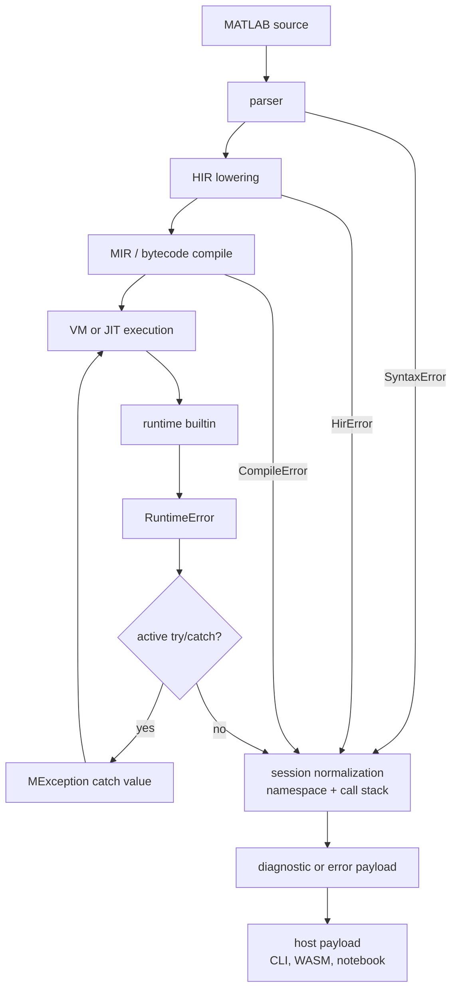

# Errors & Diagnostics

RunMat separates request setup and compile-stage failures from runtime failures. Source resolution, parser, HIR, and bytecode compilation failures leave `execute_request` as `Err(RunError)`. Runtime failures raised after bytecode execution begins use `RuntimeError`; the session captures them as diagnostics in `ExecutionOutcome` so hosts can still receive streams, warnings, figures, and other execution metadata.

## Error Flow

Compile-stage failures do not enter MATLAB `try`/`catch`; they occur before bytecode execution. `try`/`catch` handles `RuntimeError` values raised during VM or JIT execution.

## `RunError`

`runmat-core` exposes four failure stages through `RunError`:

| Variant | Source |
| --- | --- |
| `Syntax` | Parser errors from source text. |
| `Semantic` | HIR lowering, validation, name resolution, and semantic checks. |
| `Compile` | VM bytecode compilation and lowering failures after semantic analysis. |
| `Runtime` | `RuntimeError` values used for runtime failures and runtime diagnostics. |

Telemetry and host error payloads keep the stage so callers can distinguish invalid source from a runtime exception. Runtime failures that occur inside an assembled execution outcome use the same `RuntimeError` structure, but they are carried through `ExecutionOutcome::diagnostics`.

## `RuntimeError`

`RuntimeError` is the shared runtime failure type re-exported by `runmat-runtime`. It carries:

| Field | Meaning |
| --- | --- |
| `message` | Human-readable error text. |
| `identifier` | Stable MATLAB-style identifier such as `RunMat:UndefinedFunction`. |
| `span` | Optional source span for diagnostics. |
| `source` | Optional wrapped Rust error. |
| `context.builtin` | Builtin that produced the error, when known. |
| `context.phase` | Runtime phase, when known. |
| `context.task_id` | Async task identifier, when relevant. |
| `context.call_stack` / `call_frames` | Human-readable call stack or structured call frames. |
| `context.call_frames_elided` | Number of hidden call frames when the stack is truncated. |

The builder API adds identifiers, builtin names, phases, spans, source errors, task IDs, and call-stack context. Diagnostic formatting can include source snippets, caret spans, builtin/phase/task metadata, and call-stack lines.

## Namespace And Call Stack Normalization

The session sets the active HIR and VM error namespace before execution. Runtime identifiers are normalized through that namespace before the host sees them, preserving the suffix while replacing the configured prefix when needed.

If a runtime error leaves the VM, the session populates call-stack text from VM call frames and the `SourcePool`. This is where function names, source names, line/column positions, and elided-frame counts become host-visible diagnostic context.

## MATLAB Exceptions

`MException` is represented as a runtime value with an `identifier`, `message`, and `stack`. The VM converts caught `RuntimeError` values into `MException` values when it redirects control to a catch block.

`try`/`catch` compiles to bytecode-level exception routing:

| Bytecode state | Role |
| --- | --- |
| `EnterTry(catch_pc, catch_var)` | Pushes a catch target onto the interpreter `try_stack`. |
| `PopTry` | Removes the target when the protected region exits normally. |
| `redirect_exception_to_catch` | Converts `RuntimeError` to `MException`, stores the optional catch variable, updates `last_exception`, and jumps to the catch block. |

`rethrow(e)` raises a new `RuntimeError` from an explicit `MException`. A bare `rethrow()` is handled by the VM when a previous catch has populated `last_exception`.

## Diagnostics Builtins

The diagnostics builtins are ordinary runtime builtins that raise `RuntimeError` or record warnings.

| Builtin | Behavior |
| --- | --- |
| `error` | Raises a runtime error from a message, identifier/message pair, formatted message, `MException`, or message struct. |
| `assert` | Raises an assertion error when the condition is false. Numeric and logical arrays pass only when all elements are truthy; empty arrays pass. GPU values are gathered before evaluation. |
| `warning` | Records or emits a warning, controls warning state, queries status, and can promote warnings to errors. |

Unqualified identifiers are normalized with a `RunMat:` prefix. Message structs can use `identifier` or `messageid` for the code and `message` or `msg` for the text.

Warnings are stored separately from errors. The session drains the warning store after execution and appends warning diagnostics to `ExecutionOutcome::diagnostics`. A warning promoted to error is returned as a `RuntimeError`.

## WASM Error Payloads

The WASM bindings serialize errors into structured JavaScript payloads instead of plain strings. A payload includes:

| Field | Meaning |
| --- | --- |
| `kind` | `syntax`, `semantic`, `compile`, or `runtime`. |
| `message` | Human-readable message. |
| `identifier` | Stable error identifier, when available. |
| `diagnostic` | Formatted diagnostic text. |
| `span` | Start, end, line, and column when source span information exists. |
| `callstack` | Runtime call-stack lines or frame function names. |
| `callstackElided` | Number of elided runtime frames. |

Initialization failures are separate JavaScript `Error` values with codes such as `InvalidOptions`, `SnapshotResolution`, `FilesystemProvider`, and `SessionCreation`.

## Boundaries

Runtime errors are data-rich, but not every failure has a source span or call stack. Parser, HIR, and compiler errors are often attached to source spans before execution begins. Runtime builtin errors may only know the builtin name and message unless the VM call site or session source pool can attach more context.

Host integrations should display identifiers and messages prominently, preserve structured fields for programmatic handling, and include formatted diagnostics when a text console view is appropriate.
