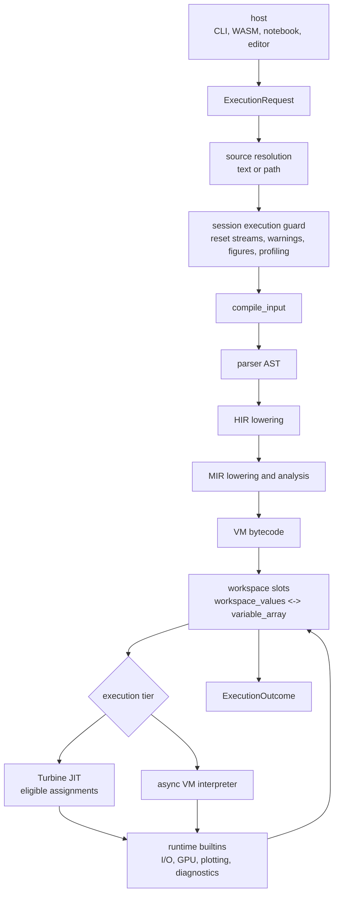

# Execution

This section covers the cross-cutting pieces that do not belong only to the compiler, VM, or session API docs: asynchronous boundaries, error propagation, diagnostics, and observability.

## Execution Path

## Stages

| Stage | Primary owner | Runtime role |
| --- | --- | --- |
| Source resolution | `runmat-core` session | Loads `SourceInput::Text` or `SourceInput::Path` and records source identity for diagnostics. |
| Compilation | `compile_input` | Parses, lowers HIR, lowers and analyzes MIR, emits bytecode, and prepares semantic function registry updates. |
| Workspace preparation | Session workspace bridge | Maps durable workspace values into VM variable slots and preserves stable binding keys. |
| Execution | Turbine JIT or VM interpreter | Runs bytecode or native code, calls runtime builtins, and updates variable slots. |
| Runtime services | `runmat-runtime` | Handles builtins, GPU gathers, plotting hooks, console streams, warnings, input, and object dispatch. |
| Outcome assembly | `runmat-core` session | Converts final value, workspace state, streams, diagnostics, figures, profiling, and fusion metadata into host ABI values. |

The session prevents concurrent execution on a single `RunMatSession`. Hosts that need concurrent execution should use separate sessions or serialize requests through one session.

## Outcome Contract

`ExecutionOutcome` is the host-facing result of a request.

| Field | Meaning |
| --- | --- |
| `flow` | Public result value, output list, comma list, dynamic list handle, or no value. |
| `workspace_delta` | Workspace version and snapshot requirements for host-side workspace views. |
| `display_events` | Values that should be displayed when output is not suppressed. |
| `streams` | Captured stdout, stderr, and clear-screen events. |
| `diagnostics` | Runtime error and warning records with severity and stable code. |
| `effects` | Declared workspace or environment effects. |
| `suspension` | Reserved ABI for resumable work. The current session path completes awaits internally and returns `None`. |
| `profiling` | Wall-clock and provider profiling summary, when available. |
| `figures_touched` | Plot figure handles changed during execution. |
| `stdin_events` | Prompts, values, and errors from host interaction. |
| `fusion_plan` | Optional Accelerate fusion plan snapshot. |

Warnings are diagnostics, not failed executions. A request can complete successfully while returning warning entries. Runtime errors raised after bytecode execution begins are also returned as diagnostics in the outcome. Source resolution and compile-stage failures leave the request as `RunError` before outcome assembly.

## Observability

The execution path resets and drains per-thread runtime buffers around every request. Console output is captured through `runmat-runtime` console hooks, warnings are drained from the warning store, recent figure IDs come from plotting hooks, and GPU/provider profiling comes from provider telemetry snapshots.

`runmat-logging` bridges Rust `tracing` and `log` events into runtime log records and optional Chrome-trace-style events. It is infrastructure for hosts and developer tooling; it does not change execution semantics.

## Page Map

| Page | Purpose |
| --- | --- |
| [Async Execution](/docs/runtime/execution/async) | Where execution awaits host input, builtin futures, GPU/provider work, filesystem/network work, async semantic calls, and current RunMat async extensions. |
| [Errors & Diagnostics](/docs/runtime/execution/errors) | How syntax, semantic, compile, runtime, warning, `MException`, catch/rethrow, and WASM error payloads are represented. |

For request and workspace details, see [Session Engine](/docs/runtime/session). For instruction-level behavior, see [Interpreter Dispatch & Execution Loop](/docs/runtime/vm/interpreter). For JIT behavior, see [JIT Compiler](/docs/runtime/jit).
