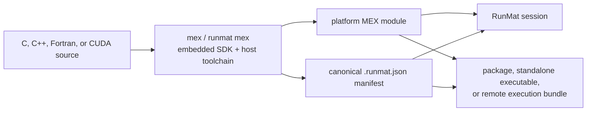

# C, C++, and MEX Extensions

RunMat can build and execute source-compatible MEX gateways without a MATLAB installation. The bundled SDK covers the C Matrix and MEX APIs, the modern C++ Data and Engine APIs, the Fortran Matrix and MEX APIs, and the GPU MEX API. A successful build produces both a platform-native module and a canonical RunMat manifest; together they form the exact artifact used by projects, standalone executables, and remote workers.

This page is the end-to-end guide for building, calling, distributing, and operating MEX code. For the lower-level adapter ABI shared by MEX and other foreign runtimes, see [Native Extension ABI](/docs/runtime/development/extensions).

## Quick Start: C

Create `add_one.c`:

```c
#include "mex.h"

void mexFunction(int nlhs, mxArray *plhs[],
                 int nrhs, const mxArray *prhs[]) {
    if (nrhs != 1 || nlhs != 1 || !mxIsDouble(prhs[0])) {
        mexErrMsgIdAndTxt("Example:AddOne:Arguments",
                         "Expected one double input and one output.");
    }

    plhs[0] = mxDuplicateArray(prhs[0]);
    double *values = mxGetDoubles(plhs[0]);
    for (mwSize i = 0; i < mxGetNumberOfElements(plhs[0]); ++i) {
        values[i] += 1.0;
    }
}
```

Build it from a RunMat session:

```matlab
mex("-R2018a", "add_one.c")
y = add_one([1 2 3]);
```

Or build the same module from the shell:

```bash
runmat mex --R2018a -o add_one add_one.c
```

The output directory contains two files. Their suffix depends on the build host:

```text
add_one.mexa64
add_one.mexa64.runmat.json
```

The module name is its callable RunMat function name. Keep the sidecar manifest next to the module: it binds the module bytes to the target, API mode, compiler family, embedded SDK, and MEX host ABI.

## Quick Start: Modern C++

A C++ source selects the C++17 driver and the interleaved-complex API by default:

```cpp
#include "mex.hpp"
#include "mexAdapter.hpp"
#include <cstddef>

class MexFunction : public matlab::mex::Function {
public:
    void operator()(matlab::mex::ArgumentList outputs,
                    matlab::mex::ArgumentList inputs) override {
        if (inputs.size() != 1 || outputs.size() != 1) {
            throw matlab::Exception("Expected one input and one output.");
        }

        matlab::data::TypedArray<double> result(inputs[0]);
        for (std::size_t i = 0; i < result.getNumberOfElements(); ++i) {
            result[i] = static_cast<double>(result[i]) * 2.0;
        }
        outputs[0] = result;
    }
};
```

```bash
runmat mex -o twice twice.cpp
```

```matlab
y = twice([1 2 3]);
```

Constructing `result` initially shares the input's storage. The first mutable access detaches it, so the input keeps RunMat's normal copy-on-write semantics.

## What The Build Produces

The build service materializes a versioned SDK from the RunMat executable, compiles every source with the appropriate language driver, links the bundled native support unit, and publishes the module plus its manifest. You do not need MATLAB headers, libraries, or a MATLAB installation.



The manifest records:

- a content-derived artifact identity;
- the module name, byte length, and SHA-256 digest;
- the target triple, architecture, operating system, pointer width, and MEX suffix;
- the selected Matrix API and source-language ABI;
- the compiler family, MEX host ABI version, and embedded SDK digest.

Changing either the module or its compatibility contract changes its identity. Moving an unchanged module and manifest together does not.

## Build Entry Points And Options

The session and shell commands use the same build planner and embedded SDK:

```matlab
mex("-v", "-Iinclude", "-DFEATURE=1", ...
    "gateway.c", "support.c", "-output", "filter")
```

```bash
runmat mex --verbose -I include -D FEATURE=1 \
  -o filter gateway.c support.c
```

Use `mexcuda` or `runmat mexcuda` for a CUDA gateway. It requires at least one `.cu` translation unit.

| Concern | Session `mex` / `mexcuda` | Shell `runmat mex` / `mexcuda` |
| --- | --- | --- |
| Output name | `-output name` or `-o name` | `--output name` or `-o name` |
| Output directory | `-outdir directory` | `--out-dir directory` |
| Include directory | `-Idir` or `-I`, `dir` | `-I dir` |
| Definition | `-DNAME=value` or `-D`, `NAME=value` | `-D NAME=value` |
| API selection | `-R2017b`, `-R2018a`, `-largeArrayDims`, `-compatibleArrayDims` | `--R2017b`, `--R2018a`, `--largeArrayDims`, `--compatibleArrayDims` |
| Toolchain | `CC=`, `CXX=`, `FC=` / `F77=`, `NVCC=` | `--compiler path` for the primary driver |
| Driver flags | `CFLAGS=`, `CXXFLAGS=`, `FFLAGS=`, `NVCCFLAGS=`, `LDFLAGS=` | repeated `--compiler-argument` and `--linker-argument` |
| Build command | `-v` or `-verbose`; `-silent` disables it | `--verbose` or `-v` |

The session parser also passes ordinary unrecognized dash-prefixed arguments to the compiler and routes `-L` and `-l` arguments to the linker. `-setup` is intentionally non-interactive: select a compiler explicitly or through the corresponding environment variable.

### Language And Toolchain Selection

Source detection is order-independent. CUDA has the highest link-driver precedence, followed by Fortran, C++, and C. C and C++ helpers are still compiled with their own drivers. Fortran and CUDA gateways cannot be combined in one module.

| Source | Default driver | Default API | Notes |
| --- | --- | --- | --- |
| `.c` | `CC`, otherwise `cc` (`cl.exe` on Windows) | `-R2017b` | C11 on GNU-like toolchains. |
| `.cc`, `.cpp`, `.cxx`, `.c++` | `CXX`, otherwise `c++` (`cl.exe` on Windows) | `-R2018a` | C++17; bundled support remains compiled as C. |
| `.f`, `.for`, `.f77`, `.f90`, `.f95`, `.f03`, `.f08` | `FC`, then `F77`, otherwise `gfortran` | `-R2017b` | Requires a GNU-compatible `gfortran` ABI; fixed-form suffixes retain fixed-form compilation. |
| `.cu` | `NVCC`, then `MW_NVCC_PATH`, otherwise `nvcc` | `-R2018a` | Use `mexcuda`; supported on Linux and Windows x86-64. |

RunMat currently builds on the target host; MEX cross-compilation is not available. macOS and Linux require a GNU-like compiler family, and Windows requires an MSVC-compatible family.

### Matrix API Selection

The API switches are mutually exclusive.

| Selection | Dimensions and indices | Complex layout | Typical use |
| --- | --- | --- | --- |
| `-R2017b` (C/Fortran default) | native-width `mwSize` and `mwIndex` | separate real and imaginary buffers | Existing C gateways using `mxGetPr` / `mxGetPi`. |
| `-R2018a` (C++/CUDA default) | native-width | interleaved complex buffers | Typed C accessors, modern C++, and GPU gateways. |
| `-largeArrayDims` | native-width | separate | Legacy spelling for the large-array separate-complex API. |
| `-compatibleArrayDims` | 32-bit public dimensions and indices | separate | Older source that requires the pre-large-array ABI. RunMat checks and translates at its native-width boundary. |

The selected API is part of the artifact identity. Rebuild rather than renaming or editing a manifest when changing modes.

## Calling And Resolving A Module

MEX modules participate in ordinary function resolution. RunMat checks exact artifacts installed from the active project or executable before searching the session path for the current platform suffix. `mexext` returns that suffix without a leading dot.

```matlab
suffix = mexext();
addpath("build");
[a, b] = native_filter(x);
```

The supported targets are:

| Host | Suffix |
| --- | --- |
| macOS Apple Silicon | `.mexmaca64` |
| macOS x86-64 | `.mexmaci64` |
| Linux x86-64 | `.mexa64` |
| Windows x86-64 | `.mexw64` |

Native MEX loading is unavailable in browser and WebAssembly sessions. Packages and compiled artifacts retain the native requirement so an unsupported host rejects them before program instructions execute.

## C Matrix And MEX API

The bundled `matrix.h` and `mex.h` expose the supported source-compatibility surface. It includes:

- dense real and complex arrays across `double`, `single`, all fixed-width signed and unsigned integer classes, and logicals;
- N-dimensional shapes, scalar and subscript helpers, and the typed R2018a accessors;
- sparse real, logical, and complex matrices in canonical CSC form;
- UTF-16 character arrays and UTF-8 conversion helpers;
- cells, structures, classed value objects, public property access, and duplication;
- `mxMalloc`, `mxCalloc`, `mxRealloc`, `mxFree`, and persistent memory;
- printing, structured errors and warnings, RunMat callbacks, workspace access, locks, and exit handlers.

The checked-in [`C_MATRIX_API` and `C_MEX_API`](https://github.com/runmat-org/runmat/blob/main/crates/runmat-mex/src/compatibility.rs) catalogs are the exact symbol-level support contract. The MAT-file API and undocumented entrypoints are not part of this compatibility tier.

### Values, Ownership, And Copies

RunMat never exposes a Rust collection layout as an `mxArray`. The gateway receives the documented C layout and invocation-scoped pointers.

Compatible dense numeric and logical arrays retain their host allocation through an in-process call. Interleaved floating-point complex arrays and native-width sparse buffers can do the same. Inputs are read-only aliases: mutating an input pointer is outside the extension contract. Create an output, call `mxDuplicateArray`, or use the modern C++ copy-on-write API before mutation.

Storage supplied through `mxSetData`, typed setters, `mxSetIr`, or `mxSetJc` is adopted only when RunMat's allocation registry can prove its origin, byte length, capacity, alignment, element layout, and release function. Otherwise:

- a compatible registered floating-point, logical, interleaved floating-complex, or native-width sparse buffer can transfer without a copy;
- fixed-width integer setter storage is converted once into RunMat's exact integer owner;
- another registered but incompatible layout takes one checked conversion;
- an unregistered pointer is rejected because RunMat cannot prove its size or how to release it.

Separate/interleaved complex changes, 32-bit sparse indices, character encoding, row-major layout, and host/device movement are explicit conversion boundaries. Pointers must not outlive the array, persistent allocation, or Data API control that owns them.

## Modern C++ Data And Engine APIs

Modern gateways include `mex.hpp` and `mexAdapter.hpp`, derive `MexFunction` from `matlab::mex::Function`, and receive `matlab::mex::ArgumentList` objects. The bundled Data API supports:

- typed real, logical, character, string, floating-complex, and fixed-width-complex arrays;
- missing string values, cells, structures, enumerations, and value or handle-object properties;
- real double and logical sparse arrays, plus complex sparse arrays;
- shared array controls with recursive copy-on-write detachment;
- column-major and row-major construction;
- C++ exceptions translated into structured MEX diagnostics.

Copying an `Array`, assigning an input to an output, or nesting it inside a cell or structure retains its underlying allocation. `ArrayFactory::createBuffer` allocates through the MEX host. `createArrayFromBuffer` adopts compatible column-major real, logical, or floating-complex storage; row-major input is reordered once. Ordered sparse value and row-index buffers can be adopted directly, while coordinate input is normalized to CSC.

`RunMatEngine` provides synchronous and asynchronous function calls, evaluation, workspace access, and indexed object-property access. `MATLABEngine` remains available as a source-compatible alias. Data API array arguments retain their payloads; typed scalar, vector, complex, and UTF string overloads convert to the requested native representation at the call boundary.

`FutureResult` and `SharedFutureResult` support waiting, timed waiting, sharing, and cooperative cancellation. A future may outlive the gateway invocation that created it: the session keeps the module, callback services, and array leases alive until the work completes. Supplied UTF-16 output and error stream buffers receive captured streams; otherwise output follows the session's normal console path. Callback failures preserve their identifier and message, and accepted cancellation appears as `CancelException`.

## Callbacks And Workspace Access

Calls through `mexCallMATLAB`, `mexEvalString`, `mexGetVariable`, `mexPutVariable`, and their C++ Engine equivalents return to the exact RunMat session and active workspace that invoked the gateway. They do not use a process-global workspace.

A callback may call another MEX module. Recursive entry into the same module is rejected with `RunMat:MEX:ReentrantInvocation` rather than deadlocking the module's persistent state. Cancellation is checked before native entry and whenever a gateway calls back into RunMat. An in-process gateway cannot be safely preempted while it is executing.

Console output from `mexPrintf` and C/C++ standard output is attached to the invocation. MEX warnings enter RunMat's warning diagnostics. `mexErrMsgTxt`, `mexErrMsgIdAndTxt`, and uncaught C++ exceptions stop the gateway at the C boundary; they do not unwind through Rust.

## Module State And Lifecycle

A loaded module belongs to one RunMat session. Static data, persistent arrays and memory, the modern C++ gateway object, registered `mexAtExit` handlers, and `mexLock` state all belong to that loaded module.

`clear name`, `clear mex`, `clear functions`, and `clear all` unload eligible modules and run their exit handlers with the originating callback services still available. A locked, executing, or asynchronously active module remains loaded. `mexUnlock` makes a locked module clearable; it does not unload it immediately. Session and standalone-program shutdown force final teardown and run exit handlers even when a module remains locked.

Only one session can own a canonical native library image in-process at a time because the image may contain process-global state. If another session needs the same exact image concurrently, RunMat gives it a separate isolated host and independent module state. Invocation-only workspace frames and host services are released after the call unless asynchronous work explicitly retains them.

## Exact Artifacts, Compatible Binaries, And Isolation

RunMat distinguishes binaries by how strongly it can prove their identity and ABI:

| Binary tier | Admission | Execution |
| --- | --- | --- |
| Exact RunMat artifact | Adjacent canonical manifest matches the module bytes, target, API, compiler family, embedded SDK, and host ABI. | Owning process; an exact isolated host is used when another session owns the same image. |
| Compatible unmanifested artifact | Current platform suffix and loader dependencies are valid, and the module exports RunMat's current adapter ABI and a supported Matrix API mode. | Same-executable isolated extension host. |
| Other native binary | Target, dependency, adapter symbol, or private ABI validation fails. | Rejected before gateway invocation whenever the platform loader can diagnose it safely. |

Source compatibility is not arbitrary third-party binary compatibility. A binary linked against another host's private exports should be rebuilt from source with `runmat mex`. If a sidecar exists but does not match the module, RunMat rejects the artifact; it does not silently downgrade it to the unmanifested tier.

The isolated host uses authenticated bounded local messages. Large canonical values move through private, digest-verified snapshots, and callbacks are routed to the originating runtime context. A native crash, cancellation, or configured timeout terminates the host without terminating the RunMat driver.

Isolation is crash containment, not a security sandbox. Native code retains the child process's filesystem, network, and user permissions.

Configure the unmanifested tier in `runmat.toml`:

```toml
[runtime.foreign.mex]
unmanifested = "isolate" # or "deny"
timeout_ms = 300000      # optional; isolated calls only
```

`unmanifested = "deny"` rejects a compatible module before starting a host. An omitted timeout applies no automatic invocation deadline; clear and shutdown still have a bounded teardown. Timeouts do not apply to exact in-process execution because forcibly interrupting native code there would be unsafe.

## Project, Package, Standalone, And Remote Use

Declare a project-owned RunMat artifact with paths relative to the package manifest:

```toml
[mex-artifacts.filter]
module = "native/filter.mexa64"
manifest = "native/filter.mexa64.runmat.json"
```

The table name must equal the manifest's module name. Neither path may escape the package root. Project resolution validates the pair and installs the module by name, so calls do not depend on the original build directory or an ambient `addpath`.

The module and manifest become first-class objects in the frozen package graph:

- package identity includes both exact byte streams;
- `--locked` and `--frozen` detect changes after resolution;
- publishing a native package requires `runmat package publish --allow-native`;
- `runmat compile` embeds the exact artifact in the standalone executable;
- standalone startup materializes it into private read-only storage and validates it before installing the entrypoint;
- remote execution bundles carry the same artifact, and workers privately materialize and validate it before execution.

MEX files are target-specific. Packages supporting several native targets should select target-specific package dependencies or artifacts rather than presenting one module as portable. Remote schedulers admit ordinary MEX artifacts only on a compatible native process host. CUDA artifacts additionally require the built-in CUDA provider contract and an available GPU with compute capability.

## GPU And Fortran Gateways

`mexcuda` builds CUDA gateways against `gpu/mxGPUArray.h`. The GPU API preserves `double`, `single`, all fixed-width integer classes, logicals, and supported interleaved complex layouts. Device buffers remain owned by the active CUDA provider; real/imaginary extraction and recombination use device-to-device strided copies. A non-CUDA resident input transfers explicitly to CUDA. Sparse GPU storage is not currently admitted, and `mxGPUIsSparse` is false for admitted handles.

Fortran gateways include `fintrf.h`. RunMat preserves Fortran calling conventions, character arguments for callbacks and diagnostics, Fortran container indexing, dense copy helpers, separate and interleaved complex values, native handles, sparse CSC data, lifecycle callbacks, and the distinct 32-bit `-compatibleArrayDims` contract. Mixed C and Fortran builds compile each translation unit with its language driver and link once with `gfortran`.

## Troubleshooting

| Symptom | Likely cause | Action |
| --- | --- | --- |
| `RunMat:MEX:UnsupportedTarget` | The current host cannot build or load native MEX, or CUDA is requested on an unsupported target. | Build on a supported native target; use Linux or Windows x86-64 for CUDA. |
| `RunMat:MEX:InvalidBuildArguments` | Missing source, conflicting API switches, unsupported assignment, or `mexcuda` without `.cu`. | Check the build options and language table above. |
| Compiler launch or build failure | Driver is absent, incompatible with the target, or received invalid flags. | Use `-v` / `--verbose`, then set the language-specific compiler and flags. |
| Artifact is invalid | Module bytes, sidecar metadata, target, SDK, or ABI no longer match. | Rebuild the module; do not edit or copy only one half of the pair. |
| Missing native dependency | The platform loader cannot resolve a library needed by the module. | Install or package that dependency and ensure the platform loader can find it. |
| Unmanifested binary denied | Project policy uses `unmanifested = "deny"`. | Rebuild with `runmat mex` or deliberately change the policy. |
| Output-count error | The gateway populated fewer outputs than the RunMat call requested. | Correct `nlhs` handling or request fewer outputs. |
| Same-module reentry error | A callback recursively invoked the active module. | Move the recursive work to another function or module. |
| Isolated host exits | Native crash, cancellation, or configured timeout. | Debug the gateway and its dependencies; increase the timeout only for expected long work. |

## Verification And Compatibility Gates

The repository tests exercise the full path rather than only compiling headers. The `runmat-mex` suite builds and invokes C, C++, Fortran, and GPU fixtures; checks every cataloged public symbol against the bundled headers and support unit; verifies exact numeric classes, complex layouts, sparse ownership, cells, structures, strings, objects, enumerations, callbacks, asynchronous engine work, persistence, clearing, and exit hooks; and measures copy-on-write and allocation-preserving paths.

```bash
cargo test -p runmat-mex
```

Cross-crate integration tests cover runtime function resolution, cancellation and callback servicing, isolated crashes and timeouts, policy denial, package freezing, exact artifact installation, standalone embedding, and remote worker materialization. For changes that affect the runtime or product path, expand validation accordingly:

```bash
cargo test -p runmat-runtime
cargo test -p runmat --test isolated_mex
cargo test -p runmat-core --test mex_artifact
cargo test -p runmat-package --test path_project_graph
cargo test -p runmat-aot-runtime
cargo test -p runmat-execution-runner-native
```

An opt-in repository cohort builds and executes pinned FieldTrip C gateways. Supply the exact checkout and run:

```bash
RUNMAT_MEX_FIELDTRIP_CHECKOUT=/path/to/fieldtrip \
cargo test -p runmat-mex --test repository_cohorts -- --ignored
```

The checkout revision and license are verified before compilation. See [Testing](/docs/runtime/development/testing) for the pinned revision and the separate advanced Fortran qualification gate.
