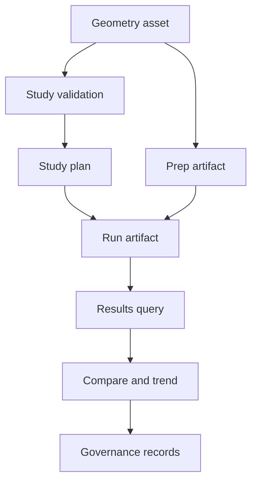

# Evidence & Artifacts

FEA results need records. RunMat writes records at the boundaries where a workflow can fail, change behavior, or need review: geometry import, prep, study validation, planning, solving, result queries, comparisons, and governance checks.

## Evidence Flow



## Record Types

| Record | Meaning |
| --- | --- |
| Operation envelope | The operation name, version, trace/request ids, and typed payload. |
| Operation error envelope | A typed failure with stable error code, severity, retryability, context, and operation identity. |
| Study issue | A validation issue that tells an author what to fix in a `.fea` study or sweep. |
| Diagnostic | Domain-specific evidence emitted by a solver or runtime path. |
| Quality reason | Machine-readable reason a run was degraded or rejected. |
| Provenance | Backend, solver backend, precision, deterministic mode, solver method, preconditioner, and fallback events. |
| Artifact | Persisted JSON record used for review, replay, comparison, trends, or governance. |

## Study Evidence

`runmat check model.fea` emits validation and plan data. The same records are available through `fea.validate_study/v1` and `fea.plan_study/v1`.

Study validation records include:

- `valid`,
- `issue_codes`,
- structured `issues`,
- study fingerprint,
- evidence artifact path.

Study planning records include:

- model id,
- run kind,
- requested backend,
- operation sequence,
- selected run operation and version,
- run options,
- study fingerprint,
- plan artifact path.

Study run records add:

- run id,
- run status,
- publishable flag,
- quality gates,
- quality reasons,
- provenance,
- run artifact path.

## Issue Codes And Error Codes

Study issue codes use the `RM.FEA.STUDY.*` and `RM.FEA.STUDY_SWEEP.*` families.

Operation failures use `RM.<DOMAIN>.<OPERATION>.<REASON>`, for example:

- `RM.FEA.RUN_STUDY.INVALID_SPEC`,
- `RM.FEA.PLAN_STUDY_SWEEP.INVALID_SPEC`,
- `RM.FEA.RUN_PREP.STALE`,
- `RM.GEOMETRY.LOAD.UNSUPPORTED_FORMAT`.

Issue codes describe authoring problems found during validation. Operation error codes describe a failed operation boundary.

## Run Evidence

Every successful run stores an `AnalysisRunResult`. A successful operation can still produce a degraded or rejected result. The result carries:

- `model_validity`,
- `solver_convergence`,
- `result_quality`,
- `run_status`,
- `publishable`,
- `quality_reasons`,
- diagnostics,
- provenance,
- domain payloads where applicable.

Those fields explain what happened in the run. They do not, by themselves, prove that a physics family is validated for production use.

## Artifact Roots

Configure FEA artifacts in `[runtime.fea]`:

```toml
[runtime.fea]
artifact_store = "filesystem"
artifact_root = "artifacts"
```

The default FEA artifact root is `./artifacts`. Run artifacts are stored under `runs`, study validation/plan/run evidence under `studies`, geometry prep artifacts under `geometry-prep`, and thermo-field artifacts under `thermo-fields`. The runtime uses the same filesystem provider for these paths that it uses for study and geometry input, so local, remote, sandboxed, and hosted filesystems follow the same path rules.

Use the artifact roots when a workflow needs reproducibility, auditability, trend analysis, or release governance.

## Results Access

Every successful study run prints and stores a `run_id`. Use that id for post-processing:

```matlab
result = fea.run(study);
results = fea.results(result);

% Later, or in another process that can see the same artifact root:
results = fea.results("run_...");
stress = fea.field(results, "von_mises");
```

`fea.results(...)` can include or omit fields, diagnostics, modal results, transient snapshots, nonlinear results, and electromagnetic payloads through Name/Value options. `fea.compare(baselineRunId, candidateRunId)` compares two persisted runs. `fea.trends("WindowSize", 16)` summarizes recent persisted runs from the artifact store.

## Governance Inputs

Governance scripts consume benchmark reports, external-reference artifacts, threshold reports, promotion calibration records, prep calibration records, thermo-field artifacts, and trend summaries.

Governance checks answer questions such as:

| Question | Records used |
| --- | --- |
| Did the operation contract stay stable? | Operation envelopes, typed errors, payload snapshots. |
| Did a benchmark stay within accepted thresholds? | Diagnostics, metrics, quality gates, quality reasons. |
| Is a family ready to promote? | Readiness reports, missing-evidence checks, trend posture, reference comparisons. |
| Did calibration drift? | Prep and promotion calibration artifacts. |
| Can the run be explained later? | Study plan, run artifact, provenance, diagnostics, geometry/prep artifacts. |

For the correctness standard behind those records, see [Verification & Validation](/docs/runtime/fea/validation).
