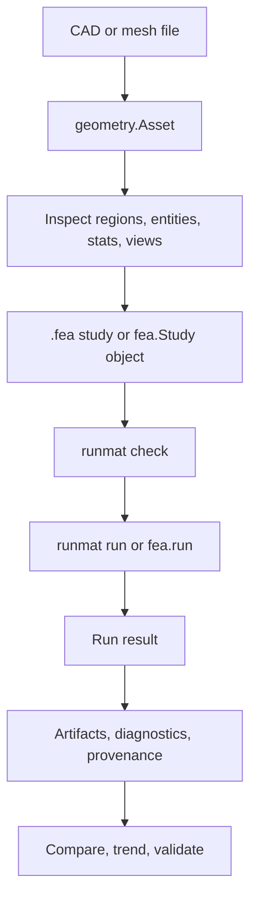

# FEA on Geometry (Beta)

RunMat FEA lets you start with a CAD or mesh file and run repeatable physics studies against it. Use this section when you want to:

1. Load geometry files into structured geometry assets.
2. Inspect regions, entities, mesh statistics, dimensions, and basic view evidence.
3. Prepare geometry for numerical analysis and save deterministic prep artifacts.
4. Define materials, assignments, loads, constraints, domains, interfaces, and steps.
5. Validate a model or study before solving.
6. Run a single study, run a sweep of studies, or call a lower-level solve operation.
7. Inspect fields, diagnostics, quality gates, quality reasons, and provenance.
8. Compare runs and track trends across repeated analyses.
9. Use validation records and governance evidence to decide whether a workflow is ready to trust.

The normal user path is:

## How To Use It

| If you want to... | Use |
| --- | --- |
| Run a repeatable study from the terminal or CI | `runmat check model.fea` and `runmat run model.fea` |
| Build or generate a study from RunMat code | `geometry.load(...)`, `fea.model(...)`, `fea.study(...)`, `fea.validate(...)`, `fea.run(...)` |
| Keep a portable study definition in a file | A `.fea` YAML document loaded by `fea.load(...)` or `runmat run` |
| Inspect geometry before modeling | `geometry.inspect(...)` and geometry runtime operations |
| Integrate from Rust or a host application | Versioned runtime operations such as `fea.create_model/v1` and `fea.run_study/v1` |

`.fea` is the full declarative study format. It is YAML with a RunMat-specific extension, similar to how `.m` is the code format. Use `.fea` rather than `.fea.yaml` for files that are meant to be passed to `runmat check` or `runmat run`.

## Topics

| Task | Read |
| --- | --- |
| Run studies from the CLI, `.m` code, or Rust host code | [Using FEA](/docs/runtime/fea/using-fea) |
| Load, inspect, and prepare CAD or mesh geometry | [Geometry](/docs/runtime/fea/geometry) |
| Define solver-ready model data | [Models](/docs/runtime/fea/models) |
| Choose the physics family and understand family limits | [Physics Families](/docs/runtime/fea/physics) |
| Run direct solves, studies, and sweeps | [Solves, Studies, and Sweeps](/docs/runtime/fea/solves) |
| Understand saved artifacts, diagnostics, and provenance | [Evidence & Artifacts](/docs/runtime/fea/evidence) |
| Understand how correctness is tested and validated | [Verification & Validation](/docs/runtime/fea/validation) |
| Interpret result quality and trust signals | [Results & Trust](/docs/runtime/fea/trust) |
| Check current support and known boundaries | [Current Status](/docs/runtime/fea/status) |
| Integrate with runtime operation contracts | [Operation Reference](/docs/runtime/fea/operation-reference) |

For general runtime execution, see [Execution](/docs/runtime/execution). For host session behavior, see [Session Engine](/docs/runtime/session). For GPU behavior, see [GPU Acceleration & Fusion Engine](/docs/runtime/gpu).
