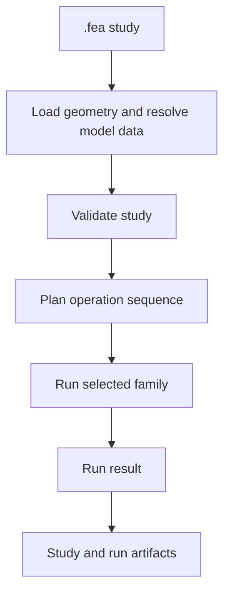
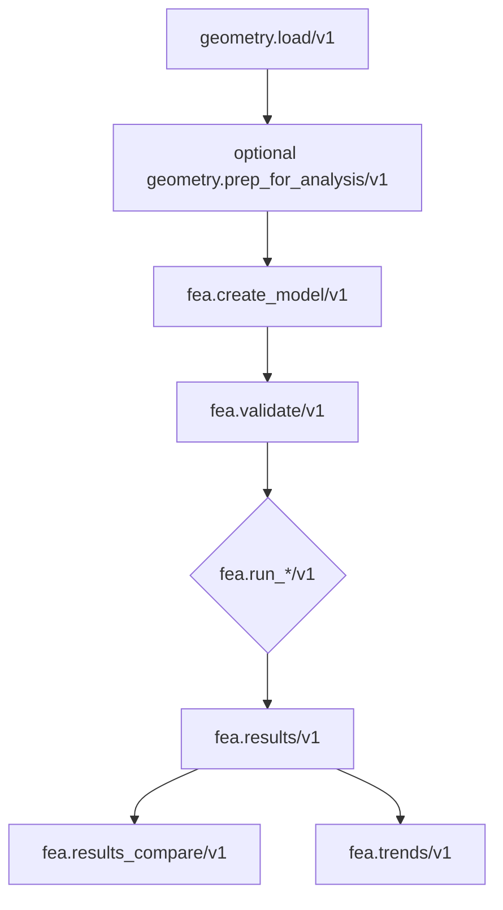

# Solves, Studies, and Sweeps

RunMat has three execution levels:

| Level | Use |
| --- | --- |
| Direct solve operation | A host already has an `AnalysisModel` and wants to call a specific run family. |
| Study | A named create-model, validate, plan, and run workflow. |
| Sweep | A deterministic sequence of studies. |

Most users should start with studies. Direct solve operations are best for host integrations that already own model construction.

## Study Flow



From the CLI:

```sh
runmat check studies/bracket_static.fea
runmat run studies/bracket_static.fea
```

From `.m` code:

```matlab
study = fea.load("studies/bracket_static.fea");
validation = fea.validate(study);
plan = fea.plan(study);
result = fea.run(study);
```

## What Check Does

`runmat check <file>` supports `.m` and `.fea`.

For `.fea`, it:

1. reads the YAML document,
2. resolves geometry paths,
3. builds or resolves the study model,
4. validates the study or sweep,
5. plans the operation sequence,
6. prints a validation and plan summary.

Use `runmat check --json <file>` for structured validation and plan data.

It does not solve.

## What Run Does

`runmat run <file>` supports `.m` and `.fea`.

For `.fea`, it executes either:

- `fea.run_study/v1` for a single study, or
- `fea.run_study_sweep/v1` for a sweep.

The result includes run ids, selected operation identities, quality gates, quality reasons, provenance, and artifact paths.

## Direct Solve Flow

Host integrations can call lower-level operations:



Direct solve operations require an `AnalysisModel`. They are the right boundary for applications that construct models themselves, manage trace ids, or need direct result queries.

## Study Operations

| Operation | Purpose |
| --- | --- |
| `fea.validate_study/v1` | Validate one study and write a validation artifact. |
| `fea.plan_study/v1` | Produce operation sequence, run operation/version, fingerprint, and plan artifact. |
| `fea.run_study/v1` | Execute one study and write run evidence. |
| `fea.validate_study_sweep/v1` | Validate a sweep with aggregate and per-study issues. |
| `fea.plan_study_sweep/v1` | Plan a sweep with per-study plan entries and failure entries. |
| `fea.run_study_sweep/v1` | Execute a sweep sequentially. |

## Run Options

Run options are specified under `run.options` in `.fea`, or through typed runtime option structs in host code. The options are validated against the solver selected by `model.profile`.

Example:

```yaml
model:
  profile: electromagnetic_static

run:
  backend: cpu
  options:
    deterministic_mode: true
    precision_mode: fp64
    quality_policy: balanced
    residual_target: 1.0e-6
    harmonic_tolerance: 1.0e-7
    harmonic_max_iterations: 96
    sweep_enabled: true
    sweep_frequency_hz: [40.0, 60.0, 120.0]
```

Supplying options for the wrong selected solver is a validation issue.

## Results After A Run

Persisted run ids can be queried through:

| Operation | Purpose |
| --- | --- |
| `fea.results/v1` | Query fields, diagnostics, domain payloads, quality reasons, summaries, and provenance. |
| `fea.results_compare/v1` | Compare two persisted runs. |
| `fea.trends/v1` | Summarize recent runs by family. |

From RunMat code:

```matlab
run = fea.run(study);
results = fea.results(run);
stress = fea.field(results, "von_mises");
figureHandle = fea.plot(run, "von_mises");
print(figureHandle, "von_mises.png", "-dpng");

later = fea.results(run.run_id);
comparison = fea.compare("run_baseline", "run_candidate");
trend = fea.trends("WindowSize", 16);
```

For interpretation, see [Results & Trust](/docs/fea/trust). For saved records, see [Evidence & Artifacts](/docs/fea/evidence).
