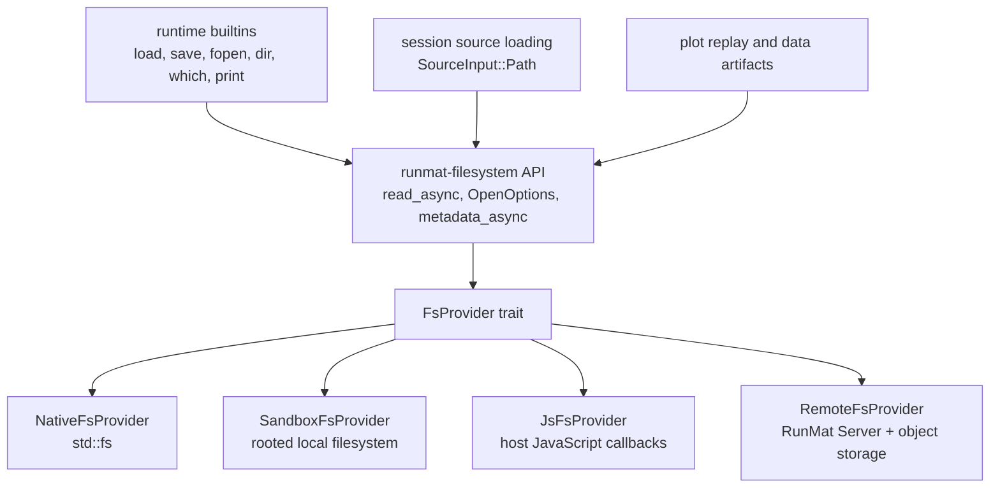
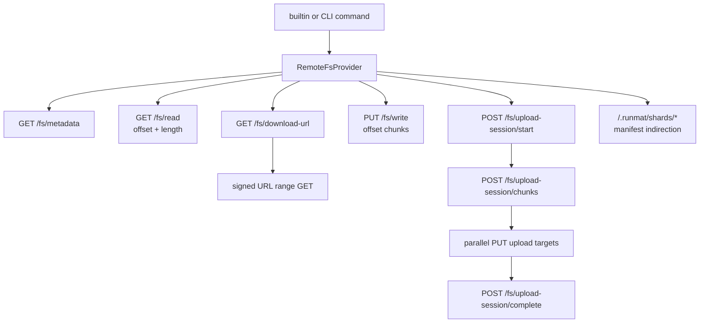

# Filesystem Abstraction

`runmat-filesystem` gives the runtime one filesystem API across native CLI execution, sandboxed hosts, WASM hosts, and the remote project filesystem. Runtime code calls the same provider-neutral functions for `load`, `save`, `fopen`, `dir`, `which`, plotting exports, replay artifacts, datasets, and source loading.

The provider boundary is deliberately below MATLAB builtins. Builtins should not know whether a path resolves to local disk, a browser-provided filesystem, a sandbox root, or a remote object store behind RunMat Server.

## Pages

- [Datasets API](/docs/runtime/fs/datasets)

## Architecture

The active provider is stored as a global `Arc<dyn FsProvider>` behind a lock. `set_provider` installs a provider for the process, while `replace_provider` and `with_provider_override` install scoped providers for tests or host-specific execution. On WASM, relative paths are resolved against a runtime-managed current directory; on native targets, current-directory behavior delegates to `std::env`.

## Provider Contract

`FsProvider` covers file handles, whole-file operations, metadata, directory traversal, path normalization, mutation, and dataset chunk endpoints.

| Operation group | Methods |
| --- | --- |
| File handles | `open`, `open_async`, `FileHandle::{Read, Write, Seek, flush_async, sync_all_async}` |
| Whole-file I/O | `read`, `write`, `remove_file` |
| Metadata | `metadata`, `symlink_metadata`, `canonicalize` |
| Directories | `read_dir`, `create_dir`, `create_dir_all`, `remove_dir`, `remove_dir_all`, `rename` |
| Permissions | `set_readonly` |
| Batched reads | `read_many` |
| Dataset objects | `data_manifest_descriptor`, `data_chunk_upload_targets`, `data_upload_chunk` |

`OpenOptions` mirrors the standard read/write/append/truncate/create/create-new flags. `File` wraps the provider-specific `FileHandle` and exposes normal `Read`, `Write`, and `Seek`, plus async flush and sync entrypoints.

The default `read_many` implementation is sequential and tolerant of misses: each path returns a `ReadManyEntry` with bytes or an error string. WASM hosts can override `readMany` to batch requests in JavaScript.

## Providers

| Provider | Target | Role |
| --- | --- | --- |
| `NativeFsProvider` | Native | Direct `std::fs` wrapper for local CLI and test execution. |
| `SandboxFsProvider` | Native | Resolves every incoming path under a fixed root and virtualizes returned paths back to sandbox paths. |
| `PlaceholderFsProvider` | WASM default | Fails with `Unsupported` until a host installs a real provider. |
| `JsFsProvider` | WASM host integration | Installed by `runmat-wasm`; delegates file calls to JavaScript callbacks such as `readFile`, `writeFile`, `metadata`, `readDir`, and optional `readMany`. |
| `RemoteFsProvider` | Native and WASM variants | Talks to RunMat Server filesystem endpoints and signed object-store URLs. |

The sandbox provider is used when a host wants local `std::fs` behavior without giving MATLAB code access to arbitrary host paths. It normalizes `..` and absolute paths under the configured root, creates parent directories for writes, and returns virtualized paths from directory listings and canonicalization.

## Builtin Integration

Most filesystem behavior exposed to MATLAB code lives in runtime builtins, but those builtins use the provider API instead of `std::fs`.

| Builtin family | Filesystem dependency |
| --- | --- |
| Text and binary file I/O | `fopen`, `fread`, `fwrite`, `fprintf`, `fclose`, `feof`, `frewind`, `fileread`, `filewrite` use `OpenOptions` and `File`. |
| MAT files | `load` and `save` open provider-backed files, so MAT I/O works against local, sandboxed, WASM, or remote storage. |
| Tabular I/O | `csvread`, `csvwrite`, `dlmread`, `dlmwrite`, `readmatrix`, and `writematrix` use provider-backed handles and metadata checks. |
| REPL filesystem commands | `cd`, `pwd`, `dir`, `ls`, `mkdir`, `rmdir`, `delete`, `copyfile`, `movefile`, `addpath`, `rmpath`, `genpath`, `savepath`, `tempname` use provider metadata, directory, rename, removal, and current-directory APIs. |
| Introspection | `exist` and `which` combine workspace lookup, builtin metadata, class lookup, and provider-backed path search. |
| Images and plotting | `imread`, `imshow`, and `print` read or write through the provider; `print` writes to a temporary path and renames into place. |
| Datasets and replay | Runtime dataset APIs and plotting replay use provider reads, writes, batched reads, manifests, and chunk upload targets. |
| Source loading | `ExecutionRequest` with `SourceInput::Path` reads the script through `read_to_string_async`. |

`exist` and `which` are worth calling out because they are not simple metadata checks. They first consider workspace variables and registered builtins, then use path-search helpers to check files, folders, class folders, classdef files, MEX/P-code/Simulink/library extensions, and canonical paths through the provider.

## Remote Filesystem

`RemoteFsProvider` maps provider calls onto RunMat Server project endpoints. Metadata and directory operations go through JSON API routes, while large file payloads are moved through chunked server reads or signed object-store URLs.

Remote configuration controls transport behavior:

| Config field | Default | Meaning |
| --- | --- | --- |
| `chunk_bytes` | 16 MB | Unit of ranged reads and chunked writes. |
| `parallel_requests` | 4 | Number of worker threads used for native remote chunk transfers. |
| `direct_read_threshold_bytes` | 64 MB | Files at or above this size use a signed download URL and ranged reads. |
| `direct_write_threshold_bytes` | 64 MB | Files at or above this size use upload-session or multipart upload flow. |
| `shard_threshold_bytes` | 4 GB | Files at or above this size are written as shard objects plus a manifest. |
| `shard_size_bytes` | 512 MB | Target size for each shard. |
| `retry_max_attempts` | 5 | Retries transient HTTP failures. |

Transient `429`, `500`, `502`, `503`, and `504` responses are retried with capped exponential backoff.

## Parallel Remote Reads

Native remote reads are designed to keep the network busy. After metadata determines file length, the provider splits the file into `chunk_bytes` tasks. A scoped worker pool with up to `parallel_requests` threads drains a shared queue. Each worker downloads a chunk either from `/fs/read` or from a signed URL range request. Chunks are stored by index and copied into the final buffer at their byte offsets after all workers finish.

For large reads, `direct_read_threshold_bytes` switches the path to a single signed download URL. The provider still splits that object into range requests and fetches those ranges in parallel. This avoids routing the payload through the API server while still saturating available client-to-object-store bandwidth.

Sharded files are represented by a small manifest whose hash is `manifest:v1`. The provider reads the manifest, downloads each shard, and concatenates shard payloads in manifest order. Each shard is itself read through the same raw-file path, so large shard downloads still use chunk/range parallelism.

## Parallel Remote Writes

Small unsharded writes use `/fs/write` with offsets and `final=true` on the last chunk. That path is sequential because it writes through the gateway.

Larger writes use upload sessions. The provider computes a full-file SHA-256, asks the server to start an upload session, describes every chunk with offset, size, and chunk hash, receives upload targets, then runs `parallel_requests` worker threads that PUT chunk slices directly to those targets. After all workers finish, it completes the session with the expected size, hash, and chunk count.

If the newer upload-session endpoint is unavailable, the provider falls back to a legacy multipart flow: create multipart upload, presign each part, upload parts in parallel, collect ETags, sort parts by part number, and complete multipart upload.

Very large writes use sharding before the upload-session decision. The provider writes each shard under `/.runmat/shards/<uuid>`, then writes a manifest to the requested path. This keeps individual object writes bounded while preserving a single logical file at the provider API.

## Dataset Chunk Contract

Dataset APIs use provider-neutral data-contract types instead of normal file paths:

| Type | Purpose |
| --- | --- |
| `DataManifestRequest` | Fetches dataset manifest metadata for a path and optional version. |
| `DataManifestDescriptor` | Returns schema version, format, dataset ID, update timestamp, and transaction sequence. |
| `DataChunkUploadRequest` | Requests upload targets for an array's chunk objects. |
| `DataChunkUploadTarget` | Describes the method, URL, headers, and key for uploading one chunk. |

Native providers map these to local manifest and chunk files. Remote providers map them to `/data/manifest`, `/data/chunks/upload-targets`, and direct chunk upload URLs. Runtime dataset builtins can therefore use the same code path for local, sandboxed, and remote datasets.

## Boundaries

The filesystem crate does not parse MATLAB file formats and does not implement MATLAB path semantics by itself. MAT parsing, CSV formatting, path search, class lookup, and REPL command behavior live in runtime builtins. The filesystem layer only provides consistent storage operations and enough provider-specific extension points for fast remote data movement.
