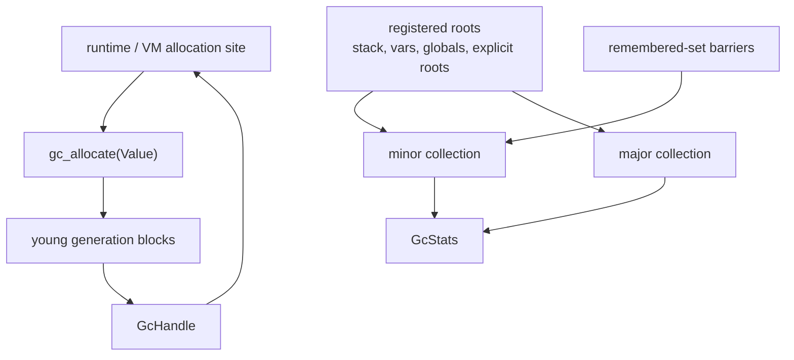
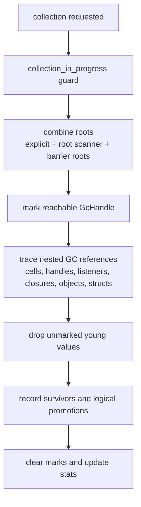

# Memory Management

`runmat-gc` provides garbage-collected storage for runtime values that need stable identity, reachability through cycles, or finalizer-backed lifetime management. It is used for handle-object targets, listener targets/callbacks, selected struct/object payloads, provider-owned resources that need finalizers, and JIT/runtime bridge values.

For the broader runtime value model, see [Runtime Values & Type Model](/docs/runtime/values). This page focuses on the subset of values that need GC-managed identity or reachability.

The collector is non-moving. A `GcHandle` is an opaque, address-stable token for a `Value` allocated by the GC. It does not dereference directly and does not carry a Rust type parameter; value access must go through checked GC APIs such as `gc_with_value`, `gc_with_value_mut`, `gc_read_value`, or `gc_write_value`. Collection marks reachable values from registered roots, drops unreachable values in place, and keeps the outer handle identity stable for surviving objects.

## Runtime Shape



## Managed Values

The GC manages the outer `Value` allocation. Nested payloads such as `Vec`, `String`, tensor buffers, and struct maps remain owned by Rust values inside that allocation and are released through normal destructors when the GC drops the outer `Value`.

| Value shape | GC role |
| --- | --- |
| `CellArray` | Stores owned `Vec<Value>` elements. A cell element can contain a handle, but the cell itself does not allocate every element in the GC. |
| `HandleObject` | Stores a `GcHandle` target to preserve handle identity. |
| `Listener` | Stores `GcHandle` references to the target and callback. |
| `Object` and `Struct` payloads | Can be placed behind a GC handle when identity or sharing is required. |
| `GpuTensor` | Registers a finalizer so provider-owned GPU buffers are freed when the GC value is collected. |

Plain numeric arrays, strings, logical arrays, and tensors are not deep-managed by the GC. Their heap buffers are owned by Rust allocation inside the stored `Value`.

## Allocation

All new GC values are allocated in generation 0. The allocator groups memory into size classes and writes the `Value` into an address recorded by the young generation.

| Component | Role |
| --- | --- |
| `GenerationalAllocator` | Owns generation blocks and allocation cursors. |
| `Generation` | Tracks size-class blocks, allocated bytes, allocation starts, and survivor state. |
| `SizeClass` | Selects small, medium, or large allocation blocks. |
| `GcStats` | Records allocation count, allocated bytes, current memory, and peak memory. |

The current size estimate is the size of the outer `Value`. This avoids over-reserving for nested Rust-owned payloads and keeps GC accounting aligned with what the GC allocator directly owns.

## Collection

Collection is mark-and-sweep over the GC-managed `Value` headers.



Minor collection is triggered when the young generation exceeds `minor_gc_threshold`; aggressive low-threshold configurations also collect periodically by allocation count. `gc_collect_minor()` can force the same path.

Major collection uses the full-root collection entrypoint, clears remembered-set barriers, records a major collection event, and resets survivor counters used for generational policy. In the current implementation, sweeping is still centered on tracked young allocations; promoted objects are logical generation state, not a separately compacted old space.

The collector does not compact surviving objects or move them between physical blocks. Promotion is logical: after a value survives enough collections, the allocator treats its address as older for barrier decisions.

## Roots

Roots are the entry points that keep GC values alive.

| Root source | Code entity | Purpose |
| --- | --- | --- |
| Explicit roots | `gc_add_root` / `gc_remove_root` | Protect a specific `GcHandle` by address. Prefer `gc_root` / `ExplicitRoot` for lexical root lifetimes. |
| VM stack | `StackRoot` | Scans the interpreter stack for nested GC handles. |
| VM variables | `VariableArrayRoot` | Scans the interpreter variable array. |
| Global values | `GlobalRoot` | Keeps runtime/global values reachable during execution. |
| Registered roots | `RootScanner` | Stores root objects by `RootId` and removes inactive roots. |
| Remembered set | `WriteBarrierManager` | Adds old-to-young references as minor-GC roots. |

`runmat-vm` wraps interpretation in an `InterpretContext`. The context registers stack and variable-array roots on creation and unregisters them on drop, with a lifetime witness tying the registered root adapters to the interpreter stack and variable vectors. Additional global roots can be registered for values that must stay live during an interpreter call.

Code that allocates and immediately needs a root can use `gc_allocate_rooted`, which registers the explicit root before collection can run. Cached JIT bridge values use this path so pooled handles are not left unrooted.

## Access

`GcHandle` is an identity token, not a Rust reference. Safe code cannot dereference it and cannot obtain `&Value` or `&mut Value` without a GC access guard.

| Access API | Purpose |
| --- | --- |
| `gc_with_value` | Checked immutable access for the duration of a callback. |
| `gc_with_value_mut` | Checked exclusive mutable access for the duration of a callback. |
| `gc_read_value` / `GcValueRef` | Explicit immutable guard that implements `Deref` while collection is blocked. |
| `gc_write_value` / `GcValueMut` | Explicit mutable guard that implements `DerefMut` while mutable access is exclusive. |

The guard APIs validate that the handle belongs to the RunMat GC heap, block collection while the borrow is active, and reject conflicting mutable access.

## Write Barriers

Generational collection must preserve references from older objects to younger objects. RunMat records those edges through `gc_record_write(old, new)`.

The barrier path checks each value's logical generation. If the old value is older than the new value, the old address is inserted into the remembered set. Minor GC then treats remembered-set entries as additional roots.

Write barriers are used in mutation paths such as object property writes and indexing writes that can install a new GC-managed value into an existing aggregate.

## Configuration

GC configuration can be set through runtime config, CLI flags, or direct API calls.

| Config field | Meaning |
| --- | --- |
| `preset` | Selects `low-latency`, `high-throughput`, `low-memory`, or `debug`. |
| `young_size_mb` | Overrides generation 0 size from runtime config or CLI. |
| `threads` | Sets `max_gc_threads` in the GC config. |
| `collect_stats` | Enables statistics collection for reporting. |

The lower-level `GcConfig` also includes thresholds, promotion policy, heap sizing, write-barrier settings, pointer-compression flag, logging, and collection timeouts.

| Preset | Intended behavior |
| --- | --- |
| `default` | 2 MB young generation, 80% minor threshold, 90% major threshold, three generations. |
| `low-latency` | Collects earlier and promotes after fewer survivals. |
| `high-throughput` | Uses a larger young generation and later thresholds. |
| `low-memory` | Uses a smaller young generation and a bounded heap target. |
| `debug` | Enables verbose logging and more frequent collection. |

CLI commands expose the same control surface:

```bash
runmat gc stats
runmat gc minor
runmat gc major
runmat gc config
runmat gc stress --allocations 10000
```

Runtime startup maps `--gc-preset`, `--gc-young-size`, `--gc-threads`, and `--gc-stats` into `runmat_gc::GcConfig` before calling `gc_configure`.

## Statistics

`GcStats` records allocation and collection counters for diagnostics and tuning.

| Metric | Meaning |
| --- | --- |
| `total_allocations`, `total_allocated_bytes` | Aggregate allocation volume. |
| `minor_collections`, `major_collections` | Collection counts by type. |
| `minor_collection_time`, `major_collection_time` | Time spent collecting. |
| `minor_objects_collected`, `major_objects_collected` | Objects dropped by collection type. |
| `objects_promoted` | Logical promotions after survival thresholds. |
| `current_memory_usage`, `peak_memory_usage` | GC-accounted memory usage. |
| Recent collection history | Bounded history of collection events. |

The CLI and session APIs use the same stats object. `summary_report()` formats allocations, current and peak memory, collection frequency, average collection time, GC overhead, allocation rate, and memory utilization.

## Boundaries

The GC is responsible for `GcHandle` lifetimes, not every byte used by the runtime. It does not replace Rust ownership for ordinary tensors, strings, cell elements, vectors, or host-side buffers. GPU buffers are provider-owned and are released through registered finalizers when a GC-managed `Value::GpuTensor` is collected.

This design keeps MATLAB identity-bearing values stable while letting Rust continue to own the bulk storage for ordinary value payloads.
