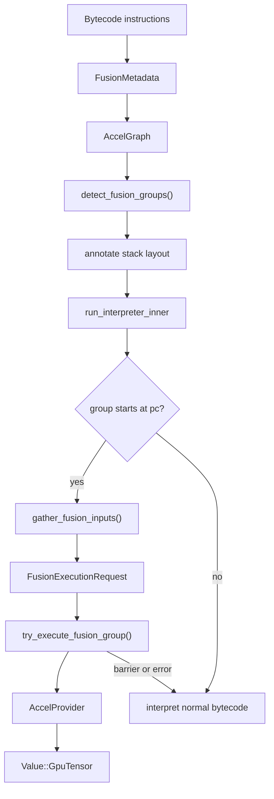
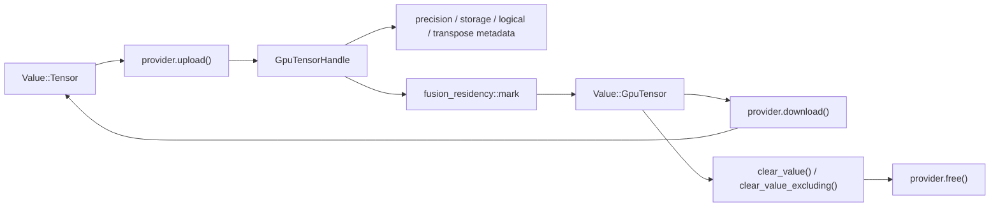

# Fusion Engine & Residency Management

The fusion engine identifies groups of VM operations that can run as a single accelerated unit. It combines compile-time bytecode metadata, graph-level pattern detection, runtime stack layout, and provider-side execution so the interpreter can skip a span of ordinary bytecode and push a GPU-resident result instead.

This allows a single GPU kernel to perform multiple operations in a single dispatch, reducing the overhead of launching and synchronizing kernels.

Residency management is the other half of the system. Once a value becomes `Value::GpuTensor`, the VM and provider need to know when that handle is still live, when it can be reused, and when it must be freed or gathered back to host memory.

## Fusion Pipeline

Fusion starts with bytecode and graph metadata and ends with a `FusionExecutionRequest` passed to the active acceleration provider.

## Fusion Group Kinds

`runmat-accelerate` classifies eligible graph regions into `FusionKind` variants.

| Kind | Purpose |
| --- | --- |
| `ElementwiseChain` | Chains of compatible elementwise operations over the same non-scalar shape. |
| `Reduction` | Single reduction operations or reduction-shaped execution windows. |
| `MatmulEpilogue` | Matrix multiplication followed by simple elementwise epilogue work. |
| `CenteredGram` | Specialized centered Gram/covariance-style patterns. |
| `ImageNormalize` | Image normalization chains with optional gain, bias, and gamma values. |
| `PowerStepNormalize` | Power iteration normalization pattern. |
| `ExplainedVariance` | Explained-variance computation pattern. |

Specialized patterns are detected before generic elementwise grouping so they are not swallowed by a broader chain.

## Runtime Gating

The interpreter only executes a fusion group when the current program counter matches the group's span start and the group is safe to replace. A group is skipped if the span contains VM barriers such as indexed assignment, member writes, or stack shapes that do not produce one live result.

When a group is accepted, the VM:

- Reads stack-layout metadata to determine the required stack operands.
- Resolves inputs from stack, globals, locals, constants, or graph node outputs.
- Creates a `FusionExecutionRequest`.
- Calls the appropriate fusion executor such as `execute_elementwise`, `execute_reduction`, or a specialized pattern executor.
- Pushes the returned `Value::GpuTensor` and advances `pc` past the fused span.

## Residency Model

GPU values are represented as `Value::GpuTensor(GpuTensorHandle)`. The handle carries shape, device ID, and buffer ID; additional metadata such as precision, storage kind, logical-ness, and transpose info is tracked by `runmat-accelerate-api`.

Residency cleanup is recursive. The VM clears GPU handles inside cells, structs, objects, handle objects, closures, and output lists. Overwrite paths use exclusion sets so a shared incoming handle is not freed while replacing an older value.

## Auto-Promotion

Auto-promotion chooses when host tensors should become GPU tensors before or during built-in execution. The policy considers value shape, provider availability, calibrated thresholds, built-in residency policy, and whether any operand is already GPU-resident. Chain-aware promotion keeps operations on the device once a chain has started, avoiding repeated host/device round trips.

## Barriers and Fallbacks

Fusion is not required for correctness. If a group has a barrier, stack mismatch, unsupported shape, provider error, or unavailable device, execution falls back to ordinary VM bytecode. Sink operations can gather values immediately when runtime semantics require host materialization.

## Tuning

The acceleration layer exposes runtime knobs for thresholds, calibration, and backend tuning. The exact set is backend-dependent, but the important policy is stable: small or synchronization-heavy work remains on CPU; large elementwise, reduction, matrix, image, and signal workloads are candidates for GPU execution.

From here, provider execution is covered in [wgpu Backend & Accelerate Provider](/docs/runtime/gpu/wgpu).
