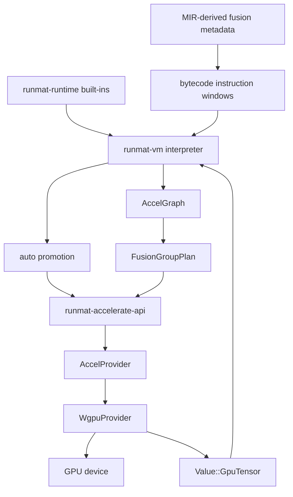

# GPU Acceleration & Fusion Engine

RunMat's GPU acceleration layer keeps compute-heavy array work close to device memory when doing so is profitable. The system spans three major surfaces: VM-side promotion and fusion planning, a provider API for GPU-resident tensors, and the `wgpu` backend that executes kernels on Vulkan, Metal, DirectX, or WebGPU-capable devices.

The acceleration path is intentionally opportunistic. CPU execution remains the semantic baseline, while GPU execution is selected for operations and chains that can amortize upload, dispatch, and synchronization costs.

## Architecture Overview

## Main Components

| Component | Role |
| --- | --- |
| `runmat-vm/src/accel` | Runtime fusion execution, stack layout, residency cleanup, and VM integration for MIR-gated bytecode windows. |
| `runmat-accelerate-api` | Provider trait, GPU tensor handles, metadata registries, residency hooks, and exported GPU contexts. |
| `runmat-accelerate/src/fusion.rs` | Graph-level fusion-group detection and fusion pattern classification. |
| `runmat-accelerate/src/fusion_exec.rs` | Execution of fusion plans through the active provider. |
| `runmat-accelerate/src/native_auto.rs` | Automatic offload policy and threshold calibration. |
| `runmat-accelerate/src/backend/wgpu` | Concrete provider implementation backed by `wgpu`, WGSL shaders, pipeline caches, and buffer residency. |
| `runmat-accelerate/src/simple_provider.rs` | Host-side fallback/reference provider for unsupported or unavailable GPU paths. |

## Execution Modes

- Direct provider calls: Built-ins can prepare arguments and call an `AccelProvider` method directly.
- Auto-promotion: Runtime values can be uploaded into `Value::GpuTensor` when thresholds and residency policy favor device execution.
- Fusion execution: The VM can execute a compiled `FusionGroupPlan` instead of interpreting each instruction in the group.
- Host fallback: Unsupported operations gather data back to host or use `SimpleProvider`/runtime CPU implementations.

## Fusion and Residency

Fusion reduces synchronization and memory traffic by grouping compatible operations into a single execution request. Residency management then decides which `GpuTensorHandle` values remain live on the device and which handles must be released or gathered.

For the VM-side fusion planner, stack layout, and handle cleanup behavior, see [Fusion Engine & Residency Management](/docs/runtime/gpu/fusion).

## wgpu Backend

The `WgpuProvider` owns the active `wgpu::Device`, `wgpu::Queue`, adapter metadata, pipeline caches, buffer table, and operation modules. It implements the `AccelProvider` trait and exposes provider-owned buffers for zero-copy consumers such as plotting when the backend supports it.

For backend organization, dispatch flow, and operation categories, see [wgpu Backend & Accelerate Provider](/docs/runtime/gpu/wgpu).
