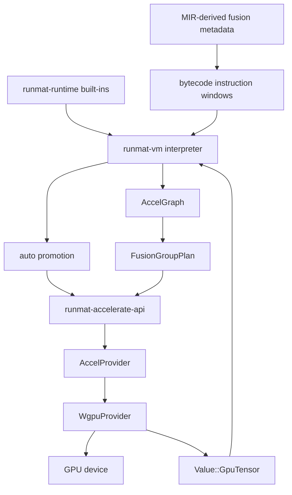

# GPU Acceleration & Fusion Engine

RunMat's GPU acceleration layer keeps compute-heavy array work close to device memory when doing so is profitable. The system spans three major surfaces: VM-side promotion and fusion planning, a provider API for GPU-resident tensors, and the `wgpu` backend that executes kernels on Vulkan, Metal, DirectX, or WebGPU-capable devices.

The acceleration path is intentionally opportunistic. CPU execution remains the semantic baseline, while GPU execution is selected for operations and chains that can amortize upload, dispatch, and synchronization costs.

## Architecture Overview

```mermaid
flowchart TD
  Runtime["runmat-runtime built-ins"]
  VM["runmat-vm interpreter"]
  Metadata["MIR-derived fusion metadata"]
  Windows["bytecode instruction windows"]
  Promote["auto promotion"]
  Graph["AccelGraph"]
  Plan["FusionGroupPlan"]
  API["runmat-accelerate-api"]
  Provider["AccelProvider"]
  WGPU["WgpuProvider"]
  GPU["GPU device"]
  Value["Value::GpuTensor"]

  Runtime --> VM
  Metadata --> Windows
  Windows --> VM
  VM --> Promote
  VM --> Graph
  Graph --> Plan
  Promote --> API
  Plan --> API
  API --> Provider
  Provider --> WGPU
  WGPU --> GPU
  WGPU --> Value
  Value --> VM
```

## Main Components

| Component | Role |
| --- | --- |
| `runmat-vm/src/accel` | Runtime fusion execution, stack layout, residency cleanup, and VM integration for MIR-gated bytecode windows. |
| `runmat-accelerate-api` | Provider trait, side-effect-free capability and feasibility contracts, GPU tensor handles, metadata registries, residency hooks, and exported GPU contexts. |
| `runmat-accelerate/src/fusion.rs` | Graph-level fusion-group detection and fusion pattern classification. |
| `runmat-accelerate/src/fusion_exec.rs` | Execution of fusion plans through the active provider. |
| `runmat-accelerate/src/native_auto.rs` | Automatic-offload calibration and compatibility inputs to placement. |
| `runmat-accelerate/src/placement` | Feasibility normalization, residency/coherency accounting, bounded graph partitioning, resource admission, adaptive session policy, and placement observations. |
| `runmat-accelerate/src/backend/wgpu` | Concrete provider implementation backed by `wgpu`, WGSL shaders, pipeline caches, and buffer residency. |
| `runmat-accelerate/src/simple_provider.rs` | Host-side fallback/reference provider for unsupported or unavailable GPU paths. |

## Execution Modes

- Direct provider calls: Built-ins can prepare arguments and call an `AccelProvider` method directly.
- Auto-promotion: Runtime values can be uploaded into `Value::GpuTensor` when the complete provider candidate is expected to outperform shared-runtime execution.
- Fusion execution: The VM can execute a compiled `FusionGroupPlan` instead of interpreting each instruction in the group.
- Host fallback: Unsupported operations gather data back to host or use `SimpleProvider`/runtime CPU implementations.

Before a candidate executes, placement asks the active provider whether the exact operation family and value representations are feasible. The query is side-effect-free: it cannot allocate, compile, transfer, or dispatch work. A structured rejection keeps execution on the shared runtime path without probing the provider by execution.

Feasible CPU and provider candidates are compared using complete component costs: preparation, upload, allocation, queueing, execution, synchronization, download, and required downstream materialization. Provider residency, fusion opportunities, calibrated thresholds, and workload profiles contribute evidence and priors; none bypasses the common decision. Uncertain estimates are risk-adjusted, and a provider must clear both absolute and relative improvement margins before displacing CPU execution. This keeps small host-resident work on CPU while allowing a resident chain to remain on the provider when its total cost wins.

For multi-region work, the same planner partitions a bounded, topologically ordered candidate graph and includes transfer costs between each producer's output residency and each consumer's execution location. Admission accounts for simultaneously live intermediates, scratch memory, reclaimable allocations, known queue capacity, cancellation, and the host allocation supplied by the execution scheduler. Search limits fail safely to a legal local plan. Repeated decisions and timing feedback are owned by one `RunMatSession`, use exact program/provider/policy/runtime-fact and resource snapshots, and apply confidence, variance, hysteresis, and optional bounded transactional exploration without sharing mutable policy between sessions.

Embedding hosts can explicitly snapshot and restore the session's bounded placement profile. The portable profile contains only digests, candidate identities, aggregate timings, counts, and logical ticks; it contains no source text, paths, tensor contents, user identity, or wall-clock timestamp, and RunMat does not persist or transmit it implicitly.

The Rust API exposes `placement_report()` for local diagnostics. Reports correlate candidate, selection, transfer, completion, and fallback events, retain bounded histories, and use stable reason tokens and numeric attributes. They do not include source text, paths, tensor contents, user identifiers, or arbitrary provider error messages.

## Fusion and Residency

Fusion reduces synchronization and memory traffic by grouping compatible operations into a single execution request. Residency management then decides which `GpuTensorHandle` values remain live on the device and which handles must be released or gathered.

For the VM-side fusion planner, stack layout, and handle cleanup behavior, see [Fusion Engine & Residency Management](/docs/runtime/gpu/fusion).

## wgpu Backend

The `WgpuProvider` owns the active `wgpu::Device`, `wgpu::Queue`, adapter metadata, pipeline caches, buffer table, and operation modules. It implements the `AccelProvider` trait and exposes provider-owned buffers for zero-copy consumers such as plotting when the backend supports it.

For backend organization, dispatch flow, and operation categories, see [wgpu Backend & Accelerate Provider](/docs/runtime/gpu/wgpu).
