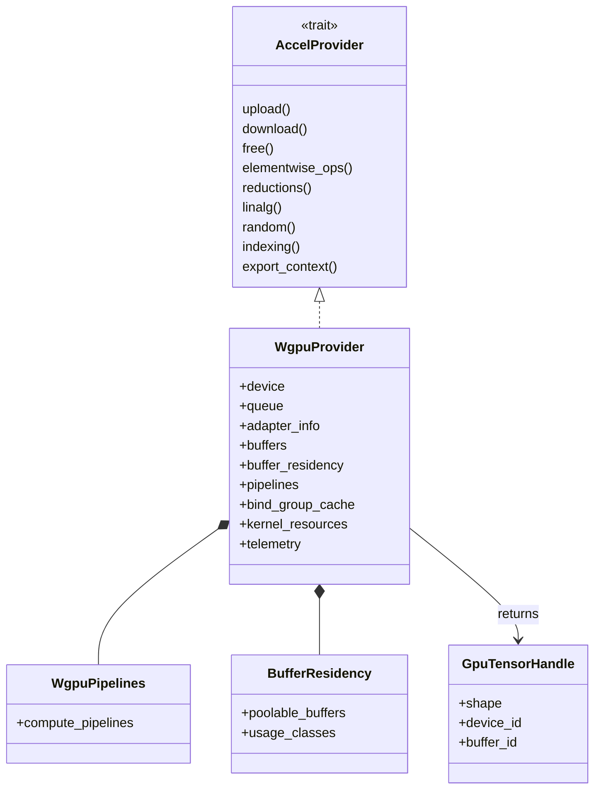
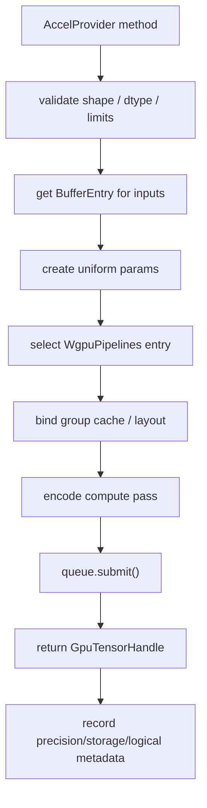

# WGPU Backend & Accelerate Provider

The `wgpu` backend is RunMat's primary hardware acceleration provider. It implements the `AccelProvider` trait with a `WgpuProvider` that owns the device, queue, adapter metadata, buffer table, residency pool, compute pipelines, kernel resources, caches, telemetry, and autotuning state.

Because it is built on `wgpu`, the same provider architecture can target native graphics APIs such as Vulkan, Metal, and DirectX, as well as WebGPU-capable browser environments.

## Provider Architecture

## Module Organization

| Area | Files |
| --- | --- |
| Provider state and initialization | `provider/backend.rs`, `provider/backend_types.rs`, `provider/init.rs`, `provider/core.rs` |
| Provider trait implementation | `provider/trait_impl.rs` |
| Operation implementations | `provider/ops/*` |
| Dispatch helpers | `dispatch/*` |
| WGSL source generation | `shaders/*` |
| Pipeline management | `pipelines.rs` |
| Buffer residency and resources | `residency.rs`, `resources.rs`, `cache/*` |
| Parameters and tuning | `params.rs`, `autotune/*`, `config.rs`, `metrics.rs` |

## Dispatch Flow

Most provider methods follow the same pattern: validate shapes and backend limits, resolve or create GPU buffers, bind a pipeline and parameter buffer, dispatch workgroups, and return a new `GpuTensorHandle`.

The provider also exposes `export_context` and `export_wgpu_buffer` for zero-copy consumers. Plotting and other GPU-aware subsystems can use those APIs to avoid unnecessary readbacks when the active provider supports them.

## Operation Categories

| Category | Examples |
| --- | --- |
| Construction | `zeros`, `fill`, `eye`, `linspace`, `meshgrid`, window functions, random tensors. |
| Elementwise and logical | Arithmetic, comparisons, logical operations, unary math, finite/NaN/Inf checks. |
| Reductions and scans | Global and dimension-wise reductions, cumulative operations, moments, variance/std helpers. |
| Linear algebra | Matrix multiplication, triangular operations, decompositions, solves, covariance/correlation helpers. |
| Indexing and scatter | Linear gather/scatter, slice-related helper kernels, set-like operations. |
| Signal and image | Convolution, filtering, image filtering, image normalization, FFT-related kernels. |
| Polynomial | `polyval`, `polyder`, `polyint`, and host-assisted `polyfit` behavior. |
| Random | Uniform, normal, exponential, integer ranges, permutations, and provider RNG state. |

Complex operations can combine device kernels with host fallback when the backend cannot yet provide the full MATLAB-compatible algorithm on device.

## Buffers and Metadata

`GpuTensorHandle` is intentionally small: it names a device, buffer, and shape. The backend and API registries hold the details that do not belong in every value:

- Precision: `f32` or `f64`.
- Storage: real or complex-interleaved.
- Logical flags for MATLAB logical arrays.
- Transpose annotations.
- Provider-owned `wgpu::Buffer` references for exported buffers.

The provider validates adapter limits before creating buffers or bind groups. It also classifies buffer usage so residency pooling and cleanup can make reasonable reuse decisions.

## Pipeline and Shader Management

WGSL shader sources live under `backend/wgpu/shaders`, while dispatch modules prepare operation-specific parameters and workgroup shapes. `WgpuPipelines` owns compiled compute pipelines, and the provider uses caches for bind group layouts, bind groups, fused pipelines, and kernel resources.

Autotuning and calibrated workgroup sizing are part of provider state. The selected workgroup hints can be exposed through `runmat-accelerate-api` so other subsystems can use compatible execution parameters.

## SimpleProvider Fallback

`SimpleProvider` is the host-side fallback provider. It keeps the same provider-facing shape as the GPU backend but delegates unsupported or CPU-better operations to host implementations. This gives the runtime a single acceleration interface while preserving correctness when WebGPU is unavailable or a specific kernel is not implemented.

For how the VM decides when to invoke provider execution, see [Fusion Engine & Residency Management](/docs/runtime/gpu/fusion).
