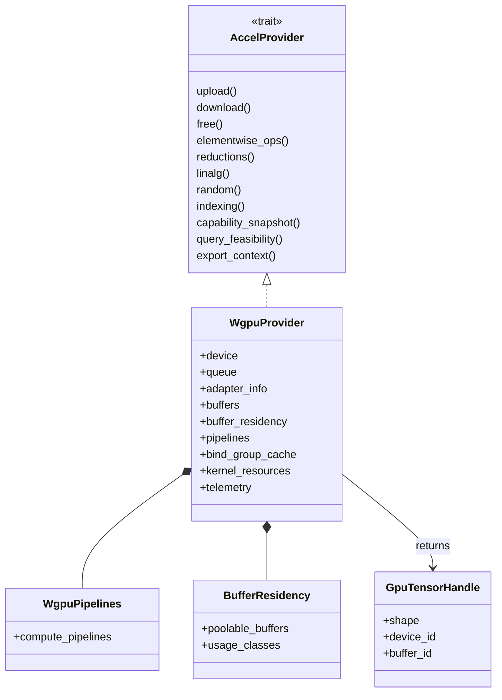
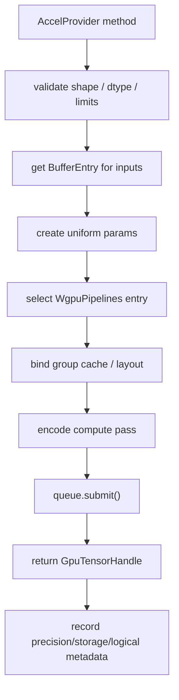

# WGPU Backend & Accelerate Provider

The `wgpu` backend is RunMat's primary hardware acceleration provider. It implements the `AccelProvider` trait with a `WgpuProvider` that owns the device, queue, adapter metadata, buffer table, residency pool, compute pipelines, kernel resources, caches, telemetry, and autotuning state.

Because it is built on `wgpu`, the same provider architecture can target native graphics APIs such as Vulkan, Metal, and DirectX, as well as WebGPU-capable browser environments.

## Provider Architecture

```mermaid
classDiagram
  class AccelProvider {
    <<trait>>
    upload()
    download()
    free()
    elementwise_ops()
    reductions()
    linalg()
    random()
    indexing()
    capability_snapshot()
    query_feasibility()
    export_context()
  }

  class WgpuProvider {
    +device
    +queue
    +adapter_info
    +buffers
    +buffer_residency
    +pipelines
    +bind_group_cache
    +kernel_resources
    +telemetry
  }

  class WgpuPipelines {
    +compute_pipelines
  }

  class BufferResidency {
    +poolable_buffers
    +usage_classes
  }

  class GpuTensorHandle {
    +shape
    +device_id
    +buffer_id
  }

  AccelProvider <|.. WgpuProvider
  WgpuProvider *-- WgpuPipelines
  WgpuProvider *-- BufferResidency
  WgpuProvider --> GpuTensorHandle : returns
```

## Module Organization

| Area | Files |
| --- | --- |
| Provider state and initialization | `provider/backend.rs`, `provider/backend_types.rs`, `provider/init.rs`, `provider/core.rs` |
| Provider trait implementation | `provider/trait_impl.rs` |
| Operation implementations | `provider/ops/*` |
| Dispatch helpers | `dispatch/*` |
| WGSL source generation | `shaders/*` |
| Pipeline management | `pipelines.rs` |
| Buffer residency and resources | `residency.rs`, `resources.rs`, `cache/*` |
| Parameters and tuning | `params.rs`, `autotune/*`, `config.rs`, `metrics.rs` |

## Dispatch Flow

Most provider methods follow the same pattern: validate shapes and backend limits, resolve or create GPU buffers, bind a pipeline and parameter buffer, dispatch workgroups, and return a new `GpuTensorHandle`.

```mermaid
flowchart TD
  Call["AccelProvider method"]
  Validate["validate shape / dtype / limits"]
  Buffers["get BufferEntry for inputs"]
  Params["create uniform params"]
  Pipeline["select WgpuPipelines entry"]
  Bind["bind group cache / layout"]
  Dispatch["encode compute pass"]
  Submit["queue.submit()"]
  Handle["return GpuTensorHandle"]
  Metadata["record precision/storage/logical metadata"]

  Call --> Validate --> Buffers --> Params --> Pipeline --> Bind --> Dispatch --> Submit --> Handle
  Handle --> Metadata
```

The provider also exposes `export_context` and `export_wgpu_buffer` for zero-copy consumers. Plotting and other GPU-aware subsystems can use those APIs to avoid unnecessary readbacks when the active provider supports them.

## Capability and Feasibility Discovery

`capability_snapshot()` returns a versioned description of the provider device, supported pilot operation identities, element representations, resource limits, and concurrency behavior. `query_feasibility()` accepts one operation identity together with its operation family, input/output representations, and workload dimensions. It returns either a resource estimate or a structured rejection code.

Both calls are observational. Providers must not allocate buffers, compile pipelines, transfer values, submit commands, or synchronize the device while answering them. This lets placement eliminate unsupported candidates before profitability comparison and prevents call-to-discover behavior. Operation identities advertised by the WGPU and in-process providers cover the current transfer, automatic-offload, and fusion pilot paths; they are not an assertion that every builtin has completed systematic placement migration.

`estimate_cost()` is also observational. For an operation already proven feasible, it can report cold or warm preparation, transfer, allocation, queue, execution, synchronization, download, downstream, and scratch-memory estimates. WGPU uses observed dispatch averages when trustworthy telemetry exists and otherwise returns explicit low-confidence priors. Placement accounts for uncertainty and supplies a bounded fallback when a provider returns no estimate; it never runs a probe operation to discover cost.

`placement_resources()` is the corresponding side-effect-free admission snapshot. It reports live allocations, pooled allocations that may be reclaimed, scratch and queue availability when known, loss state, and a resource epoch without allocating or polling by execution. WebGPU does not expose a trustworthy total device-memory budget or queue backlog, so the WGPU provider leaves total capacity, scratch availability, and queue occupancy explicitly unknown while still reporting observed allocation pressure; placement never substitutes the maximum single-buffer size as total VRAM or fabricates queue telemetry.

## Operation Categories

| Category | Examples |
| --- | --- |
| Construction | `zeros`, `fill`, `eye`, `linspace`, `meshgrid`, window functions, random tensors. |
| Elementwise and logical | Arithmetic, comparisons, logical operations, unary math, finite/NaN/Inf checks. |
| Reductions and scans | Global and dimension-wise reductions, cumulative operations, moments, variance/std helpers. |
| Linear algebra | Matrix multiplication, triangular operations, decompositions, solves, covariance/correlation helpers. |
| Indexing and scatter | Linear gather/scatter, slice-related helper kernels, set-like operations. |
| Signal and image | Convolution, filtering, image filtering, image normalization, FFT-related kernels. |
| Polynomial | `polyval`, `polyder`, `polyint`, and host-assisted `polyfit` behavior. |
| Random | Uniform, normal, exponential, integer ranges, permutations, and provider RNG state. |

Complex operations can combine device kernels with host fallback when the backend cannot yet provide the full MATLAB-compatible algorithm on device.

## Buffers and Metadata

`GpuTensorHandle` is intentionally small: it names a device, buffer, and shape. The backend and API registries hold the details that do not belong in every value:

- Precision: `f32` or `f64`.
- Storage: real or complex-interleaved.
- Logical flags for MATLAB logical arrays.
- Exact integer element type: `i8`, `i16`, `i32`, `i64`, `u8`, `u16`, `u32`, or `u64`.
- Transpose annotations.
- Provider-owned `wgpu::Buffer` references for exported buffers.

The provider validates adapter limits before creating buffers or bind groups. It also classifies buffer usage so residency pooling and cleanup can make reasonable reuse decisions.

### Exact integer ABI

Exact integer tensors do not use the provider's floating precision or a floating compatibility buffer. They use a packed `u32` word ABI:

| Integer class | Words per logical element | Interpretation |
| --- | ---: | --- |
| `int8`, `uint8` | 1 | low 8 bits |
| `int16`, `uint16` | 1 | low 16 bits |
| `int32`, `uint32` | 1 | full word |
| `int64`, `uint64` | 2 | low word followed by high word |

Signed values use two's-complement interpretation. This representation makes exact 64-bit integer support independent of native WGSL `i64`/`u64` availability. Integer comparison, arithmetic, cast, extrema, reduction, scan, and structural kernels decode the packed representation explicitly.

The `AccelProvider` contract separates `upload_integer`/`download_integer` and native integer reductions/casts from floating methods. A provider without an exact path must return unsupported; it must not route native integers through `f32` or `f64`.

The buffer entry's integer-type annotation and the API-level handle registry must be copied to every derived handle and cleared when a handle is released. Losing that annotation can make an exact word buffer look like floating storage, so metadata propagation is part of correctness rather than optional introspection.

This split registry is the current representation, not the endpoint of the numeric-storage migration. The target provider contract uses one exhaustive numeric element type for `f64`, `f32`, and all eight integer classes, with that metadata directly owned by the durable handle/provider state. Floating and integer transfers may keep specialized implementations, but must dispatch from the same authoritative type contract and must not require a host compatibility mirror.

## Pipeline and Shader Management

WGSL shader sources live under `backend/wgpu/shaders`, while dispatch modules prepare operation-specific parameters and workgroup shapes. `WgpuPipelines` owns compiled compute pipelines, and the provider uses caches for bind group layouts, bind groups, fused pipelines, and kernel resources.

Autotuning and calibrated workgroup sizing are part of provider state. The selected workgroup hints can be exposed through `runmat-accelerate-api` so other subsystems can use compatible execution parameters.

## SimpleProvider Fallback

`SimpleProvider` is the host-side fallback provider. It keeps the same provider-facing shape as the GPU backend but delegates unsupported or CPU-better operations to host implementations. This gives the runtime a single acceleration interface while preserving correctness when WebGPU is unavailable or a specific kernel is not implemented.

Fallback has two separate correctness obligations:

- Automatically promoted ordinary values may return to the CPU whenever the planner or provider selects the CPU semantic baseline.
- An exact integer handle must be downloaded with `download_integer`; fallback must preserve class and values and may re-upload only through `upload_integer`.

Handle metadata distinguishes explicit `gpuArray` construction from automatic promotion. Automatically promoted values may transparently return to the shared runtime path after a feasibility rejection; explicit GPU values retain their user-visible residency contract and are not silently reclassified as automatic values.

For how the VM decides when to invoke provider execution, see [Fusion Engine & Residency Management](/docs/runtime/gpu/fusion).
