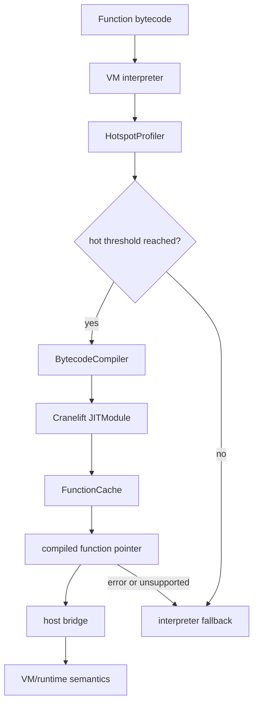

# Turbine JIT Compiler

Turbine is RunMat's native-code execution tier. The VM remains the semantic baseline, while Turbine watches bytecode execution frequency, compiles hot bytecode with Cranelift, caches the resulting function pointer, and falls back to the interpreter whenever compilation or execution cannot preserve full MATLAB semantics.

The JIT is intentionally narrow. Its fast path is strongest for scalar numeric bytecode, local and variable slot traffic, simple control flow, selected built-ins, and typed semantic calls. Complex object, cell, async, exception, and mutation behaviors stay in the VM unless Turbine has a typed bridge path for them.

## Tiered Execution

## Main Components

| Component | Role |
| --- | --- |
| `TurbineEngine` | Owns the Cranelift module, compiler, profiler, function cache, target ISA, and imported host-call symbols. |
| `HotspotProfiler` | Counts bytecode executions and marks bytecode hot after the configured threshold. |
| `FunctionCache` | Stores compiled functions by bytecode hash and tracks cache hit/miss statistics. |
| `BytecodeCompiler` | Lowers supported `Instr` sequences into Cranelift IR. |
| `RuntimeCallIds` | Carries imported Cranelift function IDs for host bridge calls. |
| `TurbineValue` | C-compatible value slot used when compiled code must pass full runtime values to host callbacks. |
| `JitMemoryManager` | Provides shared allocation helpers for string and array constants used by JIT support code. |

## Execution Policy

Turbine only runs when the current platform supports native JIT code generation. Today that means x86_64 and AArch64 hosts. The engine hashes bytecode, profiles executions by hash, compiles after the hot threshold, and reuses compiled functions through the cache.

If compilation fails, the compiled pointer is missing, a bridge call returns an error status, or an unsupported instruction is encountered, execution returns to `runmat-vm::interpret_with_vars`. This keeps JIT availability a performance property rather than a correctness requirement.

For the lowering flow, supported instruction classes, and ABI details, see [JIT Compilation Pipeline](/docs/runtime/jit/pipeline).
