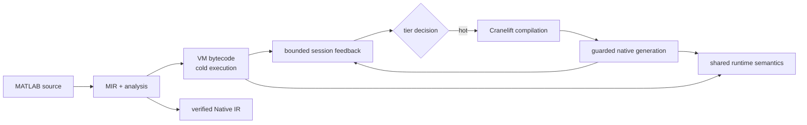

# JIT Compiler

RunMat uses adaptive native compilation on supported desktop and server targets. The VM starts execution immediately and remains the semantic baseline. As a function, loop, or interactive input becomes hot, RunMat can compile the same analyzed MIR product to verified Native IR and then to machine code with Cranelift.

JIT availability changes performance, not MATLAB behavior. Cold execution, native execution, deoptimization, and on-stack replacement use the same runtime-owned operations for calls, indexing, objects, exceptions, workspace access, cancellation, and builtins.

## Adaptive Execution

```mermaid
flowchart LR
  Source["MATLAB source"] --> MIR["MIR + analysis"]
  MIR --> VM["VM bytecode<br/>cold execution"]
  MIR --> NativeIR["verified Native IR"]
  Feedback["bounded session feedback"] --> Policy{"tier decision"}
  VM --> Feedback
  Policy -->|hot| Compile["Cranelift compilation"]
  Compile --> Published["guarded native generation"]
  Published --> Runtime["shared runtime semantics"]
  VM --> Runtime
  Published --> Feedback
```

Each `RunMatSession` owns its feedback, pending compilations, published generations, and executable-memory budget. Normal execution may compile in the background while the current request stays on the VM. Deterministic test mode uses the same pipeline synchronously.

RunMat can progress from interpretation to a generic native version and then to guarded specialized versions. Specializations are selected only for an exact matching runtime representation profile. Hot loops can transfer from generic to optimized code at a verified loop header without restarting the function or repeating an iteration.

## Correctness And Fallback

Before native entry, an unavailable, unsupported, stale, or failed compilation simply leaves execution on the canonical cold path. After native entry, RunMat does not restart the request in the VM: doing so could repeat I/O or workspace effects. Native exceptions, cancellation, suspension, and deoptimization instead preserve exact frame and resume state.

Interactive native execution receives a complete invocation-scoped workspace view. Successful execution publishes one transactional snapshot, including new and removed variables. Failed or cancelled execution publishes no partial native snapshot. Function redefinitions and project/catalog changes invalidate only products that depend on the changed authority.

Native versions and profiles are bounded. RunMat limits tracked sites, profiles, pending compilation, specialized versions, and executable bytes. Replacement can retire an old specialized version only after a new version is ready; active invocations retain their code until completion.

## Platforms

Host-native JIT compilation is supported on the native x86-64 and AArch64 backends used by RunMat's supported operating systems. WebAssembly cannot allocate host-native executable memory, so browser sessions execute the same portable program semantics through the web executor and VM. Portable Native IR remains verifiable and reusable by web tooling without embedding Cranelift machine code in the browser.

For the internal stages and ownership boundaries, see [JIT Compilation Pipeline](/docs/runtime/jit/pipeline). For session results and workspace publication, see [Execution Requests](/docs/runtime/session/execution-requests).
