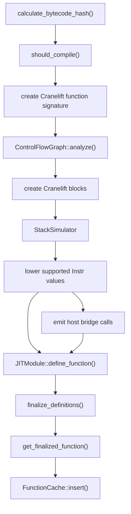
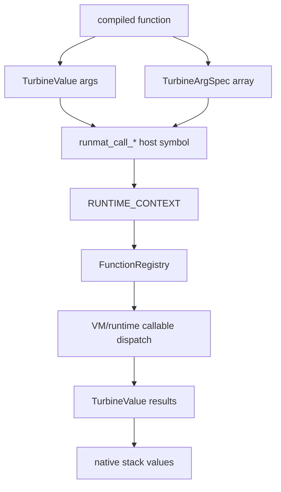

# JIT Compilation Pipeline

The Turbine pipeline converts hot VM bytecode into a native function.

## Compile Flow

The compiler first identifies basic block boundaries from jumps, conditional jumps, and returns. It then walks each block, simulating the VM stack while emitting Cranelift IR for operations it can preserve directly. Unsupported instructions return a Turbine execution error during compilation, which causes the engine to use interpreter fallback.

## Stack Simulation

`StackSimulator` tracks a vector of `StackEntry` values. Each entry has:

| Field | Meaning |
| --- | --- |
| `num` | A Cranelift `f64` value used by the numeric fast path. |
| `value_ptr` | Optional pointer to a full `TurbineValue` slot when the value came from VM storage and may need to be passed through the host bridge. |

Loads from variables and locals read the `TurbineValue` payload and keep the original slot address. Pure numeric constants only carry the `f64` lane. When the compiler needs full runtime semantics, it can rebuild argument arrays from either numeric lanes or original value slots.

## Supported Native Paths

| Instruction area | Behavior |
| --- | --- |
| Numeric literals | `LoadConst` becomes a Cranelift `f64const`. |
| Variable/local load and store | Reads and writes 16-byte `TurbineValue` slots, storing numeric results with the `Num` tag. |
| Scalar arithmetic | `Add`, `Sub`, `Mul`, `Pow`, `Neg`, elementwise arithmetic, comparisons, and logical helpers lower to direct numeric operations or static helper lowering. |
| Control flow | `Jump`, `JumpIfFalse`, and `Return` lower to Cranelift block branches and returns. |
| Matrix construction/ranges/indexing | Simple forms call Turbine helper lowering; more complex slice/cell/object forms stay in the interpreter. |
| Semantic calls | Bound function calls, named calls with resolvable identities, expanded calls, built-in calls, `feval`, and method/member expanded calls use typed host bridge functions. |

Unsupported instructions include complex literals, strings/chars as native values, cell and struct construction, object/member mutation, try/catch, async instructions, closure/function-handle construction, slice assignment, and many dynamic indexing forms. Those paths are not errors at the runtime level; they simply keep execution in the VM.

## Host Bridge and ABI

Turbine registers host bridge symbols with the Cranelift `JITBuilder`, declares matching imported functions in the `JITModule`, and passes the resulting `FuncId` values through `RuntimeCallIds` during lowering.

`TurbineValue` is a compact tagged slot:

| Tag | Payload |
| --- | --- |
| `Empty` | No value, currently converted back to numeric zero. |
| `Num` | Raw `f64::to_bits()`. |
| `Bool` | `0` or `1`. |
| `Int` | Signed integer bits. |
| `GcHandle` | Opaque identity token for a GC-managed `Value`; compiled and bridge code must use checked GC access APIs to inspect the value. |

`TurbineArgSpec` mirrors VM argument expansion metadata with `is_expand`, `num_indices`, and `expand_all`. Expanded and multi-output calls use this layout so compiled code can call the same semantic dispatch paths as the interpreter without falling back to legacy name-only resolution.

## Runtime Re-entry

Before invoking a compiled function, `TurbineEngine` converts the mutable VM variable slice into `Vec<TurbineValue>` and installs a thread-local `RuntimeContext` containing the bytecode's `FunctionRegistry`. Host bridge functions use that context to resolve semantic function IDs, builtin names, `feval`, and method/member fallback policies.

After native execution returns, the engine converts each `TurbineValue` slot back into `runmat_builtins::Value` and writes it into the original VM variable slice. A nonzero native status becomes a Turbine execution error and causes `execute_or_compile` to fall back to the interpreter when possible.

## Caching and Statistics

Compiled functions are cached by bytecode hash. The hash includes variable count, bytecode instructions, function layout metadata, entrypoints, callable identities, fallback policy, and argument expansion metadata for call instructions. This prevents code generated for one callable shape from being reused for a semantically different bytecode body.

The cache has a fixed capacity and evicts the least-used entry when full. `TurbineStats` reports compiled function count, hot functions, cache size, cache capacity, cache hit rate, and the hottest bytecode hashes.

## Constraints

The JIT fast path should be treated as a selective optimization tier. It is designed to accelerate hot scalar numeric and typed-call bytecode while delegating dynamic MATLAB semantics to the VM. Adding support for another instruction is only safe when the lowering preserves stack shape, runtime value representation, error behavior, and fallback semantics.
