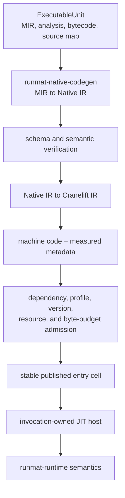

# JIT Compilation Pipeline

The JIT consumes the same immutable executable unit already produced for a request. It does not reparse source, reconstruct control flow from bytecode, or define a second runtime value representation.

## Compile And Publication Flow

```mermaid
flowchart TD
  Unit["ExecutableUnit<br/>MIR, analysis, bytecode, source map"]
  Lower["runmat-native-codegen<br/>MIR to Native IR"]
  Verify["schema and semantic verification"]
  CLIF["Native IR to Cranelift IR"]
  Code["machine code + measured metadata"]
  Admit["dependency, profile, version,<br/>resource, and byte-budget admission"]
  Cell["stable published entry cell"]
  Host["invocation-owned JIT host"]
  Runtime["runmat-runtime semantics"]

  Unit --> Lower --> Verify --> CLIF --> Code --> Admit --> Cell --> Host --> Runtime
```

`runmat-native-codegen` owns portable Native IR and machine-code lowering. `runmat-jit` owns compilation policy, publication, executable-memory lifetime, invocation state, deoptimization, OSR, and feedback. `runmat-core` owns session selection, immutable executable products, dependency revisions, and host-visible result/workspace commitment. `runmat-runtime` remains executor-neutral and owns language operations and the versioned native ABI.

## Native Invocation

Generated code receives opaque, generation-checked value references and a versioned host table. Runtime `Value` layout never crosses the native ABI. The invocation host retains locals, GC roots, exact source and resume identity, loop iterators, exception handlers, outputs, cancellation state, and any transactional workspace snapshot.

Semantic sites call the same runtime operations used by the VM. Structured exits distinguish completion, exception, cancellation, suspension, and deoptimization. A deoptimization frame includes its exact function, block, position, phase, ordinal, live locals, roots, aliases, and side-effect epoch so continuation does not replay completed work.

## Tiering And Specialization

Feedback is keyed by stable entry, function, and optional loop-header identity. Exact runtime facts form bounded representation profiles. Policy admits generic native code after generic heat, and guarded optimized versions only after their matching profile becomes hot. Compilation failures retain the existing continuation; runtime program errors are not mistaken for compiler failures.

Every published target records exact program, builtin-catalog, project, and referenced session-function generations. Dynamic lookup also depends on the session catalog. Publication rechecks those generations after background compilation. Redefining a referenced function retires stale code even if the function keeps the same semantic ID.

## Optimized Regions And Placement

Specialized products may include verified effect-free numeric regions. The JIT derives the region plan, Runtime evaluates the admitted numeric DAG transactionally, and the session's shared placement authority decides between ordinary specialized CPU execution and vectorized CPU execution. The JIT does not contain independent GPU policy. Unsupported storage, shape, resource, cancellation, or placement conditions leave ordinary execution intact.

## Interactive Workspace Contract

An eligible interactive input is compiled from the MIR and analysis already produced for that request. Its native invocation receives all ambient assigned values plus exact semantic bindings for locals used by the source. Dynamic builtins such as `exist`, `which`, `save`, `load`, `clear`, and `clearvars` therefore observe the invocation workspace through the common runtime service.

Local writes and runtime workspace effects update invocation-owned state. Only successful completion returns a snapshot to Core. Core then applies the existing display, semicolon suppression, `ans`, workspace-delta, and function-publication policies. An exception or cancellation cannot leak a partial snapshot and is never followed by whole-request VM replay.

## WebAssembly

The portable executable manifest and Native IR schema are target-neutral and validated in WASM builds. The Cranelift JIT module and executable-memory lifecycle are native-only. Browser execution keeps the VM/platform executor as its semantic path while sharing compiler facts, runtime services, portable identities, and artifact validation.
