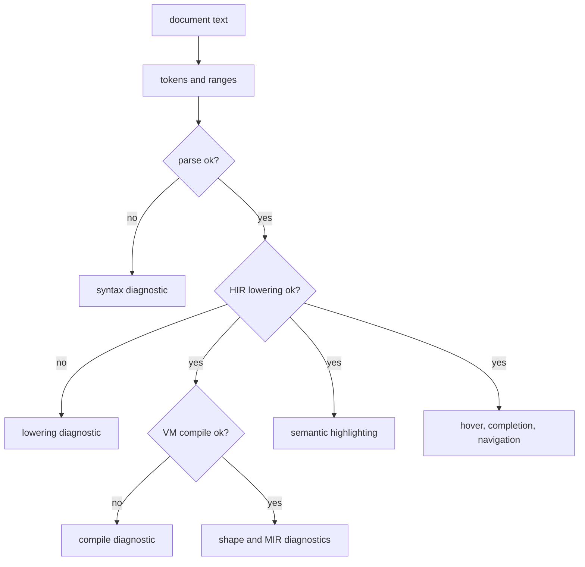

# Diagnostics & Highlighting

Diagnostics and semantic highlighting come from a static analysis pass over the current document. The server tokenizes, parses, lowers to HIR, runs static analysis, performs a VM compile check, and converts those results into LSP diagnostics and semantic tokens.

## Error Diagnostics

RunMat emits error diagnostics from four stages:

| Problem type | Example | Diagnostic source | Range selection |
| --- | --- | --- | --- |
| Syntax error | An unfinished expression or mismatched delimiter. | `runmat-parser` | Error range at the unexpected token or best available location. |
| Lowering error | A binding, call, import, or language construct cannot be resolved into HIR. | `runmat-hir` | Error range at the HIR span or a best-effort symbol range. |
| Compile error | Lowered code cannot be compiled to VM bytecode. | `runmat-vm` | Error range at the compile-error span when one is available. |
| Static-analysis error | Shape or MIR analysis reports an error-severity diagnostic. | `runmat-hir` | Error diagnostic with a code and message. |

The language server reports the earliest blocking compiler result first. A syntax error prevents reliable lowering, so parser diagnostics take precedence in the editor. If parsing succeeds but lowering fails, the HIR error is shown. If lowering succeeds but bytecode compilation fails, the VM compile error is shown. Once the document is analyzable, shape and MIR diagnostics are added.

## Warnings, Hints, And Status

The LSP also reports non-error diagnostics from static analysis.

| Severity | Typical meaning |
| --- | --- |
| Error | The document cannot be parsed, lowered, compiled, or statically validated. |
| Warning | Static analysis found a non-blocking issue. |
| Information | The server has non-blocking analysis status to report. |
| Hint | Helpful static-analysis guidance. |

The native server also emits a `runmat/status` notification after analysis. Hosts can use that to show lightweight status like `ok` or the current blocking error summary without reinterpreting the diagnostics list.

## Analysis Flow

This analysis does not run the program, mutate variables, call user functions, or trigger runtime side effects.

## Highlighting

Semantic highlighting combines lexer token classes with information learned during lowering.

| Token type | What it marks |
| --- | --- |
| `keyword` | MATLAB/RunMat control-flow and declaration keywords. |
| `function` | Function declarations and call sites. Builtin calls receive the `defaultLibrary` modifier. |
| `variable` | Locals, outputs, globals, and generic identifiers. |
| `parameter` | Function input bindings. |
| `namespace` | Imports and package references. |
| `string`, `number`, `operator`, `comment` | Direct lexer token classes. |

Declarations receive the `declaration` modifier. Builtin calls receive `defaultLibrary`, allowing themes to distinguish standard-library calls from user-defined functions.

## Project-Aware Feedback

When a document URI points into a RunMat project, the server discovers the nearest project manifest and the project composition graph. That extra context improves:

- unresolved function checks during lowering;
- go-to-definition and references across files;
- workspace symbols from unopened project files;
- reanalysis of dependent open documents when exported functions change.

If project discovery is unavailable, the server still analyzes the open document and builtins, but cross-file feedback is limited.
