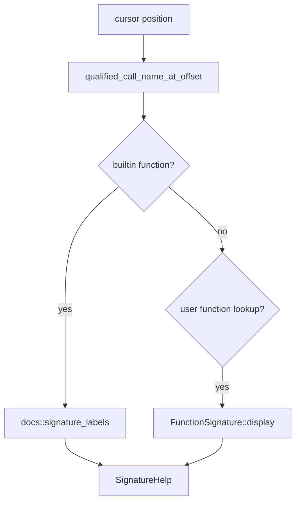

# Editor Features

The LSP exposes document analysis through editor operations: hover, completion, signature help, navigation, symbols, and formatting.

## Hover

Hover resolves the token under the cursor and returns the most specific information available.

| Hover target | Result |
| --- | --- |
| Function-local variables | `parameter`, `output`, or `local` plus inferred type and shape. |
| Globals | `global` plus inferred type and a note that the binding is workspace-visible. |
| Builtin functions | Markdown rendered from builtin descriptors and embedded builtin JSON. |
| Builtin constants | `const name` plus the constant value. |

Builtin hover text can include syntax, behaviors, options, GPU notes, examples, and reference links. Those sections come from the generated builtin documentation data used elsewhere in the runtime docs.

## Completion

Completion items are built from the semantic model and builtin inventory:

| Item source | LSP kind | Detail |
| --- | --- | --- |
| Globals | Variable | Binding kind and inferred type. |
| Function locals | Variable | Parameter/output/local kind and inferred type. |
| Document functions | Function | Display signature, including outputs and inputs. |
| Builtin functions | Function | Descriptor or inferred builtin signature plus Markdown documentation. |
| Builtin constants | Constant | Constant label. |

Completion is document-scoped and does not filter results by syntax position. The server returns the semantic inventory available for the analyzed document.

## Signature Help

Signature help appears while the cursor is in or near a function call. Builtins are resolved first so their generated descriptor labels can be shown. If the call name matches a user-defined function in the current document, the server returns the function signature built from lowered inputs and outputs.

Active-parameter calculation is not implemented. Returned signatures set the active signature to the first entry and leave active parameter unset.

## Navigation

Definition and reference requests use a local-first strategy:

| Request | Same-document behavior | Project behavior |
| --- | --- | --- |
| Definition | Function definitions, local variables, parameters, outputs, and globals resolve to source ranges in the current document. | Function definitions are searched across discovered project files. |
| References | Local variables are scoped to the containing function when possible. Function calls are found through the HIR call index. | Function references and definitions are searched across discovered project files and deduplicated. |

Project navigation is available when the server can map the document URI to a source path and discover a RunMat project manifest.

## Symbols

Document symbols are function-oriented. Each user-defined function becomes a nested `DocumentSymbol` with the function name, display signature, full range, and name selection range.

Workspace symbols aggregate document symbols from open documents and project files. Native LSP requests apply the client's query string as a case-insensitive substring filter.

## Formatting

Formatting is deliberately conservative. It does not rewrite MATLAB syntax or attempt style-aware indentation. It returns a whole-document edit only when the normalized text differs:

- trailing whitespace is removed;
- line endings are normalized through Rust string processing;
- more than one consecutive blank line is collapsed;
- the document ends with a newline.

This provides a baseline formatter without changing MATLAB syntax or expression layout.

## Native And WASM Hosts

The native server advertises incremental text sync, hover, definition, references, signature help, semantic tokens, document formatting, completion, document symbols, workspace symbols, UTF-8 positions, and workspace folders.

The WASM API exposes the same core operations as direct functions: `open_document`, `change_document`, `close_document`, `diagnostics`, `completion`, `hover`, `definition`, `references`, `signature_help`, `semantic_tokens`, `document_symbols`, `workspace_symbols_all`, `formatting`, and `setCompatMode`.

Neither host exposes rename, code actions, inlay hints, or range semantic tokens.
