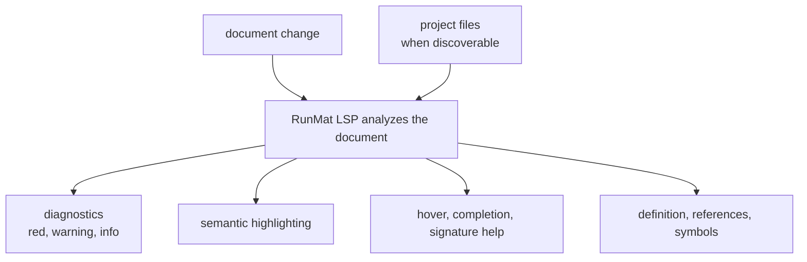

# Language Server Protocol (LSP)

`runmat-lsp` provides editor services for MATLAB/RunMat source: diagnostics, hover documentation, completion, signature help, semantic highlighting, go-to-definition, references, symbols, and formatting.

The server analyzes documents with the same lexer, parser, HIR lowering, static analysis, builtin metadata, and VM compile checks used elsewhere in RunMat. It does not run user code or create an execution session.

## Editor Surface

| Capability | Source of information |
| --- | --- |
| Error diagnostics | Syntax errors, HIR lowering errors, VM compile errors, and error-severity static-analysis diagnostics. |
| Warning and information diagnostics | Shape analysis, MIR analysis, and non-blocking semantic diagnostics. |
| Semantic highlighting | Lexer tokens plus semantic roles for functions, parameters, variables, namespaces, and builtins. |
| Hover | Inferred variable kinds/types, global variables, builtin docs, and builtin constants. |
| Completion | Globals, local variables, document functions, builtins, and constants. |
| Signature help | Builtin descriptors and user-defined function signatures. |
| Go to definition and references | Local bindings, document functions, and project functions when the project can be discovered. |
| Outline and workspace symbols | User-defined functions from open documents and project files. |
| Formatting | Conservative whitespace cleanup. |

## Analysis Flow

Analysis preserves partial results when a document is invalid. A syntax error can still leave token information available for highlighting and ranges, and a compile error can still point to the relevant source span without execution.

## Capability Coverage

| Feature | Native LSP | WASM exports | Notes |
| --- | --- | --- | --- |
| Incremental document sync | Yes | Open/change document calls | Native sync is incremental; WASM stores complete text per URI. |
| Diagnostics | Yes | Yes | Syntax, HIR lowering, VM compile, and semantic lint diagnostics. |
| Hover | Yes | Yes | Local variables, globals, builtins, and builtin constants. |
| Completion | Yes | Yes | Globals, function locals, document functions, builtins, and constants. |
| Signature help | Yes | Yes | Builtin descriptors and user-defined function signatures. |
| Semantic tokens | Yes | Yes | Keywords, functions, variables, parameters, namespaces, strings, numbers, operators, comments. |
| Go to definition | Yes | Yes | Same-document symbols plus project functions when project discovery is available. |
| References | Yes | Yes | Same-document references plus project functions when project discovery is available. |
| Document symbols | Yes | Yes | Function symbols with signature details. |
| Workspace symbols | Yes | Yes | Open documents and discovered project files, filtered by query on native LSP. |
| Formatting | Yes | Yes | Whitespace normalization only: trailing whitespace, newline normalization, and blank-line collapse. |
| Rename, code actions, inlay hints | No | No | These capabilities are not advertised by the server. |

## Runtime Scope

The LSP compiles far enough to answer editor requests, but it does not create a `RunMatSession`, mutate workspace state, invoke user functions, or evaluate runtime side effects. Its checks are static:

- Parser compatibility follows the configured language mode (`runmat`, `matlab`, or `strict`).
- HIR lowering resolves bindings, calls, imports, and project-visible symbols.
- Static analysis contributes shape and MIR diagnostics.
- VM compilation catches bytecode-level compile errors before execution.
- Builtin metadata drives editor documentation instead of duplicating handwritten LSP-only references.

This keeps editor feedback aligned with runtime semantics while keeping idle analysis side-effect free.

## Page Map

| Page | Purpose |
| --- | --- |
| [Diagnostics & Highlighting](/docs/runtime/lsp/diagnostics-and-highlighting) | Error, warning, status, and semantic-token behavior. |
| [Editor Features](/docs/runtime/lsp/features) | Hover, completion, signature help, navigation, symbols, formatting, and native/WASM host behavior. |

For compiler internals, see [Compilation Pipeline](/docs/runtime/compiler). For execution after compilation, see [VM Interpreter & Bytecode](/docs/runtime/vm). For browser embedding, see [WASM & TypeScript/JavaScript](/docs/runtime/wasm).
