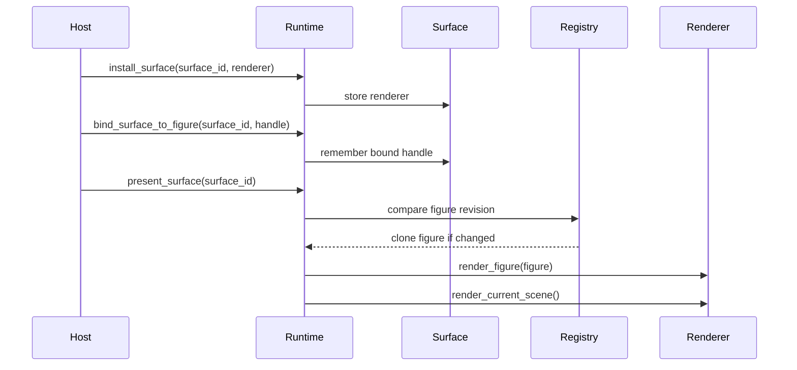

# Host Integration

Hosts present figures through browser canvases, native windows, snapshots, and exported images. The runtime owns figure handles, axes state, property mutation, replay import/export, and figure revisions.

The integration layer connects host presentation resources to runtime figure state while keeping MATLAB semantics in the runtime.

## Surface Lifecycle

On web builds, installed surfaces are stored by `surface_id`. Each surface entry contains a `WebRenderer`, an optional bound figure handle, and the last figure revision rendered on that surface. Presentation re-primes the renderer only when the figure revision changed, then draws the current scene.

That revision check is the key host optimization. Figure mutations rebuild render data. Camera-only interaction redraws the current scene without changing figure state.

## Web Host Responsibilities

| Responsibility | Runtime entrypoint |
| --- | --- |
| Register a canvas-backed renderer. | `install_surface` |
| Update physical size and pixel scale. | `resize_surface` |
| Attach a figure to a surface. | `bind_surface_to_figure` |
| Draw the currently bound figure. | `present_surface` |
| Bind and draw a specific figure in one step. | `present_figure_on_surface` |
| Remove a disposed canvas. | `detach_surface` |
| Clear surfaces bound to a closed figure. | `clear_closed_figure_surfaces` |

If a runtime path such as `drawnow` requests presentation and the figure has no bound surface, the web integration can claim the lowest unbound surface. That keeps simple scripts usable while still allowing explicit binding in multi-figure hosts.

## Camera State

Camera state is host-visible because users interact with it. A browser host may need to preserve camera position across rerenders, export an image that matches the current view, or restore a replayed figure into the same orientation.

`PlotSurfaceCameraState` contains the active axes and one camera per axes. Each camera includes position, target, up vector, zoom, aspect ratio, and projection parameters. Hosts can read this state, store it, write it back, and pass it into camera-aware snapshot paths.

Pointer, wheel, resize, and key events are routed into the web renderer. Those events update camera state and trigger scene redraws. Figure revisions change only when figure state changes.

## Native And Headless Hosts

Native plotting is feature-gated behind `gui`. In native mode, the runtime can present figures through an interactive window or use a static export path. Native integration installs a figure observer so closing a runtime figure can request closure of the corresponding native window.

Headless export runs without a live surface. It clones a figure, applies export settings and optional camera state, and renders through `ImageExporter` into PNG or RGBA bytes. This is the path used by snapshots, reports, previews, and other non-interactive consumers.

## Integration Contract

The host should treat a figure handle as a runtime identity and a surface as a presentation target. A figure can outlive a surface. A surface can be rebound to another figure. Export can render without any interactive surface.

The contract is:

- Create and resize surfaces in host code.
- Keep figure selection and property behavior in the runtime.
- Bind surfaces explicitly when multiple figures are possible.
- Preserve camera state when exported images should match interactive views.
- Detach surfaces and clear closed-figure bindings during cleanup.
- Use replay payloads for live scene persistence and image export for fixed visual output.
