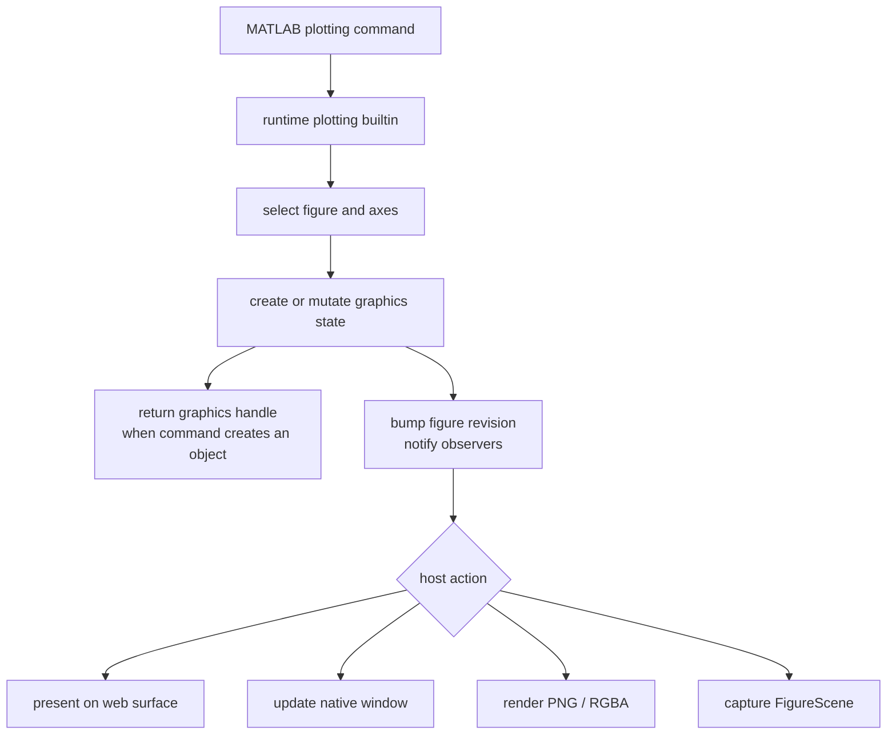

# Plotting System

Plotting is the runtime subsystem that turns MATLAB plotting commands into persistent graphics state. A call like `plot(x, y)` selects a figure and axes, creates or updates graphics objects, assigns handles, records axes-local state, and leaves behind a figure that can later be inspected, restyled, rendered, replayed, or exported.

That distinction is the center of the design. The runtime owns MATLAB semantics: current figure, current axes, `hold`, `subplot`, graphics handles, `get`/`set`, labels, legends, limits, and command behavior. `runmat-plot` owns the renderable representation of that state: figures, plot elements, replay scenes, cameras, scene nodes, GPU buffers, web surfaces, and image export.

## Plotting Lifecycle

The important runtime boundary is the transition from numeric computation to graphics state. Numeric builtins normally produce `Value` results. Plotting builtins mostly mutate a figure and may return a handle to the object they created. Once the figure exists, later commands operate on that graphics state directly.

## System Split

| Layer | Owns | Main code |
| --- | --- | --- |
| Runtime semantics | MATLAB-compatible command behavior, figure registry, current axes, handles, properties, figure events, replay/export entrypoints. | `runmat-runtime/src/builtins/plotting` |
| Replay envelope | Safe encoding and decoding of figure-scene payloads, schema envelope, size limits, large-data hydration. | `runmat-runtime/src/replay/scene.rs` |
| Graphics model | `Figure`, axes metadata, plot elements, snapshots, replay scenes, scene plot serialization. | `runmat-plot/src/plots`, `runmat-plot/src/event.rs` |
| Rendering | Scene graph construction, cameras, render data, GPU buffer references, WGPU draw paths. | `runmat-plot/src/core`, `runmat-plot/src/gpu` |
| Presentation | Browser canvas surfaces, native GUI windows, headless PNG/RGBA export. | `runmat-plot/src/web.rs`, `runmat-plot/src/export` |

This split keeps MATLAB compatibility in the runtime while letting the renderer treat figures as structured graphics scenes.

## What Makes Plotting Stateful

Plotting state is layered across the registry, figures, axes, and individual plot objects:

- The registry tracks figures and current selection.
- A figure tracks subplot layout, active axes, and plot objects.
- Each axes tracks its own labels, legend, limits, scales, color settings, view, grid, box, annotations, and hold state.
- Each plot object tracks its data, style, visibility, label, and parent axes.
- Handles let later commands refer back to those objects.

This is why `subplot`, `hold`, `legend`, `title`, `view`, `get`, and `set` all need the same registry and handle system. They are different operations over one persistent graphics model.

## Page Map

| Page | Purpose |
| --- | --- |
| [Figure State & Handles](/docs/runtime/plotting/state-and-handles) | How figures, axes, graphics handles, properties, and updates are represented in the runtime. |
| [Rendering Pipeline](/docs/runtime/plotting/rendering) | How persistent figure state becomes scene nodes, GPU buffers, draw calls, and pixels. |
| [Replay & Export](/docs/runtime/plotting/replay-and-export) | How RunMat preserves a live scene versus exporting a fixed image. |
| [Host Integration](/docs/runtime/plotting/host-integration) | How web, native, and headless hosts present figures and preserve camera state. |

For the public plotting builtin surface, see [Builtins](/docs/runtime/builtins). For GPU tensor residency and shared WGPU provider context, see [GPU Acceleration & Fusion Engine](/docs/runtime/gpu).
