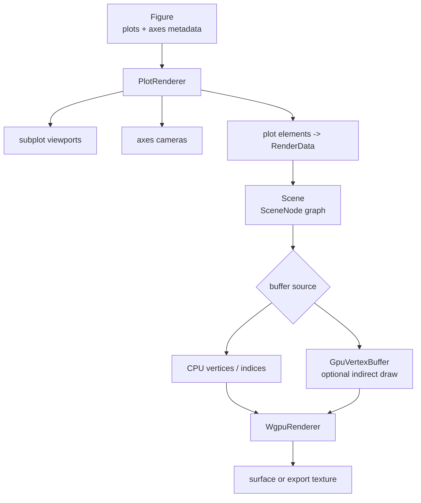

# Rendering Pipeline

Rendering starts from figure state. By the time the renderer runs, plotting builtins have already produced a `Figure` containing plot elements, axes metadata, labels, limits, color state, subplot layout, and view configuration.

The renderer's job is to turn that structured graphics state into draw-ready scene data, then into pixels.

## Render Flow

`PlotRenderer` is the orchestration layer. It owns the current scene, active theme, figure metadata, per-axes cameras, data bounds, viewport tracking, auto-fit state, and per-node GPU buffer cache.

`WgpuRenderer` is the drawing layer. It owns WGPU device resources, pipelines, uniform buffers, bind groups, image samplers, MSAA/depth resources, and the render passes that issue draw calls.

## Scene Nodes

Each visible plot object becomes render data attached to one or more scene nodes. A scene node records which axes it belongs to, whether it is visible, its transform, its bounds, and the render data needed to draw it.

Render data has two important forms:

| Form | Meaning |
| --- | --- |
| CPU-backed | Vertices and optional indices are available on the host and uploaded or reused by the renderer. |
| GPU-backed | A plot object supplies a `GpuVertexBuffer`, possibly with indirect draw arguments, so the renderer can draw without reading vertex counts back to the CPU. |

Bounds are tracked separately because GPU-backed plots may not have host-side vertices. Camera fitting and axes limits still need data-space extents even when geometry stays device-oriented.

## Pipeline Families

The renderer keeps the number of draw families small:

| Pipeline | Typical plots |
| --- | --- |
| Points | Point-like data and marker primitives. |
| Lines | Polylines, reference lines, stairs, stems, and line outlines. |
| Triangles | Surfaces, patches, bars, filled contours, areas, and mesh-like geometry. |
| Scatter3 | Camera-projected 3-D marker billboards. |
| Textured | Image and image-like payloads. |

Viewport-constrained direct 2-D pipelines handle pixel-sized style, thick lines, and marker geometry that depends on the current viewport.

## Subplots And Cameras

Subplots are not separate figures. They are axes viewports inside one figure. The renderer computes a viewport for each axes and keeps camera state per axes. That matters for multi-panel figures because one panel may be 2-D, another may be 3-D, and each may have different limits, color settings, labels, grid state, and view.

Camera state affects both presentation and reproducibility. Web hosts can read and restore per-axes camera state so exported snapshots can match the user's visible view.

## GPU Input And Render Residency

Plotting can receive GPU-resident tensors. Rendering then crosses from array semantics into graphics semantics.

There are three separate residency questions:

| Layer | Question |
| --- | --- |
| Numeric input | Is the source tensor already on an acceleration provider? |
| Plot interpretation | Can bounds, shapes, or derived plot data be computed without gathering the full input? |
| Render data | Can draw-ready buffers be provided directly to WGPU? |

The runtime uses plotting GPU helpers to seed or access a shared WGPU context from the active acceleration provider. Simple bounds can be computed through provider reductions. Plot families that need host interpretation gather only when needed. Renderer-facing data may then be CPU vertices, uploaded buffers, provider-shared buffers, or GPU-generated geometry.

## Rebuild Versus Redraw

Not every visual change has the same cost.

| Change | Typical renderer work |
| --- | --- |
| Camera rotate, pan, or zoom | Redraw existing scene with updated camera. |
| Surface resize | Recompute viewport-dependent render data and redraw. |
| Style or axes metadata change | Rebuild affected render data or uniforms, then redraw. |
| New plot data | Rebuild plot representation, scene nodes, buffers, and bounds. |
| Figure revision unchanged | Reuse prepared scene where possible. |

This distinction is why the runtime tracks figure revisions and the web host tracks the last revision presented on a surface. Redraws are cheap relative to rebuilding a figure from new graphics state.
