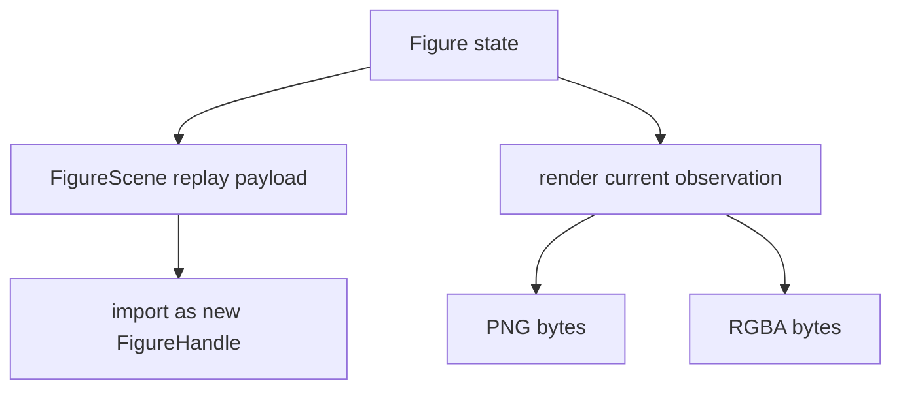
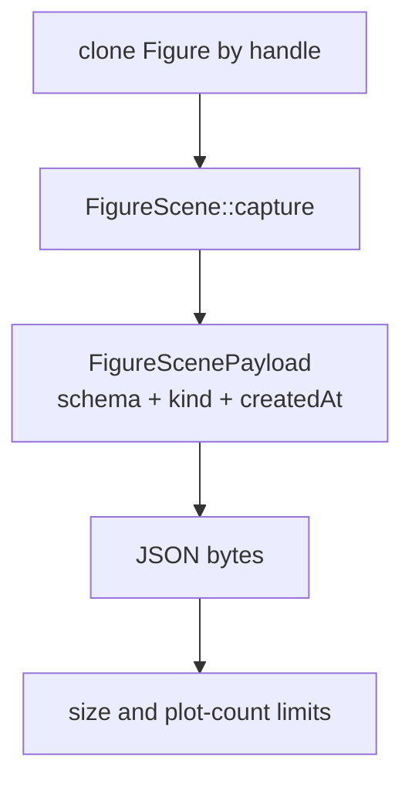
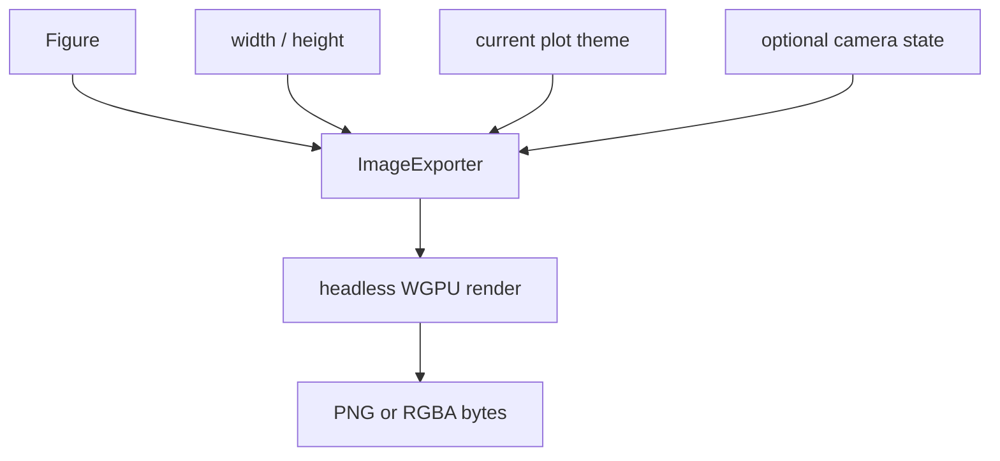

# Replay & Export

Replay and export both start from a figure. 

Replay preserves a live graphics scene: plot objects, axes metadata, subplot layout, legends, labels, limits, color settings, view-related state, and enough plot data to reconstruct a `Figure`. 

Export preserves pixels: one rendered observation of that scene at a particular size, theme, and camera state.

## Scene Versus Image

A replayed figure remains editable and renderable. An exported image is a fixed artifact. Replay preserves each axes and its state. Export preserves the composed pixels from the current observation.

## Replay Payload

`export_figure_scene` captures a cloned figure as `FigureScene` and wraps it in a runtime replay envelope. The envelope stores schema version, payload kind, creation time, and the scene itself.

Import reverses the process. The runtime decodes the envelope, validates schema and limits, hydrates any large-data references, converts the `FigureScene` back into a `Figure`, registers it in the plot registry, and returns a fresh figure handle.

## What Replay Preserves

Replay preserves interpreted graphics state. The preserved state includes:

- subplot grid and axes membership
- active axes selection
- plot objects and plot-specific style/data
- axes titles, labels, legends, limits, scales, grids, boxes, colorbars, colormaps, and color limits
- figure background and super-title
- visibility, labels, text annotations, and 3-D view metadata

The original script may have created that state. Replay reconstructs the figure directly from serialized scene state.

## Schema And Limits

There are two schema boundaries:

| Boundary | Purpose |
| --- | --- |
| Runtime replay envelope | Rejects wrong payload kinds, unsupported envelope versions, oversized payloads, and excessive plot counts. |
| `FigureScene` schema | Versions the renderable figure representation and rejects scene content that cannot be reconstructed safely. |

Default scene replay limits are:

| Limit | Default |
| --- | --- |
| Encoded figure scene payload | `16 * 1024 * 1024` bytes |
| Plot count | `4096` plots |

Large scenes can reference external array payloads. The import path can hydrate supported surface and 3-D scatter fields from dataset manifests or chunk references before reconstructing the figure.

## Export Path

Export renders a figure through the headless image exporter. The runtime can render PNG bytes or raw RGBA bytes, with default camera state, one explicit camera, or per-axes cameras.

Snapshot helpers clone the figure by handle, apply dimensions, set the active plot theme, optionally attach a textmark, and render. Camera-aware snapshot helpers convert host-facing camera state into `runmat-plot` camera values before export so the image can match the interactive view.

## Choosing The Right Operation

| Need | Use |
| --- | --- |
| Restore a figure later as editable graphics state. | Replay scene export/import. |
| Preserve the current view for a report or preview. | PNG or RGBA export. |
| Keep subplot structure and per-axes state. | Replay. |
| Match the user's current interactive 3-D view in an image. | Camera-aware export. |
| Share a fixed artifact that no longer needs handles or axes state. | Image export. |

Replay keeps the scene alive. Export records what the scene looked like at one moment.
