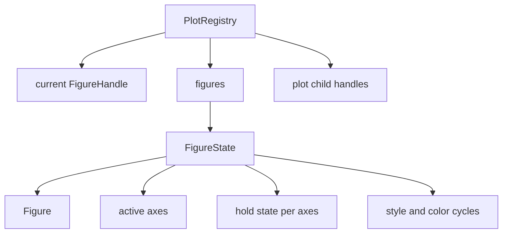
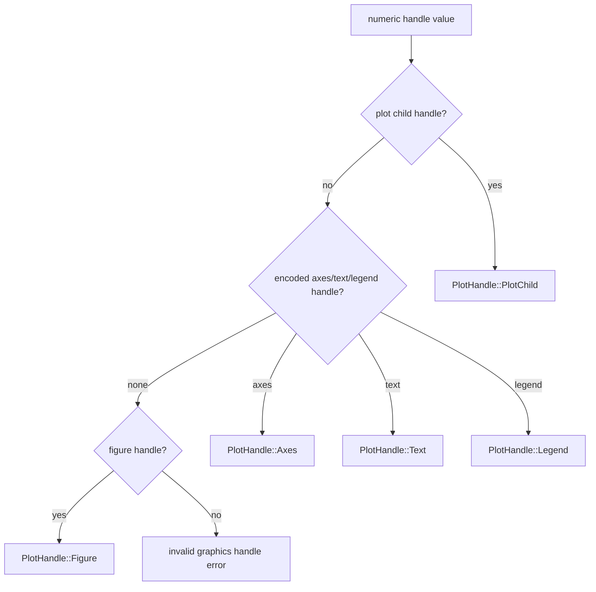
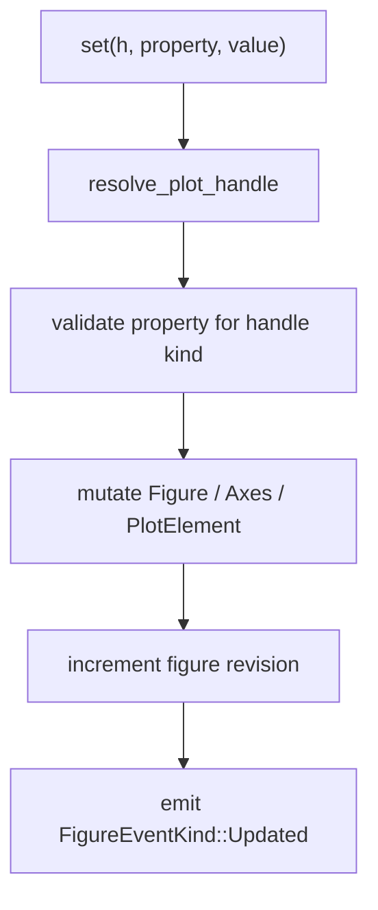

# Figure State & Handles

The figure registry gives MATLAB commands a current figure, a current axes, durable graphics objects, and numeric handles that later commands can use to inspect or mutate those objects.

This registry is the shared object model behind `hold on`, `subplot`, `set(h, ...)`, `legend`, `gca`, and replay. Each command can operate on existing figure state across the plotting workflow.

## Registry Shape

`FigureHandle` values are the user-visible identities for figures. Plot children, axes, labels, legends, and text objects use encoded handle values that can be resolved back to their owning figure and object kind. This lets the runtime accept ordinary MATLAB-style numeric handles while still routing each operation to the right object.

Native builds store the registry behind a process-global mutex. WebAssembly builds use thread-local registry storage. Both targets expose the same plotting semantics: one plotting context tracks the active figure and the graphics objects created inside it.

## Axes-Local Semantics

Axes own most plotting state. A figure may contain many subplot axes, and each axes has its own labels, title, legend, limits, scale modes, grid state, box state, colorbar, colormap, color limits, view, annotations, and plotted children.

That axes-local ownership explains several MATLAB behaviors:

- `subplot` changes which axes receives later plotting commands.
- `title`, `xlabel`, `legend`, `xlim`, `view`, and `grid` affect the current or explicit axes.
- `hold on` appends new children to the selected axes.
- `cla` clears one axes, while `clf` clears the whole figure.
- `get(ax, ...)` and `set(ax, ...)` expose axes state; plot-child handles expose object state.

The figure still owns top-level identity, layout, active axes selection, super-title state, and background. The axes own the interpretation context for the plotted data.

## Handle Resolution

The runtime resolves a handle before reading or mutating any property. Plot child handles are checked first because they live outside the ordinary figure-number range. Encoded object handles are then decoded into axes, text, or legend handles. Plain figure handles resolve last.

This order prevents ambiguous numeric handles from mutating the wrong object and keeps all `get`/`set` behavior behind one validation path.

## Property Mutation

`get` and `set` are handle-specific. A line exposes line data and line style. An axes exposes limits and axes configuration. A title exposes text style. A legend exposes legend state. The runtime parses property names case-insensitively, validates values for the resolved handle kind, then mutates the underlying figure state.

The property layer lives in `runmat-runtime` because it is part of MATLAB compatibility. The concrete state often lives inside `runmat-plot` types. The runtime defines property names, supported handle kinds, validation rules, and reported errors.

## Figure Events And Revisions

Every meaningful figure mutation bumps a revision and can notify observers. Event kinds are:

| Event | Meaning |
| --- | --- |
| `Created` | A figure was allocated or imported. |
| `Updated` | Existing figure state changed. |
| `Cleared` | Figure contents were cleared while the handle remained alive. |
| `Closed` | The figure was removed. |

Revisions are especially important for hosts. A web surface can compare its last rendered revision with the current figure revision and avoid rebuilding render data when only the camera changed. Native hosts use figure events to coordinate window lifecycle.

The runtime owns graphics identity and mutation. Hosts and renderers observe revisions and events to decide when presentation work is necessary.
