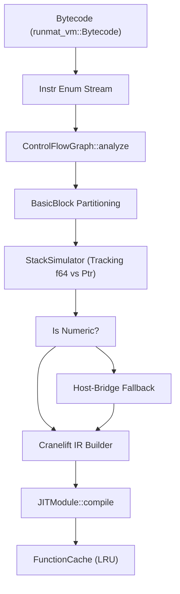
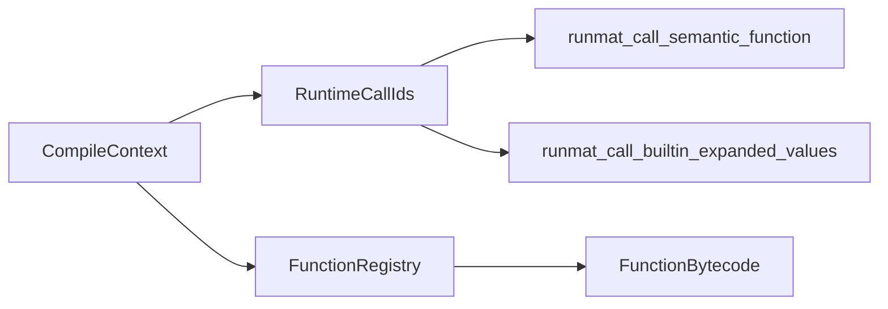

# JIT Compilation Pipeline

<details>
<summary>Relevant source files</summary>

- [crates/runmat-accelerate/tests/fusion_patterns.rs](https://github.com/runmat-org/runmat/blob/82685330/crates/runmat-accelerate/tests/fusion_patterns.rs)
- [crates/runmat-turbine/src/compiler.rs](https://github.com/runmat-org/runmat/blob/82685330/crates/runmat-turbine/src/compiler.rs)
- [crates/runmat-turbine/src/lib.rs](https://github.com/runmat-org/runmat/blob/82685330/crates/runmat-turbine/src/lib.rs)
- [crates/runmat-turbine/tests/integration.rs](https://github.com/runmat-org/runmat/blob/82685330/crates/runmat-turbine/tests/integration.rs)
- [crates/runmat-turbine/tests/jit.rs](https://github.com/runmat-org/runmat/blob/82685330/crates/runmat-turbine/tests/jit.rs)
- [crates/runmat-turbine/tests/performance.rs](https://github.com/runmat-org/runmat/blob/82685330/crates/runmat-turbine/tests/performance.rs)
- [crates/runmat-vm/src/bytecode/mod.rs](https://github.com/runmat-org/runmat/blob/82685330/crates/runmat-vm/src/bytecode/mod.rs)
- [crates/runmat-vm/src/bytecode/program.rs](https://github.com/runmat-org/runmat/blob/82685330/crates/runmat-vm/src/bytecode/program.rs)
- [crates/runmat-vm/src/interpreter/state.rs](https://github.com/runmat-org/runmat/blob/82685330/crates/runmat-vm/src/interpreter/state.rs)
- [crates/runmat-vm/src/lib.rs](https://github.com/runmat-org/runmat/blob/82685330/crates/runmat-vm/src/lib.rs)
- [crates/runmat-vm/tests/basics.rs](https://github.com/runmat-org/runmat/blob/82685330/crates/runmat-vm/tests/basics.rs)
- [crates/runmat-vm/tests/fusion_gpu.rs](https://github.com/runmat-org/runmat/blob/82685330/crates/runmat-vm/tests/fusion_gpu.rs)
- [crates/runmat-vm/tests/loops.rs](https://github.com/runmat-org/runmat/blob/82685330/crates/runmat-vm/tests/loops.rs)
- [crates/runmat-vm/tests/matrix_division.rs](https://github.com/runmat-org/runmat/blob/82685330/crates/runmat-vm/tests/matrix_division.rs)
- [crates/runmat-vm/tests/meshgrid_ranges.rs](https://github.com/runmat-org/runmat/blob/82685330/crates/runmat-vm/tests/meshgrid_ranges.rs)
- [crates/runmat-vm/tests/support/mod.rs](https://github.com/runmat-org/runmat/blob/82685330/crates/runmat-vm/tests/support/mod.rs)

</details>

The Turbine JIT is the optimizing tier of RunMat's tiered execution model. It translates hot bytecode sequences into native machine code using the Cranelift code generator. The pipeline focuses on providing high-performance fast-paths for numeric f64 arithmetic while maintaining seamless fallbacks to the VM's host-call infrastructure for complex MATLAB types like objects, cells, and strings.

## Pipeline Overview

The compilation process is triggered by the `TurbineEngine` when a function exceeds a "hotness" threshold tracked by the `HotspotProfiler` [crates/runmat-turbine/src/lib.rs #44](https://github.com/runmat-org/runmat/blob/82685330/crates/runmat-turbine/src/lib.rs#L44-L44) The pipeline consists of three primary phases: CFG analysis, stack simulation with Cranelift IR generation, and function finalization.

### Data Flow: Bytecode to Native Code

The following diagram illustrates the transformation from `runmat_vm::Bytecode` to a callable native function.

Turbine Compilation Flow



<details>
<summary>Rendered SVG</summary>

```svg
<svg id="mermaid-x76nerlfnh" xmlns="http://www.w3.org/2000/svg" xmlns:xlink="http://www.w3.org/1999/xlink" class="flowchart" style="max-width: 100%; touch-action: none; user-select: none; cursor: grab; min-height: fit-content; max-height: 100%;" viewBox="-246.25562120543407 0 945.1792111608681 1363.203125" role="graphics-document document" aria-roledescription="flowchart-v2" preserveAspectRatio="xMidYMid meet"><style>#mermaid-x76nerlfnh{font-family:ui-sans-serif,-apple-system,system-ui,Segoe UI,Helvetica;font-size:16px;fill:#ccc;}@keyframes edge-animation-frame{from{stroke-dashoffset:0;}}@keyframes dash{to{stroke-dashoffset:0;}}#mermaid-x76nerlfnh .edge-animation-slow{stroke-dasharray:9,5!important;stroke-dashoffset:900;animation:dash 50s linear infinite;stroke-linecap:round;}#mermaid-x76nerlfnh .edge-animation-fast{stroke-dasharray:9,5!important;stroke-dashoffset:900;animation:dash 20s linear infinite;stroke-linecap:round;}#mermaid-x76nerlfnh .error-icon{fill:#333;}#mermaid-x76nerlfnh .error-text{fill:#cccccc;stroke:#cccccc;}#mermaid-x76nerlfnh .edge-thickness-normal{stroke-width:1px;}#mermaid-x76nerlfnh .edge-thickness-thick{stroke-width:3.5px;}#mermaid-x76nerlfnh .edge-pattern-solid{stroke-dasharray:0;}#mermaid-x76nerlfnh .edge-thickness-invisible{stroke-width:0;fill:none;}#mermaid-x76nerlfnh .edge-pattern-dashed{stroke-dasharray:3;}#mermaid-x76nerlfnh .edge-pattern-dotted{stroke-dasharray:2;}#mermaid-x76nerlfnh .marker{fill:#666;stroke:#666;}#mermaid-x76nerlfnh .marker.cross{stroke:#666;}#mermaid-x76nerlfnh svg{font-family:ui-sans-serif,-apple-system,system-ui,Segoe UI,Helvetica;font-size:16px;}#mermaid-x76nerlfnh p{margin:0;}#mermaid-x76nerlfnh .label{font-family:ui-sans-serif,-apple-system,system-ui,Segoe UI,Helvetica;color:#fff;}#mermaid-x76nerlfnh .cluster-label text{fill:#fff;}#mermaid-x76nerlfnh .cluster-label span{color:#fff;}#mermaid-x76nerlfnh .cluster-label span p{background-color:transparent;}#mermaid-x76nerlfnh .label text,#mermaid-x76nerlfnh span{fill:#fff;color:#fff;}#mermaid-x76nerlfnh .node rect,#mermaid-x76nerlfnh .node circle,#mermaid-x76nerlfnh .node ellipse,#mermaid-x76nerlfnh .node polygon,#mermaid-x76nerlfnh .node path{fill:#111;stroke:#222;stroke-width:1px;}#mermaid-x76nerlfnh .rough-node .label text,#mermaid-x76nerlfnh .node .label text,#mermaid-x76nerlfnh .image-shape .label,#mermaid-x76nerlfnh .icon-shape .label{text-anchor:middle;}#mermaid-x76nerlfnh .node .katex path{fill:#000;stroke:#000;stroke-width:1px;}#mermaid-x76nerlfnh .rough-node .label,#mermaid-x76nerlfnh .node .label,#mermaid-x76nerlfnh .image-shape .label,#mermaid-x76nerlfnh .icon-shape .label{text-align:center;}#mermaid-x76nerlfnh .node.clickable{cursor:pointer;}#mermaid-x76nerlfnh .root .anchor path{fill:#666!important;stroke-width:0;stroke:#666;}#mermaid-x76nerlfnh .arrowheadPath{fill:#0b0b0b;}#mermaid-x76nerlfnh .edgePath .path{stroke:#666;stroke-width:1px;}#mermaid-x76nerlfnh .flowchart-link{stroke:#666;fill:none;}#mermaid-x76nerlfnh .edgeLabel{background-color:#161616;text-align:center;}#mermaid-x76nerlfnh .edgeLabel p{background-color:#161616;}#mermaid-x76nerlfnh .edgeLabel rect{opacity:0.5;background-color:#161616;fill:#161616;}#mermaid-x76nerlfnh .labelBkg{background-color:rgba(22, 22, 22, 0.5);}#mermaid-x76nerlfnh .cluster rect{fill:#161616;stroke:#222;stroke-width:1px;}#mermaid-x76nerlfnh .cluster text{fill:#fff;}#mermaid-x76nerlfnh .cluster span{color:#fff;}#mermaid-x76nerlfnh div.mermaidTooltip{position:absolute;text-align:center;max-width:200px;padding:2px;font-family:ui-sans-serif,-apple-system,system-ui,Segoe UI,Helvetica;font-size:12px;background:#333;border:1px solid hsl(0, 0%, 10%);border-radius:2px;pointer-events:none;z-index:100;}#mermaid-x76nerlfnh .flowchartTitleText{text-anchor:middle;font-size:18px;fill:#ccc;}#mermaid-x76nerlfnh rect.text{fill:none;stroke-width:0;}#mermaid-x76nerlfnh .icon-shape,#mermaid-x76nerlfnh .image-shape{background-color:#161616;text-align:center;}#mermaid-x76nerlfnh .icon-shape p,#mermaid-x76nerlfnh .image-shape p{background-color:#161616;padding:2px;}#mermaid-x76nerlfnh .icon-shape .label rect,#mermaid-x76nerlfnh .image-shape .label rect{opacity:0.5;background-color:#161616;fill:#161616;}#mermaid-x76nerlfnh .label-icon{display:inline-block;height:1em;overflow:visible;vertical-align:-0.125em;}#mermaid-x76nerlfnh .node .label-icon path{fill:currentColor;stroke:revert;stroke-width:revert;}#mermaid-x76nerlfnh .node .neo-node{stroke:#222;}#mermaid-x76nerlfnh [data-look="neo"].node rect,#mermaid-x76nerlfnh [data-look="neo"].cluster rect,#mermaid-x76nerlfnh [data-look="neo"].node polygon{stroke:url(#mermaid-x76nerlfnh-gradient);filter:drop-shadow( 1px 2px 2px rgba(185,185,185,1));}#mermaid-x76nerlfnh [data-look="neo"].node path{stroke:url(#mermaid-x76nerlfnh-gradient);stroke-width:1px;}#mermaid-x76nerlfnh [data-look="neo"].node .outer-path{filter:drop-shadow( 1px 2px 2px rgba(185,185,185,1));}#mermaid-x76nerlfnh [data-look="neo"].node .neo-line path{stroke:#222;filter:none;}#mermaid-x76nerlfnh [data-look="neo"].node circle{stroke:url(#mermaid-x76nerlfnh-gradient);filter:drop-shadow( 1px 2px 2px rgba(185,185,185,1));}#mermaid-x76nerlfnh [data-look="neo"].node circle .state-start{fill:#000000;}#mermaid-x76nerlfnh [data-look="neo"].icon-shape .icon{fill:url(#mermaid-x76nerlfnh-gradient);filter:drop-shadow( 1px 2px 2px rgba(185,185,185,1));}#mermaid-x76nerlfnh [data-look="neo"].icon-shape .icon-neo path{stroke:url(#mermaid-x76nerlfnh-gradient);filter:drop-shadow( 1px 2px 2px rgba(185,185,185,1));}#mermaid-x76nerlfnh :root{--mermaid-font-family:"trebuchet ms",verdana,arial,sans-serif;}</style><g><marker id="mermaid-x76nerlfnh_flowchart-v2-pointEnd" class="marker flowchart-v2" viewBox="0 0 10 10" refX="5" refY="5" markerUnits="userSpaceOnUse" markerWidth="8" markerHeight="8" orient="auto"><path d="M 0 0 L 10 5 L 0 10 z" class="arrowMarkerPath" style="stroke-width: 1; stroke-dasharray: 1, 0;"></path></marker><marker id="mermaid-x76nerlfnh_flowchart-v2-pointStart" class="marker flowchart-v2" viewBox="0 0 10 10" refX="4.5" refY="5" markerUnits="userSpaceOnUse" markerWidth="8" markerHeight="8" orient="auto"><path d="M 0 5 L 10 10 L 10 0 z" class="arrowMarkerPath" style="stroke-width: 1; stroke-dasharray: 1, 0;"></path></marker><marker id="mermaid-x76nerlfnh_flowchart-v2-pointEnd-margin" class="marker flowchart-v2" viewBox="0 0 11.5 14" refX="11.5" refY="7" markerUnits="userSpaceOnUse" markerWidth="10.5" markerHeight="14" orient="auto"><path d="M 0 0 L 11.5 7 L 0 14 z" class="arrowMarkerPath" style="stroke-width: 0; stroke-dasharray: 1, 0;"></path></marker><marker id="mermaid-x76nerlfnh_flowchart-v2-pointStart-margin" class="marker flowchart-v2" viewBox="0 0 11.5 14" refX="1" refY="7" markerUnits="userSpaceOnUse" markerWidth="11.5" markerHeight="14" orient="auto"><polygon points="0,7 11.5,14 11.5,0" class="arrowMarkerPath" style="stroke-width: 0; stroke-dasharray: 1, 0;"></polygon></marker><marker id="mermaid-x76nerlfnh_flowchart-v2-circleEnd" class="marker flowchart-v2" viewBox="0 0 10 10" refX="11" refY="5" markerUnits="userSpaceOnUse" markerWidth="11" markerHeight="11" orient="auto"><circle cx="5" cy="5" r="5" class="arrowMarkerPath" style="stroke-width: 1; stroke-dasharray: 1, 0;"></circle></marker><marker id="mermaid-x76nerlfnh_flowchart-v2-circleStart" class="marker flowchart-v2" viewBox="0 0 10 10" refX="-1" refY="5" markerUnits="userSpaceOnUse" markerWidth="11" markerHeight="11" orient="auto"><circle cx="5" cy="5" r="5" class="arrowMarkerPath" style="stroke-width: 1; stroke-dasharray: 1, 0;"></circle></marker><marker id="mermaid-x76nerlfnh_flowchart-v2-circleEnd-margin" class="marker flowchart-v2" viewBox="0 0 10 10" refY="5" refX="12.25" markerUnits="userSpaceOnUse" markerWidth="14" markerHeight="14" orient="auto"><circle cx="5" cy="5" r="5" class="arrowMarkerPath" style="stroke-width: 0; stroke-dasharray: 1, 0;"></circle></marker><marker id="mermaid-x76nerlfnh_flowchart-v2-circleStart-margin" class="marker flowchart-v2" viewBox="0 0 10 10" refX="-2" refY="5" markerUnits="userSpaceOnUse" markerWidth="14" markerHeight="14" orient="auto"><circle cx="5" cy="5" r="5" class="arrowMarkerPath" style="stroke-width: 0; stroke-dasharray: 1, 0;"></circle></marker><marker id="mermaid-x76nerlfnh_flowchart-v2-crossEnd" class="marker cross flowchart-v2" viewBox="0 0 11 11" refX="12" refY="5.2" markerUnits="userSpaceOnUse" markerWidth="11" markerHeight="11" orient="auto"><path d="M 1,1 l 9,9 M 10,1 l -9,9" class="arrowMarkerPath" style="stroke-width: 2; stroke-dasharray: 1, 0;"></path></marker><marker id="mermaid-x76nerlfnh_flowchart-v2-crossStart" class="marker cross flowchart-v2" viewBox="0 0 11 11" refX="-1" refY="5.2" markerUnits="userSpaceOnUse" markerWidth="11" markerHeight="11" orient="auto"><path d="M 1,1 l 9,9 M 10,1 l -9,9" class="arrowMarkerPath" style="stroke-width: 2; stroke-dasharray: 1, 0;"></path></marker><marker id="mermaid-x76nerlfnh_flowchart-v2-crossEnd-margin" class="marker cross flowchart-v2" viewBox="0 0 15 15" refX="17.7" refY="7.5" markerUnits="userSpaceOnUse" markerWidth="12" markerHeight="12" orient="auto"><path d="M 1,1 L 14,14 M 1,14 L 14,1" class="arrowMarkerPath" style="stroke-width: 2.5;"></path></marker><marker id="mermaid-x76nerlfnh_flowchart-v2-crossStart-margin" class="marker cross flowchart-v2" viewBox="0 0 15 15" refX="-3.5" refY="7.5" markerUnits="userSpaceOnUse" markerWidth="12" markerHeight="12" orient="auto"><path d="M 1,1 L 14,14 M 1,14 L 14,1" class="arrowMarkerPath" style="stroke-width: 2.5; stroke-dasharray: 1, 0;"></path></marker><g class="root"><g class="clusters"><g class="cluster" id="mermaid-x76nerlfnh-Finalization" data-look="classic"><rect style="" x="61.734375" y="1147.203125" width="285.40625" height="208"></rect><g class="cluster-label" transform="translate(163.671875, 1147.203125)"><foreignObject width="81.53125" height="24"><div style="display: table-cell; white-space: nowrap; line-height: 1.5;" xmlns="http://www.w3.org/1999/xhtml"><span class="nodeLabel"><p>Finalization</p></span></div></foreignObject></g></g><g class="cluster" id="mermaid-x76nerlfnh-subGraph2" data-look="classic"><rect style="" x="8" y="548" width="436.66796875" height="549.203125"></rect><g class="cluster-label" transform="translate(169.935546875, 548)"><foreignObject width="112.796875" height="24"><div style="display: table-cell; white-space: nowrap; line-height: 1.5;" xmlns="http://www.w3.org/1999/xhtml"><span class="nodeLabel"><p>Emission Phase</p></span></div></foreignObject></g></g><g class="cluster" id="mermaid-x76nerlfnh-subGraph1" data-look="classic"><rect style="" x="41.8671875" y="290" width="325.140625" height="208"></rect><g class="cluster-label" transform="translate(150.3359375, 290)"><foreignObject width="108.203125" height="24"><div style="display: table-cell; white-space: nowrap; line-height: 1.5;" xmlns="http://www.w3.org/1999/xhtml"><span class="nodeLabel"><p>Analysis Phase</p></span></div></foreignObject></g></g><g class="cluster" id="mermaid-x76nerlfnh-subGraph0" data-look="classic"><rect style="" x="39.4375" y="8" width="330" height="232"></rect><g class="cluster-label" transform="translate(161.1953125, 8)"><foreignObject width="86.484375" height="24"><div style="display: table-cell; white-space: nowrap; line-height: 1.5;" xmlns="http://www.w3.org/1999/xhtml"><span class="nodeLabel"><p>Input Space</p></span></div></foreignObject></g></g></g><g class="edgePaths"><path d="M204.438,111L204.438,115.167C204.438,119.333,204.438,127.667,204.438,135.333C204.438,143,204.438,150,204.438,153.5L204.438,157" id="mermaid-x76nerlfnh-L_BC_Instrs_0" class="edge-thickness-normal edge-pattern-solid edge-thickness-normal edge-pattern-solid flowchart-link" style=";" data-edge="true" data-et="edge" data-id="L_BC_Instrs_0" data-points="W3sieCI6MjA0LjQzNzUsInkiOjExMX0seyJ4IjoyMDQuNDM3NSwieSI6MTM2fSx7IngiOjIwNC40Mzc1LCJ5IjoxNjF9XQ==" data-look="classic" marker-end="url(#mermaid-x76nerlfnh_flowchart-v2-pointEnd)"></path><path d="M204.438,215L204.438,219.167C204.438,223.333,204.438,231.667,204.438,240C204.438,248.333,204.438,256.667,204.438,265C204.438,273.333,204.438,281.667,204.438,289.333C204.438,297,204.438,304,204.438,307.5L204.438,311" id="mermaid-x76nerlfnh-L_Instrs_CFG_0" class="edge-thickness-normal edge-pattern-solid edge-thickness-normal edge-pattern-solid flowchart-link" style=";" data-edge="true" data-et="edge" data-id="L_Instrs_CFG_0" data-points="W3sieCI6MjA0LjQzNzUsInkiOjIxNX0seyJ4IjoyMDQuNDM3NSwieSI6MjQwfSx7IngiOjIwNC40Mzc1LCJ5IjoyNjV9LHsieCI6MjA0LjQzNzUsInkiOjI5MH0seyJ4IjoyMDQuNDM3NSwieSI6MzE1fV0=" data-look="classic" marker-end="url(#mermaid-x76nerlfnh_flowchart-v2-pointEnd)"></path><path d="M204.438,369L204.438,373.167C204.438,377.333,204.438,385.667,204.438,393.333C204.438,401,204.438,408,204.438,411.5L204.438,415" id="mermaid-x76nerlfnh-L_CFG_BB_0" class="edge-thickness-normal edge-pattern-solid edge-thickness-normal edge-pattern-solid flowchart-link" style=";" data-edge="true" data-et="edge" data-id="L_CFG_BB_0" data-points="W3sieCI6MjA0LjQzNzUsInkiOjM2OX0seyJ4IjoyMDQuNDM3NSwieSI6Mzk0fSx7IngiOjIwNC40Mzc1LCJ5Ijo0MTl9XQ==" data-look="classic" marker-end="url(#mermaid-x76nerlfnh_flowchart-v2-pointEnd)"></path><path d="M204.438,473L204.438,477.167C204.438,481.333,204.438,489.667,204.438,498C204.438,506.333,204.438,514.667,204.438,523C204.438,531.333,204.438,539.667,204.438,547.333C204.438,555,204.438,562,204.438,565.5L204.438,569" id="mermaid-x76nerlfnh-L_BB_SS_0" class="edge-thickness-normal edge-pattern-solid edge-thickness-normal edge-pattern-solid flowchart-link" style=";" data-edge="true" data-et="edge" data-id="L_BB_SS_0" data-points="W3sieCI6MjA0LjQzNzUsInkiOjQ3M30seyJ4IjoyMDQuNDM3NSwieSI6NDk4fSx7IngiOjIwNC40Mzc1LCJ5Ijo1MjN9LHsieCI6MjA0LjQzNzUsInkiOjU0OH0seyJ4IjoyMDQuNDM3NSwieSI6NTczfV0=" data-look="classic" marker-end="url(#mermaid-x76nerlfnh_flowchart-v2-pointEnd)"></path><path d="M204.438,651L204.438,655.167C204.438,659.333,204.438,667.667,204.438,675.333C204.438,683,204.438,690,204.438,693.5L204.438,697" id="mermaid-x76nerlfnh-L_SS_FastPath_0" class="edge-thickness-normal edge-pattern-solid edge-thickness-normal edge-pattern-solid flowchart-link" style=";" data-edge="true" data-et="edge" data-id="L_SS_FastPath_0" data-points="W3sieCI6MjA0LjQzNzUsInkiOjY1MX0seyJ4IjoyMDQuNDM3NSwieSI6Njc2fSx7IngiOjIwNC40Mzc1LCJ5Ijo3MDF9XQ==" data-look="classic" marker-end="url(#mermaid-x76nerlfnh_flowchart-v2-pointEnd)"></path><path d="M173.116,808.882L163.799,820.269C154.482,831.656,135.849,854.429,126.532,876.483C117.215,898.536,117.215,919.87,117.215,939.203C117.215,958.536,117.215,975.87,123.631,988.362C130.048,1000.854,142.88,1008.504,149.297,1012.33L155.713,1016.155" id="mermaid-x76nerlfnh-L_FastPath_Cranelift_0" class="edge-thickness-normal edge-pattern-solid edge-thickness-normal edge-pattern-solid flowchart-link" style=";" data-edge="true" data-et="edge" data-id="L_FastPath_Cranelift_0" data-points="W3sieCI6MTczLjExNjE2NTY1MTAxMDcsInkiOjgwOC44ODE3OTA2NTEwMTA2fSx7IngiOjExNy4yMTQ4NDM3NSwieSI6ODc3LjIwMzEyNX0seyJ4IjoxMTcuMjE0ODQzNzUsInkiOjk0MS4yMDMxMjV9LHsieCI6MTE3LjIxNDg0Mzc1LCJ5Ijo5OTMuMjAzMTI1fSx7IngiOjE1OS4xNDg4MTMxMDA5NjE1NSwieSI6MTAxOC4yMDMxMjV9XQ==" data-look="classic" marker-end="url(#mermaid-x76nerlfnh_flowchart-v2-pointEnd)"></path><path d="M235.759,808.882L245.076,820.269C254.393,831.656,273.026,854.429,282.343,871.316C291.66,888.203,291.66,899.203,291.66,904.703L291.66,910.203" id="mermaid-x76nerlfnh-L_FastPath_HostCall_0" class="edge-thickness-normal edge-pattern-solid edge-thickness-normal edge-pattern-solid flowchart-link" style=";" data-edge="true" data-et="edge" data-id="L_FastPath_HostCall_0" data-points="W3sieCI6MjM1Ljc1ODgzNDM0ODk4OTMsInkiOjgwOC44ODE3OTA2NTEwMTA2fSx7IngiOjI5MS42NjAxNTYyNSwieSI6ODc3LjIwMzEyNX0seyJ4IjoyOTEuNjYwMTU2MjUsInkiOjkxNC4yMDMxMjV9XQ==" data-look="classic" marker-end="url(#mermaid-x76nerlfnh_flowchart-v2-pointEnd)"></path><path d="M291.66,968.203L291.66,972.37C291.66,976.536,291.66,984.87,285.244,992.862C278.827,1000.854,265.995,1008.504,259.578,1012.33L253.162,1016.155" id="mermaid-x76nerlfnh-L_HostCall_Cranelift_0" class="edge-thickness-normal edge-pattern-solid edge-thickness-normal edge-pattern-solid flowchart-link" style=";" data-edge="true" data-et="edge" data-id="L_HostCall_Cranelift_0" data-points="W3sieCI6MjkxLjY2MDE1NjI1LCJ5Ijo5NjguMjAzMTI1fSx7IngiOjI5MS42NjAxNTYyNSwieSI6OTkzLjIwMzEyNX0seyJ4IjoyNDkuNzI2MTg2ODk5MDM4NDUsInkiOjEwMTguMjAzMTI1fV0=" data-look="classic" marker-end="url(#mermaid-x76nerlfnh_flowchart-v2-pointEnd)"></path><path d="M204.438,1072.203L204.438,1076.37C204.438,1080.536,204.438,1088.87,204.438,1097.203C204.438,1105.536,204.438,1113.87,204.438,1122.203C204.438,1130.536,204.438,1138.87,204.438,1146.536C204.438,1154.203,204.438,1161.203,204.438,1164.703L204.438,1168.203" id="mermaid-x76nerlfnh-L_Cranelift_JIT_0" class="edge-thickness-normal edge-pattern-solid edge-thickness-normal edge-pattern-solid flowchart-link" style=";" data-edge="true" data-et="edge" data-id="L_Cranelift_JIT_0" data-points="W3sieCI6MjA0LjQzNzUsInkiOjEwNzIuMjAzMTI1fSx7IngiOjIwNC40Mzc1LCJ5IjoxMDk3LjIwMzEyNX0seyJ4IjoyMDQuNDM3NSwieSI6MTEyMi4yMDMxMjV9LHsieCI6MjA0LjQzNzUsInkiOjExNDcuMjAzMTI1fSx7IngiOjIwNC40Mzc1LCJ5IjoxMTcyLjIwMzEyNX1d" data-look="classic" marker-end="url(#mermaid-x76nerlfnh_flowchart-v2-pointEnd)"></path><path d="M204.438,1226.203L204.438,1230.37C204.438,1234.536,204.438,1242.87,204.438,1250.536C204.438,1258.203,204.438,1265.203,204.438,1268.703L204.438,1272.203" id="mermaid-x76nerlfnh-L_JIT_Cache_0" class="edge-thickness-normal edge-pattern-solid edge-thickness-normal edge-pattern-solid flowchart-link" style=";" data-edge="true" data-et="edge" data-id="L_JIT_Cache_0" data-points="W3sieCI6MjA0LjQzNzUsInkiOjEyMjYuMjAzMTI1fSx7IngiOjIwNC40Mzc1LCJ5IjoxMjUxLjIwMzEyNX0seyJ4IjoyMDQuNDM3NSwieSI6MTI3Ni4yMDMxMjV9XQ==" data-look="classic" marker-end="url(#mermaid-x76nerlfnh_flowchart-v2-pointEnd)"></path></g><g class="edgeLabels"><g class="edgeLabel"><g class="label" data-id="L_BC_Instrs_0" transform="translate(0, 0)"><foreignObject width="0" height="0"><div style="display: table-cell; white-space: nowrap; line-height: 1.5; max-width: 200px; text-align: center;" xmlns="http://www.w3.org/1999/xhtml" class="labelBkg"><span class="edgeLabel"></span></div></foreignObject></g></g><g class="edgeLabel"><g class="label" data-id="L_Instrs_CFG_0" transform="translate(0, 0)"><foreignObject width="0" height="0"><div style="display: table-cell; white-space: nowrap; line-height: 1.5; max-width: 200px; text-align: center;" xmlns="http://www.w3.org/1999/xhtml" class="labelBkg"><span class="edgeLabel"></span></div></foreignObject></g></g><g class="edgeLabel"><g class="label" data-id="L_CFG_BB_0" transform="translate(0, 0)"><foreignObject width="0" height="0"><div style="display: table-cell; white-space: nowrap; line-height: 1.5; max-width: 200px; text-align: center;" xmlns="http://www.w3.org/1999/xhtml" class="labelBkg"><span class="edgeLabel"></span></div></foreignObject></g></g><g class="edgeLabel"><g class="label" data-id="L_BB_SS_0" transform="translate(0, 0)"><foreignObject width="0" height="0"><div style="display: table-cell; white-space: nowrap; line-height: 1.5; max-width: 200px; text-align: center;" xmlns="http://www.w3.org/1999/xhtml" class="labelBkg"><span class="edgeLabel"></span></div></foreignObject></g></g><g class="edgeLabel"><g class="label" data-id="L_SS_FastPath_0" transform="translate(0, 0)"><foreignObject width="0" height="0"><div style="display: table-cell; white-space: nowrap; line-height: 1.5; max-width: 200px; text-align: center;" xmlns="http://www.w3.org/1999/xhtml" class="labelBkg"><span class="edgeLabel"></span></div></foreignObject></g></g><g class="edgeLabel" transform="translate(117.21484375, 941.203125)"><g class="label" data-id="L_FastPath_Cranelift_0" transform="translate(-33.4296875, -12)"><foreignObject width="66.859375" height="24"><div style="display: table-cell; white-space: nowrap; line-height: 1.5; max-width: 200px; text-align: center;" xmlns="http://www.w3.org/1999/xhtml" class="labelBkg"><span class="edgeLabel"><p>Yes (f64)</p></span></div></foreignObject></g></g><g class="edgeLabel" transform="translate(291.66015625, 877.203125)"><g class="label" data-id="L_FastPath_HostCall_0" transform="translate(-10.3515625, -12)"><foreignObject width="20.703125" height="24"><div style="display: table-cell; white-space: nowrap; line-height: 1.5; max-width: 200px; text-align: center;" xmlns="http://www.w3.org/1999/xhtml" class="labelBkg"><span class="edgeLabel"><p>No</p></span></div></foreignObject></g></g><g class="edgeLabel"><g class="label" data-id="L_HostCall_Cranelift_0" transform="translate(0, 0)"><foreignObject width="0" height="0"><div style="display: table-cell; white-space: nowrap; line-height: 1.5; max-width: 200px; text-align: center;" xmlns="http://www.w3.org/1999/xhtml" class="labelBkg"><span class="edgeLabel"></span></div></foreignObject></g></g><g class="edgeLabel"><g class="label" data-id="L_Cranelift_JIT_0" transform="translate(0, 0)"><foreignObject width="0" height="0"><div style="display: table-cell; white-space: nowrap; line-height: 1.5; max-width: 200px; text-align: center;" xmlns="http://www.w3.org/1999/xhtml" class="labelBkg"><span class="edgeLabel"></span></div></foreignObject></g></g><g class="edgeLabel"><g class="label" data-id="L_JIT_Cache_0" transform="translate(0, 0)"><foreignObject width="0" height="0"><div style="display: table-cell; white-space: nowrap; line-height: 1.5; max-width: 200px; text-align: center;" xmlns="http://www.w3.org/1999/xhtml" class="labelBkg"><span class="edgeLabel"></span></div></foreignObject></g></g></g><g class="nodes"><g class="node default" id="mermaid-x76nerlfnh-flowchart-BC-0" data-look="classic" transform="translate(204.4375, 72)"><rect class="basic label-container" style="" x="-130" y="-39" width="260" height="78"></rect><g class="label" style="" transform="translate(-100, -24)"><rect></rect><foreignObject width="200" height="48"><div style="display: table; white-space: break-spaces; line-height: 1.5; max-width: 200px; text-align: center; width: 200px;" xmlns="http://www.w3.org/1999/xhtml"><span class="nodeLabel"><p>Bytecode (runmat_vm::Bytecode)</p></span></div></foreignObject></g></g><g class="node default" id="mermaid-x76nerlfnh-flowchart-Instrs-1" data-look="classic" transform="translate(204.4375, 188)"><rect class="basic label-container" style="" x="-96.6953125" y="-27" width="193.390625" height="54"></rect><g class="label" style="" transform="translate(-66.6953125, -12)"><rect></rect><foreignObject width="133.390625" height="24"><div style="display: table-cell; white-space: nowrap; line-height: 1.5; max-width: 200px; text-align: center;" xmlns="http://www.w3.org/1999/xhtml"><span class="nodeLabel"><p>Instr Enum Stream</p></span></div></foreignObject></g></g><g class="node default" id="mermaid-x76nerlfnh-flowchart-CFG-2" data-look="classic" transform="translate(204.4375, 342)"><rect class="basic label-container" style="" x="-127.5703125" y="-27" width="255.140625" height="54"></rect><g class="label" style="" transform="translate(-97.5703125, -12)"><rect></rect><foreignObject width="195.140625" height="24"><div style="display: table-cell; white-space: nowrap; line-height: 1.5; max-width: 200px; text-align: center;" xmlns="http://www.w3.org/1999/xhtml"><span class="nodeLabel"><p>ControlFlowGraph::analyze</p></span></div></foreignObject></g></g><g class="node default" id="mermaid-x76nerlfnh-flowchart-BB-3" data-look="classic" transform="translate(204.4375, 446)"><rect class="basic label-container" style="" x="-112.9453125" y="-27" width="225.890625" height="54"></rect><g class="label" style="" transform="translate(-82.9453125, -12)"><rect></rect><foreignObject width="165.890625" height="24"><div style="display: table-cell; white-space: nowrap; line-height: 1.5; max-width: 200px; text-align: center;" xmlns="http://www.w3.org/1999/xhtml"><span class="nodeLabel"><p>BasicBlock Partitioning</p></span></div></foreignObject></g></g><g class="node default" id="mermaid-x76nerlfnh-flowchart-SS-4" data-look="classic" transform="translate(204.4375, 612)"><rect class="basic label-container" style="" x="-130" y="-39" width="260" height="78"></rect><g class="label" style="" transform="translate(-100, -24)"><rect></rect><foreignObject width="200" height="48"><div style="display: table; white-space: break-spaces; line-height: 1.5; max-width: 200px; text-align: center; width: 200px;" xmlns="http://www.w3.org/1999/xhtml"><span class="nodeLabel"><p>StackSimulator (Tracking f64 vs Ptr)</p></span></div></foreignObject></g></g><g class="node default" id="mermaid-x76nerlfnh-flowchart-Cranelift-5" data-look="classic" transform="translate(204.4375, 1045.203125)"><rect class="basic label-container" style="" x="-97.4296875" y="-27" width="194.859375" height="54"></rect><g class="label" style="" transform="translate(-67.4296875, -12)"><rect></rect><foreignObject width="134.859375" height="24"><div style="display: table-cell; white-space: nowrap; line-height: 1.5; max-width: 200px; text-align: center;" xmlns="http://www.w3.org/1999/xhtml"><span class="nodeLabel"><p>Cranelift IR Builder</p></span></div></foreignObject></g></g><g class="node default" id="mermaid-x76nerlfnh-flowchart-FastPath-6" data-look="classic" transform="translate(204.4375, 770.6015625)"><polygon points="69.6015625,0 139.203125,-69.6015625 69.6015625,-139.203125 0,-69.6015625" class="label-container" transform="translate(-69.1015625, 69.6015625)"></polygon><g class="label" style="" transform="translate(-42.6015625, -12)"><rect></rect><foreignObject width="85.203125" height="24"><div style="display: table-cell; white-space: nowrap; line-height: 1.5; max-width: 200px; text-align: center;" xmlns="http://www.w3.org/1999/xhtml"><span class="nodeLabel"><p>Is Numeric?</p></span></div></foreignObject></g></g><g class="node default" id="mermaid-x76nerlfnh-flowchart-HostCall-7" data-look="classic" transform="translate(291.66015625, 941.203125)"><rect class="basic label-container" style="" x="-106.015625" y="-27" width="212.03125" height="54"></rect><g class="label" style="" transform="translate(-76.015625, -12)"><rect></rect><foreignObject width="152.03125" height="24"><div style="display: table-cell; white-space: nowrap; line-height: 1.5; max-width: 200px; text-align: center;" xmlns="http://www.w3.org/1999/xhtml"><span class="nodeLabel"><p>Host-Bridge Fallback</p></span></div></foreignObject></g></g><g class="node default" id="mermaid-x76nerlfnh-flowchart-JIT-8" data-look="classic" transform="translate(204.4375, 1199.203125)"><rect class="basic label-container" style="" x="-100.96875" y="-27" width="201.9375" height="54"></rect><g class="label" style="" transform="translate(-70.96875, -12)"><rect></rect><foreignObject width="141.9375" height="24"><div style="display: table-cell; white-space: nowrap; line-height: 1.5; max-width: 200px; text-align: center;" xmlns="http://www.w3.org/1999/xhtml"><span class="nodeLabel"><p>JITModule::compile</p></span></div></foreignObject></g></g><g class="node default" id="mermaid-x76nerlfnh-flowchart-Cache-9" data-look="classic" transform="translate(204.4375, 1303.203125)"><rect class="basic label-container" style="" x="-107.703125" y="-27" width="215.40625" height="54"></rect><g class="label" style="" transform="translate(-77.703125, -12)"><rect></rect><foreignObject width="155.40625" height="24"><div style="display: table-cell; white-space: nowrap; line-height: 1.5; max-width: 200px; text-align: center;" xmlns="http://www.w3.org/1999/xhtml"><span class="nodeLabel"><p>FunctionCache (LRU)</p></span></div></foreignObject></g></g></g></g></g><defs><filter id="mermaid-x76nerlfnh-drop-shadow" height="130%" width="130%"><feDropShadow dx="4" dy="4" stdDeviation="0" flood-opacity="0.06" flood-color="#000000"></feDropShadow></filter></defs><defs><filter id="mermaid-x76nerlfnh-drop-shadow-small" height="150%" width="150%"><feDropShadow dx="2" dy="2" stdDeviation="0" flood-opacity="0.06" flood-color="#000000"></feDropShadow></filter></defs><linearGradient id="mermaid-x76nerlfnh-gradient" gradientUnits="objectBoundingBox" x1="0%" y1="0%" x2="100%" y2="0%"><stop offset="0%" stop-color="#333" stop-opacity="1"></stop><stop offset="100%" stop-color="hsl(-120, 0%, 3.3333333333%)" stop-opacity="1"></stop></linearGradient></svg>
```

</details>

Sources: [crates/runmat-turbine/src/compiler.rs #1-14](https://github.com/runmat-org/runmat/blob/82685330/crates/runmat-turbine/src/compiler.rs#L1-L14) [crates/runmat-turbine/src/lib.rs #1-5](https://github.com/runmat-org/runmat/blob/82685330/crates/runmat-turbine/src/lib.rs#L1-L5)

## Control Flow Graph (CFG) Analysis

Before generating IR, the `BytecodeCompiler` performs a static analysis of the instruction stream to identify basic block boundaries.

1. Block Identification: The `ControlFlowGraph::analyze` function scans for `Instr::Jump`, `Instr::JumpIfFalse`, and `Instr::Return` to determine entry points for new blocks [crates/runmat-turbine/src/compiler.rs #124-159](https://github.com/runmat-org/runmat/blob/82685330/crates/runmat-turbine/src/compiler.rs#L124-L159)
2. Successor Mapping: Blocks are linked by analyzing the target PCs of jump instructions, allowing Cranelift to reconstruct the MATLAB function's logic (e.g., `if/else`, `for` loops) [crates/runmat-turbine/src/compiler.rs #183-205](https://github.com/runmat-org/runmat/blob/82685330/crates/runmat-turbine/src/compiler.rs#L183-L205)
3. BasicBlock Struct: Each block stores its `start_pc`, `end_pc`, and the corresponding `cranelift::prelude::Block` handle [crates/runmat-turbine/src/compiler.rs #108-115](https://github.com/runmat-org/runmat/blob/82685330/crates/runmat-turbine/src/compiler.rs#L108-L115)

Sources: [crates/runmat-turbine/src/compiler.rs #108-205](https://github.com/runmat-org/runmat/blob/82685330/crates/runmat-turbine/src/compiler.rs#L108-L205)

## Stack Simulation & IR Generation

Turbine uses a `StackSimulator` to bridge the gap between the VM's stack-based architecture and Cranelift's register-based IR.

### The StackSimulator

The simulator tracks `StackEntry` objects, which contain both a numeric `Value` (f64) and an optional `value_ptr` [crates/runmat-turbine/src/compiler.rs #49-53](https://github.com/runmat-org/runmat/blob/82685330/crates/runmat-turbine/src/compiler.rs#L49-L53)

- Fast-Path: If an operation involves pure f64 math, the simulator only tracks the `num` field, allowing the JIT to emit direct CPU floating-point instructions.
- Slow-Path: If a value is a non-numeric type (e.g., a MATLAB `struct` or `cell`), the `value_ptr` preserves the address of the full `TurbineValue` slot so it can be passed back to host callbacks [crates/runmat-turbine/src/compiler.rs #63-69](https://github.com/runmat-org/runmat/blob/82685330/crates/runmat-turbine/src/compiler.rs#L63-L69)

### IR Emission Logic

The compiler iterates through instructions, popping entries from the `StackSimulator` and emitting Cranelift IR:

| Instruction Category | Implementation Strategy |
| --- | --- |
| Arithmetic | Emits native instructions (e.g., fadd, fmul) if operands are numeric crates/runmat-vm/tests/basics.rs#17-24 |
| Control Flow | Maps Instr::Jump to builder.ins().jump(target_block) crates/runmat-turbine/src/compiler.rs#137-143 |
| Built-in Calls | Emits a call to host-bridge functions like runmat_call_builtin_expanded_values crates/runmat-turbine/src/compiler.rs#25-38 |
| Variable Access | LoadVar and StoreVar map to pointer offsets from the vars_ptr provided in the CompileContext crates/runmat-turbine/src/compiler.rs#16-17 |

Sources: [crates/runmat-turbine/src/compiler.rs #49-105](https://github.com/runmat-org/runmat/blob/82685330/crates/runmat-turbine/src/compiler.rs#L49-L105) [crates/runmat-vm/src/bytecode/instr.rs #5-10](https://github.com/runmat-org/runmat/blob/82685330/crates/runmat-vm/src/bytecode/instr.rs#L5-L10)

## Host-Call Fallbacks

Turbine cannot compile every MATLAB builtin (e.g., complex matrix division `\` or `mldivide` remains on the interpreter path) [crates/runmat-turbine/tests/integration.rs #172-181](https://github.com/runmat-org/runmat/blob/82685330/crates/runmat-turbine/tests/integration.rs#L172-L181) When the compiler encounters a complex operation, it generates a "Host Bridge" call.

Key host-call identifiers used in the IR:

- `runmat_call_semantic_function`: Standard function dispatch [crates/runmat-turbine/src/lib.rs #106-118](https://github.com/runmat-org/runmat/blob/82685330/crates/runmat-turbine/src/lib.rs#L106-L118)
- `runmat_call_builtin_expanded_values`: Direct execution of optimized C++/Rust builtins [crates/runmat-turbine/src/compiler.rs #36](https://github.com/runmat-org/runmat/blob/82685330/crates/runmat-turbine/src/compiler.rs#L36-L36)
- `runmat_call_feval_expanded_values`: MATLAB `feval` protocol support [crates/runmat-turbine/src/compiler.rs #24](https://github.com/runmat-org/runmat/blob/82685330/crates/runmat-turbine/src/compiler.rs#L24-L24)

Code Entity Mapping: JIT Context to Runtime Symbols



<details>
<summary>Rendered SVG</summary>

```svg
<svg id="mermaid-ysr071c27s" xmlns="http://www.w3.org/2000/svg" xmlns:xlink="http://www.w3.org/1999/xlink" class="flowchart" style="max-width: 100%; touch-action: none; user-select: none; cursor: grab; min-height: fit-content; max-height: 100%;" viewBox="-0.0180947580645352 0 1083.458064516129 410" role="graphics-document document" aria-roledescription="flowchart-v2" preserveAspectRatio="xMidYMid meet"><style>#mermaid-ysr071c27s{font-family:ui-sans-serif,-apple-system,system-ui,Segoe UI,Helvetica;font-size:16px;fill:#ccc;}@keyframes edge-animation-frame{from{stroke-dashoffset:0;}}@keyframes dash{to{stroke-dashoffset:0;}}#mermaid-ysr071c27s .edge-animation-slow{stroke-dasharray:9,5!important;stroke-dashoffset:900;animation:dash 50s linear infinite;stroke-linecap:round;}#mermaid-ysr071c27s .edge-animation-fast{stroke-dasharray:9,5!important;stroke-dashoffset:900;animation:dash 20s linear infinite;stroke-linecap:round;}#mermaid-ysr071c27s .error-icon{fill:#333;}#mermaid-ysr071c27s .error-text{fill:#cccccc;stroke:#cccccc;}#mermaid-ysr071c27s .edge-thickness-normal{stroke-width:1px;}#mermaid-ysr071c27s .edge-thickness-thick{stroke-width:3.5px;}#mermaid-ysr071c27s .edge-pattern-solid{stroke-dasharray:0;}#mermaid-ysr071c27s .edge-thickness-invisible{stroke-width:0;fill:none;}#mermaid-ysr071c27s .edge-pattern-dashed{stroke-dasharray:3;}#mermaid-ysr071c27s .edge-pattern-dotted{stroke-dasharray:2;}#mermaid-ysr071c27s .marker{fill:#666;stroke:#666;}#mermaid-ysr071c27s .marker.cross{stroke:#666;}#mermaid-ysr071c27s svg{font-family:ui-sans-serif,-apple-system,system-ui,Segoe UI,Helvetica;font-size:16px;}#mermaid-ysr071c27s p{margin:0;}#mermaid-ysr071c27s .label{font-family:ui-sans-serif,-apple-system,system-ui,Segoe UI,Helvetica;color:#fff;}#mermaid-ysr071c27s .cluster-label text{fill:#fff;}#mermaid-ysr071c27s .cluster-label span{color:#fff;}#mermaid-ysr071c27s .cluster-label span p{background-color:transparent;}#mermaid-ysr071c27s .label text,#mermaid-ysr071c27s span{fill:#fff;color:#fff;}#mermaid-ysr071c27s .node rect,#mermaid-ysr071c27s .node circle,#mermaid-ysr071c27s .node ellipse,#mermaid-ysr071c27s .node polygon,#mermaid-ysr071c27s .node path{fill:#111;stroke:#222;stroke-width:1px;}#mermaid-ysr071c27s .rough-node .label text,#mermaid-ysr071c27s .node .label text,#mermaid-ysr071c27s .image-shape .label,#mermaid-ysr071c27s .icon-shape .label{text-anchor:middle;}#mermaid-ysr071c27s .node .katex path{fill:#000;stroke:#000;stroke-width:1px;}#mermaid-ysr071c27s .rough-node .label,#mermaid-ysr071c27s .node .label,#mermaid-ysr071c27s .image-shape .label,#mermaid-ysr071c27s .icon-shape .label{text-align:center;}#mermaid-ysr071c27s .node.clickable{cursor:pointer;}#mermaid-ysr071c27s .root .anchor path{fill:#666!important;stroke-width:0;stroke:#666;}#mermaid-ysr071c27s .arrowheadPath{fill:#0b0b0b;}#mermaid-ysr071c27s .edgePath .path{stroke:#666;stroke-width:1px;}#mermaid-ysr071c27s .flowchart-link{stroke:#666;fill:none;}#mermaid-ysr071c27s .edgeLabel{background-color:#161616;text-align:center;}#mermaid-ysr071c27s .edgeLabel p{background-color:#161616;}#mermaid-ysr071c27s .edgeLabel rect{opacity:0.5;background-color:#161616;fill:#161616;}#mermaid-ysr071c27s .labelBkg{background-color:rgba(22, 22, 22, 0.5);}#mermaid-ysr071c27s .cluster rect{fill:#161616;stroke:#222;stroke-width:1px;}#mermaid-ysr071c27s .cluster text{fill:#fff;}#mermaid-ysr071c27s .cluster span{color:#fff;}#mermaid-ysr071c27s div.mermaidTooltip{position:absolute;text-align:center;max-width:200px;padding:2px;font-family:ui-sans-serif,-apple-system,system-ui,Segoe UI,Helvetica;font-size:12px;background:#333;border:1px solid hsl(0, 0%, 10%);border-radius:2px;pointer-events:none;z-index:100;}#mermaid-ysr071c27s .flowchartTitleText{text-anchor:middle;font-size:18px;fill:#ccc;}#mermaid-ysr071c27s rect.text{fill:none;stroke-width:0;}#mermaid-ysr071c27s .icon-shape,#mermaid-ysr071c27s .image-shape{background-color:#161616;text-align:center;}#mermaid-ysr071c27s .icon-shape p,#mermaid-ysr071c27s .image-shape p{background-color:#161616;padding:2px;}#mermaid-ysr071c27s .icon-shape .label rect,#mermaid-ysr071c27s .image-shape .label rect{opacity:0.5;background-color:#161616;fill:#161616;}#mermaid-ysr071c27s .label-icon{display:inline-block;height:1em;overflow:visible;vertical-align:-0.125em;}#mermaid-ysr071c27s .node .label-icon path{fill:currentColor;stroke:revert;stroke-width:revert;}#mermaid-ysr071c27s .node .neo-node{stroke:#222;}#mermaid-ysr071c27s [data-look="neo"].node rect,#mermaid-ysr071c27s [data-look="neo"].cluster rect,#mermaid-ysr071c27s [data-look="neo"].node polygon{stroke:url(#mermaid-ysr071c27s-gradient);filter:drop-shadow( 1px 2px 2px rgba(185,185,185,1));}#mermaid-ysr071c27s [data-look="neo"].node path{stroke:url(#mermaid-ysr071c27s-gradient);stroke-width:1px;}#mermaid-ysr071c27s [data-look="neo"].node .outer-path{filter:drop-shadow( 1px 2px 2px rgba(185,185,185,1));}#mermaid-ysr071c27s [data-look="neo"].node .neo-line path{stroke:#222;filter:none;}#mermaid-ysr071c27s [data-look="neo"].node circle{stroke:url(#mermaid-ysr071c27s-gradient);filter:drop-shadow( 1px 2px 2px rgba(185,185,185,1));}#mermaid-ysr071c27s [data-look="neo"].node circle .state-start{fill:#000000;}#mermaid-ysr071c27s [data-look="neo"].icon-shape .icon{fill:url(#mermaid-ysr071c27s-gradient);filter:drop-shadow( 1px 2px 2px rgba(185,185,185,1));}#mermaid-ysr071c27s [data-look="neo"].icon-shape .icon-neo path{stroke:url(#mermaid-ysr071c27s-gradient);filter:drop-shadow( 1px 2px 2px rgba(185,185,185,1));}#mermaid-ysr071c27s :root{--mermaid-font-family:"trebuchet ms",verdana,arial,sans-serif;}</style><g><marker id="mermaid-ysr071c27s_flowchart-v2-pointEnd" class="marker flowchart-v2" viewBox="0 0 10 10" refX="5" refY="5" markerUnits="userSpaceOnUse" markerWidth="8" markerHeight="8" orient="auto"><path d="M 0 0 L 10 5 L 0 10 z" class="arrowMarkerPath" style="stroke-width: 1; stroke-dasharray: 1, 0;"></path></marker><marker id="mermaid-ysr071c27s_flowchart-v2-pointStart" class="marker flowchart-v2" viewBox="0 0 10 10" refX="4.5" refY="5" markerUnits="userSpaceOnUse" markerWidth="8" markerHeight="8" orient="auto"><path d="M 0 5 L 10 10 L 10 0 z" class="arrowMarkerPath" style="stroke-width: 1; stroke-dasharray: 1, 0;"></path></marker><marker id="mermaid-ysr071c27s_flowchart-v2-pointEnd-margin" class="marker flowchart-v2" viewBox="0 0 11.5 14" refX="11.5" refY="7" markerUnits="userSpaceOnUse" markerWidth="10.5" markerHeight="14" orient="auto"><path d="M 0 0 L 11.5 7 L 0 14 z" class="arrowMarkerPath" style="stroke-width: 0; stroke-dasharray: 1, 0;"></path></marker><marker id="mermaid-ysr071c27s_flowchart-v2-pointStart-margin" class="marker flowchart-v2" viewBox="0 0 11.5 14" refX="1" refY="7" markerUnits="userSpaceOnUse" markerWidth="11.5" markerHeight="14" orient="auto"><polygon points="0,7 11.5,14 11.5,0" class="arrowMarkerPath" style="stroke-width: 0; stroke-dasharray: 1, 0;"></polygon></marker><marker id="mermaid-ysr071c27s_flowchart-v2-circleEnd" class="marker flowchart-v2" viewBox="0 0 10 10" refX="11" refY="5" markerUnits="userSpaceOnUse" markerWidth="11" markerHeight="11" orient="auto"><circle cx="5" cy="5" r="5" class="arrowMarkerPath" style="stroke-width: 1; stroke-dasharray: 1, 0;"></circle></marker><marker id="mermaid-ysr071c27s_flowchart-v2-circleStart" class="marker flowchart-v2" viewBox="0 0 10 10" refX="-1" refY="5" markerUnits="userSpaceOnUse" markerWidth="11" markerHeight="11" orient="auto"><circle cx="5" cy="5" r="5" class="arrowMarkerPath" style="stroke-width: 1; stroke-dasharray: 1, 0;"></circle></marker><marker id="mermaid-ysr071c27s_flowchart-v2-circleEnd-margin" class="marker flowchart-v2" viewBox="0 0 10 10" refY="5" refX="12.25" markerUnits="userSpaceOnUse" markerWidth="14" markerHeight="14" orient="auto"><circle cx="5" cy="5" r="5" class="arrowMarkerPath" style="stroke-width: 0; stroke-dasharray: 1, 0;"></circle></marker><marker id="mermaid-ysr071c27s_flowchart-v2-circleStart-margin" class="marker flowchart-v2" viewBox="0 0 10 10" refX="-2" refY="5" markerUnits="userSpaceOnUse" markerWidth="14" markerHeight="14" orient="auto"><circle cx="5" cy="5" r="5" class="arrowMarkerPath" style="stroke-width: 0; stroke-dasharray: 1, 0;"></circle></marker><marker id="mermaid-ysr071c27s_flowchart-v2-crossEnd" class="marker cross flowchart-v2" viewBox="0 0 11 11" refX="12" refY="5.2" markerUnits="userSpaceOnUse" markerWidth="11" markerHeight="11" orient="auto"><path d="M 1,1 l 9,9 M 10,1 l -9,9" class="arrowMarkerPath" style="stroke-width: 2; stroke-dasharray: 1, 0;"></path></marker><marker id="mermaid-ysr071c27s_flowchart-v2-crossStart" class="marker cross flowchart-v2" viewBox="0 0 11 11" refX="-1" refY="5.2" markerUnits="userSpaceOnUse" markerWidth="11" markerHeight="11" orient="auto"><path d="M 1,1 l 9,9 M 10,1 l -9,9" class="arrowMarkerPath" style="stroke-width: 2; stroke-dasharray: 1, 0;"></path></marker><marker id="mermaid-ysr071c27s_flowchart-v2-crossEnd-margin" class="marker cross flowchart-v2" viewBox="0 0 15 15" refX="17.7" refY="7.5" markerUnits="userSpaceOnUse" markerWidth="12" markerHeight="12" orient="auto"><path d="M 1,1 L 14,14 M 1,14 L 14,1" class="arrowMarkerPath" style="stroke-width: 2.5;"></path></marker><marker id="mermaid-ysr071c27s_flowchart-v2-crossStart-margin" class="marker cross flowchart-v2" viewBox="0 0 15 15" refX="-3.5" refY="7.5" markerUnits="userSpaceOnUse" markerWidth="12" markerHeight="12" orient="auto"><path d="M 1,1 L 14,14 M 1,14 L 14,1" class="arrowMarkerPath" style="stroke-width: 2.5; stroke-dasharray: 1, 0;"></path></marker><g class="root"><g class="clusters"><g class="cluster" id="mermaid-ysr071c27s-subGraph2" data-look="classic"><rect style="" x="336.59375" y="8" width="738.828125" height="124"></rect><g class="cluster-label" transform="translate(613.9765625, 8)"><foreignObject width="184.0625" height="24"><div style="display: table-cell; white-space: nowrap; line-height: 1.5;" xmlns="http://www.w3.org/1999/xhtml"><span class="nodeLabel"><p>VM Runtime (runmat-vm)</p></span></div></foreignObject></g></g><g class="cluster" id="mermaid-ysr071c27s-subGraph1" data-look="classic"><rect style="" x="692.375" y="174" width="383.046875" height="228"></rect><g class="cluster-label" transform="translate(815.6875, 174)"><foreignObject width="136.421875" height="24"><div style="display: table-cell; white-space: nowrap; line-height: 1.5;" xmlns="http://www.w3.org/1999/xhtml"><span class="nodeLabel"><p>Host Bridge (lib.rs)</p></span></div></foreignObject></g></g><g class="cluster" id="mermaid-ysr071c27s-subGraph0" data-look="classic"><rect style="" x="8" y="163" width="561.125" height="218"></rect><g class="cluster-label" transform="translate(178.7890625, 163)"><foreignObject width="219.546875" height="24"><div style="display: table-cell; white-space: nowrap; line-height: 1.5;" xmlns="http://www.w3.org/1999/xhtml"><span class="nodeLabel"><p>Turbine Compiler (compiler.rs)</p></span></div></foreignObject></g></g></g><g class="edgePaths"><path d="M209.328,278.778L219.934,280.315C230.539,281.852,251.75,284.926,272.961,286.463C294.172,288,315.383,288,330.663,288C345.943,288,355.292,288,359.966,288L364.641,288" id="mermaid-ysr071c27s-L_CC_RCID_0" class="edge-thickness-normal edge-pattern-solid edge-thickness-normal edge-pattern-solid flowchart-link" style=";" data-edge="true" data-et="edge" data-id="L_CC_RCID_0" data-points="W3sieCI6MjA5LjMyODEyNSwieSI6Mjc4Ljc3NzY2MzQwNzEwMjR9LHsieCI6MjcyLjk2MDkzNzUsInkiOjI4OH0seyJ4IjozMzYuNTkzNzUsInkiOjI4OH0seyJ4IjozNjguNjQwNjI1LCJ5IjoyODh9XQ==" data-look="classic" marker-end="url(#mermaid-ysr071c27s_flowchart-v2-pointEnd)"></path><path d="M513.228,261L522.544,256.833C531.86,252.667,550.493,244.333,570.08,240.167C589.667,236,610.208,236,630.75,236C651.292,236,671.833,236,689.38,236C706.927,236,721.479,236,728.755,236L736.031,236" id="mermaid-ysr071c27s-L_RCID_RSF_0" class="edge-thickness-normal edge-pattern-solid edge-thickness-normal edge-pattern-solid flowchart-link" style=";" data-edge="true" data-et="edge" data-id="L_RCID_RSF_0" data-points="W3sieCI6NTEzLjIyODA2NDkwMzg0NjIsInkiOjI2MX0seyJ4Ijo1NjkuMTI1LCJ5IjoyMzZ9LHsieCI6NjMwLjc1LCJ5IjoyMzZ9LHsieCI6NjkyLjM3NSwieSI6MjM2fSx7IngiOjc0MC4wMzEyNSwieSI6MjM2fV0=" data-look="classic" marker-end="url(#mermaid-ysr071c27s_flowchart-v2-pointEnd)"></path><path d="M513.228,315L522.544,319.167C531.86,323.333,550.493,331.667,570.08,335.833C589.667,340,610.208,340,630.75,340C651.292,340,671.833,340,685.604,340C699.375,340,706.375,340,709.875,340L713.375,340" id="mermaid-ysr071c27s-L_RCID_RBEV_0" class="edge-thickness-normal edge-pattern-solid edge-thickness-normal edge-pattern-solid flowchart-link" style=";" data-edge="true" data-et="edge" data-id="L_RCID_RBEV_0" data-points="W3sieCI6NTEzLjIyODA2NDkwMzg0NjIsInkiOjMxNX0seyJ4Ijo1NjkuMTI1LCJ5IjozNDB9LHsieCI6NjMwLjc1LCJ5IjozNDB9LHsieCI6NjkyLjM3NSwieSI6MzQwfSx7IngiOjcxNy4zNzUsInkiOjM0MH1d" data-look="classic" marker-end="url(#mermaid-ysr071c27s_flowchart-v2-pointEnd)"></path><path d="M194.352,239L207.453,234.167C220.555,229.333,246.758,219.667,270.465,214.833C294.172,210,315.383,210,341.203,191.68C367.023,173.359,397.452,136.718,412.667,118.398L427.881,100.077" id="mermaid-ysr071c27s-L_CC_FR_0" class="edge-thickness-normal edge-pattern-solid edge-thickness-normal edge-pattern-solid flowchart-link" style=";" data-edge="true" data-et="edge" data-id="L_CC_FR_0" data-points="W3sieCI6MTk0LjM1MTg0MTUxNzg1NzE0LCJ5IjoyMzl9LHsieCI6MjcyLjk2MDkzNzUsInkiOjIxMH0seyJ4IjozMzYuNTkzNzUsInkiOjIxMH0seyJ4Ijo0MzAuNDM2NzE4NzUsInkiOjk3fV0=" data-look="classic" marker-end="url(#mermaid-ysr071c27s_flowchart-v2-pointEnd)"></path><path d="M544.125,70L548.292,70C552.458,70,560.792,70,575.229,70C589.667,70,610.208,70,630.75,70C651.292,70,671.833,70,697.366,70C722.898,70,753.422,70,768.684,70L783.945,70" id="mermaid-ysr071c27s-L_FR_BC_0" class="edge-thickness-normal edge-pattern-solid edge-thickness-normal edge-pattern-solid flowchart-link" style=";" data-edge="true" data-et="edge" data-id="L_FR_BC_0" data-points="W3sieCI6NTQ0LjEyNSwieSI6NzB9LHsieCI6NTY5LjEyNSwieSI6NzB9LHsieCI6NjMwLjc1LCJ5Ijo3MH0seyJ4Ijo2OTIuMzc1LCJ5Ijo3MH0seyJ4Ijo3ODcuOTQ1MzEyNSwieSI6NzB9XQ==" data-look="classic" marker-end="url(#mermaid-ysr071c27s_flowchart-v2-pointEnd)"></path></g><g class="edgeLabels"><g class="edgeLabel" transform="translate(272.9609375, 288)"><g class="label" data-id="L_CC_RCID_0" transform="translate(-19.78125, -12)"><foreignObject width="39.5625" height="24"><div style="display: table-cell; white-space: nowrap; line-height: 1.5; max-width: 200px; text-align: center;" xmlns="http://www.w3.org/1999/xhtml" class="labelBkg"><span class="edgeLabel"><p>holds</p></span></div></foreignObject></g></g><g class="edgeLabel" transform="translate(630.75, 236)"><g class="label" data-id="L_RCID_RSF_0" transform="translate(-36.625, -12)"><foreignObject width="73.25" height="24"><div style="display: table-cell; white-space: nowrap; line-height: 1.5; max-width: 200px; text-align: center;" xmlns="http://www.w3.org/1999/xhtml" class="labelBkg"><span class="edgeLabel"><p>FuncId for</p></span></div></foreignObject></g></g><g class="edgeLabel" transform="translate(630.75, 340)"><g class="label" data-id="L_RCID_RBEV_0" transform="translate(-36.625, -12)"><foreignObject width="73.25" height="24"><div style="display: table-cell; white-space: nowrap; line-height: 1.5; max-width: 200px; text-align: center;" xmlns="http://www.w3.org/1999/xhtml" class="labelBkg"><span class="edgeLabel"><p>FuncId for</p></span></div></foreignObject></g></g><g class="edgeLabel" transform="translate(272.9609375, 210)"><g class="label" data-id="L_CC_FR_0" transform="translate(-38.6328125, -12)"><foreignObject width="77.265625" height="24"><div style="display: table-cell; white-space: nowrap; line-height: 1.5; max-width: 200px; text-align: center;" xmlns="http://www.w3.org/1999/xhtml" class="labelBkg"><span class="edgeLabel"><p>references</p></span></div></foreignObject></g></g><g class="edgeLabel" transform="translate(630.75, 70)"><g class="label" data-id="L_FR_BC_0" transform="translate(-30.7734375, -12)"><foreignObject width="61.546875" height="24"><div style="display: table-cell; white-space: nowrap; line-height: 1.5; max-width: 200px; text-align: center;" xmlns="http://www.w3.org/1999/xhtml" class="labelBkg"><span class="edgeLabel"><p>contains</p></span></div></foreignObject></g></g></g><g class="nodes"><g class="node default" id="mermaid-ysr071c27s-flowchart-CC-0" data-look="classic" transform="translate(121.1640625, 266)"><rect class="basic label-container" style="" x="-88.1640625" y="-27" width="176.328125" height="54"></rect><g class="label" style="" transform="translate(-58.1640625, -12)"><rect></rect><foreignObject width="116.328125" height="24"><div style="display: table-cell; white-space: nowrap; line-height: 1.5; max-width: 200px; text-align: center;" xmlns="http://www.w3.org/1999/xhtml"><span class="nodeLabel"><p>CompileContext</p></span></div></foreignObject></g></g><g class="node default" id="mermaid-ysr071c27s-flowchart-RCID-1" data-look="classic" transform="translate(452.859375, 288)"><rect class="basic label-container" style="" x="-84.21875" y="-27" width="168.4375" height="54"></rect><g class="label" style="" transform="translate(-54.21875, -12)"><rect></rect><foreignObject width="108.4375" height="24"><div style="display: table-cell; white-space: nowrap; line-height: 1.5; max-width: 200px; text-align: center;" xmlns="http://www.w3.org/1999/xhtml"><span class="nodeLabel"><p>RuntimeCallIds</p></span></div></foreignObject></g></g><g class="node default" id="mermaid-ysr071c27s-flowchart-RSF-2" data-look="classic" transform="translate(883.8984375, 236)"><rect class="basic label-container" style="" x="-143.8671875" y="-27" width="287.734375" height="54"></rect><g class="label" style="" transform="translate(-113.8671875, -12)"><rect></rect><foreignObject width="227.734375" height="24"><div style="display: table; white-space: break-spaces; line-height: 1.5; max-width: 200px; text-align: center; width: 200px;" xmlns="http://www.w3.org/1999/xhtml"><span class="nodeLabel"><p>runmat_call_semantic_function</p></span></div></foreignObject></g></g><g class="node default" id="mermaid-ysr071c27s-flowchart-RBEV-3" data-look="classic" transform="translate(883.8984375, 340)"><rect class="basic label-container" style="" x="-166.5234375" y="-27" width="333.046875" height="54"></rect><g class="label" style="" transform="translate(-136.5234375, -12)"><rect></rect><foreignObject width="273.046875" height="24"><div style="display: table; white-space: break-spaces; line-height: 1.5; max-width: 200px; text-align: center; width: 200px;" xmlns="http://www.w3.org/1999/xhtml"><span class="nodeLabel"><p>runmat_call_builtin_expanded_values</p></span></div></foreignObject></g></g><g class="node default" id="mermaid-ysr071c27s-flowchart-FR-4" data-look="classic" transform="translate(452.859375, 70)"><rect class="basic label-container" style="" x="-91.265625" y="-27" width="182.53125" height="54"></rect><g class="label" style="" transform="translate(-61.265625, -12)"><rect></rect><foreignObject width="122.53125" height="24"><div style="display: table-cell; white-space: nowrap; line-height: 1.5; max-width: 200px; text-align: center;" xmlns="http://www.w3.org/1999/xhtml"><span class="nodeLabel"><p>FunctionRegistry</p></span></div></foreignObject></g></g><g class="node default" id="mermaid-ysr071c27s-flowchart-BC-5" data-look="classic" transform="translate(883.8984375, 70)"><rect class="basic label-container" style="" x="-95.953125" y="-27" width="191.90625" height="54"></rect><g class="label" style="" transform="translate(-65.953125, -12)"><rect></rect><foreignObject width="131.90625" height="24"><div style="display: table-cell; white-space: nowrap; line-height: 1.5; max-width: 200px; text-align: center;" xmlns="http://www.w3.org/1999/xhtml"><span class="nodeLabel"><p>FunctionBytecode</p></span></div></foreignObject></g></g></g></g></g><defs><filter id="mermaid-ysr071c27s-drop-shadow" height="130%" width="130%"><feDropShadow dx="4" dy="4" stdDeviation="0" flood-opacity="0.06" flood-color="#000000"></feDropShadow></filter></defs><defs><filter id="mermaid-ysr071c27s-drop-shadow-small" height="150%" width="150%"><feDropShadow dx="2" dy="2" stdDeviation="0" flood-opacity="0.06" flood-color="#000000"></feDropShadow></filter></defs><linearGradient id="mermaid-ysr071c27s-gradient" gradientUnits="objectBoundingBox" x1="0%" y1="0%" x2="100%" y2="0%"><stop offset="0%" stop-color="#333" stop-opacity="1"></stop><stop offset="100%" stop-color="hsl(-120, 0%, 3.3333333333%)" stop-opacity="1"></stop></linearGradient></svg>
```

</details>

Sources: [crates/runmat-turbine/src/compiler.rs #16-47](https://github.com/runmat-org/runmat/blob/82685330/crates/runmat-turbine/src/compiler.rs#L16-L47) [crates/runmat-turbine/src/lib.rs #106-190](https://github.com/runmat-org/runmat/blob/82685330/crates/runmat-turbine/src/lib.rs#L106-L190)

## Function Finalization & Caching

Once IR generation is complete, the `JITModule` compiles the IR into machine code.

1. Finalization: The function is finalized, and a raw function pointer (`ptr`) is obtained [crates/runmat-turbine/tests/jit.rs #155-160](https://github.com/runmat-org/runmat/blob/82685330/crates/runmat-turbine/tests/jit.rs#L155-L160)
2. FunctionCache: The resulting `CompiledFunction` is stored in an LRU `FunctionCache` [crates/runmat-turbine/tests/jit.rs #144-153](https://github.com/runmat-org/runmat/blob/82685330/crates/runmat-turbine/tests/jit.rs#L144-L153)
3. Thread Safety: For multi-threaded environments, the `ThreadSafeFunctionCache` provides a synchronized wrapper around the LRU logic [crates/runmat-turbine/tests/jit.rs #227-235](https://github.com/runmat-org/runmat/blob/82685330/crates/runmat-turbine/tests/jit.rs#L227-L235)
4. Statistics: The engine tracks `compiled_functions`, `total_compilations`, and `cache_hits` to monitor JIT efficiency [crates/runmat-turbine/tests/jit.rs #38-41](https://github.com/runmat-org/runmat/blob/82685330/crates/runmat-turbine/tests/jit.rs#L38-L41)

Sources: [crates/runmat-turbine/src/lib.rs #17-18](https://github.com/runmat-org/runmat/blob/82685330/crates/runmat-turbine/src/lib.rs#L17-L18) [crates/runmat-turbine/tests/jit.rs #144-235](https://github.com/runmat-org/runmat/blob/82685330/crates/runmat-turbine/tests/jit.rs#L144-L235)
