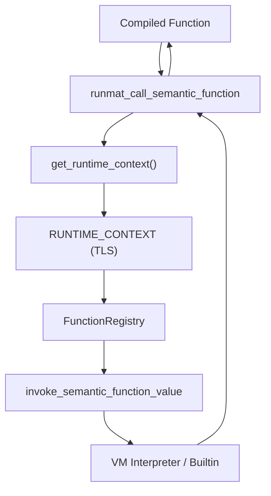
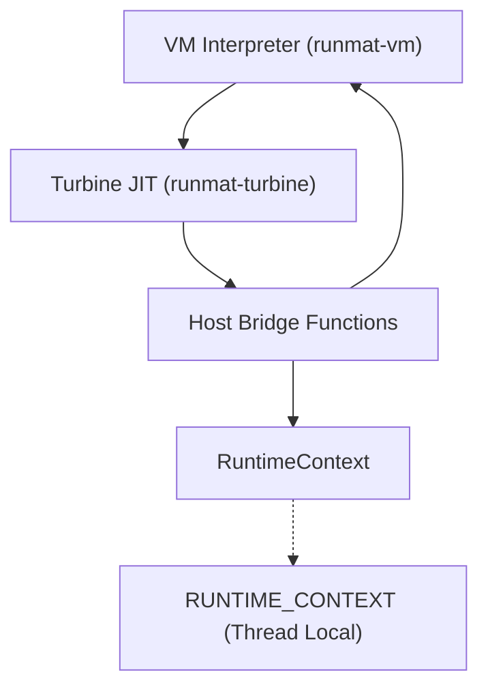

# TurbineValue ABI & Host Bridge

<details>
<summary>Relevant source files</summary>

- [crates/runmat-turbine/src/compiler.rs](https://github.com/runmat-org/runmat/blob/82685330/crates/runmat-turbine/src/compiler.rs)
- [crates/runmat-turbine/src/lib.rs](https://github.com/runmat-org/runmat/blob/82685330/crates/runmat-turbine/src/lib.rs)
- [crates/runmat-turbine/tests/jit.rs](https://github.com/runmat-org/runmat/blob/82685330/crates/runmat-turbine/tests/jit.rs)
- [crates/runmat-vm/src/bytecode/mod.rs](https://github.com/runmat-org/runmat/blob/82685330/crates/runmat-vm/src/bytecode/mod.rs)
- [crates/runmat-vm/src/bytecode/program.rs](https://github.com/runmat-org/runmat/blob/82685330/crates/runmat-vm/src/bytecode/program.rs)
- [crates/runmat-vm/src/interpreter/state.rs](https://github.com/runmat-org/runmat/blob/82685330/crates/runmat-vm/src/interpreter/state.rs)
- [crates/runmat-vm/src/lib.rs](https://github.com/runmat-org/runmat/blob/82685330/crates/runmat-vm/src/lib.rs)

</details>

The Turbine JIT compiler utilizes a specialized Application Binary Interface (ABI) to transition between high-performance native machine code and the complex, dynamic environment of the RunMat VM. This bridge allows JIT-compiled functions to perform "host calls" back into the Rust runtime for operations that cannot be easily specialized into machine code, such as dynamic function resolution, complex object indexing, or built-in functions with non-numeric arguments.

## TurbineValue & Tagged Representation

The core of the JIT's data representation is the `TurbineValue`. While the JIT fast-path prioritizes raw `f64` values for numeric calculations, it must maintain a representation compatible with the VM's `Value` enum when interacting with the host.

### Data Structures

| Type | Description |
| --- | --- |
| TurbineValue | A C-compatible struct used for FFI. It mirrors the layout of the VM's Value but is optimized for stack-passing in native code. crates/runmat-turbine/src/value_abi.rs#58-62 |
| TurbineValueTag | A u32 enum discriminator that identifies the type of data held in the TurbineValue union (e.g., Number, String, Cell, Object). crates/runmat-turbine/src/value_abi.rs#13-35 |
| TurbineArgSpec | Describes how arguments are passed in expanded calls, distinguishing between standard values and varargin. crates/runmat-turbine/src/value_abi.rs#114-118 |

Sources: [crates/runmat-turbine/src/value_abi.rs #13-118](https://github.com/runmat-org/runmat/blob/82685330/crates/runmat-turbine/src/value_abi.rs#L13-L118) [crates/runmat-turbine/src/lib.rs #45](https://github.com/runmat-org/runmat/blob/82685330/crates/runmat-turbine/src/lib.rs#L45-L45)

### Stack Simulation

During compilation, the `StackSimulator` tracks values using `StackEntry`. If a value is a pure number, it is stored as a Cranelift `Value`. If it represents a complex type or a variable that may be passed to the host, it includes a `value_ptr` to a `TurbineValue` slot. [crates/runmat-turbine/src/compiler.rs #50-53](https://github.com/runmat-org/runmat/blob/82685330/crates/runmat-turbine/src/compiler.rs#L50-L53) [crates/runmat-turbine/src/compiler.rs #67-69](https://github.com/runmat-org/runmat/blob/82685330/crates/runmat-turbine/src/compiler.rs#L67-L69)

Sources: [crates/runmat-turbine/src/compiler.rs #50-105](https://github.com/runmat-org/runmat/blob/82685330/crates/runmat-turbine/src/compiler.rs#L50-L105)

## Host Bridge Functions

The "Host Bridge" consists of a set of `#[no_mangle]` functions defined in Rust that are registered as external symbols in the Cranelift `JITModule`. These functions serve as the entry points for the JIT to re-enter the VM's logic.

### Bridge Invocation Diagram

The following diagram illustrates how a JIT-compiled function uses the bridge to resolve a dynamic function call.

"JIT-to-Host Call Flow"



<details>
<summary>Rendered SVG</summary>

```svg
<svg id="mermaid-pgu2zhywxp" xmlns="http://www.w3.org/2000/svg" xmlns:xlink="http://www.w3.org/1999/xlink" class="flowchart" style="max-width: 100%; touch-action: none; user-select: none; cursor: grab; min-height: fit-content; max-height: 100%;" viewBox="0 0 502.76953125 866" role="graphics-document document" aria-roledescription="flowchart-v2" preserveAspectRatio="xMidYMid meet"><style>#mermaid-pgu2zhywxp{font-family:ui-sans-serif,-apple-system,system-ui,Segoe UI,Helvetica;font-size:16px;fill:#ccc;}@keyframes edge-animation-frame{from{stroke-dashoffset:0;}}@keyframes dash{to{stroke-dashoffset:0;}}#mermaid-pgu2zhywxp .edge-animation-slow{stroke-dasharray:9,5!important;stroke-dashoffset:900;animation:dash 50s linear infinite;stroke-linecap:round;}#mermaid-pgu2zhywxp .edge-animation-fast{stroke-dasharray:9,5!important;stroke-dashoffset:900;animation:dash 20s linear infinite;stroke-linecap:round;}#mermaid-pgu2zhywxp .error-icon{fill:#333;}#mermaid-pgu2zhywxp .error-text{fill:#cccccc;stroke:#cccccc;}#mermaid-pgu2zhywxp .edge-thickness-normal{stroke-width:1px;}#mermaid-pgu2zhywxp .edge-thickness-thick{stroke-width:3.5px;}#mermaid-pgu2zhywxp .edge-pattern-solid{stroke-dasharray:0;}#mermaid-pgu2zhywxp .edge-thickness-invisible{stroke-width:0;fill:none;}#mermaid-pgu2zhywxp .edge-pattern-dashed{stroke-dasharray:3;}#mermaid-pgu2zhywxp .edge-pattern-dotted{stroke-dasharray:2;}#mermaid-pgu2zhywxp .marker{fill:#666;stroke:#666;}#mermaid-pgu2zhywxp .marker.cross{stroke:#666;}#mermaid-pgu2zhywxp svg{font-family:ui-sans-serif,-apple-system,system-ui,Segoe UI,Helvetica;font-size:16px;}#mermaid-pgu2zhywxp p{margin:0;}#mermaid-pgu2zhywxp .label{font-family:ui-sans-serif,-apple-system,system-ui,Segoe UI,Helvetica;color:#fff;}#mermaid-pgu2zhywxp .cluster-label text{fill:#fff;}#mermaid-pgu2zhywxp .cluster-label span{color:#fff;}#mermaid-pgu2zhywxp .cluster-label span p{background-color:transparent;}#mermaid-pgu2zhywxp .label text,#mermaid-pgu2zhywxp span{fill:#fff;color:#fff;}#mermaid-pgu2zhywxp .node rect,#mermaid-pgu2zhywxp .node circle,#mermaid-pgu2zhywxp .node ellipse,#mermaid-pgu2zhywxp .node polygon,#mermaid-pgu2zhywxp .node path{fill:#111;stroke:#222;stroke-width:1px;}#mermaid-pgu2zhywxp .rough-node .label text,#mermaid-pgu2zhywxp .node .label text,#mermaid-pgu2zhywxp .image-shape .label,#mermaid-pgu2zhywxp .icon-shape .label{text-anchor:middle;}#mermaid-pgu2zhywxp .node .katex path{fill:#000;stroke:#000;stroke-width:1px;}#mermaid-pgu2zhywxp .rough-node .label,#mermaid-pgu2zhywxp .node .label,#mermaid-pgu2zhywxp .image-shape .label,#mermaid-pgu2zhywxp .icon-shape .label{text-align:center;}#mermaid-pgu2zhywxp .node.clickable{cursor:pointer;}#mermaid-pgu2zhywxp .root .anchor path{fill:#666!important;stroke-width:0;stroke:#666;}#mermaid-pgu2zhywxp .arrowheadPath{fill:#0b0b0b;}#mermaid-pgu2zhywxp .edgePath .path{stroke:#666;stroke-width:1px;}#mermaid-pgu2zhywxp .flowchart-link{stroke:#666;fill:none;}#mermaid-pgu2zhywxp .edgeLabel{background-color:#161616;text-align:center;}#mermaid-pgu2zhywxp .edgeLabel p{background-color:#161616;}#mermaid-pgu2zhywxp .edgeLabel rect{opacity:0.5;background-color:#161616;fill:#161616;}#mermaid-pgu2zhywxp .labelBkg{background-color:rgba(22, 22, 22, 0.5);}#mermaid-pgu2zhywxp .cluster rect{fill:#161616;stroke:#222;stroke-width:1px;}#mermaid-pgu2zhywxp .cluster text{fill:#fff;}#mermaid-pgu2zhywxp .cluster span{color:#fff;}#mermaid-pgu2zhywxp div.mermaidTooltip{position:absolute;text-align:center;max-width:200px;padding:2px;font-family:ui-sans-serif,-apple-system,system-ui,Segoe UI,Helvetica;font-size:12px;background:#333;border:1px solid hsl(0, 0%, 10%);border-radius:2px;pointer-events:none;z-index:100;}#mermaid-pgu2zhywxp .flowchartTitleText{text-anchor:middle;font-size:18px;fill:#ccc;}#mermaid-pgu2zhywxp rect.text{fill:none;stroke-width:0;}#mermaid-pgu2zhywxp .icon-shape,#mermaid-pgu2zhywxp .image-shape{background-color:#161616;text-align:center;}#mermaid-pgu2zhywxp .icon-shape p,#mermaid-pgu2zhywxp .image-shape p{background-color:#161616;padding:2px;}#mermaid-pgu2zhywxp .icon-shape .label rect,#mermaid-pgu2zhywxp .image-shape .label rect{opacity:0.5;background-color:#161616;fill:#161616;}#mermaid-pgu2zhywxp .label-icon{display:inline-block;height:1em;overflow:visible;vertical-align:-0.125em;}#mermaid-pgu2zhywxp .node .label-icon path{fill:currentColor;stroke:revert;stroke-width:revert;}#mermaid-pgu2zhywxp .node .neo-node{stroke:#222;}#mermaid-pgu2zhywxp [data-look="neo"].node rect,#mermaid-pgu2zhywxp [data-look="neo"].cluster rect,#mermaid-pgu2zhywxp [data-look="neo"].node polygon{stroke:url(#mermaid-pgu2zhywxp-gradient);filter:drop-shadow( 1px 2px 2px rgba(185,185,185,1));}#mermaid-pgu2zhywxp [data-look="neo"].node path{stroke:url(#mermaid-pgu2zhywxp-gradient);stroke-width:1px;}#mermaid-pgu2zhywxp [data-look="neo"].node .outer-path{filter:drop-shadow( 1px 2px 2px rgba(185,185,185,1));}#mermaid-pgu2zhywxp [data-look="neo"].node .neo-line path{stroke:#222;filter:none;}#mermaid-pgu2zhywxp [data-look="neo"].node circle{stroke:url(#mermaid-pgu2zhywxp-gradient);filter:drop-shadow( 1px 2px 2px rgba(185,185,185,1));}#mermaid-pgu2zhywxp [data-look="neo"].node circle .state-start{fill:#000000;}#mermaid-pgu2zhywxp [data-look="neo"].icon-shape .icon{fill:url(#mermaid-pgu2zhywxp-gradient);filter:drop-shadow( 1px 2px 2px rgba(185,185,185,1));}#mermaid-pgu2zhywxp [data-look="neo"].icon-shape .icon-neo path{stroke:url(#mermaid-pgu2zhywxp-gradient);filter:drop-shadow( 1px 2px 2px rgba(185,185,185,1));}#mermaid-pgu2zhywxp :root{--mermaid-font-family:"trebuchet ms",verdana,arial,sans-serif;}</style><g><marker id="mermaid-pgu2zhywxp_flowchart-v2-pointEnd" class="marker flowchart-v2" viewBox="0 0 10 10" refX="5" refY="5" markerUnits="userSpaceOnUse" markerWidth="8" markerHeight="8" orient="auto"><path d="M 0 0 L 10 5 L 0 10 z" class="arrowMarkerPath" style="stroke-width: 1; stroke-dasharray: 1, 0;"></path></marker><marker id="mermaid-pgu2zhywxp_flowchart-v2-pointStart" class="marker flowchart-v2" viewBox="0 0 10 10" refX="4.5" refY="5" markerUnits="userSpaceOnUse" markerWidth="8" markerHeight="8" orient="auto"><path d="M 0 5 L 10 10 L 10 0 z" class="arrowMarkerPath" style="stroke-width: 1; stroke-dasharray: 1, 0;"></path></marker><marker id="mermaid-pgu2zhywxp_flowchart-v2-pointEnd-margin" class="marker flowchart-v2" viewBox="0 0 11.5 14" refX="11.5" refY="7" markerUnits="userSpaceOnUse" markerWidth="10.5" markerHeight="14" orient="auto"><path d="M 0 0 L 11.5 7 L 0 14 z" class="arrowMarkerPath" style="stroke-width: 0; stroke-dasharray: 1, 0;"></path></marker><marker id="mermaid-pgu2zhywxp_flowchart-v2-pointStart-margin" class="marker flowchart-v2" viewBox="0 0 11.5 14" refX="1" refY="7" markerUnits="userSpaceOnUse" markerWidth="11.5" markerHeight="14" orient="auto"><polygon points="0,7 11.5,14 11.5,0" class="arrowMarkerPath" style="stroke-width: 0; stroke-dasharray: 1, 0;"></polygon></marker><marker id="mermaid-pgu2zhywxp_flowchart-v2-circleEnd" class="marker flowchart-v2" viewBox="0 0 10 10" refX="11" refY="5" markerUnits="userSpaceOnUse" markerWidth="11" markerHeight="11" orient="auto"><circle cx="5" cy="5" r="5" class="arrowMarkerPath" style="stroke-width: 1; stroke-dasharray: 1, 0;"></circle></marker><marker id="mermaid-pgu2zhywxp_flowchart-v2-circleStart" class="marker flowchart-v2" viewBox="0 0 10 10" refX="-1" refY="5" markerUnits="userSpaceOnUse" markerWidth="11" markerHeight="11" orient="auto"><circle cx="5" cy="5" r="5" class="arrowMarkerPath" style="stroke-width: 1; stroke-dasharray: 1, 0;"></circle></marker><marker id="mermaid-pgu2zhywxp_flowchart-v2-circleEnd-margin" class="marker flowchart-v2" viewBox="0 0 10 10" refY="5" refX="12.25" markerUnits="userSpaceOnUse" markerWidth="14" markerHeight="14" orient="auto"><circle cx="5" cy="5" r="5" class="arrowMarkerPath" style="stroke-width: 0; stroke-dasharray: 1, 0;"></circle></marker><marker id="mermaid-pgu2zhywxp_flowchart-v2-circleStart-margin" class="marker flowchart-v2" viewBox="0 0 10 10" refX="-2" refY="5" markerUnits="userSpaceOnUse" markerWidth="14" markerHeight="14" orient="auto"><circle cx="5" cy="5" r="5" class="arrowMarkerPath" style="stroke-width: 0; stroke-dasharray: 1, 0;"></circle></marker><marker id="mermaid-pgu2zhywxp_flowchart-v2-crossEnd" class="marker cross flowchart-v2" viewBox="0 0 11 11" refX="12" refY="5.2" markerUnits="userSpaceOnUse" markerWidth="11" markerHeight="11" orient="auto"><path d="M 1,1 l 9,9 M 10,1 l -9,9" class="arrowMarkerPath" style="stroke-width: 2; stroke-dasharray: 1, 0;"></path></marker><marker id="mermaid-pgu2zhywxp_flowchart-v2-crossStart" class="marker cross flowchart-v2" viewBox="0 0 11 11" refX="-1" refY="5.2" markerUnits="userSpaceOnUse" markerWidth="11" markerHeight="11" orient="auto"><path d="M 1,1 l 9,9 M 10,1 l -9,9" class="arrowMarkerPath" style="stroke-width: 2; stroke-dasharray: 1, 0;"></path></marker><marker id="mermaid-pgu2zhywxp_flowchart-v2-crossEnd-margin" class="marker cross flowchart-v2" viewBox="0 0 15 15" refX="17.7" refY="7.5" markerUnits="userSpaceOnUse" markerWidth="12" markerHeight="12" orient="auto"><path d="M 1,1 L 14,14 M 1,14 L 14,1" class="arrowMarkerPath" style="stroke-width: 2.5;"></path></marker><marker id="mermaid-pgu2zhywxp_flowchart-v2-crossStart-margin" class="marker cross flowchart-v2" viewBox="0 0 15 15" refX="-3.5" refY="7.5" markerUnits="userSpaceOnUse" markerWidth="12" markerHeight="12" orient="auto"><path d="M 1,1 L 14,14 M 1,14 L 14,1" class="arrowMarkerPath" style="stroke-width: 2.5; stroke-dasharray: 1, 0;"></path></marker><g class="root"><g class="clusters"><g class="cluster" id="mermaid-pgu2zhywxp-subGraph1" data-look="classic"><rect style="" x="8" y="290" width="486.76953125" height="568"></rect><g class="cluster-label" transform="translate(153.345703125, 290)"><foreignObject width="196.078125" height="24"><div style="display: table-cell; white-space: nowrap; line-height: 1.5;" xmlns="http://www.w3.org/1999/xhtml"><span class="nodeLabel"><p>Rust Runtime Space (Host)</p></span></div></foreignObject></g></g><g class="cluster" id="mermaid-pgu2zhywxp-subGraph0" data-look="classic"><rect style="" x="81.76171875" y="8" width="392.0625" height="232"></rect><g class="cluster-label" transform="translate(189.64453125, 8)"><foreignObject width="176.296875" height="24"><div style="display: table-cell; white-space: nowrap; line-height: 1.5;" xmlns="http://www.w3.org/1999/xhtml"><span class="nodeLabel"><p>Native Code Space (JIT)</p></span></div></foreignObject></g></g></g><g class="edgePaths"><path d="M242.529,87L233.332,93.167C224.136,99.333,205.744,111.667,205.19,123.629C204.637,135.591,221.921,147.181,230.564,152.977L239.206,158.772" id="mermaid-pgu2zhywxp-L_A_B_0" class="edge-thickness-normal edge-pattern-solid edge-thickness-normal edge-pattern-solid flowchart-link" style=";" data-edge="true" data-et="edge" data-id="L_A_B_0" data-points="W3sieCI6MjQyLjUyODYyNTQ4ODI4MTI1LCJ5Ijo4N30seyJ4IjoxODcuMzUxNTYyNSwieSI6MTI0fSx7IngiOjI0Mi41Mjg2MjU0ODgyODEyNSwieSI6MTYxfV0=" data-look="classic" marker-end="url(#mermaid-pgu2zhywxp_flowchart-v2-pointEnd)"></path><path d="M235.233,215L227.893,219.167C220.554,223.333,205.874,231.667,198.535,240C191.195,248.333,191.195,256.667,191.195,265C191.195,273.333,191.195,281.667,191.195,289.333C191.195,297,191.195,304,191.195,307.5L191.195,311" id="mermaid-pgu2zhywxp-L_B_C_0" class="edge-thickness-normal edge-pattern-solid edge-thickness-normal edge-pattern-solid flowchart-link" style=";" data-edge="true" data-et="edge" data-id="L_B_C_0" data-points="W3sieCI6MjM1LjIzMjY0NzIzNTU3NjksInkiOjIxNX0seyJ4IjoxOTEuMTk1MzEyNSwieSI6MjQwfSx7IngiOjE5MS4xOTUzMTI1LCJ5IjoyNjV9LHsieCI6MTkxLjE5NTMxMjUsInkiOjI5MH0seyJ4IjoxOTEuMTk1MzEyNSwieSI6MzE1fV0=" data-look="classic" marker-end="url(#mermaid-pgu2zhywxp_flowchart-v2-pointEnd)"></path><path d="M191.195,369L191.195,375.167C191.195,381.333,191.195,393.667,191.195,405.333C191.195,417,191.195,428,191.195,433.5L191.195,439" id="mermaid-pgu2zhywxp-L_C_D_0" class="edge-thickness-normal edge-pattern-solid edge-thickness-normal edge-pattern-solid flowchart-link" style=";" data-edge="true" data-et="edge" data-id="L_C_D_0" data-points="W3sieCI6MTkxLjE5NTMxMjUsInkiOjM2OX0seyJ4IjoxOTEuMTk1MzEyNSwieSI6NDA2fSx7IngiOjE5MS4xOTUzMTI1LCJ5Ijo0NDN9XQ==" data-look="classic" marker-end="url(#mermaid-pgu2zhywxp_flowchart-v2-pointEnd)"></path><path d="M191.195,497L191.195,503.167C191.195,509.333,191.195,521.667,191.195,533.333C191.195,545,191.195,556,191.195,561.5L191.195,567" id="mermaid-pgu2zhywxp-L_D_E_0" class="edge-thickness-normal edge-pattern-solid edge-thickness-normal edge-pattern-solid flowchart-link" style=";" data-edge="true" data-et="edge" data-id="L_D_E_0" data-points="W3sieCI6MTkxLjE5NTMxMjUsInkiOjQ5N30seyJ4IjoxOTEuMTk1MzEyNSwieSI6NTM0fSx7IngiOjE5MS4xOTUzMTI1LCJ5Ijo1NzF9XQ==" data-look="classic" marker-end="url(#mermaid-pgu2zhywxp_flowchart-v2-pointEnd)"></path><path d="M191.195,625L191.195,629.167C191.195,633.333,191.195,641.667,191.195,649.333C191.195,657,191.195,664,191.195,667.5L191.195,671" id="mermaid-pgu2zhywxp-L_E_F_0" class="edge-thickness-normal edge-pattern-solid edge-thickness-normal edge-pattern-solid flowchart-link" style=";" data-edge="true" data-et="edge" data-id="L_E_F_0" data-points="W3sieCI6MTkxLjE5NTMxMjUsInkiOjYyNX0seyJ4IjoxOTEuMTk1MzEyNSwieSI6NjUwfSx7IngiOjE5MS4xOTUzMTI1LCJ5Ijo2NzV9XQ==" data-look="classic" marker-end="url(#mermaid-pgu2zhywxp_flowchart-v2-pointEnd)"></path><path d="M191.195,729L191.195,733.167C191.195,737.333,191.195,745.667,197.955,753.671C204.715,761.675,218.235,769.35,224.994,773.188L231.754,777.025" id="mermaid-pgu2zhywxp-L_F_G_0" class="edge-thickness-normal edge-pattern-solid edge-thickness-normal edge-pattern-solid flowchart-link" style=";" data-edge="true" data-et="edge" data-id="L_F_G_0" data-points="W3sieCI6MTkxLjE5NTMxMjUsInkiOjcyOX0seyJ4IjoxOTEuMTk1MzEyNSwieSI6NzU0fSx7IngiOjIzNS4yMzI2NDcyMzU1NzY5LCJ5Ijo3Nzl9XQ==" data-look="classic" marker-end="url(#mermaid-pgu2zhywxp_flowchart-v2-pointEnd)"></path><path d="M330.353,779L337.693,774.833C345.032,770.667,359.712,762.333,367.051,749.5C374.391,736.667,374.391,719.333,374.391,702C374.391,684.667,374.391,667.333,374.391,650C374.391,632.667,374.391,615.333,374.391,596C374.391,576.667,374.391,555.333,374.391,534C374.391,512.667,374.391,491.333,374.391,470C374.391,448.667,374.391,427.333,374.391,406C374.391,384.667,374.391,363.333,374.391,344C374.391,324.667,374.391,307.333,374.391,294.5C374.391,281.667,374.391,273.333,374.391,265C374.391,256.667,374.391,248.333,367.631,240.329C360.871,232.325,347.351,224.65,340.592,220.812L333.832,216.975" id="mermaid-pgu2zhywxp-L_G_B_0" class="edge-thickness-normal edge-pattern-solid edge-thickness-normal edge-pattern-solid flowchart-link" style=";" data-edge="true" data-et="edge" data-id="L_G_B_0" data-points="W3sieCI6MzMwLjM1MzI5MDI2NDQyMzEsInkiOjc3OX0seyJ4IjozNzQuMzkwNjI1LCJ5Ijo3NTR9LHsieCI6Mzc0LjM5MDYyNSwieSI6NzAyfSx7IngiOjM3NC4zOTA2MjUsInkiOjY1MH0seyJ4IjozNzQuMzkwNjI1LCJ5Ijo1OTh9LHsieCI6Mzc0LjM5MDYyNSwieSI6NTM0fSx7IngiOjM3NC4zOTA2MjUsInkiOjQ3MH0seyJ4IjozNzQuMzkwNjI1LCJ5Ijo0MDZ9LHsieCI6Mzc0LjM5MDYyNSwieSI6MzQyfSx7IngiOjM3NC4zOTA2MjUsInkiOjI5MH0seyJ4IjozNzQuMzkwNjI1LCJ5IjoyNjV9LHsieCI6Mzc0LjM5MDYyNSwieSI6MjQwfSx7IngiOjMzMC4zNTMyOTAyNjQ0MjMxLCJ5IjoyMTV9XQ==" data-look="classic" marker-end="url(#mermaid-pgu2zhywxp_flowchart-v2-pointEnd)"></path><path d="M312.046,161L318.727,154.833C325.408,148.667,338.77,136.333,339.26,124.452C339.75,112.571,327.368,101.142,321.176,95.427L314.985,89.713" id="mermaid-pgu2zhywxp-L_B_A_0" class="edge-thickness-normal edge-pattern-solid edge-thickness-normal edge-pattern-solid flowchart-link" style=";" data-edge="true" data-et="edge" data-id="L_B_A_0" data-points="W3sieCI6MzEyLjA0NTcxNTMzMjAzMTI1LCJ5IjoxNjF9LHsieCI6MzUyLjEzMjgxMjUsInkiOjEyNH0seyJ4IjozMTIuMDQ1NzE1MzMyMDMxMjUsInkiOjg3fV0=" data-look="classic" marker-end="url(#mermaid-pgu2zhywxp_flowchart-v2-pointEnd)"></path></g><g class="edgeLabels"><g class="edgeLabel" transform="translate(187.3515625, 124)"><g class="label" data-id="L_A_B_0" transform="translate(-12.3125, -12)"><foreignObject width="24.625" height="24"><div style="display: table-cell; white-space: nowrap; line-height: 1.5; max-width: 200px; text-align: center;" xmlns="http://www.w3.org/1999/xhtml" class="labelBkg"><span class="edgeLabel"><p>call</p></span></div></foreignObject></g></g><g class="edgeLabel"><g class="label" data-id="L_B_C_0" transform="translate(0, 0)"><foreignObject width="0" height="0"><div style="display: table-cell; white-space: nowrap; line-height: 1.5; max-width: 200px; text-align: center;" xmlns="http://www.w3.org/1999/xhtml" class="labelBkg"><span class="edgeLabel"></span></div></foreignObject></g></g><g class="edgeLabel" transform="translate(191.1953125, 406)"><g class="label" data-id="L_C_D_0" transform="translate(-26.0390625, -12)"><foreignObject width="52.078125" height="24"><div style="display: table-cell; white-space: nowrap; line-height: 1.5; max-width: 200px; text-align: center;" xmlns="http://www.w3.org/1999/xhtml" class="labelBkg"><span class="edgeLabel"><p>Access</p></span></div></foreignObject></g></g><g class="edgeLabel"><g class="label" data-id="L_D_E_0" transform="translate(0, 0)"><foreignObject width="0" height="0"><div style="display: table-cell; white-space: nowrap; line-height: 1.5; max-width: 200px; text-align: center;" xmlns="http://www.w3.org/1999/xhtml" class="labelBkg"><span class="edgeLabel"></span></div></foreignObject></g></g><g class="edgeLabel"><g class="label" data-id="L_E_F_0" transform="translate(0, 0)"><foreignObject width="0" height="0"><div style="display: table-cell; white-space: nowrap; line-height: 1.5; max-width: 200px; text-align: center;" xmlns="http://www.w3.org/1999/xhtml" class="labelBkg"><span class="edgeLabel"></span></div></foreignObject></g></g><g class="edgeLabel"><g class="label" data-id="L_F_G_0" transform="translate(0, 0)"><foreignObject width="0" height="0"><div style="display: table-cell; white-space: nowrap; line-height: 1.5; max-width: 200px; text-align: center;" xmlns="http://www.w3.org/1999/xhtml" class="labelBkg"><span class="edgeLabel"></span></div></foreignObject></g></g><g class="edgeLabel" transform="translate(374.390625, 534)"><g class="label" data-id="L_G_B_0" transform="translate(-74.2578125, -12)"><foreignObject width="148.515625" height="24"><div style="display: table-cell; white-space: nowrap; line-height: 1.5; max-width: 200px; text-align: center;" xmlns="http://www.w3.org/1999/xhtml" class="labelBkg"><span class="edgeLabel"><p>Return Status/Result</p></span></div></foreignObject></g></g><g class="edgeLabel" transform="translate(352.1328125, 124)"><g class="label" data-id="L_B_A_0" transform="translate(-44.515625, -12)"><foreignObject width="89.03125" height="24"><div style="display: table-cell; white-space: nowrap; line-height: 1.5; max-width: 200px; text-align: center;" xmlns="http://www.w3.org/1999/xhtml" class="labelBkg"><span class="edgeLabel"><p>Result Value</p></span></div></foreignObject></g></g></g><g class="nodes"><g class="node default" id="mermaid-pgu2zhywxp-flowchart-A-0" data-look="classic" transform="translate(282.79296875, 60)"><rect class="basic label-container" style="" x="-98.125" y="-27" width="196.25" height="54"></rect><g class="label" style="" transform="translate(-68.125, -12)"><rect></rect><foreignObject width="136.25" height="24"><div style="display: table-cell; white-space: nowrap; line-height: 1.5; max-width: 200px; text-align: center;" xmlns="http://www.w3.org/1999/xhtml"><span class="nodeLabel"><p>Compiled Function</p></span></div></foreignObject></g></g><g class="node default" id="mermaid-pgu2zhywxp-flowchart-B-1" data-look="classic" transform="translate(282.79296875, 188)"><rect class="basic label-container" style="" x="-143.8671875" y="-27" width="287.734375" height="54"></rect><g class="label" style="" transform="translate(-113.8671875, -12)"><rect></rect><foreignObject width="227.734375" height="24"><div style="display: table; white-space: break-spaces; line-height: 1.5; max-width: 200px; text-align: center; width: 200px;" xmlns="http://www.w3.org/1999/xhtml"><span class="nodeLabel"><p>runmat_call_semantic_function</p></span></div></foreignObject></g></g><g class="node default" id="mermaid-pgu2zhywxp-flowchart-C-3" data-look="classic" transform="translate(191.1953125, 342)"><rect class="basic label-container" style="" x="-111.15625" y="-27" width="222.3125" height="54"></rect><g class="label" style="" transform="translate(-81.15625, -12)"><rect></rect><foreignObject width="162.3125" height="24"><div style="display: table-cell; white-space: nowrap; line-height: 1.5; max-width: 200px; text-align: center;" xmlns="http://www.w3.org/1999/xhtml"><span class="nodeLabel"><p>get_runtime_context()</p></span></div></foreignObject></g></g><g class="node default" id="mermaid-pgu2zhywxp-flowchart-D-5" data-look="classic" transform="translate(191.1953125, 470)"><rect class="basic label-container" style="" x="-128.3125" y="-27" width="256.625" height="54"></rect><g class="label" style="" transform="translate(-98.3125, -12)"><rect></rect><foreignObject width="196.625" height="24"><div style="display: table-cell; white-space: nowrap; line-height: 1.5; max-width: 200px; text-align: center;" xmlns="http://www.w3.org/1999/xhtml"><span class="nodeLabel"><p>RUNTIME_CONTEXT (TLS)</p></span></div></foreignObject></g></g><g class="node default" id="mermaid-pgu2zhywxp-flowchart-E-7" data-look="classic" transform="translate(191.1953125, 598)"><rect class="basic label-container" style="" x="-91.265625" y="-27" width="182.53125" height="54"></rect><g class="label" style="" transform="translate(-61.265625, -12)"><rect></rect><foreignObject width="122.53125" height="24"><div style="display: table-cell; white-space: nowrap; line-height: 1.5; max-width: 200px; text-align: center;" xmlns="http://www.w3.org/1999/xhtml"><span class="nodeLabel"><p>FunctionRegistry</p></span></div></foreignObject></g></g><g class="node default" id="mermaid-pgu2zhywxp-flowchart-F-9" data-look="classic" transform="translate(191.1953125, 702)"><rect class="basic label-container" style="" x="-148.1953125" y="-27" width="296.390625" height="54"></rect><g class="label" style="" transform="translate(-118.1953125, -12)"><rect></rect><foreignObject width="236.390625" height="24"><div style="display: table; white-space: break-spaces; line-height: 1.5; max-width: 200px; text-align: center; width: 200px;" xmlns="http://www.w3.org/1999/xhtml"><span class="nodeLabel"><p>invoke_semantic_function_value</p></span></div></foreignObject></g></g><g class="node default" id="mermaid-pgu2zhywxp-flowchart-G-11" data-look="classic" transform="translate(282.79296875, 806)"><rect class="basic label-container" style="" x="-111.5" y="-27" width="223" height="54"></rect><g class="label" style="" transform="translate(-81.5, -12)"><rect></rect><foreignObject width="163" height="24"><div style="display: table-cell; white-space: nowrap; line-height: 1.5; max-width: 200px; text-align: center;" xmlns="http://www.w3.org/1999/xhtml"><span class="nodeLabel"><p>VM Interpreter / Builtin</p></span></div></foreignObject></g></g></g></g></g><defs><filter id="mermaid-pgu2zhywxp-drop-shadow" height="130%" width="130%"><feDropShadow dx="4" dy="4" stdDeviation="0" flood-opacity="0.06" flood-color="#000000"></feDropShadow></filter></defs><defs><filter id="mermaid-pgu2zhywxp-drop-shadow-small" height="150%" width="150%"><feDropShadow dx="2" dy="2" stdDeviation="0" flood-opacity="0.06" flood-color="#000000"></feDropShadow></filter></defs><linearGradient id="mermaid-pgu2zhywxp-gradient" gradientUnits="objectBoundingBox" x1="0%" y1="0%" x2="100%" y2="0%"><stop offset="0%" stop-color="#333" stop-opacity="1"></stop><stop offset="100%" stop-color="hsl(-120, 0%, 3.3333333333%)" stop-opacity="1"></stop></linearGradient></svg>
```

</details>

Sources: [crates/runmat-turbine/src/lib.rs #83-104](https://github.com/runmat-org/runmat/blob/82685330/crates/runmat-turbine/src/lib.rs#L83-L104) [crates/runmat-turbine/src/lib.rs #106-118](https://github.com/runmat-org/runmat/blob/82685330/crates/runmat-turbine/src/lib.rs#L106-L118) [crates/runmat-vm/src/interpreter/runner.rs #30-33](https://github.com/runmat-org/runmat/blob/82685330/crates/runmat-vm/src/interpreter/runner.rs#L30-L33)

### Key Bridge Exports

| Function Name | Purpose |
| --- | --- |
| runmat_call_semantic_function | Basic call to a resolved function ID with standard arguments. crates/runmat-turbine/src/lib.rs#106-118 |
| runmat_call_builtin_expanded_values | Specialized call for built-in functions requiring ArgSpec (e.g., handling varargin). crates/runmat-turbine/src/lib.rs#252-270 |
| runmat_call_feval_expanded_values | Handles the feval protocol for function handles and anonymous functions. crates/runmat-turbine/src/lib.rs#232-250 |
| runmat_call_method_member_expanded_values | Dispatches method calls or property access on objects. crates/runmat-turbine/src/lib.rs#272-290 |

Sources: [crates/runmat-turbine/src/lib.rs #106-300](https://github.com/runmat-org/runmat/blob/82685330/crates/runmat-turbine/src/lib.rs#L106-L300)

## Runtime Context & Re-entry

Because the JIT-compiled code is executed as a standard C-style function call, it loses the direct reference to the VM's `FunctionRegistry` and other state. RunMat solves this using a `thread_local` `RUNTIME_CONTEXT`.

### RUNTIME_CONTEXT Thread-Local

The `RuntimeContext` struct holds the `FunctionRegistry` required for dynamic resolution during host calls. [crates/runmat-turbine/src/lib.rs #73-81](https://github.com/runmat-org/runmat/blob/82685330/crates/runmat-turbine/src/lib.rs#L73-L81)

- Initialization: Before calling a JIT-compiled function, the engine sets the `RUNTIME_CONTEXT` using `set_runtime_context`. [crates/runmat-turbine/src/lib.rs #87-89](https://github.com/runmat-org/runmat/blob/82685330/crates/runmat-turbine/src/lib.rs#L87-L89)
- Access: Host bridge functions retrieve this context via `get_runtime_context()` to perform their tasks. [crates/runmat-turbine/src/lib.rs #95-104](https://github.com/runmat-org/runmat/blob/82685330/crates/runmat-turbine/src/lib.rs#L95-L104)
- Cleanup: The context is cleared after the JIT function returns to prevent memory leaks or cross-thread contamination. [crates/runmat-turbine/src/lib.rs #91-93](https://github.com/runmat-org/runmat/blob/82685330/crates/runmat-turbine/src/lib.rs#L91-L93)

### Re-entry Patterns

When the JIT calls a bridge function like `runmat_call_semantic_function`, the bridge may determine that the target function is not a built-in but another MATLAB function. In this case, the bridge re-enters the VM interpreter.

"Re-entry and Execution Hierarchy"



<details>
<summary>Rendered SVG</summary>

```svg
<svg id="mermaid-z9gvfujkzw" xmlns="http://www.w3.org/2000/svg" xmlns:xlink="http://www.w3.org/1999/xlink" class="flowchart" style="max-width: 100%; touch-action: none; user-select: none; cursor: grab; min-height: fit-content; max-height: 100%;" viewBox="0 0 536.59765625 754" role="graphics-document document" aria-roledescription="flowchart-v2" preserveAspectRatio="xMidYMid meet"><style>#mermaid-z9gvfujkzw{font-family:ui-sans-serif,-apple-system,system-ui,Segoe UI,Helvetica;font-size:16px;fill:#ccc;}@keyframes edge-animation-frame{from{stroke-dashoffset:0;}}@keyframes dash{to{stroke-dashoffset:0;}}#mermaid-z9gvfujkzw .edge-animation-slow{stroke-dasharray:9,5!important;stroke-dashoffset:900;animation:dash 50s linear infinite;stroke-linecap:round;}#mermaid-z9gvfujkzw .edge-animation-fast{stroke-dasharray:9,5!important;stroke-dashoffset:900;animation:dash 20s linear infinite;stroke-linecap:round;}#mermaid-z9gvfujkzw .error-icon{fill:#333;}#mermaid-z9gvfujkzw .error-text{fill:#cccccc;stroke:#cccccc;}#mermaid-z9gvfujkzw .edge-thickness-normal{stroke-width:1px;}#mermaid-z9gvfujkzw .edge-thickness-thick{stroke-width:3.5px;}#mermaid-z9gvfujkzw .edge-pattern-solid{stroke-dasharray:0;}#mermaid-z9gvfujkzw .edge-thickness-invisible{stroke-width:0;fill:none;}#mermaid-z9gvfujkzw .edge-pattern-dashed{stroke-dasharray:3;}#mermaid-z9gvfujkzw .edge-pattern-dotted{stroke-dasharray:2;}#mermaid-z9gvfujkzw .marker{fill:#666;stroke:#666;}#mermaid-z9gvfujkzw .marker.cross{stroke:#666;}#mermaid-z9gvfujkzw svg{font-family:ui-sans-serif,-apple-system,system-ui,Segoe UI,Helvetica;font-size:16px;}#mermaid-z9gvfujkzw p{margin:0;}#mermaid-z9gvfujkzw .label{font-family:ui-sans-serif,-apple-system,system-ui,Segoe UI,Helvetica;color:#fff;}#mermaid-z9gvfujkzw .cluster-label text{fill:#fff;}#mermaid-z9gvfujkzw .cluster-label span{color:#fff;}#mermaid-z9gvfujkzw .cluster-label span p{background-color:transparent;}#mermaid-z9gvfujkzw .label text,#mermaid-z9gvfujkzw span{fill:#fff;color:#fff;}#mermaid-z9gvfujkzw .node rect,#mermaid-z9gvfujkzw .node circle,#mermaid-z9gvfujkzw .node ellipse,#mermaid-z9gvfujkzw .node polygon,#mermaid-z9gvfujkzw .node path{fill:#111;stroke:#222;stroke-width:1px;}#mermaid-z9gvfujkzw .rough-node .label text,#mermaid-z9gvfujkzw .node .label text,#mermaid-z9gvfujkzw .image-shape .label,#mermaid-z9gvfujkzw .icon-shape .label{text-anchor:middle;}#mermaid-z9gvfujkzw .node .katex path{fill:#000;stroke:#000;stroke-width:1px;}#mermaid-z9gvfujkzw .rough-node .label,#mermaid-z9gvfujkzw .node .label,#mermaid-z9gvfujkzw .image-shape .label,#mermaid-z9gvfujkzw .icon-shape .label{text-align:center;}#mermaid-z9gvfujkzw .node.clickable{cursor:pointer;}#mermaid-z9gvfujkzw .root .anchor path{fill:#666!important;stroke-width:0;stroke:#666;}#mermaid-z9gvfujkzw .arrowheadPath{fill:#0b0b0b;}#mermaid-z9gvfujkzw .edgePath .path{stroke:#666;stroke-width:1px;}#mermaid-z9gvfujkzw .flowchart-link{stroke:#666;fill:none;}#mermaid-z9gvfujkzw .edgeLabel{background-color:#161616;text-align:center;}#mermaid-z9gvfujkzw .edgeLabel p{background-color:#161616;}#mermaid-z9gvfujkzw .edgeLabel rect{opacity:0.5;background-color:#161616;fill:#161616;}#mermaid-z9gvfujkzw .labelBkg{background-color:rgba(22, 22, 22, 0.5);}#mermaid-z9gvfujkzw .cluster rect{fill:#161616;stroke:#222;stroke-width:1px;}#mermaid-z9gvfujkzw .cluster text{fill:#fff;}#mermaid-z9gvfujkzw .cluster span{color:#fff;}#mermaid-z9gvfujkzw div.mermaidTooltip{position:absolute;text-align:center;max-width:200px;padding:2px;font-family:ui-sans-serif,-apple-system,system-ui,Segoe UI,Helvetica;font-size:12px;background:#333;border:1px solid hsl(0, 0%, 10%);border-radius:2px;pointer-events:none;z-index:100;}#mermaid-z9gvfujkzw .flowchartTitleText{text-anchor:middle;font-size:18px;fill:#ccc;}#mermaid-z9gvfujkzw rect.text{fill:none;stroke-width:0;}#mermaid-z9gvfujkzw .icon-shape,#mermaid-z9gvfujkzw .image-shape{background-color:#161616;text-align:center;}#mermaid-z9gvfujkzw .icon-shape p,#mermaid-z9gvfujkzw .image-shape p{background-color:#161616;padding:2px;}#mermaid-z9gvfujkzw .icon-shape .label rect,#mermaid-z9gvfujkzw .image-shape .label rect{opacity:0.5;background-color:#161616;fill:#161616;}#mermaid-z9gvfujkzw .label-icon{display:inline-block;height:1em;overflow:visible;vertical-align:-0.125em;}#mermaid-z9gvfujkzw .node .label-icon path{fill:currentColor;stroke:revert;stroke-width:revert;}#mermaid-z9gvfujkzw .node .neo-node{stroke:#222;}#mermaid-z9gvfujkzw [data-look="neo"].node rect,#mermaid-z9gvfujkzw [data-look="neo"].cluster rect,#mermaid-z9gvfujkzw [data-look="neo"].node polygon{stroke:url(#mermaid-z9gvfujkzw-gradient);filter:drop-shadow( 1px 2px 2px rgba(185,185,185,1));}#mermaid-z9gvfujkzw [data-look="neo"].node path{stroke:url(#mermaid-z9gvfujkzw-gradient);stroke-width:1px;}#mermaid-z9gvfujkzw [data-look="neo"].node .outer-path{filter:drop-shadow( 1px 2px 2px rgba(185,185,185,1));}#mermaid-z9gvfujkzw [data-look="neo"].node .neo-line path{stroke:#222;filter:none;}#mermaid-z9gvfujkzw [data-look="neo"].node circle{stroke:url(#mermaid-z9gvfujkzw-gradient);filter:drop-shadow( 1px 2px 2px rgba(185,185,185,1));}#mermaid-z9gvfujkzw [data-look="neo"].node circle .state-start{fill:#000000;}#mermaid-z9gvfujkzw [data-look="neo"].icon-shape .icon{fill:url(#mermaid-z9gvfujkzw-gradient);filter:drop-shadow( 1px 2px 2px rgba(185,185,185,1));}#mermaid-z9gvfujkzw [data-look="neo"].icon-shape .icon-neo path{stroke:url(#mermaid-z9gvfujkzw-gradient);filter:drop-shadow( 1px 2px 2px rgba(185,185,185,1));}#mermaid-z9gvfujkzw :root{--mermaid-font-family:"trebuchet ms",verdana,arial,sans-serif;}</style><g><marker id="mermaid-z9gvfujkzw_flowchart-v2-pointEnd" class="marker flowchart-v2" viewBox="0 0 10 10" refX="5" refY="5" markerUnits="userSpaceOnUse" markerWidth="8" markerHeight="8" orient="auto"><path d="M 0 0 L 10 5 L 0 10 z" class="arrowMarkerPath" style="stroke-width: 1; stroke-dasharray: 1, 0;"></path></marker><marker id="mermaid-z9gvfujkzw_flowchart-v2-pointStart" class="marker flowchart-v2" viewBox="0 0 10 10" refX="4.5" refY="5" markerUnits="userSpaceOnUse" markerWidth="8" markerHeight="8" orient="auto"><path d="M 0 5 L 10 10 L 10 0 z" class="arrowMarkerPath" style="stroke-width: 1; stroke-dasharray: 1, 0;"></path></marker><marker id="mermaid-z9gvfujkzw_flowchart-v2-pointEnd-margin" class="marker flowchart-v2" viewBox="0 0 11.5 14" refX="11.5" refY="7" markerUnits="userSpaceOnUse" markerWidth="10.5" markerHeight="14" orient="auto"><path d="M 0 0 L 11.5 7 L 0 14 z" class="arrowMarkerPath" style="stroke-width: 0; stroke-dasharray: 1, 0;"></path></marker><marker id="mermaid-z9gvfujkzw_flowchart-v2-pointStart-margin" class="marker flowchart-v2" viewBox="0 0 11.5 14" refX="1" refY="7" markerUnits="userSpaceOnUse" markerWidth="11.5" markerHeight="14" orient="auto"><polygon points="0,7 11.5,14 11.5,0" class="arrowMarkerPath" style="stroke-width: 0; stroke-dasharray: 1, 0;"></polygon></marker><marker id="mermaid-z9gvfujkzw_flowchart-v2-circleEnd" class="marker flowchart-v2" viewBox="0 0 10 10" refX="11" refY="5" markerUnits="userSpaceOnUse" markerWidth="11" markerHeight="11" orient="auto"><circle cx="5" cy="5" r="5" class="arrowMarkerPath" style="stroke-width: 1; stroke-dasharray: 1, 0;"></circle></marker><marker id="mermaid-z9gvfujkzw_flowchart-v2-circleStart" class="marker flowchart-v2" viewBox="0 0 10 10" refX="-1" refY="5" markerUnits="userSpaceOnUse" markerWidth="11" markerHeight="11" orient="auto"><circle cx="5" cy="5" r="5" class="arrowMarkerPath" style="stroke-width: 1; stroke-dasharray: 1, 0;"></circle></marker><marker id="mermaid-z9gvfujkzw_flowchart-v2-circleEnd-margin" class="marker flowchart-v2" viewBox="0 0 10 10" refY="5" refX="12.25" markerUnits="userSpaceOnUse" markerWidth="14" markerHeight="14" orient="auto"><circle cx="5" cy="5" r="5" class="arrowMarkerPath" style="stroke-width: 0; stroke-dasharray: 1, 0;"></circle></marker><marker id="mermaid-z9gvfujkzw_flowchart-v2-circleStart-margin" class="marker flowchart-v2" viewBox="0 0 10 10" refX="-2" refY="5" markerUnits="userSpaceOnUse" markerWidth="14" markerHeight="14" orient="auto"><circle cx="5" cy="5" r="5" class="arrowMarkerPath" style="stroke-width: 0; stroke-dasharray: 1, 0;"></circle></marker><marker id="mermaid-z9gvfujkzw_flowchart-v2-crossEnd" class="marker cross flowchart-v2" viewBox="0 0 11 11" refX="12" refY="5.2" markerUnits="userSpaceOnUse" markerWidth="11" markerHeight="11" orient="auto"><path d="M 1,1 l 9,9 M 10,1 l -9,9" class="arrowMarkerPath" style="stroke-width: 2; stroke-dasharray: 1, 0;"></path></marker><marker id="mermaid-z9gvfujkzw_flowchart-v2-crossStart" class="marker cross flowchart-v2" viewBox="0 0 11 11" refX="-1" refY="5.2" markerUnits="userSpaceOnUse" markerWidth="11" markerHeight="11" orient="auto"><path d="M 1,1 l 9,9 M 10,1 l -9,9" class="arrowMarkerPath" style="stroke-width: 2; stroke-dasharray: 1, 0;"></path></marker><marker id="mermaid-z9gvfujkzw_flowchart-v2-crossEnd-margin" class="marker cross flowchart-v2" viewBox="0 0 15 15" refX="17.7" refY="7.5" markerUnits="userSpaceOnUse" markerWidth="12" markerHeight="12" orient="auto"><path d="M 1,1 L 14,14 M 1,14 L 14,1" class="arrowMarkerPath" style="stroke-width: 2.5;"></path></marker><marker id="mermaid-z9gvfujkzw_flowchart-v2-crossStart-margin" class="marker cross flowchart-v2" viewBox="0 0 15 15" refX="-3.5" refY="7.5" markerUnits="userSpaceOnUse" markerWidth="12" markerHeight="12" orient="auto"><path d="M 1,1 L 14,14 M 1,14 L 14,1" class="arrowMarkerPath" style="stroke-width: 2.5; stroke-dasharray: 1, 0;"></path></marker><g class="root"><g class="clusters"><g class="cluster" id="mermaid-z9gvfujkzw-subGraph1" data-look="classic"><rect style="" x="123.19921875" y="490" width="330" height="256"></rect><g class="cluster-label" transform="translate(210.23828125, 490)"><foreignObject width="155.921875" height="24"><div style="display: table-cell; white-space: nowrap; line-height: 1.5;" xmlns="http://www.w3.org/1999/xhtml"><span class="nodeLabel"><p>Context Management</p></span></div></foreignObject></g></g><g class="cluster" id="mermaid-z9gvfujkzw-subGraph0" data-look="classic"><rect style="" x="8" y="8" width="520.59765625" height="280"></rect><g class="cluster-label" transform="translate(212.939453125, 8)"><foreignObject width="110.71875" height="24"><div style="display: table-cell; white-space: nowrap; line-height: 1.5;" xmlns="http://www.w3.org/1999/xhtml"><span class="nodeLabel"><p>Execution Tiers</p></span></div></foreignObject></g></g></g><g class="edgePaths"><path d="M229.084,111L219.737,117.167C210.389,123.333,191.695,135.667,182.347,147.333C173,159,173,170,173,175.5L173,181" id="mermaid-z9gvfujkzw-L_VM_JIT_0" class="edge-thickness-normal edge-pattern-solid edge-thickness-normal edge-pattern-solid flowchart-link" style=";" data-edge="true" data-et="edge" data-id="L_VM_JIT_0" data-points="W3sieCI6MjI5LjA4MzgzMDE4MDkyMTA0LCJ5IjoxMTF9LHsieCI6MTczLCJ5IjoxNDh9LHsieCI6MTczLCJ5IjoxODV9XQ==" data-look="classic" marker-end="url(#mermaid-z9gvfujkzw_flowchart-v2-pointEnd)"></path><path d="M173,263L173,267.167C173,271.333,173,279.667,173,290C173,300.333,173,312.667,183.517,324.676C194.034,336.686,215.069,348.372,225.586,354.215L236.103,360.057" id="mermaid-z9gvfujkzw-L_JIT_Bridge_0" class="edge-thickness-normal edge-pattern-solid edge-thickness-normal edge-pattern-solid flowchart-link" style=";" data-edge="true" data-et="edge" data-id="L_JIT_Bridge_0" data-points="W3sieCI6MTczLCJ5IjoyNjN9LHsieCI6MTczLCJ5IjoyODh9LHsieCI6MTczLCJ5IjozMjV9LHsieCI6MjM5LjU5OTU0ODMzOTg0Mzc1LCJ5IjozNjJ9XQ==" data-look="classic" marker-end="url(#mermaid-z9gvfujkzw_flowchart-v2-pointEnd)"></path><path d="M336.799,362L347.899,355.833C358.999,349.667,381.199,337.333,392.299,325C403.398,312.667,403.398,300.333,403.398,283.5C403.398,266.667,403.398,245.333,403.398,222C403.398,198.667,403.398,173.333,394.608,154.867C385.817,136.401,368.235,124.802,359.444,119.002L350.653,113.203" id="mermaid-z9gvfujkzw-L_Bridge_VM_0" class="edge-thickness-normal edge-pattern-solid edge-thickness-normal edge-pattern-solid flowchart-link" style=";" data-edge="true" data-et="edge" data-id="L_Bridge_VM_0" data-points="W3sieCI6MzM2Ljc5ODg4OTE2MDE1NjI1LCJ5IjozNjJ9LHsieCI6NDAzLjM5ODQzNzUsInkiOjMyNX0seyJ4Ijo0MDMuMzk4NDM3NSwieSI6Mjg4fSx7IngiOjQwMy4zOTg0Mzc1LCJ5IjoyMjR9LHsieCI6NDAzLjM5ODQzNzUsInkiOjE0OH0seyJ4IjozNDcuMzE0NjA3MzE5MDc4OTYsInkiOjExMX1d" data-look="classic" marker-end="url(#mermaid-z9gvfujkzw_flowchart-v2-pointEnd)"></path><path d="M288.199,569L288.199,575.167C288.199,581.333,288.199,593.667,288.199,605.333C288.199,617,288.199,628,288.199,633.5L288.199,639" id="mermaid-z9gvfujkzw-L_RC_TLS_0" class="edge-thickness-normal edge-pattern-dotted edge-thickness-normal edge-pattern-solid flowchart-link" style=";" data-edge="true" data-et="edge" data-id="L_RC_TLS_0" data-points="W3sieCI6Mjg4LjE5OTIxODc1LCJ5Ijo1Njl9LHsieCI6Mjg4LjE5OTIxODc1LCJ5Ijo2MDZ9LHsieCI6Mjg4LjE5OTIxODc1LCJ5Ijo2NDN9XQ==" data-look="classic" marker-end="url(#mermaid-z9gvfujkzw_flowchart-v2-pointEnd)"></path><path d="M288.199,416L288.199,422.167C288.199,428.333,288.199,440.667,288.199,453C288.199,465.333,288.199,477.667,288.199,487.333C288.199,497,288.199,504,288.199,507.5L288.199,511" id="mermaid-z9gvfujkzw-L_Bridge_RC_0" class="edge-thickness-normal edge-pattern-solid edge-thickness-normal edge-pattern-solid flowchart-link" style=";" data-edge="true" data-et="edge" data-id="L_Bridge_RC_0" data-points="W3sieCI6Mjg4LjE5OTIxODc1LCJ5Ijo0MTZ9LHsieCI6Mjg4LjE5OTIxODc1LCJ5Ijo0NTN9LHsieCI6Mjg4LjE5OTIxODc1LCJ5Ijo0OTB9LHsieCI6Mjg4LjE5OTIxODc1LCJ5Ijo1MTV9XQ==" data-look="classic" marker-end="url(#mermaid-z9gvfujkzw_flowchart-v2-pointEnd)"></path></g><g class="edgeLabels"><g class="edgeLabel" transform="translate(173, 148)"><g class="label" data-id="L_VM_JIT_0" transform="translate(-64.6328125, -12)"><foreignObject width="129.265625" height="24"><div style="display: table-cell; white-space: nowrap; line-height: 1.5; max-width: 200px; text-align: center;" xmlns="http://www.w3.org/1999/xhtml" class="labelBkg"><span class="edgeLabel"><p>Hotspot Detected</p></span></div></foreignObject></g></g><g class="edgeLabel" transform="translate(173, 325)"><g class="label" data-id="L_JIT_Bridge_0" transform="translate(-94.125, -12)"><foreignObject width="188.25" height="24"><div style="display: table-cell; white-space: nowrap; line-height: 1.5; max-width: 200px; text-align: center;" xmlns="http://www.w3.org/1999/xhtml" class="labelBkg"><span class="edgeLabel"><p>Host Call (runmat_call_...)</p></span></div></foreignObject></g></g><g class="edgeLabel" transform="translate(403.3984375, 224)"><g class="label" data-id="L_Bridge_VM_0" transform="translate(-65.3984375, -12)"><foreignObject width="130.796875" height="24"><div style="display: table-cell; white-space: nowrap; line-height: 1.5; max-width: 200px; text-align: center;" xmlns="http://www.w3.org/1999/xhtml" class="labelBkg"><span class="edgeLabel"><p>interpret_function</p></span></div></foreignObject></g></g><g class="edgeLabel" transform="translate(288.19921875, 606)"><g class="label" data-id="L_RC_TLS_0" transform="translate(-32.578125, -12)"><foreignObject width="65.15625" height="24"><div style="display: table-cell; white-space: nowrap; line-height: 1.5; max-width: 200px; text-align: center;" xmlns="http://www.w3.org/1999/xhtml" class="labelBkg"><span class="edgeLabel"><p>Stored in</p></span></div></foreignObject></g></g><g class="edgeLabel" transform="translate(288.19921875, 453)"><g class="label" data-id="L_Bridge_RC_0" transform="translate(-26.7578125, -12)"><foreignObject width="53.515625" height="24"><div style="display: table-cell; white-space: nowrap; line-height: 1.5; max-width: 200px; text-align: center;" xmlns="http://www.w3.org/1999/xhtml" class="labelBkg"><span class="edgeLabel"><p>Lookup</p></span></div></foreignObject></g></g></g><g class="nodes"><g class="node default" id="mermaid-z9gvfujkzw-flowchart-VM-0" data-look="classic" transform="translate(288.19921875, 72)"><rect class="basic label-container" style="" x="-130" y="-39" width="260" height="78"></rect><g class="label" style="" transform="translate(-100, -24)"><rect></rect><foreignObject width="200" height="48"><div style="display: table; white-space: break-spaces; line-height: 1.5; max-width: 200px; text-align: center; width: 200px;" xmlns="http://www.w3.org/1999/xhtml"><span class="nodeLabel"><p>VM Interpreter (runmat-vm)</p></span></div></foreignObject></g></g><g class="node default" id="mermaid-z9gvfujkzw-flowchart-JIT-1" data-look="classic" transform="translate(173, 224)"><rect class="basic label-container" style="" x="-130" y="-39" width="260" height="78"></rect><g class="label" style="" transform="translate(-100, -24)"><rect></rect><foreignObject width="200" height="48"><div style="display: table; white-space: break-spaces; line-height: 1.5; max-width: 200px; text-align: center; width: 200px;" xmlns="http://www.w3.org/1999/xhtml"><span class="nodeLabel"><p>Turbine JIT (runmat-turbine)</p></span></div></foreignObject></g></g><g class="node default" id="mermaid-z9gvfujkzw-flowchart-Bridge-5" data-look="classic" transform="translate(288.19921875, 389)"><rect class="basic label-container" style="" x="-110.515625" y="-27" width="221.03125" height="54"></rect><g class="label" style="" transform="translate(-80.515625, -12)"><rect></rect><foreignObject width="161.03125" height="24"><div style="display: table-cell; white-space: nowrap; line-height: 1.5; max-width: 200px; text-align: center;" xmlns="http://www.w3.org/1999/xhtml"><span class="nodeLabel"><p>Host Bridge Functions</p></span></div></foreignObject></g></g><g class="node default" id="mermaid-z9gvfujkzw-flowchart-RC-8" data-look="classic" transform="translate(288.19921875, 542)"><rect class="basic label-container" style="" x="-88.2734375" y="-27" width="176.546875" height="54"></rect><g class="label" style="" transform="translate(-58.2734375, -12)"><rect></rect><foreignObject width="116.546875" height="24"><div style="display: table-cell; white-space: nowrap; line-height: 1.5; max-width: 200px; text-align: center;" xmlns="http://www.w3.org/1999/xhtml"><span class="nodeLabel"><p>RuntimeContext</p></span></div></foreignObject></g></g><g class="node default" id="mermaid-z9gvfujkzw-flowchart-TLS-9" data-look="classic" transform="translate(288.19921875, 682)"><rect class="basic label-container" style="" x="-130" y="-39" width="260" height="78"></rect><g class="label" style="" transform="translate(-100, -24)"><rect></rect><foreignObject width="200" height="48"><div style="display: table; white-space: break-spaces; line-height: 1.5; max-width: 200px; text-align: center; width: 200px;" xmlns="http://www.w3.org/1999/xhtml"><span class="nodeLabel"><p>RUNTIME_CONTEXT (Thread Local)</p></span></div></foreignObject></g></g></g></g></g><defs><filter id="mermaid-z9gvfujkzw-drop-shadow" height="130%" width="130%"><feDropShadow dx="4" dy="4" stdDeviation="0" flood-opacity="0.06" flood-color="#000000"></feDropShadow></filter></defs><defs><filter id="mermaid-z9gvfujkzw-drop-shadow-small" height="150%" width="150%"><feDropShadow dx="2" dy="2" stdDeviation="0" flood-opacity="0.06" flood-color="#000000"></feDropShadow></filter></defs><linearGradient id="mermaid-z9gvfujkzw-gradient" gradientUnits="objectBoundingBox" x1="0%" y1="0%" x2="100%" y2="0%"><stop offset="0%" stop-color="#333" stop-opacity="1"></stop><stop offset="100%" stop-color="hsl(-120, 0%, 3.3333333333%)" stop-opacity="1"></stop></linearGradient></svg>
```

</details>

Sources: [crates/runmat-turbine/src/lib.rs #73-104](https://github.com/runmat-org/runmat/blob/82685330/crates/runmat-turbine/src/lib.rs#L73-L104) [crates/runmat-vm/src/lib.rs #30-33](https://github.com/runmat-org/runmat/blob/82685330/crates/runmat-vm/src/lib.rs#L30-L33) [crates/runmat-vm/src/interpreter/runner.rs #30-33](https://github.com/runmat-org/runmat/blob/82685330/crates/runmat-vm/src/interpreter/runner.rs#L30-L33)

## Compilation Integration

The `CompileContext` in the JIT compiler stores the `FuncId` (Cranelift Function IDs) for all host bridge functions. This allows the `Compiler` to emit `call` instructions to these specific addresses during the translation of bytecode like `Instr::CallFunctionMulti`. [crates/runmat-turbine/src/compiler.rs #16-27](https://github.com/runmat-org/runmat/blob/82685330/crates/runmat-turbine/src/compiler.rs#L16-L27) [crates/runmat-turbine/src/compiler.rs #30-38](https://github.com/runmat-org/runmat/blob/82685330/crates/runmat-turbine/src/compiler.rs#L30-L38)

During the lowering of a call instruction, the compiler:

1. Pops arguments from the `StackSimulator`. [crates/runmat-turbine/src/compiler.rs #90-98](https://github.com/runmat-org/runmat/blob/82685330/crates/runmat-turbine/src/compiler.rs#L90-L98)
2. Allocates `TurbineValue` slots on the native stack.
3. Marshals numeric or pointer values into these slots.
4. Emits a Cranelift `call` to the bridge function ID stored in `RuntimeCallIds`. [crates/runmat-turbine/src/compiler.rs #40-47](https://github.com/runmat-org/runmat/blob/82685330/crates/runmat-turbine/src/compiler.rs#L40-L47)

Sources: [crates/runmat-turbine/src/compiler.rs #16-105](https://github.com/runmat-org/runmat/blob/82685330/crates/runmat-turbine/src/compiler.rs#L16-L105) [crates/runmat-turbine/src/lib.rs #106-200](https://github.com/runmat-org/runmat/blob/82685330/crates/runmat-turbine/src/lib.rs#L106-L200)
