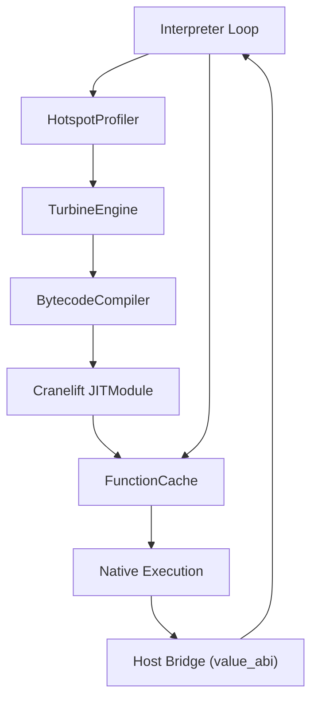
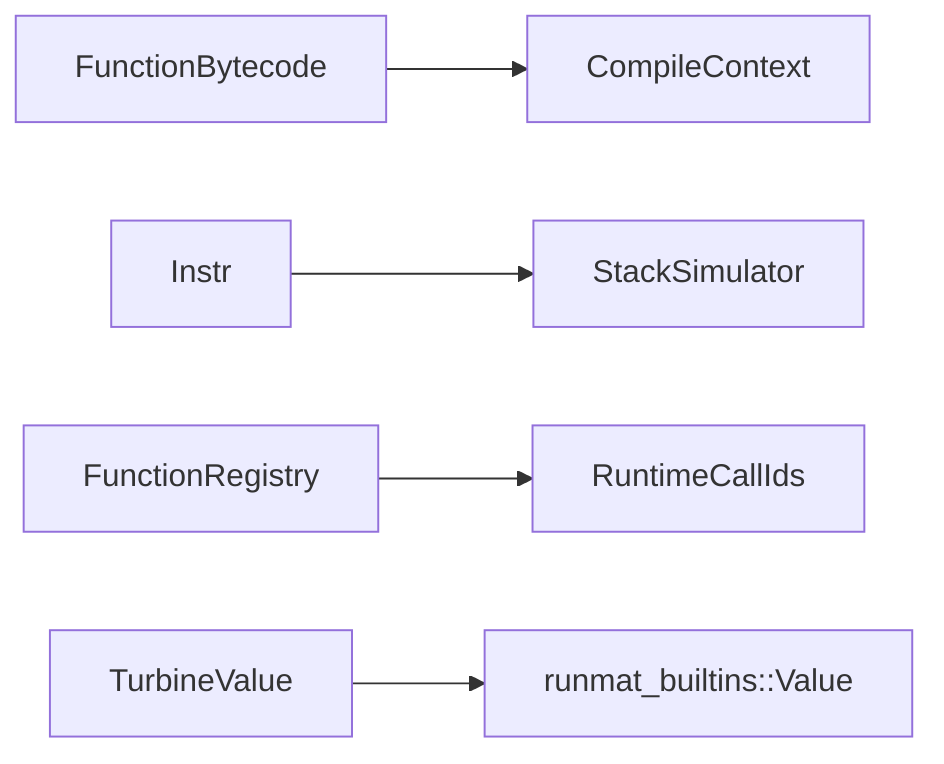

# Turbine JIT Compiler

<details>
<summary>Relevant source files</summary>

- [crates/runmat-turbine/src/compiler.rs](https://github.com/runmat-org/runmat/blob/82685330/crates/runmat-turbine/src/compiler.rs)
- [crates/runmat-turbine/src/lib.rs](https://github.com/runmat-org/runmat/blob/82685330/crates/runmat-turbine/src/lib.rs)
- [crates/runmat-turbine/tests/jit.rs](https://github.com/runmat-org/runmat/blob/82685330/crates/runmat-turbine/tests/jit.rs)
- [crates/runmat-vm/src/bytecode/mod.rs](https://github.com/runmat-org/runmat/blob/82685330/crates/runmat-vm/src/bytecode/mod.rs)
- [crates/runmat-vm/src/bytecode/program.rs](https://github.com/runmat-org/runmat/blob/82685330/crates/runmat-vm/src/bytecode/program.rs)
- [crates/runmat-vm/src/interpreter/state.rs](https://github.com/runmat-org/runmat/blob/82685330/crates/runmat-vm/src/interpreter/state.rs)
- [crates/runmat-vm/src/lib.rs](https://github.com/runmat-org/runmat/blob/82685330/crates/runmat-vm/src/lib.rs)

</details>

The Turbine JIT Compiler is the high-performance optimizing tier of RunMat's execution model [crates/runmat-turbine/src/lib.rs #3-5](https://github.com/runmat-org/runmat/blob/82685330/crates/runmat-turbine/src/lib.rs#L3-L5) It leverages the Cranelift code generation framework to translate hot bytecode sequences into native machine code, providing significant speedups for numeric-heavy MATLAB code while maintaining full compatibility with the VM's complex dynamic semantics through a robust host bridge.

### Tiered Execution Model

RunMat employs a tiered strategy inspired by modern high-performance runtimes:

1. Interpreter: All code begins execution in the `runmat-vm` interpreter loop [crates/runmat-vm/src/interpreter/state.rs #19-37](https://github.com/runmat-org/runmat/blob/82685330/crates/runmat-vm/src/interpreter/state.rs#L19-L37)
2. Profiling: The `HotspotProfiler` tracks execution counts for every function [crates/runmat-turbine/src/profiler.rs #1-10](https://github.com/runmat-org/runmat/blob/82685330/crates/runmat-turbine/src/profiler.rs#L1-L10)
3. JIT Compilation: Once a function exceeds a specific "hotness" threshold (defaulting to 10), the `TurbineEngine` triggers a background compilation via the `BytecodeCompiler` [crates/runmat-turbine/tests/jit.rs #73-100](https://github.com/runmat-org/runmat/blob/82685330/crates/runmat-turbine/tests/jit.rs#L73-L100)
4. Native Execution: Subsequent calls to the function dispatch to the compiled native pointer stored in the `FunctionCache` [crates/runmat-turbine/src/cache.rs #1-15](https://github.com/runmat-org/runmat/blob/82685330/crates/runmat-turbine/src/cache.rs#L1-L15)

### TurbineEngine Lifecycle

The `TurbineEngine` manages the `JITModule`, `FunctionCache`, and the interaction with Cranelift's compilation pipeline.

#### JIT Execution Flow

The following diagram illustrates how the `TurbineEngine` bridges the VM and Native spaces.



<details>
<summary>Rendered SVG</summary>

```svg
<svg id="mermaid-3xxxdvx326b" xmlns="http://www.w3.org/2000/svg" xmlns:xlink="http://www.w3.org/1999/xlink" class="flowchart" style="max-width: 100%; touch-action: none; user-select: none; cursor: grab; min-height: fit-content; max-height: 100%;" viewBox="-148.95099008568724 0 739.1129176713745 1066" role="graphics-document document" aria-roledescription="flowchart-v2" preserveAspectRatio="xMidYMid meet"><style>#mermaid-3xxxdvx326b{font-family:ui-sans-serif,-apple-system,system-ui,Segoe UI,Helvetica;font-size:16px;fill:#ccc;}@keyframes edge-animation-frame{from{stroke-dashoffset:0;}}@keyframes dash{to{stroke-dashoffset:0;}}#mermaid-3xxxdvx326b .edge-animation-slow{stroke-dasharray:9,5!important;stroke-dashoffset:900;animation:dash 50s linear infinite;stroke-linecap:round;}#mermaid-3xxxdvx326b .edge-animation-fast{stroke-dasharray:9,5!important;stroke-dashoffset:900;animation:dash 20s linear infinite;stroke-linecap:round;}#mermaid-3xxxdvx326b .error-icon{fill:#333;}#mermaid-3xxxdvx326b .error-text{fill:#cccccc;stroke:#cccccc;}#mermaid-3xxxdvx326b .edge-thickness-normal{stroke-width:1px;}#mermaid-3xxxdvx326b .edge-thickness-thick{stroke-width:3.5px;}#mermaid-3xxxdvx326b .edge-pattern-solid{stroke-dasharray:0;}#mermaid-3xxxdvx326b .edge-thickness-invisible{stroke-width:0;fill:none;}#mermaid-3xxxdvx326b .edge-pattern-dashed{stroke-dasharray:3;}#mermaid-3xxxdvx326b .edge-pattern-dotted{stroke-dasharray:2;}#mermaid-3xxxdvx326b .marker{fill:#666;stroke:#666;}#mermaid-3xxxdvx326b .marker.cross{stroke:#666;}#mermaid-3xxxdvx326b svg{font-family:ui-sans-serif,-apple-system,system-ui,Segoe UI,Helvetica;font-size:16px;}#mermaid-3xxxdvx326b p{margin:0;}#mermaid-3xxxdvx326b .label{font-family:ui-sans-serif,-apple-system,system-ui,Segoe UI,Helvetica;color:#fff;}#mermaid-3xxxdvx326b .cluster-label text{fill:#fff;}#mermaid-3xxxdvx326b .cluster-label span{color:#fff;}#mermaid-3xxxdvx326b .cluster-label span p{background-color:transparent;}#mermaid-3xxxdvx326b .label text,#mermaid-3xxxdvx326b span{fill:#fff;color:#fff;}#mermaid-3xxxdvx326b .node rect,#mermaid-3xxxdvx326b .node circle,#mermaid-3xxxdvx326b .node ellipse,#mermaid-3xxxdvx326b .node polygon,#mermaid-3xxxdvx326b .node path{fill:#111;stroke:#222;stroke-width:1px;}#mermaid-3xxxdvx326b .rough-node .label text,#mermaid-3xxxdvx326b .node .label text,#mermaid-3xxxdvx326b .image-shape .label,#mermaid-3xxxdvx326b .icon-shape .label{text-anchor:middle;}#mermaid-3xxxdvx326b .node .katex path{fill:#000;stroke:#000;stroke-width:1px;}#mermaid-3xxxdvx326b .rough-node .label,#mermaid-3xxxdvx326b .node .label,#mermaid-3xxxdvx326b .image-shape .label,#mermaid-3xxxdvx326b .icon-shape .label{text-align:center;}#mermaid-3xxxdvx326b .node.clickable{cursor:pointer;}#mermaid-3xxxdvx326b .root .anchor path{fill:#666!important;stroke-width:0;stroke:#666;}#mermaid-3xxxdvx326b .arrowheadPath{fill:#0b0b0b;}#mermaid-3xxxdvx326b .edgePath .path{stroke:#666;stroke-width:1px;}#mermaid-3xxxdvx326b .flowchart-link{stroke:#666;fill:none;}#mermaid-3xxxdvx326b .edgeLabel{background-color:#161616;text-align:center;}#mermaid-3xxxdvx326b .edgeLabel p{background-color:#161616;}#mermaid-3xxxdvx326b .edgeLabel rect{opacity:0.5;background-color:#161616;fill:#161616;}#mermaid-3xxxdvx326b .labelBkg{background-color:rgba(22, 22, 22, 0.5);}#mermaid-3xxxdvx326b .cluster rect{fill:#161616;stroke:#222;stroke-width:1px;}#mermaid-3xxxdvx326b .cluster text{fill:#fff;}#mermaid-3xxxdvx326b .cluster span{color:#fff;}#mermaid-3xxxdvx326b div.mermaidTooltip{position:absolute;text-align:center;max-width:200px;padding:2px;font-family:ui-sans-serif,-apple-system,system-ui,Segoe UI,Helvetica;font-size:12px;background:#333;border:1px solid hsl(0, 0%, 10%);border-radius:2px;pointer-events:none;z-index:100;}#mermaid-3xxxdvx326b .flowchartTitleText{text-anchor:middle;font-size:18px;fill:#ccc;}#mermaid-3xxxdvx326b rect.text{fill:none;stroke-width:0;}#mermaid-3xxxdvx326b .icon-shape,#mermaid-3xxxdvx326b .image-shape{background-color:#161616;text-align:center;}#mermaid-3xxxdvx326b .icon-shape p,#mermaid-3xxxdvx326b .image-shape p{background-color:#161616;padding:2px;}#mermaid-3xxxdvx326b .icon-shape .label rect,#mermaid-3xxxdvx326b .image-shape .label rect{opacity:0.5;background-color:#161616;fill:#161616;}#mermaid-3xxxdvx326b .label-icon{display:inline-block;height:1em;overflow:visible;vertical-align:-0.125em;}#mermaid-3xxxdvx326b .node .label-icon path{fill:currentColor;stroke:revert;stroke-width:revert;}#mermaid-3xxxdvx326b .node .neo-node{stroke:#222;}#mermaid-3xxxdvx326b [data-look="neo"].node rect,#mermaid-3xxxdvx326b [data-look="neo"].cluster rect,#mermaid-3xxxdvx326b [data-look="neo"].node polygon{stroke:url(#mermaid-3xxxdvx326b-gradient);filter:drop-shadow( 1px 2px 2px rgba(185,185,185,1));}#mermaid-3xxxdvx326b [data-look="neo"].node path{stroke:url(#mermaid-3xxxdvx326b-gradient);stroke-width:1px;}#mermaid-3xxxdvx326b [data-look="neo"].node .outer-path{filter:drop-shadow( 1px 2px 2px rgba(185,185,185,1));}#mermaid-3xxxdvx326b [data-look="neo"].node .neo-line path{stroke:#222;filter:none;}#mermaid-3xxxdvx326b [data-look="neo"].node circle{stroke:url(#mermaid-3xxxdvx326b-gradient);filter:drop-shadow( 1px 2px 2px rgba(185,185,185,1));}#mermaid-3xxxdvx326b [data-look="neo"].node circle .state-start{fill:#000000;}#mermaid-3xxxdvx326b [data-look="neo"].icon-shape .icon{fill:url(#mermaid-3xxxdvx326b-gradient);filter:drop-shadow( 1px 2px 2px rgba(185,185,185,1));}#mermaid-3xxxdvx326b [data-look="neo"].icon-shape .icon-neo path{stroke:url(#mermaid-3xxxdvx326b-gradient);filter:drop-shadow( 1px 2px 2px rgba(185,185,185,1));}#mermaid-3xxxdvx326b :root{--mermaid-font-family:"trebuchet ms",verdana,arial,sans-serif;}</style><g><marker id="mermaid-3xxxdvx326b_flowchart-v2-pointEnd" class="marker flowchart-v2" viewBox="0 0 10 10" refX="5" refY="5" markerUnits="userSpaceOnUse" markerWidth="8" markerHeight="8" orient="auto"><path d="M 0 0 L 10 5 L 0 10 z" class="arrowMarkerPath" style="stroke-width: 1; stroke-dasharray: 1, 0;"></path></marker><marker id="mermaid-3xxxdvx326b_flowchart-v2-pointStart" class="marker flowchart-v2" viewBox="0 0 10 10" refX="4.5" refY="5" markerUnits="userSpaceOnUse" markerWidth="8" markerHeight="8" orient="auto"><path d="M 0 5 L 10 10 L 10 0 z" class="arrowMarkerPath" style="stroke-width: 1; stroke-dasharray: 1, 0;"></path></marker><marker id="mermaid-3xxxdvx326b_flowchart-v2-pointEnd-margin" class="marker flowchart-v2" viewBox="0 0 11.5 14" refX="11.5" refY="7" markerUnits="userSpaceOnUse" markerWidth="10.5" markerHeight="14" orient="auto"><path d="M 0 0 L 11.5 7 L 0 14 z" class="arrowMarkerPath" style="stroke-width: 0; stroke-dasharray: 1, 0;"></path></marker><marker id="mermaid-3xxxdvx326b_flowchart-v2-pointStart-margin" class="marker flowchart-v2" viewBox="0 0 11.5 14" refX="1" refY="7" markerUnits="userSpaceOnUse" markerWidth="11.5" markerHeight="14" orient="auto"><polygon points="0,7 11.5,14 11.5,0" class="arrowMarkerPath" style="stroke-width: 0; stroke-dasharray: 1, 0;"></polygon></marker><marker id="mermaid-3xxxdvx326b_flowchart-v2-circleEnd" class="marker flowchart-v2" viewBox="0 0 10 10" refX="11" refY="5" markerUnits="userSpaceOnUse" markerWidth="11" markerHeight="11" orient="auto"><circle cx="5" cy="5" r="5" class="arrowMarkerPath" style="stroke-width: 1; stroke-dasharray: 1, 0;"></circle></marker><marker id="mermaid-3xxxdvx326b_flowchart-v2-circleStart" class="marker flowchart-v2" viewBox="0 0 10 10" refX="-1" refY="5" markerUnits="userSpaceOnUse" markerWidth="11" markerHeight="11" orient="auto"><circle cx="5" cy="5" r="5" class="arrowMarkerPath" style="stroke-width: 1; stroke-dasharray: 1, 0;"></circle></marker><marker id="mermaid-3xxxdvx326b_flowchart-v2-circleEnd-margin" class="marker flowchart-v2" viewBox="0 0 10 10" refY="5" refX="12.25" markerUnits="userSpaceOnUse" markerWidth="14" markerHeight="14" orient="auto"><circle cx="5" cy="5" r="5" class="arrowMarkerPath" style="stroke-width: 0; stroke-dasharray: 1, 0;"></circle></marker><marker id="mermaid-3xxxdvx326b_flowchart-v2-circleStart-margin" class="marker flowchart-v2" viewBox="0 0 10 10" refX="-2" refY="5" markerUnits="userSpaceOnUse" markerWidth="14" markerHeight="14" orient="auto"><circle cx="5" cy="5" r="5" class="arrowMarkerPath" style="stroke-width: 0; stroke-dasharray: 1, 0;"></circle></marker><marker id="mermaid-3xxxdvx326b_flowchart-v2-crossEnd" class="marker cross flowchart-v2" viewBox="0 0 11 11" refX="12" refY="5.2" markerUnits="userSpaceOnUse" markerWidth="11" markerHeight="11" orient="auto"><path d="M 1,1 l 9,9 M 10,1 l -9,9" class="arrowMarkerPath" style="stroke-width: 2; stroke-dasharray: 1, 0;"></path></marker><marker id="mermaid-3xxxdvx326b_flowchart-v2-crossStart" class="marker cross flowchart-v2" viewBox="0 0 11 11" refX="-1" refY="5.2" markerUnits="userSpaceOnUse" markerWidth="11" markerHeight="11" orient="auto"><path d="M 1,1 l 9,9 M 10,1 l -9,9" class="arrowMarkerPath" style="stroke-width: 2; stroke-dasharray: 1, 0;"></path></marker><marker id="mermaid-3xxxdvx326b_flowchart-v2-crossEnd-margin" class="marker cross flowchart-v2" viewBox="0 0 15 15" refX="17.7" refY="7.5" markerUnits="userSpaceOnUse" markerWidth="12" markerHeight="12" orient="auto"><path d="M 1,1 L 14,14 M 1,14 L 14,1" class="arrowMarkerPath" style="stroke-width: 2.5;"></path></marker><marker id="mermaid-3xxxdvx326b_flowchart-v2-crossStart-margin" class="marker cross flowchart-v2" viewBox="0 0 15 15" refX="-3.5" refY="7.5" markerUnits="userSpaceOnUse" markerWidth="12" markerHeight="12" orient="auto"><path d="M 1,1 L 14,14 M 1,14 L 14,1" class="arrowMarkerPath" style="stroke-width: 2.5; stroke-dasharray: 1, 0;"></path></marker><g class="root"><g class="clusters"><g class="cluster" id="mermaid-3xxxdvx326b-subGraph1" data-look="classic"><rect style="" x="8" y="442" width="341.6484375" height="360"></rect><g class="cluster-label" transform="translate(64.25390625, 442)"><foreignObject width="229.140625" height="24"><div style="display: table-cell; white-space: nowrap; line-height: 1.5;" xmlns="http://www.w3.org/1999/xhtml"><span class="nodeLabel"><p>Turbine Space (runmat-turbine)</p></span></div></foreignObject></g></g><g class="cluster" id="mermaid-3xxxdvx326b-subGraph0" data-look="classic"><rect style="" x="22.0546875" y="8" width="399.375" height="360"></rect><g class="cluster-label" transform="translate(136.9296875, 8)"><foreignObject width="169.625" height="24"><div style="display: table-cell; white-space: nowrap; line-height: 1.5;" xmlns="http://www.w3.org/1999/xhtml"><span class="nodeLabel"><p>VM Space (runmat-vm)</p></span></div></foreignObject></g></g></g><g class="edgePaths"><path d="M213.295,87L201.732,93.167C190.17,99.333,167.046,111.667,155.484,123.333C143.922,135,143.922,146,143.922,151.5L143.922,157" id="mermaid-3xxxdvx326b-L_VM_PROF_0" class="edge-thickness-normal edge-pattern-solid edge-thickness-normal edge-pattern-solid flowchart-link" style=";" data-edge="true" data-et="edge" data-id="L_VM_PROF_0" data-points="W3sieCI6MjEzLjI5NDYxNjY5OTIxODc1LCJ5Ijo4N30seyJ4IjoxNDMuOTIxODc1LCJ5IjoxMjR9LHsieCI6MTQzLjkyMTg3NSwieSI6MTYxfV0=" data-look="classic" marker-end="url(#mermaid-3xxxdvx326b_flowchart-v2-pointEnd)"></path><path d="M143.922,215L143.922,221.167C143.922,227.333,143.922,239.667,143.922,251.333C143.922,263,143.922,274,143.922,279.5L143.922,285" id="mermaid-3xxxdvx326b-L_PROF_ENGINE_0" class="edge-thickness-normal edge-pattern-solid edge-thickness-normal edge-pattern-solid flowchart-link" style=";" data-edge="true" data-et="edge" data-id="L_PROF_ENGINE_0" data-points="W3sieCI6MTQzLjkyMTg3NSwieSI6MjE1fSx7IngiOjE0My45MjE4NzUsInkiOjI1Mn0seyJ4IjoxNDMuOTIxODc1LCJ5IjoyODl9XQ==" data-look="classic" marker-end="url(#mermaid-3xxxdvx326b_flowchart-v2-pointEnd)"></path><path d="M143.922,343L143.922,347.167C143.922,351.333,143.922,359.667,143.922,370C143.922,380.333,143.922,392.667,143.922,405C143.922,417.333,143.922,429.667,143.922,439.333C143.922,449,143.922,456,143.922,459.5L143.922,463" id="mermaid-3xxxdvx326b-L_ENGINE_COMP_0" class="edge-thickness-normal edge-pattern-solid edge-thickness-normal edge-pattern-solid flowchart-link" style=";" data-edge="true" data-et="edge" data-id="L_ENGINE_COMP_0" data-points="W3sieCI6MTQzLjkyMTg3NSwieSI6MzQzfSx7IngiOjE0My45MjE4NzUsInkiOjM2OH0seyJ4IjoxNDMuOTIxODc1LCJ5Ijo0MDV9LHsieCI6MTQzLjkyMTg3NSwieSI6NDQyfSx7IngiOjE0My45MjE4NzUsInkiOjQ2N31d" data-look="classic" marker-end="url(#mermaid-3xxxdvx326b_flowchart-v2-pointEnd)"></path><path d="M143.922,521L143.922,527.167C143.922,533.333,143.922,545.667,143.922,557.333C143.922,569,143.922,580,143.922,585.5L143.922,591" id="mermaid-3xxxdvx326b-L_COMP_CL_0" class="edge-thickness-normal edge-pattern-solid edge-thickness-normal edge-pattern-solid flowchart-link" style=";" data-edge="true" data-et="edge" data-id="L_COMP_CL_0" data-points="W3sieCI6MTQzLjkyMTg3NSwieSI6NTIxfSx7IngiOjE0My45MjE4NzUsInkiOjU1OH0seyJ4IjoxNDMuOTIxODc1LCJ5Ijo1OTV9XQ==" data-look="classic" marker-end="url(#mermaid-3xxxdvx326b_flowchart-v2-pointEnd)"></path><path d="M143.922,649L143.922,655.167C143.922,661.333,143.922,673.667,148.311,685.474C152.701,697.281,161.48,708.562,165.869,714.203L170.259,719.843" id="mermaid-3xxxdvx326b-L_CL_CACHE_0" class="edge-thickness-normal edge-pattern-solid edge-thickness-normal edge-pattern-solid flowchart-link" style=";" data-edge="true" data-et="edge" data-id="L_CL_CACHE_0" data-points="W3sieCI6MTQzLjkyMTg3NSwieSI6NjQ5fSx7IngiOjE0My45MjE4NzUsInkiOjY4Nn0seyJ4IjoxNzIuNzE1MjA5OTYwOTM3NSwieSI6NzIzfV0=" data-look="classic" marker-end="url(#mermaid-3xxxdvx326b_flowchart-v2-pointEnd)"></path><path d="M270.637,87L272.171,93.167C273.706,99.333,276.775,111.667,278.309,128.5C279.844,145.333,279.844,166.667,279.844,188C279.844,209.333,279.844,230.667,279.844,252C279.844,273.333,279.844,294.667,279.844,314C279.844,333.333,279.844,350.667,279.844,365.5C279.844,380.333,279.844,392.667,279.844,405C279.844,417.333,279.844,429.667,279.844,444.5C279.844,459.333,279.844,476.667,279.844,496C279.844,515.333,279.844,536.667,279.844,558C279.844,579.333,279.844,600.667,279.844,622C279.844,643.333,279.844,664.667,272.081,681.102C264.318,697.538,248.793,709.076,241.03,714.845L233.268,720.614" id="mermaid-3xxxdvx326b-L_VM_CACHE_0" class="edge-thickness-normal edge-pattern-solid edge-thickness-normal edge-pattern-solid flowchart-link" style=";" data-edge="true" data-et="edge" data-id="L_VM_CACHE_0" data-points="W3sieCI6MjcwLjYzNjY1NzcxNDg0Mzc1LCJ5Ijo4N30seyJ4IjoyNzkuODQzNzUsInkiOjEyNH0seyJ4IjoyNzkuODQzNzUsInkiOjE4OH0seyJ4IjoyNzkuODQzNzUsInkiOjI1Mn0seyJ4IjoyNzkuODQzNzUsInkiOjMxNn0seyJ4IjoyNzkuODQzNzUsInkiOjM2OH0seyJ4IjoyNzkuODQzNzUsInkiOjQwNX0seyJ4IjoyNzkuODQzNzUsInkiOjQ0Mn0seyJ4IjoyNzkuODQzNzUsInkiOjQ5NH0seyJ4IjoyNzkuODQzNzUsInkiOjU1OH0seyJ4IjoyNzkuODQzNzUsInkiOjYyMn0seyJ4IjoyNzkuODQzNzUsInkiOjY4Nn0seyJ4IjoyMzAuMDU3MjUwOTc2NTYyNSwieSI6NzIzfV0=" data-look="classic" marker-end="url(#mermaid-3xxxdvx326b_flowchart-v2-pointEnd)"></path><path d="M193.727,777L193.727,781.167C193.727,785.333,193.727,793.667,193.727,804C193.727,814.333,193.727,826.667,193.727,838.333C193.727,850,193.727,861,193.727,866.5L193.727,872" id="mermaid-3xxxdvx326b-L_CACHE_NATIVE_0" class="edge-thickness-normal edge-pattern-solid edge-thickness-normal edge-pattern-solid flowchart-link" style=";" data-edge="true" data-et="edge" data-id="L_CACHE_NATIVE_0" data-points="W3sieCI6MTkzLjcyNjU2MjUsInkiOjc3N30seyJ4IjoxOTMuNzI2NTYyNSwieSI6ODAyfSx7IngiOjE5My43MjY1NjI1LCJ5Ijo4Mzl9LHsieCI6MTkzLjcyNjU2MjUsInkiOjg3Nn1d" data-look="classic" marker-end="url(#mermaid-3xxxdvx326b_flowchart-v2-pointEnd)"></path><path d="M193.727,930L193.727,936.167C193.727,942.333,193.727,954.667,198.32,966.483C202.913,978.299,212.1,989.598,216.693,995.247L221.286,1000.896" id="mermaid-3xxxdvx326b-L_NATIVE_BRIDGE_0" class="edge-thickness-normal edge-pattern-solid edge-thickness-normal edge-pattern-solid flowchart-link" style=";" data-edge="true" data-et="edge" data-id="L_NATIVE_BRIDGE_0" data-points="W3sieCI6MTkzLjcyNjU2MjUsInkiOjkzMH0seyJ4IjoxOTMuNzI2NTYyNSwieSI6OTY3fSx7IngiOjIyMy44MDkzODcyMDcwMzEyNSwieSI6MTAwNH1d" data-look="classic" marker-end="url(#mermaid-3xxxdvx326b_flowchart-v2-pointEnd)"></path><path d="M311.434,1004L326.433,997.833C341.433,991.667,371.431,979.333,386.43,962.5C401.43,945.667,401.43,924.333,401.43,903C401.43,881.667,401.43,860.333,401.43,843.5C401.43,826.667,401.43,814.333,401.43,799.5C401.43,784.667,401.43,767.333,401.43,748C401.43,728.667,401.43,707.333,401.43,686C401.43,664.667,401.43,643.333,401.43,622C401.43,600.667,401.43,579.333,401.43,558C401.43,536.667,401.43,515.333,401.43,496C401.43,476.667,401.43,459.333,401.43,444.5C401.43,429.667,401.43,417.333,401.43,405C401.43,392.667,401.43,380.333,401.43,365.5C401.43,350.667,401.43,333.333,401.43,314C401.43,294.667,401.43,273.333,401.43,252C401.43,230.667,401.43,209.333,401.43,188C401.43,166.667,401.43,145.333,388.784,128.781C376.139,112.229,350.848,100.459,338.203,94.573L325.557,88.688" id="mermaid-3xxxdvx326b-L_BRIDGE_VM_0" class="edge-thickness-normal edge-pattern-solid edge-thickness-normal edge-pattern-solid flowchart-link" style=";" data-edge="true" data-et="edge" data-id="L_BRIDGE_VM_0" data-points="W3sieCI6MzExLjQzNDE0MzA2NjQwNjI1LCJ5IjoxMDA0fSx7IngiOjQwMS40Mjk2ODc1LCJ5Ijo5Njd9LHsieCI6NDAxLjQyOTY4NzUsInkiOjkwM30seyJ4Ijo0MDEuNDI5Njg3NSwieSI6ODM5fSx7IngiOjQwMS40Mjk2ODc1LCJ5Ijo4MDJ9LHsieCI6NDAxLjQyOTY4NzUsInkiOjc1MH0seyJ4Ijo0MDEuNDI5Njg3NSwieSI6Njg2fSx7IngiOjQwMS40Mjk2ODc1LCJ5Ijo2MjJ9LHsieCI6NDAxLjQyOTY4NzUsInkiOjU1OH0seyJ4Ijo0MDEuNDI5Njg3NSwieSI6NDk0fSx7IngiOjQwMS40Mjk2ODc1LCJ5Ijo0NDJ9LHsieCI6NDAxLjQyOTY4NzUsInkiOjQwNX0seyJ4Ijo0MDEuNDI5Njg3NSwieSI6MzY4fSx7IngiOjQwMS40Mjk2ODc1LCJ5IjozMTZ9LHsieCI6NDAxLjQyOTY4NzUsInkiOjI1Mn0seyJ4Ijo0MDEuNDI5Njg3NSwieSI6MTg4fSx7IngiOjQwMS40Mjk2ODc1LCJ5IjoxMjR9LHsieCI6MzIxLjkzMDcyNTA5NzY1NjI1LCJ5Ijo4N31d" data-look="classic" marker-end="url(#mermaid-3xxxdvx326b_flowchart-v2-pointEnd)"></path></g><g class="edgeLabels"><g class="edgeLabel" transform="translate(143.921875, 124)"><g class="label" data-id="L_VM_PROF_0" transform="translate(-75.265625, -12)"><foreignObject width="150.53125" height="24"><div style="display: table-cell; white-space: nowrap; line-height: 1.5; max-width: 200px; text-align: center;" xmlns="http://www.w3.org/1999/xhtml" class="labelBkg"><span class="edgeLabel"><p>record_execution(id)</p></span></div></foreignObject></g></g><g class="edgeLabel" transform="translate(143.921875, 252)"><g class="label" data-id="L_PROF_ENGINE_0" transform="translate(-63.0546875, -12)"><foreignObject width="126.109375" height="24"><div style="display: table-cell; white-space: nowrap; line-height: 1.5; max-width: 200px; text-align: center;" xmlns="http://www.w3.org/1999/xhtml" class="labelBkg"><span class="edgeLabel"><p>is_hot(id) == true</p></span></div></foreignObject></g></g><g class="edgeLabel" transform="translate(143.921875, 405)"><g class="label" data-id="L_ENGINE_COMP_0" transform="translate(-68.78125, -12)"><foreignObject width="137.5625" height="24"><div style="display: table-cell; white-space: nowrap; line-height: 1.5; max-width: 200px; text-align: center;" xmlns="http://www.w3.org/1999/xhtml" class="labelBkg"><span class="edgeLabel"><p>compile(Bytecode)</p></span></div></foreignObject></g></g><g class="edgeLabel" transform="translate(143.921875, 558)"><g class="label" data-id="L_COMP_CL_0" transform="translate(-39.96875, -12)"><foreignObject width="79.9375" height="24"><div style="display: table-cell; white-space: nowrap; line-height: 1.5; max-width: 200px; text-align: center;" xmlns="http://www.w3.org/1999/xhtml" class="labelBkg"><span class="edgeLabel"><p>Cranelift IR</p></span></div></foreignObject></g></g><g class="edgeLabel" transform="translate(143.921875, 686)"><g class="label" data-id="L_CL_CACHE_0" transform="translate(-44.453125, -12)"><foreignObject width="88.90625" height="24"><div style="display: table-cell; white-space: nowrap; line-height: 1.5; max-width: 200px; text-align: center;" xmlns="http://www.w3.org/1999/xhtml" class="labelBkg"><span class="edgeLabel"><p>Native Code</p></span></div></foreignObject></g></g><g class="edgeLabel" transform="translate(279.84375, 405)"><g class="label" data-id="L_VM_CACHE_0" transform="translate(-24.2578125, -12)"><foreignObject width="48.515625" height="24"><div style="display: table-cell; white-space: nowrap; line-height: 1.5; max-width: 200px; text-align: center;" xmlns="http://www.w3.org/1999/xhtml" class="labelBkg"><span class="edgeLabel"><p>get(id)</p></span></div></foreignObject></g></g><g class="edgeLabel" transform="translate(193.7265625, 839)"><g class="label" data-id="L_CACHE_NATIVE_0" transform="translate(-17.6171875, -12)"><foreignObject width="35.234375" height="24"><div style="display: table-cell; white-space: nowrap; line-height: 1.5; max-width: 200px; text-align: center;" xmlns="http://www.w3.org/1999/xhtml" class="labelBkg"><span class="edgeLabel"><p>fnptr</p></span></div></foreignObject></g></g><g class="edgeLabel" transform="translate(193.7265625, 967)"><g class="label" data-id="L_NATIVE_BRIDGE_0" transform="translate(-32.75, -12)"><foreignObject width="65.5" height="24"><div style="display: table-cell; white-space: nowrap; line-height: 1.5; max-width: 200px; text-align: center;" xmlns="http://www.w3.org/1999/xhtml" class="labelBkg"><span class="edgeLabel"><p>Host Call</p></span></div></foreignObject></g></g><g class="edgeLabel" transform="translate(401.4296875, 558)"><g class="label" data-id="L_BRIDGE_VM_0" transform="translate(-31.78125, -12)"><foreignObject width="63.5625" height="24"><div style="display: table-cell; white-space: nowrap; line-height: 1.5; max-width: 200px; text-align: center;" xmlns="http://www.w3.org/1999/xhtml" class="labelBkg"><span class="edgeLabel"><p>Re-entry</p></span></div></foreignObject></g></g></g><g class="nodes"><g class="node default" id="mermaid-3xxxdvx326b-flowchart-VM-0" data-look="classic" transform="translate(263.91796875, 60)"><rect class="basic label-container" style="" x="-88.6328125" y="-27" width="177.265625" height="54"></rect><g class="label" style="" transform="translate(-58.6328125, -12)"><rect></rect><foreignObject width="117.265625" height="24"><div style="display: table-cell; white-space: nowrap; line-height: 1.5; max-width: 200px; text-align: center;" xmlns="http://www.w3.org/1999/xhtml"><span class="nodeLabel"><p>Interpreter Loop</p></span></div></foreignObject></g></g><g class="node default" id="mermaid-3xxxdvx326b-flowchart-PROF-1" data-look="classic" transform="translate(143.921875, 188)"><rect class="basic label-container" style="" x="-85.1015625" y="-27" width="170.203125" height="54"></rect><g class="label" style="" transform="translate(-55.1015625, -12)"><rect></rect><foreignObject width="110.203125" height="24"><div style="display: table-cell; white-space: nowrap; line-height: 1.5; max-width: 200px; text-align: center;" xmlns="http://www.w3.org/1999/xhtml"><span class="nodeLabel"><p>HotspotProfiler</p></span></div></foreignObject></g></g><g class="node default" id="mermaid-3xxxdvx326b-flowchart-ENGINE-3" data-look="classic" transform="translate(143.921875, 316)"><rect class="basic label-container" style="" x="-81.8203125" y="-27" width="163.640625" height="54"></rect><g class="label" style="" transform="translate(-51.8203125, -12)"><rect></rect><foreignObject width="103.640625" height="24"><div style="display: table-cell; white-space: nowrap; line-height: 1.5; max-width: 200px; text-align: center;" xmlns="http://www.w3.org/1999/xhtml"><span class="nodeLabel"><p>TurbineEngine</p></span></div></foreignObject></g></g><g class="node default" id="mermaid-3xxxdvx326b-flowchart-COMP-5" data-look="classic" transform="translate(143.921875, 494)"><rect class="basic label-container" style="" x="-97.125" y="-27" width="194.25" height="54"></rect><g class="label" style="" transform="translate(-67.125, -12)"><rect></rect><foreignObject width="134.25" height="24"><div style="display: table-cell; white-space: nowrap; line-height: 1.5; max-width: 200px; text-align: center;" xmlns="http://www.w3.org/1999/xhtml"><span class="nodeLabel"><p>BytecodeCompiler</p></span></div></foreignObject></g></g><g class="node default" id="mermaid-3xxxdvx326b-flowchart-CL-7" data-look="classic" transform="translate(143.921875, 622)"><rect class="basic label-container" style="" x="-100.921875" y="-27" width="201.84375" height="54"></rect><g class="label" style="" transform="translate(-70.921875, -12)"><rect></rect><foreignObject width="141.84375" height="24"><div style="display: table-cell; white-space: nowrap; line-height: 1.5; max-width: 200px; text-align: center;" xmlns="http://www.w3.org/1999/xhtml"><span class="nodeLabel"><p>Cranelift JITModule</p></span></div></foreignObject></g></g><g class="node default" id="mermaid-3xxxdvx326b-flowchart-CACHE-9" data-look="classic" transform="translate(193.7265625, 750)"><rect class="basic label-container" style="" x="-84.609375" y="-27" width="169.21875" height="54"></rect><g class="label" style="" transform="translate(-54.609375, -12)"><rect></rect><foreignObject width="109.21875" height="24"><div style="display: table-cell; white-space: nowrap; line-height: 1.5; max-width: 200px; text-align: center;" xmlns="http://www.w3.org/1999/xhtml"><span class="nodeLabel"><p>FunctionCache</p></span></div></foreignObject></g></g><g class="node default" id="mermaid-3xxxdvx326b-flowchart-NATIVE-13" data-look="classic" transform="translate(193.7265625, 903)"><rect class="basic label-container" style="" x="-90.4921875" y="-27" width="180.984375" height="54"></rect><g class="label" style="" transform="translate(-60.4921875, -12)"><rect></rect><foreignObject width="120.984375" height="24"><div style="display: table-cell; white-space: nowrap; line-height: 1.5; max-width: 200px; text-align: center;" xmlns="http://www.w3.org/1999/xhtml"><span class="nodeLabel"><p>Native Execution</p></span></div></foreignObject></g></g><g class="node default" id="mermaid-3xxxdvx326b-flowchart-BRIDGE-15" data-look="classic" transform="translate(245.76171875, 1031)"><rect class="basic label-container" style="" x="-114.96875" y="-27" width="229.9375" height="54"></rect><g class="label" style="" transform="translate(-84.96875, -12)"><rect></rect><foreignObject width="169.9375" height="24"><div style="display: table-cell; white-space: nowrap; line-height: 1.5; max-width: 200px; text-align: center;" xmlns="http://www.w3.org/1999/xhtml"><span class="nodeLabel"><p>Host Bridge (value_abi)</p></span></div></foreignObject></g></g></g></g></g><defs><filter id="mermaid-3xxxdvx326b-drop-shadow" height="130%" width="130%"><feDropShadow dx="4" dy="4" stdDeviation="0" flood-opacity="0.06" flood-color="#000000"></feDropShadow></filter></defs><defs><filter id="mermaid-3xxxdvx326b-drop-shadow-small" height="150%" width="150%"><feDropShadow dx="2" dy="2" stdDeviation="0" flood-opacity="0.06" flood-color="#000000"></feDropShadow></filter></defs><linearGradient id="mermaid-3xxxdvx326b-gradient" gradientUnits="objectBoundingBox" x1="0%" y1="0%" x2="100%" y2="0%"><stop offset="0%" stop-color="#333" stop-opacity="1"></stop><stop offset="100%" stop-color="hsl(-120, 0%, 3.3333333333%)" stop-opacity="1"></stop></linearGradient></svg>
```

</details>

Sources: [crates/runmat-turbine/src/lib.rs #1-46](https://github.com/runmat-org/runmat/blob/82685330/crates/runmat-turbine/src/lib.rs#L1-L46) [crates/runmat-turbine/tests/jit.rs #27-48](https://github.com/runmat-org/runmat/blob/82685330/crates/runmat-turbine/tests/jit.rs#L27-L48) [crates/runmat-turbine/src/compiler.rs #1-12](https://github.com/runmat-org/runmat/blob/82685330/crates/runmat-turbine/src/compiler.rs#L1-L12)

### Component Overview

| Component | Role | Code Entity |
| --- | --- | --- |
| Profiler | Tracks execution frequency and identifies "hot" functions. | HotspotProfiler crates/runmat-turbine/src/profiler.rs |
| Compiler | Translates Instr to Cranelift IR with stack simulation. | BytecodeCompiler crates/runmat-turbine/src/compiler.rs#15-27 |
| Cache | Stores CompiledFunction pointers with LRU eviction. | FunctionCache crates/runmat-turbine/src/cache.rs |
| ABI Bridge | Handles the FFI transition between native code and VM Value. | TurbineValue crates/runmat-turbine/src/value_abi.rs |
| Engine | Orchestrates the JIT lifecycle and environment. | TurbineEngine crates/runmat-turbine/src/lib.rs |

### Code Entity Association

The JIT compiler maps VM-level bytecode structures to Cranelift-level compilation units.



<details>
<summary>Rendered SVG</summary>

```svg
<svg id="mermaid-ugiu06muh1r" xmlns="http://www.w3.org/2000/svg" xmlns:xlink="http://www.w3.org/1999/xlink" class="flowchart" style="max-width: 100%; touch-action: none; user-select: none; cursor: grab; min-height: fit-content; max-height: 100%;" viewBox="-0.01069439265404526 2.842170943040401e-14 862.9588887853081 451.99999999999994" role="graphics-document document" aria-roledescription="flowchart-v2" preserveAspectRatio="xMidYMid meet"><style>#mermaid-ugiu06muh1r{font-family:ui-sans-serif,-apple-system,system-ui,Segoe UI,Helvetica;font-size:16px;fill:#ccc;}@keyframes edge-animation-frame{from{stroke-dashoffset:0;}}@keyframes dash{to{stroke-dashoffset:0;}}#mermaid-ugiu06muh1r .edge-animation-slow{stroke-dasharray:9,5!important;stroke-dashoffset:900;animation:dash 50s linear infinite;stroke-linecap:round;}#mermaid-ugiu06muh1r .edge-animation-fast{stroke-dasharray:9,5!important;stroke-dashoffset:900;animation:dash 20s linear infinite;stroke-linecap:round;}#mermaid-ugiu06muh1r .error-icon{fill:#333;}#mermaid-ugiu06muh1r .error-text{fill:#cccccc;stroke:#cccccc;}#mermaid-ugiu06muh1r .edge-thickness-normal{stroke-width:1px;}#mermaid-ugiu06muh1r .edge-thickness-thick{stroke-width:3.5px;}#mermaid-ugiu06muh1r .edge-pattern-solid{stroke-dasharray:0;}#mermaid-ugiu06muh1r .edge-thickness-invisible{stroke-width:0;fill:none;}#mermaid-ugiu06muh1r .edge-pattern-dashed{stroke-dasharray:3;}#mermaid-ugiu06muh1r .edge-pattern-dotted{stroke-dasharray:2;}#mermaid-ugiu06muh1r .marker{fill:#666;stroke:#666;}#mermaid-ugiu06muh1r .marker.cross{stroke:#666;}#mermaid-ugiu06muh1r svg{font-family:ui-sans-serif,-apple-system,system-ui,Segoe UI,Helvetica;font-size:16px;}#mermaid-ugiu06muh1r p{margin:0;}#mermaid-ugiu06muh1r .label{font-family:ui-sans-serif,-apple-system,system-ui,Segoe UI,Helvetica;color:#fff;}#mermaid-ugiu06muh1r .cluster-label text{fill:#fff;}#mermaid-ugiu06muh1r .cluster-label span{color:#fff;}#mermaid-ugiu06muh1r .cluster-label span p{background-color:transparent;}#mermaid-ugiu06muh1r .label text,#mermaid-ugiu06muh1r span{fill:#fff;color:#fff;}#mermaid-ugiu06muh1r .node rect,#mermaid-ugiu06muh1r .node circle,#mermaid-ugiu06muh1r .node ellipse,#mermaid-ugiu06muh1r .node polygon,#mermaid-ugiu06muh1r .node path{fill:#111;stroke:#222;stroke-width:1px;}#mermaid-ugiu06muh1r .rough-node .label text,#mermaid-ugiu06muh1r .node .label text,#mermaid-ugiu06muh1r .image-shape .label,#mermaid-ugiu06muh1r .icon-shape .label{text-anchor:middle;}#mermaid-ugiu06muh1r .node .katex path{fill:#000;stroke:#000;stroke-width:1px;}#mermaid-ugiu06muh1r .rough-node .label,#mermaid-ugiu06muh1r .node .label,#mermaid-ugiu06muh1r .image-shape .label,#mermaid-ugiu06muh1r .icon-shape .label{text-align:center;}#mermaid-ugiu06muh1r .node.clickable{cursor:pointer;}#mermaid-ugiu06muh1r .root .anchor path{fill:#666!important;stroke-width:0;stroke:#666;}#mermaid-ugiu06muh1r .arrowheadPath{fill:#0b0b0b;}#mermaid-ugiu06muh1r .edgePath .path{stroke:#666;stroke-width:1px;}#mermaid-ugiu06muh1r .flowchart-link{stroke:#666;fill:none;}#mermaid-ugiu06muh1r .edgeLabel{background-color:#161616;text-align:center;}#mermaid-ugiu06muh1r .edgeLabel p{background-color:#161616;}#mermaid-ugiu06muh1r .edgeLabel rect{opacity:0.5;background-color:#161616;fill:#161616;}#mermaid-ugiu06muh1r .labelBkg{background-color:rgba(22, 22, 22, 0.5);}#mermaid-ugiu06muh1r .cluster rect{fill:#161616;stroke:#222;stroke-width:1px;}#mermaid-ugiu06muh1r .cluster text{fill:#fff;}#mermaid-ugiu06muh1r .cluster span{color:#fff;}#mermaid-ugiu06muh1r div.mermaidTooltip{position:absolute;text-align:center;max-width:200px;padding:2px;font-family:ui-sans-serif,-apple-system,system-ui,Segoe UI,Helvetica;font-size:12px;background:#333;border:1px solid hsl(0, 0%, 10%);border-radius:2px;pointer-events:none;z-index:100;}#mermaid-ugiu06muh1r .flowchartTitleText{text-anchor:middle;font-size:18px;fill:#ccc;}#mermaid-ugiu06muh1r rect.text{fill:none;stroke-width:0;}#mermaid-ugiu06muh1r .icon-shape,#mermaid-ugiu06muh1r .image-shape{background-color:#161616;text-align:center;}#mermaid-ugiu06muh1r .icon-shape p,#mermaid-ugiu06muh1r .image-shape p{background-color:#161616;padding:2px;}#mermaid-ugiu06muh1r .icon-shape .label rect,#mermaid-ugiu06muh1r .image-shape .label rect{opacity:0.5;background-color:#161616;fill:#161616;}#mermaid-ugiu06muh1r .label-icon{display:inline-block;height:1em;overflow:visible;vertical-align:-0.125em;}#mermaid-ugiu06muh1r .node .label-icon path{fill:currentColor;stroke:revert;stroke-width:revert;}#mermaid-ugiu06muh1r .node .neo-node{stroke:#222;}#mermaid-ugiu06muh1r [data-look="neo"].node rect,#mermaid-ugiu06muh1r [data-look="neo"].cluster rect,#mermaid-ugiu06muh1r [data-look="neo"].node polygon{stroke:url(#mermaid-ugiu06muh1r-gradient);filter:drop-shadow( 1px 2px 2px rgba(185,185,185,1));}#mermaid-ugiu06muh1r [data-look="neo"].node path{stroke:url(#mermaid-ugiu06muh1r-gradient);stroke-width:1px;}#mermaid-ugiu06muh1r [data-look="neo"].node .outer-path{filter:drop-shadow( 1px 2px 2px rgba(185,185,185,1));}#mermaid-ugiu06muh1r [data-look="neo"].node .neo-line path{stroke:#222;filter:none;}#mermaid-ugiu06muh1r [data-look="neo"].node circle{stroke:url(#mermaid-ugiu06muh1r-gradient);filter:drop-shadow( 1px 2px 2px rgba(185,185,185,1));}#mermaid-ugiu06muh1r [data-look="neo"].node circle .state-start{fill:#000000;}#mermaid-ugiu06muh1r [data-look="neo"].icon-shape .icon{fill:url(#mermaid-ugiu06muh1r-gradient);filter:drop-shadow( 1px 2px 2px rgba(185,185,185,1));}#mermaid-ugiu06muh1r [data-look="neo"].icon-shape .icon-neo path{stroke:url(#mermaid-ugiu06muh1r-gradient);filter:drop-shadow( 1px 2px 2px rgba(185,185,185,1));}#mermaid-ugiu06muh1r :root{--mermaid-font-family:"trebuchet ms",verdana,arial,sans-serif;}</style><g><marker id="mermaid-ugiu06muh1r_flowchart-v2-pointEnd" class="marker flowchart-v2" viewBox="0 0 10 10" refX="5" refY="5" markerUnits="userSpaceOnUse" markerWidth="8" markerHeight="8" orient="auto"><path d="M 0 0 L 10 5 L 0 10 z" class="arrowMarkerPath" style="stroke-width: 1; stroke-dasharray: 1, 0;"></path></marker><marker id="mermaid-ugiu06muh1r_flowchart-v2-pointStart" class="marker flowchart-v2" viewBox="0 0 10 10" refX="4.5" refY="5" markerUnits="userSpaceOnUse" markerWidth="8" markerHeight="8" orient="auto"><path d="M 0 5 L 10 10 L 10 0 z" class="arrowMarkerPath" style="stroke-width: 1; stroke-dasharray: 1, 0;"></path></marker><marker id="mermaid-ugiu06muh1r_flowchart-v2-pointEnd-margin" class="marker flowchart-v2" viewBox="0 0 11.5 14" refX="11.5" refY="7" markerUnits="userSpaceOnUse" markerWidth="10.5" markerHeight="14" orient="auto"><path d="M 0 0 L 11.5 7 L 0 14 z" class="arrowMarkerPath" style="stroke-width: 0; stroke-dasharray: 1, 0;"></path></marker><marker id="mermaid-ugiu06muh1r_flowchart-v2-pointStart-margin" class="marker flowchart-v2" viewBox="0 0 11.5 14" refX="1" refY="7" markerUnits="userSpaceOnUse" markerWidth="11.5" markerHeight="14" orient="auto"><polygon points="0,7 11.5,14 11.5,0" class="arrowMarkerPath" style="stroke-width: 0; stroke-dasharray: 1, 0;"></polygon></marker><marker id="mermaid-ugiu06muh1r_flowchart-v2-circleEnd" class="marker flowchart-v2" viewBox="0 0 10 10" refX="11" refY="5" markerUnits="userSpaceOnUse" markerWidth="11" markerHeight="11" orient="auto"><circle cx="5" cy="5" r="5" class="arrowMarkerPath" style="stroke-width: 1; stroke-dasharray: 1, 0;"></circle></marker><marker id="mermaid-ugiu06muh1r_flowchart-v2-circleStart" class="marker flowchart-v2" viewBox="0 0 10 10" refX="-1" refY="5" markerUnits="userSpaceOnUse" markerWidth="11" markerHeight="11" orient="auto"><circle cx="5" cy="5" r="5" class="arrowMarkerPath" style="stroke-width: 1; stroke-dasharray: 1, 0;"></circle></marker><marker id="mermaid-ugiu06muh1r_flowchart-v2-circleEnd-margin" class="marker flowchart-v2" viewBox="0 0 10 10" refY="5" refX="12.25" markerUnits="userSpaceOnUse" markerWidth="14" markerHeight="14" orient="auto"><circle cx="5" cy="5" r="5" class="arrowMarkerPath" style="stroke-width: 0; stroke-dasharray: 1, 0;"></circle></marker><marker id="mermaid-ugiu06muh1r_flowchart-v2-circleStart-margin" class="marker flowchart-v2" viewBox="0 0 10 10" refX="-2" refY="5" markerUnits="userSpaceOnUse" markerWidth="14" markerHeight="14" orient="auto"><circle cx="5" cy="5" r="5" class="arrowMarkerPath" style="stroke-width: 0; stroke-dasharray: 1, 0;"></circle></marker><marker id="mermaid-ugiu06muh1r_flowchart-v2-crossEnd" class="marker cross flowchart-v2" viewBox="0 0 11 11" refX="12" refY="5.2" markerUnits="userSpaceOnUse" markerWidth="11" markerHeight="11" orient="auto"><path d="M 1,1 l 9,9 M 10,1 l -9,9" class="arrowMarkerPath" style="stroke-width: 2; stroke-dasharray: 1, 0;"></path></marker><marker id="mermaid-ugiu06muh1r_flowchart-v2-crossStart" class="marker cross flowchart-v2" viewBox="0 0 11 11" refX="-1" refY="5.2" markerUnits="userSpaceOnUse" markerWidth="11" markerHeight="11" orient="auto"><path d="M 1,1 l 9,9 M 10,1 l -9,9" class="arrowMarkerPath" style="stroke-width: 2; stroke-dasharray: 1, 0;"></path></marker><marker id="mermaid-ugiu06muh1r_flowchart-v2-crossEnd-margin" class="marker cross flowchart-v2" viewBox="0 0 15 15" refX="17.7" refY="7.5" markerUnits="userSpaceOnUse" markerWidth="12" markerHeight="12" orient="auto"><path d="M 1,1 L 14,14 M 1,14 L 14,1" class="arrowMarkerPath" style="stroke-width: 2.5;"></path></marker><marker id="mermaid-ugiu06muh1r_flowchart-v2-crossStart-margin" class="marker cross flowchart-v2" viewBox="0 0 15 15" refX="-3.5" refY="7.5" markerUnits="userSpaceOnUse" markerWidth="12" markerHeight="12" orient="auto"><path d="M 1,1 L 14,14 M 1,14 L 14,1" class="arrowMarkerPath" style="stroke-width: 2.5; stroke-dasharray: 1, 0;"></path></marker><g class="root"><g class="clusters"><g class="cluster" id="mermaid-ugiu06muh1r-subGraph1" data-look="classic"><rect style="" x="299.90625" y="8" width="226.328125" height="436"></rect><g class="cluster-label" transform="translate(329.578125, 8)"><foreignObject width="166.984375" height="24"><div style="display: table-cell; white-space: nowrap; line-height: 1.5;" xmlns="http://www.w3.org/1999/xhtml"><span class="nodeLabel"><p>runmat-turbine Entities</p></span></div></foreignObject></g></g><g class="cluster" id="mermaid-ugiu06muh1r-subGraph0" data-look="classic"><rect style="" x="8" y="8" width="241.90625" height="332"></rect><g class="cluster-label" transform="translate(60.0546875, 8)"><foreignObject width="137.796875" height="24"><div style="display: table-cell; white-space: nowrap; line-height: 1.5;" xmlns="http://www.w3.org/1999/xhtml"><span class="nodeLabel"><p>runmat-vm Entities</p></span></div></foreignObject></g></g></g><g class="edgePaths"><path d="M224.906,70L229.073,70C233.24,70,241.573,70,249.906,70C258.24,70,266.573,70,274.906,70C283.24,70,291.573,70,299.24,70C306.906,70,313.906,70,317.406,70L320.906,70" id="mermaid-ugiu06muh1r-L_BC_CC_0" class="edge-thickness-normal edge-pattern-solid edge-thickness-normal edge-pattern-solid flowchart-link" style=";" data-edge="true" data-et="edge" data-id="L_BC_CC_0" data-points="W3sieCI6MjI0LjkwNjI1LCJ5Ijo3MH0seyJ4IjoyNDkuOTA2MjUsInkiOjcwfSx7IngiOjI3NC45MDYyNSwieSI6NzB9LHsieCI6Mjk5LjkwNjI1LCJ5Ijo3MH0seyJ4IjozMjQuOTA2MjUsInkiOjcwfV0=" data-look="classic" marker-end="url(#mermaid-ugiu06muh1r_flowchart-v2-pointEnd)"></path><path d="M175.086,174L187.556,174C200.026,174,224.966,174,241.603,174C258.24,174,266.573,174,274.906,174C283.24,174,291.573,174,299.798,174C308.023,174,316.141,174,320.199,174L324.258,174" id="mermaid-ugiu06muh1r-L_INST_SS_0" class="edge-thickness-normal edge-pattern-solid edge-thickness-normal edge-pattern-solid flowchart-link" style=";" data-edge="true" data-et="edge" data-id="L_INST_SS_0" data-points="W3sieCI6MTc1LjA4NTkzNzUsInkiOjE3NH0seyJ4IjoyNDkuOTA2MjUsInkiOjE3NH0seyJ4IjoyNzQuOTA2MjUsInkiOjE3NH0seyJ4IjoyOTkuOTA2MjUsInkiOjE3NH0seyJ4IjozMjguMjU3ODEyNSwieSI6MTc0fV0=" data-look="classic" marker-end="url(#mermaid-ugiu06muh1r_flowchart-v2-pointEnd)"></path><path d="M220.219,278L225.167,278C230.115,278,240.01,278,249.125,278C258.24,278,266.573,278,274.906,278C283.24,278,291.573,278,299.897,278C308.221,278,316.536,278,320.694,278L324.852,278" id="mermaid-ugiu06muh1r-L_REG_RT_0" class="edge-thickness-normal edge-pattern-solid edge-thickness-normal edge-pattern-solid flowchart-link" style=";" data-edge="true" data-et="edge" data-id="L_REG_RT_0" data-points="W3sieCI6MjIwLjIxODc1LCJ5IjoyNzh9LHsieCI6MjQ5LjkwNjI1LCJ5IjoyNzh9LHsieCI6Mjc0LjkwNjI1LCJ5IjoyNzh9LHsieCI6Mjk5LjkwNjI1LCJ5IjoyNzh9LHsieCI6MzI4Ljg1MTU2MjUsInkiOjI3OH1d" data-look="classic" marker-end="url(#mermaid-ugiu06muh1r_flowchart-v2-pointEnd)"></path><path d="M489.813,382L495.883,382C501.953,382,514.094,382,529.194,382C544.294,382,562.354,382,579.747,382C597.141,382,613.867,382,622.23,382L630.594,382" id="mermaid-ugiu06muh1r-L_CV_VMV_0" class="edge-thickness-normal edge-pattern-solid edge-thickness-normal edge-pattern-solid flowchart-link" style=";" data-edge="true" data-et="edge" data-id="L_CV_VMV_0" data-points="W3sieCI6NDg5LjgxMjUsInkiOjM4Mn0seyJ4Ijo1MjYuMjM0Mzc1LCJ5IjozODJ9LHsieCI6NTgwLjQxNDA2MjUsInkiOjM4Mn0seyJ4Ijo2MzQuNTkzNzUsInkiOjM4Mn1d" data-look="classic" marker-end="url(#mermaid-ugiu06muh1r_flowchart-v2-pointEnd)"></path></g><g class="edgeLabels"><g class="edgeLabel"><g class="label" data-id="L_BC_CC_0" transform="translate(0, 0)"><foreignObject width="0" height="0"><div style="display: table-cell; white-space: nowrap; line-height: 1.5; max-width: 200px; text-align: center;" xmlns="http://www.w3.org/1999/xhtml" class="labelBkg"><span class="edgeLabel"></span></div></foreignObject></g></g><g class="edgeLabel"><g class="label" data-id="L_INST_SS_0" transform="translate(0, 0)"><foreignObject width="0" height="0"><div style="display: table-cell; white-space: nowrap; line-height: 1.5; max-width: 200px; text-align: center;" xmlns="http://www.w3.org/1999/xhtml" class="labelBkg"><span class="edgeLabel"></span></div></foreignObject></g></g><g class="edgeLabel"><g class="label" data-id="L_REG_RT_0" transform="translate(0, 0)"><foreignObject width="0" height="0"><div style="display: table-cell; white-space: nowrap; line-height: 1.5; max-width: 200px; text-align: center;" xmlns="http://www.w3.org/1999/xhtml" class="labelBkg"><span class="edgeLabel"></span></div></foreignObject></g></g><g class="edgeLabel" transform="translate(580.4140625, 382)"><g class="label" data-id="L_CV_VMV_0" transform="translate(-29.1796875, -12)"><foreignObject width="58.359375" height="24"><div style="display: table-cell; white-space: nowrap; line-height: 1.5; max-width: 200px; text-align: center;" xmlns="http://www.w3.org/1999/xhtml" class="labelBkg"><span class="edgeLabel"><p>maps to</p></span></div></foreignObject></g></g></g><g class="nodes"><g class="node default" id="mermaid-ugiu06muh1r-flowchart-BC-0" data-look="classic" transform="translate(128.953125, 70)"><rect class="basic label-container" style="" x="-95.953125" y="-27" width="191.90625" height="54"></rect><g class="label" style="" transform="translate(-65.953125, -12)"><rect></rect><foreignObject width="131.90625" height="24"><div style="display: table-cell; white-space: nowrap; line-height: 1.5; max-width: 200px; text-align: center;" xmlns="http://www.w3.org/1999/xhtml"><span class="nodeLabel"><p>FunctionBytecode</p></span></div></foreignObject></g></g><g class="node default" id="mermaid-ugiu06muh1r-flowchart-INST-1" data-look="classic" transform="translate(128.953125, 174)"><rect class="basic label-container" style="" x="-46.1328125" y="-27" width="92.265625" height="54"></rect><g class="label" style="" transform="translate(-16.1328125, -12)"><rect></rect><foreignObject width="32.265625" height="24"><div style="display: table-cell; white-space: nowrap; line-height: 1.5; max-width: 200px; text-align: center;" xmlns="http://www.w3.org/1999/xhtml"><span class="nodeLabel"><p>Instr</p></span></div></foreignObject></g></g><g class="node default" id="mermaid-ugiu06muh1r-flowchart-REG-2" data-look="classic" transform="translate(128.953125, 278)"><rect class="basic label-container" style="" x="-91.265625" y="-27" width="182.53125" height="54"></rect><g class="label" style="" transform="translate(-61.265625, -12)"><rect></rect><foreignObject width="122.53125" height="24"><div style="display: table-cell; white-space: nowrap; line-height: 1.5; max-width: 200px; text-align: center;" xmlns="http://www.w3.org/1999/xhtml"><span class="nodeLabel"><p>FunctionRegistry</p></span></div></foreignObject></g></g><g class="node default" id="mermaid-ugiu06muh1r-flowchart-CC-3" data-look="classic" transform="translate(413.0703125, 70)"><rect class="basic label-container" style="" x="-88.1640625" y="-27" width="176.328125" height="54"></rect><g class="label" style="" transform="translate(-58.1640625, -12)"><rect></rect><foreignObject width="116.328125" height="24"><div style="display: table-cell; white-space: nowrap; line-height: 1.5; max-width: 200px; text-align: center;" xmlns="http://www.w3.org/1999/xhtml"><span class="nodeLabel"><p>CompileContext</p></span></div></foreignObject></g></g><g class="node default" id="mermaid-ugiu06muh1r-flowchart-SS-4" data-look="classic" transform="translate(413.0703125, 174)"><rect class="basic label-container" style="" x="-84.8125" y="-27" width="169.625" height="54"></rect><g class="label" style="" transform="translate(-54.8125, -12)"><rect></rect><foreignObject width="109.625" height="24"><div style="display: table-cell; white-space: nowrap; line-height: 1.5; max-width: 200px; text-align: center;" xmlns="http://www.w3.org/1999/xhtml"><span class="nodeLabel"><p>StackSimulator</p></span></div></foreignObject></g></g><g class="node default" id="mermaid-ugiu06muh1r-flowchart-RT-5" data-look="classic" transform="translate(413.0703125, 278)"><rect class="basic label-container" style="" x="-84.21875" y="-27" width="168.4375" height="54"></rect><g class="label" style="" transform="translate(-54.21875, -12)"><rect></rect><foreignObject width="108.4375" height="24"><div style="display: table-cell; white-space: nowrap; line-height: 1.5; max-width: 200px; text-align: center;" xmlns="http://www.w3.org/1999/xhtml"><span class="nodeLabel"><p>RuntimeCallIds</p></span></div></foreignObject></g></g><g class="node default" id="mermaid-ugiu06muh1r-flowchart-CV-6" data-look="classic" transform="translate(413.0703125, 382)"><rect class="basic label-container" style="" x="-76.7421875" y="-27" width="153.484375" height="54"></rect><g class="label" style="" transform="translate(-46.7421875, -12)"><rect></rect><foreignObject width="93.484375" height="24"><div style="display: table-cell; white-space: nowrap; line-height: 1.5; max-width: 200px; text-align: center;" xmlns="http://www.w3.org/1999/xhtml"><span class="nodeLabel"><p>TurbineValue</p></span></div></foreignObject></g></g><g class="node default" id="mermaid-ugiu06muh1r-flowchart-VMV-14" data-look="classic" transform="translate(744.765625, 382)"><rect class="basic label-container" style="" x="-110.171875" y="-27" width="220.34375" height="54"></rect><g class="label" style="" transform="translate(-80.171875, -12)"><rect></rect><foreignObject width="160.34375" height="24"><div style="display: table-cell; white-space: nowrap; line-height: 1.5; max-width: 200px; text-align: center;" xmlns="http://www.w3.org/1999/xhtml"><span class="nodeLabel"><p>runmat_builtins::Value</p></span></div></foreignObject></g></g></g></g></g><defs><filter id="mermaid-ugiu06muh1r-drop-shadow" height="130%" width="130%"><feDropShadow dx="4" dy="4" stdDeviation="0" flood-opacity="0.06" flood-color="#000000"></feDropShadow></filter></defs><defs><filter id="mermaid-ugiu06muh1r-drop-shadow-small" height="150%" width="150%"><feDropShadow dx="2" dy="2" stdDeviation="0" flood-opacity="0.06" flood-color="#000000"></feDropShadow></filter></defs><linearGradient id="mermaid-ugiu06muh1r-gradient" gradientUnits="objectBoundingBox" x1="0%" y1="0%" x2="100%" y2="0%"><stop offset="0%" stop-color="#333" stop-opacity="1"></stop><stop offset="100%" stop-color="hsl(-120, 0%, 3.3333333333%)" stop-opacity="1"></stop></linearGradient></svg>
```

</details>

Sources: [crates/runmat-turbine/src/compiler.rs #16-47](https://github.com/runmat-org/runmat/blob/82685330/crates/runmat-turbine/src/compiler.rs#L16-L47) [crates/runmat-turbine/src/value_abi.rs #1-20](https://github.com/runmat-org/runmat/blob/82685330/crates/runmat-turbine/src/value_abi.rs#L1-L20) [crates/runmat-vm/src/bytecode/program.rs #35-57](https://github.com/runmat-org/runmat/blob/82685330/crates/runmat-vm/src/bytecode/program.rs#L35-L57)

### Sub-Systems

#### JIT Compilation Pipeline

The compilation process involves performing a Control Flow Graph (CFG) analysis on the bytecode `Instr` stream [crates/runmat-turbine/src/compiler.rs #119-124](https://github.com/runmat-org/runmat/blob/82685330/crates/runmat-turbine/src/compiler.rs#L119-L124) It uses a `StackSimulator` to track value types, allowing numeric operations (e.g., `f64` additions) to stay in CPU registers while complex types (cells, structs) are handled via host calls [crates/runmat-turbine/src/compiler.rs #66-88](https://github.com/runmat-org/runmat/blob/82685330/crates/runmat-turbine/src/compiler.rs#L66-L88) For details, see [JIT Compilation Pipeline](https://app.devin.ai/org/runmat-org/wiki/runmat-org/runmat?branch=dev#4.1).

#### TurbineValue ABI & Host Bridge

Because the JIT cannot compile every MATLAB built-in (like `fft` or `eig`), it uses a specialized ABI. `TurbineValue` is a FFI-safe representation of the `Value` enum [crates/runmat-turbine/src/value_abi.rs](https://github.com/runmat-org/runmat/blob/82685330/crates/runmat-turbine/src/value_abi.rs) The JIT emits calls to "bridge" functions such as `runmat_call_semantic_function` to drop back into the Rust runtime for complex operations [crates/runmat-turbine/src/compiler.rs #20-27](https://github.com/runmat-org/runmat/blob/82685330/crates/runmat-turbine/src/compiler.rs#L20-L27) For details, see [TurbineValue ABI & Host Bridge](https://app.devin.ai/org/runmat-org/wiki/runmat-org/runmat?branch=dev#4.2).

### Technical Constraints

- Stack Management: Turbine uses a dedicated fallback stack (default 16MB) to prevent overflows during deep recursive JIT calls [crates/runmat-turbine/src/lib.rs #47-57](https://github.com/runmat-org/runmat/blob/82685330/crates/runmat-turbine/src/lib.rs#L47-L57)
- Thread Safety: The engine uses a `ThreadSafeFunctionCache` to allow multiple execution threads to share compiled native code [crates/runmat-turbine/tests/jit.rs #227-235](https://github.com/runmat-org/runmat/blob/82685330/crates/runmat-turbine/tests/jit.rs#L227-L235)
- Runtime Context: A thread-local `RUNTIME_CONTEXT` is used to provide native code access to the `FunctionRegistry` during host callbacks [crates/runmat-turbine/src/lib.rs #83-104](https://github.com/runmat-org/runmat/blob/82685330/crates/runmat-turbine/src/lib.rs#L83-L104)

Sources: [crates/runmat-turbine/src/lib.rs #1-104](https://github.com/runmat-org/runmat/blob/82685330/crates/runmat-turbine/src/lib.rs#L1-L104) [crates/runmat-turbine/src/compiler.rs #1-105](https://github.com/runmat-org/runmat/blob/82685330/crates/runmat-turbine/src/compiler.rs#L1-L105) [crates/runmat-vm/src/bytecode/program.rs #59-87](https://github.com/runmat-org/runmat/blob/82685330/crates/runmat-vm/src/bytecode/program.rs#L59-L87)
