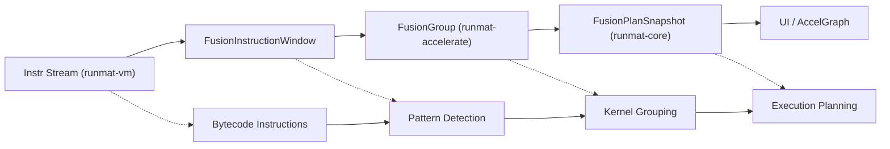
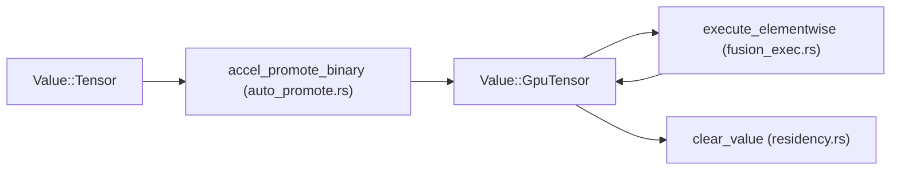

# Fusion Engine & Residency Management

<details>
<summary>Relevant source files</summary>

- [crates/runmat-accelerate/src/fusion.rs](https://github.com/runmat-org/runmat/blob/82685330/crates/runmat-accelerate/src/fusion.rs)
- [crates/runmat-core/src/execution/mod.rs](https://github.com/runmat-org/runmat/blob/82685330/crates/runmat-core/src/execution/mod.rs)
- [crates/runmat-core/src/execution/types.rs](https://github.com/runmat-org/runmat/blob/82685330/crates/runmat-core/src/execution/types.rs)
- [crates/runmat-core/src/fusion/mod.rs](https://github.com/runmat-org/runmat/blob/82685330/crates/runmat-core/src/fusion/mod.rs)
- [crates/runmat-core/src/fusion/snapshot.rs](https://github.com/runmat-org/runmat/blob/82685330/crates/runmat-core/src/fusion/snapshot.rs)
- [crates/runmat-core/src/fusion/types.rs](https://github.com/runmat-org/runmat/blob/82685330/crates/runmat-core/src/fusion/types.rs)
- [crates/runmat-core/src/profiling.rs](https://github.com/runmat-org/runmat/blob/82685330/crates/runmat-core/src/profiling.rs)
- [crates/runmat-core/src/session/compile.rs](https://github.com/runmat-org/runmat/blob/82685330/crates/runmat-core/src/session/compile.rs)
- [crates/runmat-core/src/session/config.rs](https://github.com/runmat-org/runmat/blob/82685330/crates/runmat-core/src/session/config.rs)
- [crates/runmat-core/src/session/mod.rs](https://github.com/runmat-org/runmat/blob/82685330/crates/runmat-core/src/session/mod.rs)
- [crates/runmat-core/src/session/run.rs](https://github.com/runmat-org/runmat/blob/82685330/crates/runmat-core/src/session/run.rs)
- [crates/runmat-core/src/session/snapshot.rs](https://github.com/runmat-org/runmat/blob/82685330/crates/runmat-core/src/session/snapshot.rs)
- [crates/runmat-core/src/session/workspace.rs](https://github.com/runmat-org/runmat/blob/82685330/crates/runmat-core/src/session/workspace.rs)
- [crates/runmat-core/src/tests.rs](https://github.com/runmat-org/runmat/blob/82685330/crates/runmat-core/src/tests.rs)
- [crates/runmat-core/src/workspace/emit.rs](https://github.com/runmat-org/runmat/blob/82685330/crates/runmat-core/src/workspace/emit.rs)
- [crates/runmat-core/src/workspace/mod.rs](https://github.com/runmat-org/runmat/blob/82685330/crates/runmat-core/src/workspace/mod.rs)
- [crates/runmat-core/tests/fusion_regressions.rs](https://github.com/runmat-org/runmat/blob/82685330/crates/runmat-core/tests/fusion_regressions.rs)
- [crates/runmat-runtime/src/builtins/math/rounding/ceil.rs](https://github.com/runmat-org/runmat/blob/82685330/crates/runmat-runtime/src/builtins/math/rounding/ceil.rs)
- [crates/runmat-runtime/src/builtins/math/rounding/fix.rs](https://github.com/runmat-org/runmat/blob/82685330/crates/runmat-runtime/src/builtins/math/rounding/fix.rs)
- [crates/runmat-runtime/src/builtins/math/rounding/floor.rs](https://github.com/runmat-org/runmat/blob/82685330/crates/runmat-runtime/src/builtins/math/rounding/floor.rs)
- [crates/runmat-runtime/src/builtins/math/rounding/mod.rs](https://github.com/runmat-org/runmat/blob/82685330/crates/runmat-runtime/src/builtins/math/rounding/mod.rs)
- [crates/runmat-runtime/src/builtins/math/rounding/rem.rs](https://github.com/runmat-org/runmat/blob/82685330/crates/runmat-runtime/src/builtins/math/rounding/rem.rs)
- [crates/runmat-runtime/src/builtins/math/rounding/round.rs](https://github.com/runmat-org/runmat/blob/82685330/crates/runmat-runtime/src/builtins/math/rounding/round.rs)
- [crates/runmat-vm/src/accel/auto_promote.rs](https://github.com/runmat-org/runmat/blob/82685330/crates/runmat-vm/src/accel/auto_promote.rs)
- [crates/runmat-vm/src/accel/fusion.rs](https://github.com/runmat-org/runmat/blob/82685330/crates/runmat-vm/src/accel/fusion.rs)
- [crates/runmat-vm/src/accel/mod.rs](https://github.com/runmat-org/runmat/blob/82685330/crates/runmat-vm/src/accel/mod.rs)
- [crates/runmat-vm/src/accel/residency.rs](https://github.com/runmat-org/runmat/blob/82685330/crates/runmat-vm/src/accel/residency.rs)
- [crates/runmat-vm/src/indexing/end_expr.rs](https://github.com/runmat-org/runmat/blob/82685330/crates/runmat-vm/src/indexing/end_expr.rs)
- [crates/runmat-vm/src/indexing/mod.rs](https://github.com/runmat-org/runmat/blob/82685330/crates/runmat-vm/src/indexing/mod.rs)
- [crates/runmat-vm/src/indexing/read_linear.rs](https://github.com/runmat-org/runmat/blob/82685330/crates/runmat-vm/src/indexing/read_linear.rs)
- [crates/runmat-vm/src/interpreter/dispatch/arithmetic.rs](https://github.com/runmat-org/runmat/blob/82685330/crates/runmat-vm/src/interpreter/dispatch/arithmetic.rs)
- [crates/runmat-vm/src/ops/arithmetic.rs](https://github.com/runmat-org/runmat/blob/82685330/crates/runmat-vm/src/ops/arithmetic.rs)
- [crates/runmat-vm/src/ops/arrays.rs](https://github.com/runmat-org/runmat/blob/82685330/crates/runmat-vm/src/ops/arrays.rs)
- [crates/runmat-vm/src/ops/cells.rs](https://github.com/runmat-org/runmat/blob/82685330/crates/runmat-vm/src/ops/cells.rs)
- [crates/runmat-vm/src/ops/comparison.rs](https://github.com/runmat-org/runmat/blob/82685330/crates/runmat-vm/src/ops/comparison.rs)

</details>

The RunMat Fusion Engine is a sophisticated optimization layer that identifies sequences of operations suitable for GPU acceleration. It bridges the gap between high-level MATLAB semantics and high-performance GPU kernels by analyzing the execution graph, managing data residency between CPU and GPU memory, and generating execution plans for the `wgpu` backend.

## Fusion Engine Architecture

The fusion engine operates by transforming a stream of instructions or an intermediate representation into a structured `AccelGraph`. This graph is then analyzed to find "Fusion Candidate Groups"—clusters of operations that can be executed as a single GPU kernel to minimize memory bandwidth bottlenecks.

### Core Components

- AccelGraph: A directed acyclic graph (DAG) representing operations (`AccelNode`) and data dependencies (`ValueId`) [crates/runmat-accelerate/src/fusion.rs #13-16](https://github.com/runmat-org/runmat/blob/82685330/crates/runmat-accelerate/src/fusion.rs#L13-L16)
- FusionCandidateGroup: A group of instructions identified during bytecode compilation or MIR analysis as potential fusion targets [crates/runmat-core/src/fusion/snapshot.rs #11-12](https://github.com/runmat-org/runmat/blob/82685330/crates/runmat-core/src/fusion/snapshot.rs#L11-L12)
- FusionInstructionWindow: A sliding window over the VM instruction stream used to detect patterns like elementwise chains or reductions at runtime [crates/runmat-core/src/fusion/snapshot.rs #12](https://github.com/runmat-org/runmat/blob/82685330/crates/runmat-core/src/fusion/snapshot.rs#L12-L12)
- FusionPlanner: The logic responsible for deciding which groups to offload based on shape information and cost heuristics [crates/runmat-core/src/fusion/snapshot.rs #13-14](https://github.com/runmat-org/runmat/blob/82685330/crates/runmat-core/src/fusion/snapshot.rs#L13-L14)

### Data Flow: From Instructions to Fusion Plan

The following diagram illustrates how the system transitions from bytecode instructions to a finalized fusion plan.

Instruction Fusion Pipeline



<details>
<summary>Rendered SVG</summary>

```svg
<svg id="mermaid-gjjvwlrg40j" xmlns="http://www.w3.org/2000/svg" xmlns:xlink="http://www.w3.org/1999/xlink" class="flowchart" style="max-width: 100%; touch-action: none; user-select: none; cursor: grab; min-height: fit-content; max-height: 100%;" viewBox="-0.002926680048403796 0 846.9511658600968 705" role="graphics-document document" aria-roledescription="flowchart-v2" preserveAspectRatio="xMidYMid meet"><style>#mermaid-gjjvwlrg40j{font-family:ui-sans-serif,-apple-system,system-ui,Segoe UI,Helvetica;font-size:16px;fill:#ccc;}@keyframes edge-animation-frame{from{stroke-dashoffset:0;}}@keyframes dash{to{stroke-dashoffset:0;}}#mermaid-gjjvwlrg40j .edge-animation-slow{stroke-dasharray:9,5!important;stroke-dashoffset:900;animation:dash 50s linear infinite;stroke-linecap:round;}#mermaid-gjjvwlrg40j .edge-animation-fast{stroke-dasharray:9,5!important;stroke-dashoffset:900;animation:dash 20s linear infinite;stroke-linecap:round;}#mermaid-gjjvwlrg40j .error-icon{fill:#333;}#mermaid-gjjvwlrg40j .error-text{fill:#cccccc;stroke:#cccccc;}#mermaid-gjjvwlrg40j .edge-thickness-normal{stroke-width:1px;}#mermaid-gjjvwlrg40j .edge-thickness-thick{stroke-width:3.5px;}#mermaid-gjjvwlrg40j .edge-pattern-solid{stroke-dasharray:0;}#mermaid-gjjvwlrg40j .edge-thickness-invisible{stroke-width:0;fill:none;}#mermaid-gjjvwlrg40j .edge-pattern-dashed{stroke-dasharray:3;}#mermaid-gjjvwlrg40j .edge-pattern-dotted{stroke-dasharray:2;}#mermaid-gjjvwlrg40j .marker{fill:#666;stroke:#666;}#mermaid-gjjvwlrg40j .marker.cross{stroke:#666;}#mermaid-gjjvwlrg40j svg{font-family:ui-sans-serif,-apple-system,system-ui,Segoe UI,Helvetica;font-size:16px;}#mermaid-gjjvwlrg40j p{margin:0;}#mermaid-gjjvwlrg40j .label{font-family:ui-sans-serif,-apple-system,system-ui,Segoe UI,Helvetica;color:#fff;}#mermaid-gjjvwlrg40j .cluster-label text{fill:#fff;}#mermaid-gjjvwlrg40j .cluster-label span{color:#fff;}#mermaid-gjjvwlrg40j .cluster-label span p{background-color:transparent;}#mermaid-gjjvwlrg40j .label text,#mermaid-gjjvwlrg40j span{fill:#fff;color:#fff;}#mermaid-gjjvwlrg40j .node rect,#mermaid-gjjvwlrg40j .node circle,#mermaid-gjjvwlrg40j .node ellipse,#mermaid-gjjvwlrg40j .node polygon,#mermaid-gjjvwlrg40j .node path{fill:#111;stroke:#222;stroke-width:1px;}#mermaid-gjjvwlrg40j .rough-node .label text,#mermaid-gjjvwlrg40j .node .label text,#mermaid-gjjvwlrg40j .image-shape .label,#mermaid-gjjvwlrg40j .icon-shape .label{text-anchor:middle;}#mermaid-gjjvwlrg40j .node .katex path{fill:#000;stroke:#000;stroke-width:1px;}#mermaid-gjjvwlrg40j .rough-node .label,#mermaid-gjjvwlrg40j .node .label,#mermaid-gjjvwlrg40j .image-shape .label,#mermaid-gjjvwlrg40j .icon-shape .label{text-align:center;}#mermaid-gjjvwlrg40j .node.clickable{cursor:pointer;}#mermaid-gjjvwlrg40j .root .anchor path{fill:#666!important;stroke-width:0;stroke:#666;}#mermaid-gjjvwlrg40j .arrowheadPath{fill:#0b0b0b;}#mermaid-gjjvwlrg40j .edgePath .path{stroke:#666;stroke-width:1px;}#mermaid-gjjvwlrg40j .flowchart-link{stroke:#666;fill:none;}#mermaid-gjjvwlrg40j .edgeLabel{background-color:#161616;text-align:center;}#mermaid-gjjvwlrg40j .edgeLabel p{background-color:#161616;}#mermaid-gjjvwlrg40j .edgeLabel rect{opacity:0.5;background-color:#161616;fill:#161616;}#mermaid-gjjvwlrg40j .labelBkg{background-color:rgba(22, 22, 22, 0.5);}#mermaid-gjjvwlrg40j .cluster rect{fill:#161616;stroke:#222;stroke-width:1px;}#mermaid-gjjvwlrg40j .cluster text{fill:#fff;}#mermaid-gjjvwlrg40j .cluster span{color:#fff;}#mermaid-gjjvwlrg40j div.mermaidTooltip{position:absolute;text-align:center;max-width:200px;padding:2px;font-family:ui-sans-serif,-apple-system,system-ui,Segoe UI,Helvetica;font-size:12px;background:#333;border:1px solid hsl(0, 0%, 10%);border-radius:2px;pointer-events:none;z-index:100;}#mermaid-gjjvwlrg40j .flowchartTitleText{text-anchor:middle;font-size:18px;fill:#ccc;}#mermaid-gjjvwlrg40j rect.text{fill:none;stroke-width:0;}#mermaid-gjjvwlrg40j .icon-shape,#mermaid-gjjvwlrg40j .image-shape{background-color:#161616;text-align:center;}#mermaid-gjjvwlrg40j .icon-shape p,#mermaid-gjjvwlrg40j .image-shape p{background-color:#161616;padding:2px;}#mermaid-gjjvwlrg40j .icon-shape .label rect,#mermaid-gjjvwlrg40j .image-shape .label rect{opacity:0.5;background-color:#161616;fill:#161616;}#mermaid-gjjvwlrg40j .label-icon{display:inline-block;height:1em;overflow:visible;vertical-align:-0.125em;}#mermaid-gjjvwlrg40j .node .label-icon path{fill:currentColor;stroke:revert;stroke-width:revert;}#mermaid-gjjvwlrg40j .node .neo-node{stroke:#222;}#mermaid-gjjvwlrg40j [data-look="neo"].node rect,#mermaid-gjjvwlrg40j [data-look="neo"].cluster rect,#mermaid-gjjvwlrg40j [data-look="neo"].node polygon{stroke:url(#mermaid-gjjvwlrg40j-gradient);filter:drop-shadow( 1px 2px 2px rgba(185,185,185,1));}#mermaid-gjjvwlrg40j [data-look="neo"].node path{stroke:url(#mermaid-gjjvwlrg40j-gradient);stroke-width:1px;}#mermaid-gjjvwlrg40j [data-look="neo"].node .outer-path{filter:drop-shadow( 1px 2px 2px rgba(185,185,185,1));}#mermaid-gjjvwlrg40j [data-look="neo"].node .neo-line path{stroke:#222;filter:none;}#mermaid-gjjvwlrg40j [data-look="neo"].node circle{stroke:url(#mermaid-gjjvwlrg40j-gradient);filter:drop-shadow( 1px 2px 2px rgba(185,185,185,1));}#mermaid-gjjvwlrg40j [data-look="neo"].node circle .state-start{fill:#000000;}#mermaid-gjjvwlrg40j [data-look="neo"].icon-shape .icon{fill:url(#mermaid-gjjvwlrg40j-gradient);filter:drop-shadow( 1px 2px 2px rgba(185,185,185,1));}#mermaid-gjjvwlrg40j [data-look="neo"].icon-shape .icon-neo path{stroke:url(#mermaid-gjjvwlrg40j-gradient);filter:drop-shadow( 1px 2px 2px rgba(185,185,185,1));}#mermaid-gjjvwlrg40j :root{--mermaid-font-family:"trebuchet ms",verdana,arial,sans-serif;}</style><g><marker id="mermaid-gjjvwlrg40j_flowchart-v2-pointEnd" class="marker flowchart-v2" viewBox="0 0 10 10" refX="5" refY="5" markerUnits="userSpaceOnUse" markerWidth="8" markerHeight="8" orient="auto"><path d="M 0 0 L 10 5 L 0 10 z" class="arrowMarkerPath" style="stroke-width: 1; stroke-dasharray: 1, 0;"></path></marker><marker id="mermaid-gjjvwlrg40j_flowchart-v2-pointStart" class="marker flowchart-v2" viewBox="0 0 10 10" refX="4.5" refY="5" markerUnits="userSpaceOnUse" markerWidth="8" markerHeight="8" orient="auto"><path d="M 0 5 L 10 10 L 10 0 z" class="arrowMarkerPath" style="stroke-width: 1; stroke-dasharray: 1, 0;"></path></marker><marker id="mermaid-gjjvwlrg40j_flowchart-v2-pointEnd-margin" class="marker flowchart-v2" viewBox="0 0 11.5 14" refX="11.5" refY="7" markerUnits="userSpaceOnUse" markerWidth="10.5" markerHeight="14" orient="auto"><path d="M 0 0 L 11.5 7 L 0 14 z" class="arrowMarkerPath" style="stroke-width: 0; stroke-dasharray: 1, 0;"></path></marker><marker id="mermaid-gjjvwlrg40j_flowchart-v2-pointStart-margin" class="marker flowchart-v2" viewBox="0 0 11.5 14" refX="1" refY="7" markerUnits="userSpaceOnUse" markerWidth="11.5" markerHeight="14" orient="auto"><polygon points="0,7 11.5,14 11.5,0" class="arrowMarkerPath" style="stroke-width: 0; stroke-dasharray: 1, 0;"></polygon></marker><marker id="mermaid-gjjvwlrg40j_flowchart-v2-circleEnd" class="marker flowchart-v2" viewBox="0 0 10 10" refX="11" refY="5" markerUnits="userSpaceOnUse" markerWidth="11" markerHeight="11" orient="auto"><circle cx="5" cy="5" r="5" class="arrowMarkerPath" style="stroke-width: 1; stroke-dasharray: 1, 0;"></circle></marker><marker id="mermaid-gjjvwlrg40j_flowchart-v2-circleStart" class="marker flowchart-v2" viewBox="0 0 10 10" refX="-1" refY="5" markerUnits="userSpaceOnUse" markerWidth="11" markerHeight="11" orient="auto"><circle cx="5" cy="5" r="5" class="arrowMarkerPath" style="stroke-width: 1; stroke-dasharray: 1, 0;"></circle></marker><marker id="mermaid-gjjvwlrg40j_flowchart-v2-circleEnd-margin" class="marker flowchart-v2" viewBox="0 0 10 10" refY="5" refX="12.25" markerUnits="userSpaceOnUse" markerWidth="14" markerHeight="14" orient="auto"><circle cx="5" cy="5" r="5" class="arrowMarkerPath" style="stroke-width: 0; stroke-dasharray: 1, 0;"></circle></marker><marker id="mermaid-gjjvwlrg40j_flowchart-v2-circleStart-margin" class="marker flowchart-v2" viewBox="0 0 10 10" refX="-2" refY="5" markerUnits="userSpaceOnUse" markerWidth="14" markerHeight="14" orient="auto"><circle cx="5" cy="5" r="5" class="arrowMarkerPath" style="stroke-width: 0; stroke-dasharray: 1, 0;"></circle></marker><marker id="mermaid-gjjvwlrg40j_flowchart-v2-crossEnd" class="marker cross flowchart-v2" viewBox="0 0 11 11" refX="12" refY="5.2" markerUnits="userSpaceOnUse" markerWidth="11" markerHeight="11" orient="auto"><path d="M 1,1 l 9,9 M 10,1 l -9,9" class="arrowMarkerPath" style="stroke-width: 2; stroke-dasharray: 1, 0;"></path></marker><marker id="mermaid-gjjvwlrg40j_flowchart-v2-crossStart" class="marker cross flowchart-v2" viewBox="0 0 11 11" refX="-1" refY="5.2" markerUnits="userSpaceOnUse" markerWidth="11" markerHeight="11" orient="auto"><path d="M 1,1 l 9,9 M 10,1 l -9,9" class="arrowMarkerPath" style="stroke-width: 2; stroke-dasharray: 1, 0;"></path></marker><marker id="mermaid-gjjvwlrg40j_flowchart-v2-crossEnd-margin" class="marker cross flowchart-v2" viewBox="0 0 15 15" refX="17.7" refY="7.5" markerUnits="userSpaceOnUse" markerWidth="12" markerHeight="12" orient="auto"><path d="M 1,1 L 14,14 M 1,14 L 14,1" class="arrowMarkerPath" style="stroke-width: 2.5;"></path></marker><marker id="mermaid-gjjvwlrg40j_flowchart-v2-crossStart-margin" class="marker cross flowchart-v2" viewBox="0 0 15 15" refX="-3.5" refY="7.5" markerUnits="userSpaceOnUse" markerWidth="12" markerHeight="12" orient="auto"><path d="M 1,1 L 14,14 M 1,14 L 14,1" class="arrowMarkerPath" style="stroke-width: 2.5; stroke-dasharray: 1, 0;"></path></marker><g class="root"><g class="clusters"><g class="cluster" id="mermaid-gjjvwlrg40j-subGraph1" data-look="classic"><rect style="" x="550.3984375" y="161" width="288.546875" height="536"></rect><g class="cluster-label" transform="translate(605.7265625, 161)"><foreignObject width="177.890625" height="24"><div style="display: table-cell; white-space: nowrap; line-height: 1.5;" xmlns="http://www.w3.org/1999/xhtml"><span class="nodeLabel"><p>Natural Language Space</p></span></div></foreignObject></g></g><g class="cluster" id="mermaid-gjjvwlrg40j-subGraph0" data-look="classic"><rect style="" x="8" y="8" width="522.3984375" height="689"></rect><g class="cluster-label" transform="translate(202.41015625, 8)"><foreignObject width="133.578125" height="24"><div style="display: table-cell; white-space: nowrap; line-height: 1.5;" xmlns="http://www.w3.org/1999/xhtml"><span class="nodeLabel"><p>Code Entity Space</p></span></div></foreignObject></g></g></g><g class="edgePaths"><path d="M342.858,87L336.813,93.167C330.769,99.333,318.679,111.667,312.635,124C306.59,136.333,306.59,148.667,306.59,158.333C306.59,168,306.59,175,306.59,178.5L306.59,182" id="mermaid-gjjvwlrg40j-L_A_B_0" class="edge-thickness-normal edge-pattern-solid edge-thickness-normal edge-pattern-solid flowchart-link" style=";" data-edge="true" data-et="edge" data-id="L_A_B_0" data-points="W3sieCI6MzQyLjg1ODE1NDI5Njg3NSwieSI6ODd9LHsieCI6MzA2LjU4OTg0Mzc1LCJ5IjoxMjR9LHsieCI6MzA2LjU4OTg0Mzc1LCJ5IjoxNjF9LHsieCI6MzA2LjU4OTg0Mzc1LCJ5IjoxODZ9XQ==" data-look="classic" marker-end="url(#mermaid-gjjvwlrg40j_flowchart-v2-pointEnd)"></path><path d="M285.552,240L280.747,246.167C275.942,252.333,266.332,264.667,261.528,276.333C256.723,288,256.723,299,256.723,304.5L256.723,310" id="mermaid-gjjvwlrg40j-L_B_C_0" class="edge-thickness-normal edge-pattern-solid edge-thickness-normal edge-pattern-solid flowchart-link" style=";" data-edge="true" data-et="edge" data-id="L_B_C_0" data-points="W3sieCI6Mjg1LjU1MjEyNDAyMzQzNzUsInkiOjI0MH0seyJ4IjoyNTYuNzIyNjU2MjUsInkiOjI3N30seyJ4IjoyNTYuNzIyNjU2MjUsInkiOjMxNH1d" data-look="classic" marker-end="url(#mermaid-gjjvwlrg40j_flowchart-v2-pointEnd)"></path><path d="M230.481,392L226.332,398.167C222.183,404.333,213.884,416.667,209.735,428.333C205.586,440,205.586,451,205.586,456.5L205.586,462" id="mermaid-gjjvwlrg40j-L_C_D_0" class="edge-thickness-normal edge-pattern-solid edge-thickness-normal edge-pattern-solid flowchart-link" style=";" data-edge="true" data-et="edge" data-id="L_C_D_0" data-points="W3sieCI6MjMwLjQ4MTQ0NTMxMjUsInkiOjM5Mn0seyJ4IjoyMDUuNTg1OTM3NSwieSI6NDI5fSx7IngiOjIwNS41ODU5Mzc1LCJ5Ijo0NjZ9XQ==" data-look="classic" marker-end="url(#mermaid-gjjvwlrg40j_flowchart-v2-pointEnd)"></path><path d="M177.667,544L173.252,550.167C168.838,556.333,160.009,568.667,155.594,580.333C151.18,592,151.18,603,151.18,608.5L151.18,614" id="mermaid-gjjvwlrg40j-L_D_E_0" class="edge-thickness-normal edge-pattern-solid edge-thickness-normal edge-pattern-solid flowchart-link" style=";" data-edge="true" data-et="edge" data-id="L_D_E_0" data-points="W3sieCI6MTc3LjY2Njk0MDc4OTQ3MzcsInkiOjU0NH0seyJ4IjoxNTEuMTc5Njg3NSwieSI6NTgxfSx7IngiOjE1MS4xNzk2ODc1LCJ5Ijo2MTh9XQ==" data-look="classic" marker-end="url(#mermaid-gjjvwlrg40j_flowchart-v2-pointEnd)"></path><path d="M694.672,240L694.672,246.167C694.672,252.333,694.672,264.667,694.672,278.333C694.672,292,694.672,307,694.672,314.5L694.672,322" id="mermaid-gjjvwlrg40j-L_F_G_0" class="edge-thickness-normal edge-pattern-solid edge-thickness-normal edge-pattern-solid flowchart-link" style=";" data-edge="true" data-et="edge" data-id="L_F_G_0" data-points="W3sieCI6Njk0LjY3MTg3NSwieSI6MjQwfSx7IngiOjY5NC42NzE4NzUsInkiOjI3N30seyJ4Ijo2OTQuNjcxODc1LCJ5IjozMjZ9XQ==" data-look="classic" marker-end="url(#mermaid-gjjvwlrg40j_flowchart-v2-pointEnd)"></path><path d="M694.672,380L694.672,388.167C694.672,396.333,694.672,412.667,694.672,428.333C694.672,444,694.672,459,694.672,466.5L694.672,474" id="mermaid-gjjvwlrg40j-L_G_H_0" class="edge-thickness-normal edge-pattern-solid edge-thickness-normal edge-pattern-solid flowchart-link" style=";" data-edge="true" data-et="edge" data-id="L_G_H_0" data-points="W3sieCI6Njk0LjY3MTg3NSwieSI6MzgwfSx7IngiOjY5NC42NzE4NzUsInkiOjQyOX0seyJ4Ijo2OTQuNjcxODc1LCJ5Ijo0Nzh9XQ==" data-look="classic" marker-end="url(#mermaid-gjjvwlrg40j_flowchart-v2-pointEnd)"></path><path d="M694.672,532L694.672,540.167C694.672,548.333,694.672,564.667,694.672,578.333C694.672,592,694.672,603,694.672,608.5L694.672,614" id="mermaid-gjjvwlrg40j-L_H_I_0" class="edge-thickness-normal edge-pattern-solid edge-thickness-normal edge-pattern-solid flowchart-link" style=";" data-edge="true" data-et="edge" data-id="L_H_I_0" data-points="W3sieCI6Njk0LjY3MTg3NSwieSI6NTMyfSx7IngiOjY5NC42NzE4NzUsInkiOjU4MX0seyJ4Ijo2OTQuNjcxODc1LCJ5Ijo2MTh9XQ==" data-look="classic" marker-end="url(#mermaid-gjjvwlrg40j_flowchart-v2-pointEnd)"></path><path d="M399.91,87L406.896,93.167C413.882,99.333,427.853,111.667,434.839,124C441.824,136.333,441.824,148.667,465.1,159.62C488.376,170.574,534.928,180.148,558.204,184.934L581.48,189.721" id="mermaid-gjjvwlrg40j-L_A_F_0" class="edge-thickness-normal edge-pattern-dotted edge-thickness-normal edge-pattern-solid flowchart-link" style=";" data-edge="true" data-et="edge" data-id="L_A_F_0" data-points="W3sieCI6Mzk5LjkxMDE1NjI1LCJ5Ijo4N30seyJ4Ijo0NDEuODI0MjE4NzUsInkiOjEyNH0seyJ4Ijo0NDEuODI0MjE4NzUsInkiOjE2MX0seyJ4Ijo1ODUuMzk4NDM3NSwieSI6MTkwLjUyNzEwNTMxNjAwOTgyfV0=" data-look="classic" marker-end="url(#mermaid-gjjvwlrg40j_flowchart-v2-pointEnd)"></path><path d="M337.176,240L344.161,246.167C351.147,252.333,365.118,264.667,408.438,279.584C451.758,294.5,524.427,312.001,560.761,320.751L597.096,329.501" id="mermaid-gjjvwlrg40j-L_B_G_0" class="edge-thickness-normal edge-pattern-dotted edge-thickness-normal edge-pattern-solid flowchart-link" style=";" data-edge="true" data-et="edge" data-id="L_B_G_0" data-points="W3sieCI6MzM3LjE3NTc4MTI1LCJ5IjoyNDB9LHsieCI6Mzc5LjA4OTg0Mzc1LCJ5IjoyNzd9LHsieCI6NjAwLjk4NDM3NSwieSI6MzMwLjQzNzcyMDQ4MTc0ODd9XQ==" data-look="classic" marker-end="url(#mermaid-gjjvwlrg40j_flowchart-v2-pointEnd)"></path><path d="M293.927,392L299.809,398.167C305.692,404.333,317.457,416.667,368.842,432.296C420.226,447.925,511.229,466.851,556.731,476.313L602.232,485.776" id="mermaid-gjjvwlrg40j-L_C_H_0" class="edge-thickness-normal edge-pattern-dotted edge-thickness-normal edge-pattern-solid flowchart-link" style=";" data-edge="true" data-et="edge" data-id="L_C_H_0" data-points="W3sieCI6MjkzLjkyNjYwMzYxODQyMTA0LCJ5IjozOTJ9LHsieCI6MzI5LjIyMjY1NjI1LCJ5Ijo0Mjl9LHsieCI6NjA2LjE0ODQzNzUsInkiOjQ4Ni41OTAzNzk5OTAzOH1d" data-look="classic" marker-end="url(#mermaid-gjjvwlrg40j_flowchart-v2-pointEnd)"></path><path d="M242.79,544L248.673,550.167C254.555,556.333,266.321,568.667,324.547,582.875C382.773,597.083,487.461,613.166,539.804,621.208L592.148,629.249" id="mermaid-gjjvwlrg40j-L_D_I_0" class="edge-thickness-normal edge-pattern-dotted edge-thickness-normal edge-pattern-solid flowchart-link" style=";" data-edge="true" data-et="edge" data-id="L_D_I_0" data-points="W3sieCI6MjQyLjc4OTg4NDg2ODQyMTA0LCJ5Ijo1NDR9LHsieCI6Mjc4LjA4NTkzNzUsInkiOjU4MX0seyJ4Ijo1OTYuMTAxNTYyNSwieSI6NjI5Ljg1NjY2NTk3OTAzMzR9XQ==" data-look="classic" marker-end="url(#mermaid-gjjvwlrg40j_flowchart-v2-pointEnd)"></path></g><g class="edgeLabels"><g class="edgeLabel" transform="translate(306.58984375, 124)"><g class="label" data-id="L_A_B_0" transform="translate(-105.46875, -12)"><foreignObject width="210.9375" height="24"><div style="display: table; white-space: break-spaces; line-height: 1.5; max-width: 200px; text-align: center; width: 200px;" xmlns="http://www.w3.org/1999/xhtml" class="labelBkg"><span class="edgeLabel"><p>fusion_span_has_vm_barrier</p></span></div></foreignObject></g></g><g class="edgeLabel" transform="translate(256.72265625, 277)"><g class="label" data-id="L_B_C_0" transform="translate(-79.734375, -12)"><foreignObject width="159.46875" height="24"><div style="display: table-cell; white-space: nowrap; line-height: 1.5; max-width: 200px; text-align: center;" xmlns="http://www.w3.org/1999/xhtml" class="labelBkg"><span class="edgeLabel"><p>detect_fusion_groups</p></span></div></foreignObject></g></g><g class="edgeLabel" transform="translate(205.5859375, 429)"><g class="label" data-id="L_C_D_0" transform="translate(-82.2734375, -12)"><foreignObject width="164.546875" height="24"><div style="display: table-cell; white-space: nowrap; line-height: 1.5; max-width: 200px; text-align: center;" xmlns="http://www.w3.org/1999/xhtml" class="labelBkg"><span class="edgeLabel"><p>build_fusion_snapshot</p></span></div></foreignObject></g></g><g class="edgeLabel" transform="translate(151.1796875, 581)"><g class="label" data-id="L_D_E_0" transform="translate(-88.8125, -12)"><foreignObject width="177.625" height="24"><div style="display: table-cell; white-space: nowrap; line-height: 1.5; max-width: 200px; text-align: center;" xmlns="http://www.w3.org/1999/xhtml" class="labelBkg"><span class="edgeLabel"><p>AccelGraph visualization</p></span></div></foreignObject></g></g><g class="edgeLabel"><g class="label" data-id="L_F_G_0" transform="translate(0, 0)"><foreignObject width="0" height="0"><div style="display: table-cell; white-space: nowrap; line-height: 1.5; max-width: 200px; text-align: center;" xmlns="http://www.w3.org/1999/xhtml" class="labelBkg"><span class="edgeLabel"></span></div></foreignObject></g></g><g class="edgeLabel"><g class="label" data-id="L_G_H_0" transform="translate(0, 0)"><foreignObject width="0" height="0"><div style="display: table-cell; white-space: nowrap; line-height: 1.5; max-width: 200px; text-align: center;" xmlns="http://www.w3.org/1999/xhtml" class="labelBkg"><span class="edgeLabel"></span></div></foreignObject></g></g><g class="edgeLabel"><g class="label" data-id="L_H_I_0" transform="translate(0, 0)"><foreignObject width="0" height="0"><div style="display: table-cell; white-space: nowrap; line-height: 1.5; max-width: 200px; text-align: center;" xmlns="http://www.w3.org/1999/xhtml" class="labelBkg"><span class="edgeLabel"></span></div></foreignObject></g></g><g class="edgeLabel"><g class="label" data-id="L_A_F_0" transform="translate(0, 0)"><foreignObject width="0" height="0"><div style="display: table-cell; white-space: nowrap; line-height: 1.5; max-width: 200px; text-align: center;" xmlns="http://www.w3.org/1999/xhtml" class="labelBkg"><span class="edgeLabel"></span></div></foreignObject></g></g><g class="edgeLabel"><g class="label" data-id="L_B_G_0" transform="translate(0, 0)"><foreignObject width="0" height="0"><div style="display: table-cell; white-space: nowrap; line-height: 1.5; max-width: 200px; text-align: center;" xmlns="http://www.w3.org/1999/xhtml" class="labelBkg"><span class="edgeLabel"></span></div></foreignObject></g></g><g class="edgeLabel"><g class="label" data-id="L_C_H_0" transform="translate(0, 0)"><foreignObject width="0" height="0"><div style="display: table-cell; white-space: nowrap; line-height: 1.5; max-width: 200px; text-align: center;" xmlns="http://www.w3.org/1999/xhtml" class="labelBkg"><span class="edgeLabel"></span></div></foreignObject></g></g><g class="edgeLabel"><g class="label" data-id="L_D_I_0" transform="translate(0, 0)"><foreignObject width="0" height="0"><div style="display: table-cell; white-space: nowrap; line-height: 1.5; max-width: 200px; text-align: center;" xmlns="http://www.w3.org/1999/xhtml" class="labelBkg"><span class="edgeLabel"></span></div></foreignObject></g></g></g><g class="nodes"><g class="node default" id="mermaid-gjjvwlrg40j-flowchart-A-0" data-look="classic" transform="translate(369.32421875, 60)"><rect class="basic label-container" style="" x="-122.1484375" y="-27" width="244.296875" height="54"></rect><g class="label" style="" transform="translate(-92.1484375, -12)"><rect></rect><foreignObject width="184.296875" height="24"><div style="display: table-cell; white-space: nowrap; line-height: 1.5; max-width: 200px; text-align: center;" xmlns="http://www.w3.org/1999/xhtml"><span class="nodeLabel"><p>Instr Stream (runmat-vm)</p></span></div></foreignObject></g></g><g class="node default" id="mermaid-gjjvwlrg40j-flowchart-B-1" data-look="classic" transform="translate(306.58984375, 213)"><rect class="basic label-container" style="" x="-121.296875" y="-27" width="242.59375" height="54"></rect><g class="label" style="" transform="translate(-91.296875, -12)"><rect></rect><foreignObject width="182.59375" height="24"><div style="display: table-cell; white-space: nowrap; line-height: 1.5; max-width: 200px; text-align: center;" xmlns="http://www.w3.org/1999/xhtml"><span class="nodeLabel"><p>FusionInstructionWindow</p></span></div></foreignObject></g></g><g class="node default" id="mermaid-gjjvwlrg40j-flowchart-C-3" data-look="classic" transform="translate(256.72265625, 353)"><rect class="basic label-container" style="" x="-130" y="-39" width="260" height="78"></rect><g class="label" style="" transform="translate(-100, -24)"><rect></rect><foreignObject width="200" height="48"><div style="display: table; white-space: break-spaces; line-height: 1.5; max-width: 200px; text-align: center; width: 200px;" xmlns="http://www.w3.org/1999/xhtml"><span class="nodeLabel"><p>FusionGroup (runmat-accelerate)</p></span></div></foreignObject></g></g><g class="node default" id="mermaid-gjjvwlrg40j-flowchart-D-5" data-look="classic" transform="translate(205.5859375, 505)"><rect class="basic label-container" style="" x="-130" y="-39" width="260" height="78"></rect><g class="label" style="" transform="translate(-100, -24)"><rect></rect><foreignObject width="200" height="48"><div style="display: table; white-space: break-spaces; line-height: 1.5; max-width: 200px; text-align: center; width: 200px;" xmlns="http://www.w3.org/1999/xhtml"><span class="nodeLabel"><p>FusionPlanSnapshot (runmat-core)</p></span></div></foreignObject></g></g><g class="node default" id="mermaid-gjjvwlrg40j-flowchart-E-7" data-look="classic" transform="translate(151.1796875, 645)"><rect class="basic label-container" style="" x="-86.359375" y="-27" width="172.71875" height="54"></rect><g class="label" style="" transform="translate(-56.359375, -12)"><rect></rect><foreignObject width="112.71875" height="24"><div style="display: table-cell; white-space: nowrap; line-height: 1.5; max-width: 200px; text-align: center;" xmlns="http://www.w3.org/1999/xhtml"><span class="nodeLabel"><p>UI / AccelGraph</p></span></div></foreignObject></g></g><g class="node default" id="mermaid-gjjvwlrg40j-flowchart-F-8" data-look="classic" transform="translate(694.671875, 213)"><rect class="basic label-container" style="" x="-109.2734375" y="-27" width="218.546875" height="54"></rect><g class="label" style="" transform="translate(-79.2734375, -12)"><rect></rect><foreignObject width="158.546875" height="24"><div style="display: table-cell; white-space: nowrap; line-height: 1.5; max-width: 200px; text-align: center;" xmlns="http://www.w3.org/1999/xhtml"><span class="nodeLabel"><p>Bytecode Instructions</p></span></div></foreignObject></g></g><g class="node default" id="mermaid-gjjvwlrg40j-flowchart-G-9" data-look="classic" transform="translate(694.671875, 353)"><rect class="basic label-container" style="" x="-93.6875" y="-27" width="187.375" height="54"></rect><g class="label" style="" transform="translate(-63.6875, -12)"><rect></rect><foreignObject width="127.375" height="24"><div style="display: table-cell; white-space: nowrap; line-height: 1.5; max-width: 200px; text-align: center;" xmlns="http://www.w3.org/1999/xhtml"><span class="nodeLabel"><p>Pattern Detection</p></span></div></foreignObject></g></g><g class="node default" id="mermaid-gjjvwlrg40j-flowchart-H-11" data-look="classic" transform="translate(694.671875, 505)"><rect class="basic label-container" style="" x="-88.5234375" y="-27" width="177.046875" height="54"></rect><g class="label" style="" transform="translate(-58.5234375, -12)"><rect></rect><foreignObject width="117.046875" height="24"><div style="display: table-cell; white-space: nowrap; line-height: 1.5; max-width: 200px; text-align: center;" xmlns="http://www.w3.org/1999/xhtml"><span class="nodeLabel"><p>Kernel Grouping</p></span></div></foreignObject></g></g><g class="node default" id="mermaid-gjjvwlrg40j-flowchart-I-13" data-look="classic" transform="translate(694.671875, 645)"><rect class="basic label-container" style="" x="-98.5703125" y="-27" width="197.140625" height="54"></rect><g class="label" style="" transform="translate(-68.5703125, -12)"><rect></rect><foreignObject width="137.140625" height="24"><div style="display: table-cell; white-space: nowrap; line-height: 1.5; max-width: 200px; text-align: center;" xmlns="http://www.w3.org/1999/xhtml"><span class="nodeLabel"><p>Execution Planning</p></span></div></foreignObject></g></g></g></g></g><defs><filter id="mermaid-gjjvwlrg40j-drop-shadow" height="130%" width="130%"><feDropShadow dx="4" dy="4" stdDeviation="0" flood-opacity="0.06" flood-color="#000000"></feDropShadow></filter></defs><defs><filter id="mermaid-gjjvwlrg40j-drop-shadow-small" height="150%" width="150%"><feDropShadow dx="2" dy="2" stdDeviation="0" flood-opacity="0.06" flood-color="#000000"></feDropShadow></filter></defs><linearGradient id="mermaid-gjjvwlrg40j-gradient" gradientUnits="objectBoundingBox" x1="0%" y1="0%" x2="100%" y2="0%"><stop offset="0%" stop-color="#333" stop-opacity="1"></stop><stop offset="100%" stop-color="hsl(-120, 0%, 3.3333333333%)" stop-opacity="1"></stop></linearGradient></svg>
```

</details>

Sources: [crates/runmat-vm/src/accel/fusion.rs #91](https://github.com/runmat-org/runmat/blob/82685330/crates/runmat-vm/src/accel/fusion.rs#L91-L91) [crates/runmat-accelerate/src/fusion.rs #88](https://github.com/runmat-org/runmat/blob/82685330/crates/runmat-accelerate/src/fusion.rs#L88-L88) [crates/runmat-core/src/fusion/snapshot.rs #9-14](https://github.com/runmat-org/runmat/blob/82685330/crates/runmat-core/src/fusion/snapshot.rs#L9-L14)

## Fusion Candidate Detection

The engine detects several `FusionKind` patterns that map to optimized GPU implementations:

- ElementwiseChain: Consecutive elementwise operations (e.g., `A + B .* C`) [crates/runmat-accelerate/src/fusion.rs #22](https://github.com/runmat-org/runmat/blob/82685330/crates/runmat-accelerate/src/fusion.rs#L22-L22)
- Reduction: Operations that collapse dimensions, such as `sum` or `max` [crates/runmat-accelerate/src/fusion.rs #23](https://github.com/runmat-org/runmat/blob/82685330/crates/runmat-accelerate/src/fusion.rs#L23-L23)
- MatmulEpilogue: Matrix multiplication followed by scaling or bias addition [crates/runmat-accelerate/src/fusion.rs #24](https://github.com/runmat-org/runmat/blob/82685330/crates/runmat-accelerate/src/fusion.rs#L24-L24)
- Complex Patterns: Domain-specific fusions like `ImageNormalize` or `CenteredGram` [crates/runmat-accelerate/src/fusion.rs #25-29](https://github.com/runmat-org/runmat/blob/82685330/crates/runmat-accelerate/src/fusion.rs#L25-L29)

### The Detection Loop

The `detect_fusion_groups` function in `runmat-accelerate` iterates through the `AccelGraph`, building consumer maps and checking for chainable operations [crates/runmat-accelerate/src/fusion.rs #88-102](https://github.com/runmat-org/runmat/blob/82685330/crates/runmat-accelerate/src/fusion.rs#L88-L102) It uses `expand_group_with_fanout` to include all eligible nodes in a single kernel execution [crates/runmat-accelerate/src/fusion.rs #146](https://github.com/runmat-org/runmat/blob/82685330/crates/runmat-accelerate/src/fusion.rs#L146-L146)

Sources: [crates/runmat-accelerate/src/fusion.rs #21-41](https://github.com/runmat-org/runmat/blob/82685330/crates/runmat-accelerate/src/fusion.rs#L21-L41) [crates/runmat-accelerate/src/fusion.rs #88-169](https://github.com/runmat-org/runmat/blob/82685330/crates/runmat-accelerate/src/fusion.rs#L88-L169)

## Residency Management

Residency management tracks whether a `Value` (typically a `Tensor`) resides in CPU memory (as a `Tensor`) or GPU memory (as a `GpuTensor`).

### Auto-Promotion Logic

When the VM encounters an arithmetic instruction (e.g., `Instr::Add`), it calls `accel_promote_binary` [crates/runmat-vm/src/interpreter/dispatch/arithmetic.rs #25](https://github.com/runmat-org/runmat/blob/82685330/crates/runmat-vm/src/interpreter/dispatch/arithmetic.rs#L25-L25) This logic checks:

1. Offload Policy: Is `RUNMAT_ACCEL_AUTO_OFFLOAD` enabled? [crates/runmat-core/tests/fusion_regressions.rs #12](https://github.com/runmat-org/runmat/blob/82685330/crates/runmat-core/tests/fusion_regressions.rs#L12-L12)
2. Thresholds: Is the data large enough to justify the overhead of a GPU transfer? [crates/runmat-core/tests/fusion_regressions.rs #14](https://github.com/runmat-org/runmat/blob/82685330/crates/runmat-core/tests/fusion_regressions.rs#L14-L14)
3. Promotion: If eligible, the CPU tensor is uploaded to the GPU, returning a `GpuTensor` handle [crates/runmat-vm/src/accel/fusion.rs #35](https://github.com/runmat-org/runmat/blob/82685330/crates/runmat-vm/src/accel/fusion.rs#L35-L35)

### Residency Tracking Functions

| Function | Role | File Reference |
| --- | --- | --- |
| clear_value | Releases GPU handles associated with a value. | crates/runmat-vm/src/accel/residency.rs#6-8 |
| collect_gpu_buffer_ids | Traverses complex values (Structs/Cells) to find all active GPU buffers. | crates/runmat-vm/src/accel/residency.rs#126-129 |
| clear_value_excluding | Clears residency for a value but preserves specific buffers (used during updates). | crates/runmat-vm/src/accel/residency.rs#14-18 |

Sources: [crates/runmat-vm/src/accel/residency.rs #1-129](https://github.com/runmat-org/runmat/blob/82685330/crates/runmat-vm/src/accel/residency.rs#L1-L129) [crates/runmat-vm/src/interpreter/dispatch/arithmetic.rs #22-30](https://github.com/runmat-org/runmat/blob/82685330/crates/runmat-vm/src/interpreter/dispatch/arithmetic.rs#L22-L30)

## Execution & Visualization

### Fusion Execution

Once a group is fused, the VM dispatches it via `FusionExecutionRequest`. The engine selects the appropriate executor (e.g., `execute_elementwise`, `execute_reduction`) which interacts with the `wgpu` provider [crates/runmat-vm/src/accel/fusion.rs #8-12](https://github.com/runmat-org/runmat/blob/82685330/crates/runmat-vm/src/accel/fusion.rs#L8-L12)

### AccelGraph & Snapshots

For debugging and performance analysis, the engine can emit a `FusionPlanSnapshot`. This contains:

- Nodes: The fused kernels and their shapes [crates/runmat-core/src/fusion/snapshot.rs #84-96](https://github.com/runmat-org/runmat/blob/82685330/crates/runmat-core/src/fusion/snapshot.rs#L84-L96)
- Shaders: Metadata about the WGSL shaders generated for the group [crates/runmat-core/src/fusion/snapshot.rs #97-102](https://github.com/runmat-org/runmat/blob/82685330/crates/runmat-core/src/fusion/snapshot.rs#L97-L102)
- Decisions: Log of why specific operations were or were not fused [crates/runmat-core/src/fusion/snapshot.rs #103-118](https://github.com/runmat-org/runmat/blob/82685330/crates/runmat-core/src/fusion/snapshot.rs#L103-L118)

Residency and Execution Diagram



<details>
<summary>Rendered SVG</summary>

```svg
<svg id="mermaid-ncqo7cjkv1" xmlns="http://www.w3.org/2000/svg" xmlns:xlink="http://www.w3.org/1999/xlink" class="flowchart" style="max-width: 100%; touch-action: none; user-select: none; cursor: grab; min-height: fit-content; max-height: 100%;" viewBox="-11.66970386112655 0 1343.964407722253 413" role="graphics-document document" aria-roledescription="flowchart-v2" preserveAspectRatio="xMidYMid meet"><style>#mermaid-ncqo7cjkv1{font-family:ui-sans-serif,-apple-system,system-ui,Segoe UI,Helvetica;font-size:16px;fill:#ccc;}@keyframes edge-animation-frame{from{stroke-dashoffset:0;}}@keyframes dash{to{stroke-dashoffset:0;}}#mermaid-ncqo7cjkv1 .edge-animation-slow{stroke-dasharray:9,5!important;stroke-dashoffset:900;animation:dash 50s linear infinite;stroke-linecap:round;}#mermaid-ncqo7cjkv1 .edge-animation-fast{stroke-dasharray:9,5!important;stroke-dashoffset:900;animation:dash 20s linear infinite;stroke-linecap:round;}#mermaid-ncqo7cjkv1 .error-icon{fill:#333;}#mermaid-ncqo7cjkv1 .error-text{fill:#cccccc;stroke:#cccccc;}#mermaid-ncqo7cjkv1 .edge-thickness-normal{stroke-width:1px;}#mermaid-ncqo7cjkv1 .edge-thickness-thick{stroke-width:3.5px;}#mermaid-ncqo7cjkv1 .edge-pattern-solid{stroke-dasharray:0;}#mermaid-ncqo7cjkv1 .edge-thickness-invisible{stroke-width:0;fill:none;}#mermaid-ncqo7cjkv1 .edge-pattern-dashed{stroke-dasharray:3;}#mermaid-ncqo7cjkv1 .edge-pattern-dotted{stroke-dasharray:2;}#mermaid-ncqo7cjkv1 .marker{fill:#666;stroke:#666;}#mermaid-ncqo7cjkv1 .marker.cross{stroke:#666;}#mermaid-ncqo7cjkv1 svg{font-family:ui-sans-serif,-apple-system,system-ui,Segoe UI,Helvetica;font-size:16px;}#mermaid-ncqo7cjkv1 p{margin:0;}#mermaid-ncqo7cjkv1 .label{font-family:ui-sans-serif,-apple-system,system-ui,Segoe UI,Helvetica;color:#fff;}#mermaid-ncqo7cjkv1 .cluster-label text{fill:#fff;}#mermaid-ncqo7cjkv1 .cluster-label span{color:#fff;}#mermaid-ncqo7cjkv1 .cluster-label span p{background-color:transparent;}#mermaid-ncqo7cjkv1 .label text,#mermaid-ncqo7cjkv1 span{fill:#fff;color:#fff;}#mermaid-ncqo7cjkv1 .node rect,#mermaid-ncqo7cjkv1 .node circle,#mermaid-ncqo7cjkv1 .node ellipse,#mermaid-ncqo7cjkv1 .node polygon,#mermaid-ncqo7cjkv1 .node path{fill:#111;stroke:#222;stroke-width:1px;}#mermaid-ncqo7cjkv1 .rough-node .label text,#mermaid-ncqo7cjkv1 .node .label text,#mermaid-ncqo7cjkv1 .image-shape .label,#mermaid-ncqo7cjkv1 .icon-shape .label{text-anchor:middle;}#mermaid-ncqo7cjkv1 .node .katex path{fill:#000;stroke:#000;stroke-width:1px;}#mermaid-ncqo7cjkv1 .rough-node .label,#mermaid-ncqo7cjkv1 .node .label,#mermaid-ncqo7cjkv1 .image-shape .label,#mermaid-ncqo7cjkv1 .icon-shape .label{text-align:center;}#mermaid-ncqo7cjkv1 .node.clickable{cursor:pointer;}#mermaid-ncqo7cjkv1 .root .anchor path{fill:#666!important;stroke-width:0;stroke:#666;}#mermaid-ncqo7cjkv1 .arrowheadPath{fill:#0b0b0b;}#mermaid-ncqo7cjkv1 .edgePath .path{stroke:#666;stroke-width:1px;}#mermaid-ncqo7cjkv1 .flowchart-link{stroke:#666;fill:none;}#mermaid-ncqo7cjkv1 .edgeLabel{background-color:#161616;text-align:center;}#mermaid-ncqo7cjkv1 .edgeLabel p{background-color:#161616;}#mermaid-ncqo7cjkv1 .edgeLabel rect{opacity:0.5;background-color:#161616;fill:#161616;}#mermaid-ncqo7cjkv1 .labelBkg{background-color:rgba(22, 22, 22, 0.5);}#mermaid-ncqo7cjkv1 .cluster rect{fill:#161616;stroke:#222;stroke-width:1px;}#mermaid-ncqo7cjkv1 .cluster text{fill:#fff;}#mermaid-ncqo7cjkv1 .cluster span{color:#fff;}#mermaid-ncqo7cjkv1 div.mermaidTooltip{position:absolute;text-align:center;max-width:200px;padding:2px;font-family:ui-sans-serif,-apple-system,system-ui,Segoe UI,Helvetica;font-size:12px;background:#333;border:1px solid hsl(0, 0%, 10%);border-radius:2px;pointer-events:none;z-index:100;}#mermaid-ncqo7cjkv1 .flowchartTitleText{text-anchor:middle;font-size:18px;fill:#ccc;}#mermaid-ncqo7cjkv1 rect.text{fill:none;stroke-width:0;}#mermaid-ncqo7cjkv1 .icon-shape,#mermaid-ncqo7cjkv1 .image-shape{background-color:#161616;text-align:center;}#mermaid-ncqo7cjkv1 .icon-shape p,#mermaid-ncqo7cjkv1 .image-shape p{background-color:#161616;padding:2px;}#mermaid-ncqo7cjkv1 .icon-shape .label rect,#mermaid-ncqo7cjkv1 .image-shape .label rect{opacity:0.5;background-color:#161616;fill:#161616;}#mermaid-ncqo7cjkv1 .label-icon{display:inline-block;height:1em;overflow:visible;vertical-align:-0.125em;}#mermaid-ncqo7cjkv1 .node .label-icon path{fill:currentColor;stroke:revert;stroke-width:revert;}#mermaid-ncqo7cjkv1 .node .neo-node{stroke:#222;}#mermaid-ncqo7cjkv1 [data-look="neo"].node rect,#mermaid-ncqo7cjkv1 [data-look="neo"].cluster rect,#mermaid-ncqo7cjkv1 [data-look="neo"].node polygon{stroke:url(#mermaid-ncqo7cjkv1-gradient);filter:drop-shadow( 1px 2px 2px rgba(185,185,185,1));}#mermaid-ncqo7cjkv1 [data-look="neo"].node path{stroke:url(#mermaid-ncqo7cjkv1-gradient);stroke-width:1px;}#mermaid-ncqo7cjkv1 [data-look="neo"].node .outer-path{filter:drop-shadow( 1px 2px 2px rgba(185,185,185,1));}#mermaid-ncqo7cjkv1 [data-look="neo"].node .neo-line path{stroke:#222;filter:none;}#mermaid-ncqo7cjkv1 [data-look="neo"].node circle{stroke:url(#mermaid-ncqo7cjkv1-gradient);filter:drop-shadow( 1px 2px 2px rgba(185,185,185,1));}#mermaid-ncqo7cjkv1 [data-look="neo"].node circle .state-start{fill:#000000;}#mermaid-ncqo7cjkv1 [data-look="neo"].icon-shape .icon{fill:url(#mermaid-ncqo7cjkv1-gradient);filter:drop-shadow( 1px 2px 2px rgba(185,185,185,1));}#mermaid-ncqo7cjkv1 [data-look="neo"].icon-shape .icon-neo path{stroke:url(#mermaid-ncqo7cjkv1-gradient);filter:drop-shadow( 1px 2px 2px rgba(185,185,185,1));}#mermaid-ncqo7cjkv1 :root{--mermaid-font-family:"trebuchet ms",verdana,arial,sans-serif;}</style><g><marker id="mermaid-ncqo7cjkv1_flowchart-v2-pointEnd" class="marker flowchart-v2" viewBox="0 0 10 10" refX="5" refY="5" markerUnits="userSpaceOnUse" markerWidth="8" markerHeight="8" orient="auto"><path d="M 0 0 L 10 5 L 0 10 z" class="arrowMarkerPath" style="stroke-width: 1; stroke-dasharray: 1, 0;"></path></marker><marker id="mermaid-ncqo7cjkv1_flowchart-v2-pointStart" class="marker flowchart-v2" viewBox="0 0 10 10" refX="4.5" refY="5" markerUnits="userSpaceOnUse" markerWidth="8" markerHeight="8" orient="auto"><path d="M 0 5 L 10 10 L 10 0 z" class="arrowMarkerPath" style="stroke-width: 1; stroke-dasharray: 1, 0;"></path></marker><marker id="mermaid-ncqo7cjkv1_flowchart-v2-pointEnd-margin" class="marker flowchart-v2" viewBox="0 0 11.5 14" refX="11.5" refY="7" markerUnits="userSpaceOnUse" markerWidth="10.5" markerHeight="14" orient="auto"><path d="M 0 0 L 11.5 7 L 0 14 z" class="arrowMarkerPath" style="stroke-width: 0; stroke-dasharray: 1, 0;"></path></marker><marker id="mermaid-ncqo7cjkv1_flowchart-v2-pointStart-margin" class="marker flowchart-v2" viewBox="0 0 11.5 14" refX="1" refY="7" markerUnits="userSpaceOnUse" markerWidth="11.5" markerHeight="14" orient="auto"><polygon points="0,7 11.5,14 11.5,0" class="arrowMarkerPath" style="stroke-width: 0; stroke-dasharray: 1, 0;"></polygon></marker><marker id="mermaid-ncqo7cjkv1_flowchart-v2-circleEnd" class="marker flowchart-v2" viewBox="0 0 10 10" refX="11" refY="5" markerUnits="userSpaceOnUse" markerWidth="11" markerHeight="11" orient="auto"><circle cx="5" cy="5" r="5" class="arrowMarkerPath" style="stroke-width: 1; stroke-dasharray: 1, 0;"></circle></marker><marker id="mermaid-ncqo7cjkv1_flowchart-v2-circleStart" class="marker flowchart-v2" viewBox="0 0 10 10" refX="-1" refY="5" markerUnits="userSpaceOnUse" markerWidth="11" markerHeight="11" orient="auto"><circle cx="5" cy="5" r="5" class="arrowMarkerPath" style="stroke-width: 1; stroke-dasharray: 1, 0;"></circle></marker><marker id="mermaid-ncqo7cjkv1_flowchart-v2-circleEnd-margin" class="marker flowchart-v2" viewBox="0 0 10 10" refY="5" refX="12.25" markerUnits="userSpaceOnUse" markerWidth="14" markerHeight="14" orient="auto"><circle cx="5" cy="5" r="5" class="arrowMarkerPath" style="stroke-width: 0; stroke-dasharray: 1, 0;"></circle></marker><marker id="mermaid-ncqo7cjkv1_flowchart-v2-circleStart-margin" class="marker flowchart-v2" viewBox="0 0 10 10" refX="-2" refY="5" markerUnits="userSpaceOnUse" markerWidth="14" markerHeight="14" orient="auto"><circle cx="5" cy="5" r="5" class="arrowMarkerPath" style="stroke-width: 0; stroke-dasharray: 1, 0;"></circle></marker><marker id="mermaid-ncqo7cjkv1_flowchart-v2-crossEnd" class="marker cross flowchart-v2" viewBox="0 0 11 11" refX="12" refY="5.2" markerUnits="userSpaceOnUse" markerWidth="11" markerHeight="11" orient="auto"><path d="M 1,1 l 9,9 M 10,1 l -9,9" class="arrowMarkerPath" style="stroke-width: 2; stroke-dasharray: 1, 0;"></path></marker><marker id="mermaid-ncqo7cjkv1_flowchart-v2-crossStart" class="marker cross flowchart-v2" viewBox="0 0 11 11" refX="-1" refY="5.2" markerUnits="userSpaceOnUse" markerWidth="11" markerHeight="11" orient="auto"><path d="M 1,1 l 9,9 M 10,1 l -9,9" class="arrowMarkerPath" style="stroke-width: 2; stroke-dasharray: 1, 0;"></path></marker><marker id="mermaid-ncqo7cjkv1_flowchart-v2-crossEnd-margin" class="marker cross flowchart-v2" viewBox="0 0 15 15" refX="17.7" refY="7.5" markerUnits="userSpaceOnUse" markerWidth="12" markerHeight="12" orient="auto"><path d="M 1,1 L 14,14 M 1,14 L 14,1" class="arrowMarkerPath" style="stroke-width: 2.5;"></path></marker><marker id="mermaid-ncqo7cjkv1_flowchart-v2-crossStart-margin" class="marker cross flowchart-v2" viewBox="0 0 15 15" refX="-3.5" refY="7.5" markerUnits="userSpaceOnUse" markerWidth="12" markerHeight="12" orient="auto"><path d="M 1,1 L 14,14 M 1,14 L 14,1" class="arrowMarkerPath" style="stroke-width: 2.5; stroke-dasharray: 1, 0;"></path></marker><g class="root"><g class="clusters"><g class="cluster" id="mermaid-ncqo7cjkv1-subGraph2" data-look="classic"><rect style="" x="316.984375" y="8" width="1007.296875" height="253"></rect><g class="cluster-label" transform="translate(772.3046875, 8)"><foreignObject width="96.65625" height="24"><div style="display: table-cell; white-space: nowrap; line-height: 1.5;" xmlns="http://www.w3.org/1999/xhtml"><span class="nodeLabel"><p>Control Logic</p></span></div></foreignObject></g></g><g class="cluster" id="mermaid-ncqo7cjkv1-subGraph1" data-look="classic"><rect style="" x="628.625" y="281" width="283.34375" height="124"></rect><g class="cluster-label" transform="translate(632.625, 281)"><foreignObject width="275.34375" height="24"><div style="display: table-cell; white-space: nowrap; line-height: 1.5;" xmlns="http://www.w3.org/1999/xhtml"><span class="nodeLabel"><p>GPU Memory (runmat-accelerate-api)</p></span></div></foreignObject></g></g><g class="cluster" id="mermaid-ncqo7cjkv1-subGraph0" data-look="classic"><rect style="" x="-3.65625" y="64" width="230.453125" height="124"></rect><g class="cluster-label" transform="translate(0.34375, 64)"><foreignObject width="222.453125" height="24"><div style="display: table-cell; white-space: nowrap; line-height: 1.5;" xmlns="http://www.w3.org/1999/xhtml"><span class="nodeLabel"><p>CPU Memory (runmat-builtins)</p></span></div></foreignObject></g></g></g><g class="edgePaths"><path d="M190.141,126L194.307,126C198.474,126,206.807,126,219.461,126C232.115,126,249.089,126,266.063,126C283.036,126,300.01,126,311.997,126C323.984,126,330.984,126,334.484,126L337.984,126" id="mermaid-ncqo7cjkv1-L_T_AP_0" class="edge-thickness-normal edge-pattern-solid edge-thickness-normal edge-pattern-solid flowchart-link" style=";" data-edge="true" data-et="edge" data-id="L_T_AP_0" data-points="W3sieCI6MTkwLjE0MDYyNSwieSI6MTI2fSx7IngiOjIxNS4xNDA2MjUsInkiOjEyNn0seyJ4IjoyNjYuMDYyNSwieSI6MTI2fSx7IngiOjMxNi45ODQzNzUsInkiOjEyNn0seyJ4IjozNDEuOTg0Mzc1LCJ5IjoxMjZ9XQ==" data-look="classic" marker-end="url(#mermaid-ncqo7cjkv1_flowchart-v2-pointEnd)"></path><path d="M601.984,126L606.151,126C610.318,126,618.651,126,626.984,126C635.318,126,643.651,126,664.764,157.081C685.877,188.163,719.769,250.325,736.715,281.407L753.661,312.488" id="mermaid-ncqo7cjkv1-L_AP_G_0" class="edge-thickness-normal edge-pattern-solid edge-thickness-normal edge-pattern-solid flowchart-link" style=";" data-edge="true" data-et="edge" data-id="L_AP_G_0" data-points="W3sieCI6NjAxLjk4NDM3NSwieSI6MTI2fSx7IngiOjYyNi45ODQzNzUsInkiOjEyNn0seyJ4Ijo2NTEuOTg0Mzc1LCJ5IjoxMjZ9LHsieCI6NzU1LjU3NTk2NDg2MTc1MTEsInkiOjMxNn1d" data-look="classic" marker-end="url(#mermaid-ncqo7cjkv1_flowchart-v2-pointEnd)"></path><path d="M863.609,326.437L867.776,325.698C871.943,324.958,880.276,323.479,896.999,279.24C913.721,235,938.833,148,963.282,105.774C987.732,63.548,1011.518,66.097,1023.411,67.371L1035.304,68.645" id="mermaid-ncqo7cjkv1-L_G_FE_0" class="edge-thickness-normal edge-pattern-solid edge-thickness-normal edge-pattern-solid flowchart-link" style=";" data-edge="true" data-et="edge" data-id="L_G_FE_0" data-points="W3sieCI6ODYzLjYwOTM3NSwieSI6MzI2LjQzNzQwMDk1MDg3MTZ9LHsieCI6ODg4LjYwOTM3NSwieSI6MzIyfSx7IngiOjk2My45NDUzMTI1LCJ5Ijo2MX0seyJ4IjoxMDM5LjI4MTI1LCJ5Ijo2OS4wNzE2MDUyMjAxMDQyNX1d" data-look="classic" marker-end="url(#mermaid-ncqo7cjkv1_flowchart-v2-pointEnd)"></path><path d="M1039.281,105.792L1026.725,107.993C1014.169,110.195,989.057,114.597,963.945,154.132C938.833,193.667,913.721,268.333,897.665,305.667C881.609,343,874.609,343,871.109,343L867.609,343" id="mermaid-ncqo7cjkv1-L_FE_G_0" class="edge-thickness-normal edge-pattern-solid edge-thickness-normal edge-pattern-solid flowchart-link" style=";" data-edge="true" data-et="edge" data-id="L_FE_G_0" data-points="W3sieCI6MTAzOS4yODEyNSwieSI6MTA1Ljc5MTkxODczMDczODV9LHsieCI6OTYzLjk0NTMxMjUsInkiOjExOX0seyJ4Ijo4ODguNjA5Mzc1LCJ5IjozNDN9LHsieCI6ODYzLjYwOTM3NSwieSI6MzQzfV0=" data-look="classic" marker-end="url(#mermaid-ncqo7cjkv1_flowchart-v2-pointEnd)"></path><path d="M863.609,367.45L867.776,368.541C871.943,369.633,880.276,371.817,896.999,343.742C913.721,315.667,938.833,257.333,964.495,228.167C990.156,199,1016.367,199,1029.473,199L1042.578,199" id="mermaid-ncqo7cjkv1-L_G_RM_0" class="edge-thickness-normal edge-pattern-solid edge-thickness-normal edge-pattern-solid flowchart-link" style=";" data-edge="true" data-et="edge" data-id="L_G_RM_0" data-points="W3sieCI6ODYzLjYwOTM3NSwieSI6MzY3LjQ0OTU1MDk3NzI4NDczfSx7IngiOjg4OC42MDkzNzUsInkiOjM3NH0seyJ4Ijo5NjMuOTQ1MzEyNSwieSI6MTk5fSx7IngiOjEwNDYuNTc4MTI1LCJ5IjoxOTl9XQ==" data-look="classic" marker-end="url(#mermaid-ncqo7cjkv1_flowchart-v2-pointEnd)"></path></g><g class="edgeLabels"><g class="edgeLabel" transform="translate(266.0625, 126)"><g class="label" data-id="L_T_AP_0" transform="translate(-25.921875, -12)"><foreignObject width="51.84375" height="24"><div style="display: table-cell; white-space: nowrap; line-height: 1.5; max-width: 200px; text-align: center;" xmlns="http://www.w3.org/1999/xhtml" class="labelBkg"><span class="edgeLabel"><p>Upload</p></span></div></foreignObject></g></g><g class="edgeLabel"><g class="label" data-id="L_AP_G_0" transform="translate(0, 0)"><foreignObject width="0" height="0"><div style="display: table-cell; white-space: nowrap; line-height: 1.5; max-width: 200px; text-align: center;" xmlns="http://www.w3.org/1999/xhtml" class="labelBkg"><span class="edgeLabel"></span></div></foreignObject></g></g><g class="edgeLabel" transform="translate(933.26258, 167.29978)"><g class="label" data-id="L_G_FE_0" transform="translate(-43.5546875, -12)"><foreignObject width="87.109375" height="24"><div style="display: table-cell; white-space: nowrap; line-height: 1.5; max-width: 200px; text-align: center;" xmlns="http://www.w3.org/1999/xhtml" class="labelBkg"><span class="edgeLabel"><p>Kernel Input</p></span></div></foreignObject></g></g><g class="edgeLabel" transform="translate(963.9453125, 119)"><g class="label" data-id="L_FE_G_0" transform="translate(-50.3359375, -12)"><foreignObject width="100.671875" height="24"><div style="display: table-cell; white-space: nowrap; line-height: 1.5; max-width: 200px; text-align: center;" xmlns="http://www.w3.org/1999/xhtml" class="labelBkg"><span class="edgeLabel"><p>Kernel Output</p></span></div></foreignObject></g></g><g class="edgeLabel" transform="translate(963.9453125, 199)"><g class="label" data-id="L_G_RM_0" transform="translate(-16.0234375, -12)"><foreignObject width="32.046875" height="24"><div style="display: table-cell; white-space: nowrap; line-height: 1.5; max-width: 200px; text-align: center;" xmlns="http://www.w3.org/1999/xhtml" class="labelBkg"><span class="edgeLabel"><p>Free</p></span></div></foreignObject></g></g></g><g class="nodes"><g class="node default" id="mermaid-ncqo7cjkv1-flowchart-T-0" data-look="classic" transform="translate(111.5703125, 126)"><rect class="basic label-container" style="" x="-78.5703125" y="-27" width="157.140625" height="54"></rect><g class="label" style="" transform="translate(-48.5703125, -12)"><rect></rect><foreignObject width="97.140625" height="24"><div style="display: table-cell; white-space: nowrap; line-height: 1.5; max-width: 200px; text-align: center;" xmlns="http://www.w3.org/1999/xhtml"><span class="nodeLabel"><p>Value::Tensor</p></span></div></foreignObject></g></g><g class="node default" id="mermaid-ncqo7cjkv1-flowchart-G-1" data-look="classic" transform="translate(770.296875, 343)"><rect class="basic label-container" style="" x="-93.3125" y="-27" width="186.625" height="54"></rect><g class="label" style="" transform="translate(-63.3125, -12)"><rect></rect><foreignObject width="126.625" height="24"><div style="display: table-cell; white-space: nowrap; line-height: 1.5; max-width: 200px; text-align: center;" xmlns="http://www.w3.org/1999/xhtml"><span class="nodeLabel"><p>Value::GpuTensor</p></span></div></foreignObject></g></g><g class="node default" id="mermaid-ncqo7cjkv1-flowchart-AP-2" data-look="classic" transform="translate(471.984375, 126)"><rect class="basic label-container" style="" x="-130" y="-39" width="260" height="78"></rect><g class="label" style="" transform="translate(-100, -24)"><rect></rect><foreignObject width="200" height="48"><div style="display: table; white-space: break-spaces; line-height: 1.5; max-width: 200px; text-align: center; width: 200px;" xmlns="http://www.w3.org/1999/xhtml"><span class="nodeLabel"><p>accel_promote_binary (auto_promote.rs)</p></span></div></foreignObject></g></g><g class="node default" id="mermaid-ncqo7cjkv1-flowchart-FE-3" data-look="classic" transform="translate(1169.28125, 83)"><rect class="basic label-container" style="" x="-130" y="-39" width="260" height="78"></rect><g class="label" style="" transform="translate(-100, -24)"><rect></rect><foreignObject width="200" height="48"><div style="display: table; white-space: break-spaces; line-height: 1.5; max-width: 200px; text-align: center; width: 200px;" xmlns="http://www.w3.org/1999/xhtml"><span class="nodeLabel"><p>execute_elementwise (fusion_exec.rs)</p></span></div></foreignObject></g></g><g class="node default" id="mermaid-ncqo7cjkv1-flowchart-RM-4" data-look="classic" transform="translate(1169.28125, 199)"><rect class="basic label-container" style="" x="-122.703125" y="-27" width="245.40625" height="54"></rect><g class="label" style="" transform="translate(-92.703125, -12)"><rect></rect><foreignObject width="185.40625" height="24"><div style="display: table-cell; white-space: nowrap; line-height: 1.5; max-width: 200px; text-align: center;" xmlns="http://www.w3.org/1999/xhtml"><span class="nodeLabel"><p>clear_value (residency.rs)</p></span></div></foreignObject></g></g></g></g></g><defs><filter id="mermaid-ncqo7cjkv1-drop-shadow" height="130%" width="130%"><feDropShadow dx="4" dy="4" stdDeviation="0" flood-opacity="0.06" flood-color="#000000"></feDropShadow></filter></defs><defs><filter id="mermaid-ncqo7cjkv1-drop-shadow-small" height="150%" width="150%"><feDropShadow dx="2" dy="2" stdDeviation="0" flood-opacity="0.06" flood-color="#000000"></feDropShadow></filter></defs><linearGradient id="mermaid-ncqo7cjkv1-gradient" gradientUnits="objectBoundingBox" x1="0%" y1="0%" x2="100%" y2="0%"><stop offset="0%" stop-color="#333" stop-opacity="1"></stop><stop offset="100%" stop-color="hsl(-120, 0%, 3.3333333333%)" stop-opacity="1"></stop></linearGradient></svg>
```

</details>

Sources: [crates/runmat-vm/src/accel/auto_promote.rs #1-3](https://github.com/runmat-org/runmat/blob/82685330/crates/runmat-vm/src/accel/auto_promote.rs#L1-L3) [crates/runmat-vm/src/accel/fusion.rs #8-12](https://github.com/runmat-org/runmat/blob/82685330/crates/runmat-vm/src/accel/fusion.rs#L8-L12) [crates/runmat-vm/src/accel/residency.rs #6-18](https://github.com/runmat-org/runmat/blob/82685330/crates/runmat-vm/src/accel/residency.rs#L6-L18)

## Performance Heuristics

The engine uses environment variables to tune its behavior at runtime:

- `RUNMAT_ACCEL_THRESHOLD_ELEMWISE`: Minimum number of elements required to trigger GPU offload for elementwise chains [crates/runmat-core/tests/fusion_regressions.rs #14](https://github.com/runmat-org/runmat/blob/82685330/crates/runmat-core/tests/fusion_regressions.rs#L14-L14)
- `RUNMAT_ACCEL_CALIBRATE`: When enabled, the engine performs micro-benchmarks to adjust thresholds based on the current hardware [crates/runmat-core/tests/fusion_regressions.rs #13](https://github.com/runmat-org/runmat/blob/82685330/crates/runmat-core/tests/fusion_regressions.rs#L13-L13)

Sources: [crates/runmat-core/tests/fusion_regressions.rs #10-16](https://github.com/runmat-org/runmat/blob/82685330/crates/runmat-core/tests/fusion_regressions.rs#L10-L16)
