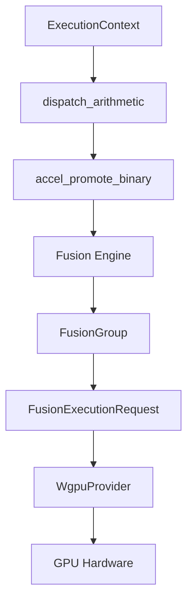
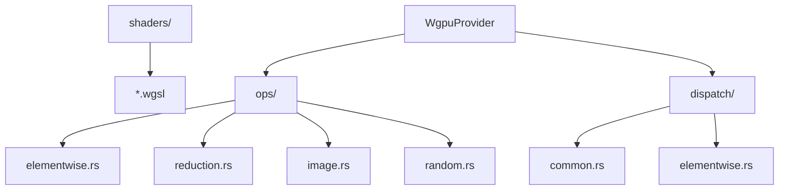

# GPU Acceleration & Fusion Engine

<details>
<summary>Relevant source files</summary>

- [crates/runmat-accelerate/src/backend/wgpu/provider/ops/constructors.rs](https://github.com/runmat-org/runmat/blob/82685330/crates/runmat-accelerate/src/backend/wgpu/provider/ops/constructors.rs)
- [crates/runmat-accelerate/src/backend/wgpu/provider/ops/elementwise.rs](https://github.com/runmat-org/runmat/blob/82685330/crates/runmat-accelerate/src/backend/wgpu/provider/ops/elementwise.rs)
- [crates/runmat-accelerate/src/backend/wgpu/provider/ops/image.rs](https://github.com/runmat-org/runmat/blob/82685330/crates/runmat-accelerate/src/backend/wgpu/provider/ops/image.rs)
- [crates/runmat-accelerate/src/backend/wgpu/provider/ops/indexing.rs](https://github.com/runmat-org/runmat/blob/82685330/crates/runmat-accelerate/src/backend/wgpu/provider/ops/indexing.rs)
- [crates/runmat-accelerate/src/backend/wgpu/provider/ops/polynomial.rs](https://github.com/runmat-org/runmat/blob/82685330/crates/runmat-accelerate/src/backend/wgpu/provider/ops/polynomial.rs)
- [crates/runmat-accelerate/src/backend/wgpu/provider/ops/random.rs](https://github.com/runmat-org/runmat/blob/82685330/crates/runmat-accelerate/src/backend/wgpu/provider/ops/random.rs)
- [crates/runmat-accelerate/src/backend/wgpu/provider/ops/signal.rs](https://github.com/runmat-org/runmat/blob/82685330/crates/runmat-accelerate/src/backend/wgpu/provider/ops/signal.rs)
- [crates/runmat-accelerate/src/backend/wgpu/provider/ops/solve.rs](https://github.com/runmat-org/runmat/blob/82685330/crates/runmat-accelerate/src/backend/wgpu/provider/ops/solve.rs)
- [crates/runmat-accelerate/src/backend/wgpu/provider/ops/tensor.rs](https://github.com/runmat-org/runmat/blob/82685330/crates/runmat-accelerate/src/backend/wgpu/provider/ops/tensor.rs)
- [crates/runmat-accelerate/src/fusion.rs](https://github.com/runmat-org/runmat/blob/82685330/crates/runmat-accelerate/src/fusion.rs)
- [crates/runmat-runtime/src/builtins/math/rounding/ceil.rs](https://github.com/runmat-org/runmat/blob/82685330/crates/runmat-runtime/src/builtins/math/rounding/ceil.rs)
- [crates/runmat-runtime/src/builtins/math/rounding/fix.rs](https://github.com/runmat-org/runmat/blob/82685330/crates/runmat-runtime/src/builtins/math/rounding/fix.rs)
- [crates/runmat-runtime/src/builtins/math/rounding/floor.rs](https://github.com/runmat-org/runmat/blob/82685330/crates/runmat-runtime/src/builtins/math/rounding/floor.rs)
- [crates/runmat-runtime/src/builtins/math/rounding/mod.rs](https://github.com/runmat-org/runmat/blob/82685330/crates/runmat-runtime/src/builtins/math/rounding/mod.rs)
- [crates/runmat-runtime/src/builtins/math/rounding/rem.rs](https://github.com/runmat-org/runmat/blob/82685330/crates/runmat-runtime/src/builtins/math/rounding/rem.rs)
- [crates/runmat-runtime/src/builtins/math/rounding/round.rs](https://github.com/runmat-org/runmat/blob/82685330/crates/runmat-runtime/src/builtins/math/rounding/round.rs)
- [crates/runmat-vm/src/accel/auto_promote.rs](https://github.com/runmat-org/runmat/blob/82685330/crates/runmat-vm/src/accel/auto_promote.rs)
- [crates/runmat-vm/src/accel/fusion.rs](https://github.com/runmat-org/runmat/blob/82685330/crates/runmat-vm/src/accel/fusion.rs)
- [crates/runmat-vm/src/accel/mod.rs](https://github.com/runmat-org/runmat/blob/82685330/crates/runmat-vm/src/accel/mod.rs)
- [crates/runmat-vm/src/accel/residency.rs](https://github.com/runmat-org/runmat/blob/82685330/crates/runmat-vm/src/accel/residency.rs)
- [crates/runmat-vm/src/indexing/end_expr.rs](https://github.com/runmat-org/runmat/blob/82685330/crates/runmat-vm/src/indexing/end_expr.rs)
- [crates/runmat-vm/src/indexing/mod.rs](https://github.com/runmat-org/runmat/blob/82685330/crates/runmat-vm/src/indexing/mod.rs)
- [crates/runmat-vm/src/indexing/read_linear.rs](https://github.com/runmat-org/runmat/blob/82685330/crates/runmat-vm/src/indexing/read_linear.rs)
- [crates/runmat-vm/src/interpreter/dispatch/arithmetic.rs](https://github.com/runmat-org/runmat/blob/82685330/crates/runmat-vm/src/interpreter/dispatch/arithmetic.rs)
- [crates/runmat-vm/src/ops/arithmetic.rs](https://github.com/runmat-org/runmat/blob/82685330/crates/runmat-vm/src/ops/arithmetic.rs)
- [crates/runmat-vm/src/ops/arrays.rs](https://github.com/runmat-org/runmat/blob/82685330/crates/runmat-vm/src/ops/arrays.rs)
- [crates/runmat-vm/src/ops/comparison.rs](https://github.com/runmat-org/runmat/blob/82685330/crates/runmat-vm/src/ops/comparison.rs)
- [docs-tmp/ACCELERATE_PROVIDER_REFACTOR.md](https://github.com/runmat-org/runmat/blob/82685330/docs-tmp/ACCELERATE_PROVIDER_REFACTOR.md?plain=1)
- [docs-tmp/ACCELERATE_PROVIDER_REFACTOR_PROGRESS.md](https://github.com/runmat-org/runmat/blob/82685330/docs-tmp/ACCELERATE_PROVIDER_REFACTOR_PROGRESS.md?plain=1)

</details>

RunMat features a high-performance GPU acceleration subsystem designed to transparently offload compute-heavy MATLAB operations to the GPU. The system combines an automatic offload heuristic with a sophisticated Fusion Engine that merges multiple operations into single GPU kernels to minimize memory bandwidth bottlenecks and host-device synchronization.

## System Architecture Overview

The acceleration system bridges the gap between the high-level VM interpreter and the low-level GPU hardware through several layers of abstraction.

### Component Relationship

The following diagram illustrates how VM instructions are transformed into fused GPU execution plans.

From VM Bytecode to GPU Execution



<details>
<summary>Rendered SVG</summary>

```svg
<svg id="mermaid-5i7hkej4vio" xmlns="http://www.w3.org/2000/svg" xmlns:xlink="http://www.w3.org/1999/xlink" class="flowchart" style="max-width: 100%; touch-action: none; user-select: none; cursor: grab; min-height: fit-content; max-height: 100%;" viewBox="-224.9136889640028 0 773.7805029280056 1116" role="graphics-document document" aria-roledescription="flowchart-v2" preserveAspectRatio="xMidYMid meet"><style>#mermaid-5i7hkej4vio{font-family:ui-sans-serif,-apple-system,system-ui,Segoe UI,Helvetica;font-size:16px;fill:#ccc;}@keyframes edge-animation-frame{from{stroke-dashoffset:0;}}@keyframes dash{to{stroke-dashoffset:0;}}#mermaid-5i7hkej4vio .edge-animation-slow{stroke-dasharray:9,5!important;stroke-dashoffset:900;animation:dash 50s linear infinite;stroke-linecap:round;}#mermaid-5i7hkej4vio .edge-animation-fast{stroke-dasharray:9,5!important;stroke-dashoffset:900;animation:dash 20s linear infinite;stroke-linecap:round;}#mermaid-5i7hkej4vio .error-icon{fill:#333;}#mermaid-5i7hkej4vio .error-text{fill:#cccccc;stroke:#cccccc;}#mermaid-5i7hkej4vio .edge-thickness-normal{stroke-width:1px;}#mermaid-5i7hkej4vio .edge-thickness-thick{stroke-width:3.5px;}#mermaid-5i7hkej4vio .edge-pattern-solid{stroke-dasharray:0;}#mermaid-5i7hkej4vio .edge-thickness-invisible{stroke-width:0;fill:none;}#mermaid-5i7hkej4vio .edge-pattern-dashed{stroke-dasharray:3;}#mermaid-5i7hkej4vio .edge-pattern-dotted{stroke-dasharray:2;}#mermaid-5i7hkej4vio .marker{fill:#666;stroke:#666;}#mermaid-5i7hkej4vio .marker.cross{stroke:#666;}#mermaid-5i7hkej4vio svg{font-family:ui-sans-serif,-apple-system,system-ui,Segoe UI,Helvetica;font-size:16px;}#mermaid-5i7hkej4vio p{margin:0;}#mermaid-5i7hkej4vio .label{font-family:ui-sans-serif,-apple-system,system-ui,Segoe UI,Helvetica;color:#fff;}#mermaid-5i7hkej4vio .cluster-label text{fill:#fff;}#mermaid-5i7hkej4vio .cluster-label span{color:#fff;}#mermaid-5i7hkej4vio .cluster-label span p{background-color:transparent;}#mermaid-5i7hkej4vio .label text,#mermaid-5i7hkej4vio span{fill:#fff;color:#fff;}#mermaid-5i7hkej4vio .node rect,#mermaid-5i7hkej4vio .node circle,#mermaid-5i7hkej4vio .node ellipse,#mermaid-5i7hkej4vio .node polygon,#mermaid-5i7hkej4vio .node path{fill:#111;stroke:#222;stroke-width:1px;}#mermaid-5i7hkej4vio .rough-node .label text,#mermaid-5i7hkej4vio .node .label text,#mermaid-5i7hkej4vio .image-shape .label,#mermaid-5i7hkej4vio .icon-shape .label{text-anchor:middle;}#mermaid-5i7hkej4vio .node .katex path{fill:#000;stroke:#000;stroke-width:1px;}#mermaid-5i7hkej4vio .rough-node .label,#mermaid-5i7hkej4vio .node .label,#mermaid-5i7hkej4vio .image-shape .label,#mermaid-5i7hkej4vio .icon-shape .label{text-align:center;}#mermaid-5i7hkej4vio .node.clickable{cursor:pointer;}#mermaid-5i7hkej4vio .root .anchor path{fill:#666!important;stroke-width:0;stroke:#666;}#mermaid-5i7hkej4vio .arrowheadPath{fill:#0b0b0b;}#mermaid-5i7hkej4vio .edgePath .path{stroke:#666;stroke-width:1px;}#mermaid-5i7hkej4vio .flowchart-link{stroke:#666;fill:none;}#mermaid-5i7hkej4vio .edgeLabel{background-color:#161616;text-align:center;}#mermaid-5i7hkej4vio .edgeLabel p{background-color:#161616;}#mermaid-5i7hkej4vio .edgeLabel rect{opacity:0.5;background-color:#161616;fill:#161616;}#mermaid-5i7hkej4vio .labelBkg{background-color:rgba(22, 22, 22, 0.5);}#mermaid-5i7hkej4vio .cluster rect{fill:#161616;stroke:#222;stroke-width:1px;}#mermaid-5i7hkej4vio .cluster text{fill:#fff;}#mermaid-5i7hkej4vio .cluster span{color:#fff;}#mermaid-5i7hkej4vio div.mermaidTooltip{position:absolute;text-align:center;max-width:200px;padding:2px;font-family:ui-sans-serif,-apple-system,system-ui,Segoe UI,Helvetica;font-size:12px;background:#333;border:1px solid hsl(0, 0%, 10%);border-radius:2px;pointer-events:none;z-index:100;}#mermaid-5i7hkej4vio .flowchartTitleText{text-anchor:middle;font-size:18px;fill:#ccc;}#mermaid-5i7hkej4vio rect.text{fill:none;stroke-width:0;}#mermaid-5i7hkej4vio .icon-shape,#mermaid-5i7hkej4vio .image-shape{background-color:#161616;text-align:center;}#mermaid-5i7hkej4vio .icon-shape p,#mermaid-5i7hkej4vio .image-shape p{background-color:#161616;padding:2px;}#mermaid-5i7hkej4vio .icon-shape .label rect,#mermaid-5i7hkej4vio .image-shape .label rect{opacity:0.5;background-color:#161616;fill:#161616;}#mermaid-5i7hkej4vio .label-icon{display:inline-block;height:1em;overflow:visible;vertical-align:-0.125em;}#mermaid-5i7hkej4vio .node .label-icon path{fill:currentColor;stroke:revert;stroke-width:revert;}#mermaid-5i7hkej4vio .node .neo-node{stroke:#222;}#mermaid-5i7hkej4vio [data-look="neo"].node rect,#mermaid-5i7hkej4vio [data-look="neo"].cluster rect,#mermaid-5i7hkej4vio [data-look="neo"].node polygon{stroke:url(#mermaid-5i7hkej4vio-gradient);filter:drop-shadow( 1px 2px 2px rgba(185,185,185,1));}#mermaid-5i7hkej4vio [data-look="neo"].node path{stroke:url(#mermaid-5i7hkej4vio-gradient);stroke-width:1px;}#mermaid-5i7hkej4vio [data-look="neo"].node .outer-path{filter:drop-shadow( 1px 2px 2px rgba(185,185,185,1));}#mermaid-5i7hkej4vio [data-look="neo"].node .neo-line path{stroke:#222;filter:none;}#mermaid-5i7hkej4vio [data-look="neo"].node circle{stroke:url(#mermaid-5i7hkej4vio-gradient);filter:drop-shadow( 1px 2px 2px rgba(185,185,185,1));}#mermaid-5i7hkej4vio [data-look="neo"].node circle .state-start{fill:#000000;}#mermaid-5i7hkej4vio [data-look="neo"].icon-shape .icon{fill:url(#mermaid-5i7hkej4vio-gradient);filter:drop-shadow( 1px 2px 2px rgba(185,185,185,1));}#mermaid-5i7hkej4vio [data-look="neo"].icon-shape .icon-neo path{stroke:url(#mermaid-5i7hkej4vio-gradient);filter:drop-shadow( 1px 2px 2px rgba(185,185,185,1));}#mermaid-5i7hkej4vio :root{--mermaid-font-family:"trebuchet ms",verdana,arial,sans-serif;}</style><g><marker id="mermaid-5i7hkej4vio_flowchart-v2-pointEnd" class="marker flowchart-v2" viewBox="0 0 10 10" refX="5" refY="5" markerUnits="userSpaceOnUse" markerWidth="8" markerHeight="8" orient="auto"><path d="M 0 0 L 10 5 L 0 10 z" class="arrowMarkerPath" style="stroke-width: 1; stroke-dasharray: 1, 0;"></path></marker><marker id="mermaid-5i7hkej4vio_flowchart-v2-pointStart" class="marker flowchart-v2" viewBox="0 0 10 10" refX="4.5" refY="5" markerUnits="userSpaceOnUse" markerWidth="8" markerHeight="8" orient="auto"><path d="M 0 5 L 10 10 L 10 0 z" class="arrowMarkerPath" style="stroke-width: 1; stroke-dasharray: 1, 0;"></path></marker><marker id="mermaid-5i7hkej4vio_flowchart-v2-pointEnd-margin" class="marker flowchart-v2" viewBox="0 0 11.5 14" refX="11.5" refY="7" markerUnits="userSpaceOnUse" markerWidth="10.5" markerHeight="14" orient="auto"><path d="M 0 0 L 11.5 7 L 0 14 z" class="arrowMarkerPath" style="stroke-width: 0; stroke-dasharray: 1, 0;"></path></marker><marker id="mermaid-5i7hkej4vio_flowchart-v2-pointStart-margin" class="marker flowchart-v2" viewBox="0 0 11.5 14" refX="1" refY="7" markerUnits="userSpaceOnUse" markerWidth="11.5" markerHeight="14" orient="auto"><polygon points="0,7 11.5,14 11.5,0" class="arrowMarkerPath" style="stroke-width: 0; stroke-dasharray: 1, 0;"></polygon></marker><marker id="mermaid-5i7hkej4vio_flowchart-v2-circleEnd" class="marker flowchart-v2" viewBox="0 0 10 10" refX="11" refY="5" markerUnits="userSpaceOnUse" markerWidth="11" markerHeight="11" orient="auto"><circle cx="5" cy="5" r="5" class="arrowMarkerPath" style="stroke-width: 1; stroke-dasharray: 1, 0;"></circle></marker><marker id="mermaid-5i7hkej4vio_flowchart-v2-circleStart" class="marker flowchart-v2" viewBox="0 0 10 10" refX="-1" refY="5" markerUnits="userSpaceOnUse" markerWidth="11" markerHeight="11" orient="auto"><circle cx="5" cy="5" r="5" class="arrowMarkerPath" style="stroke-width: 1; stroke-dasharray: 1, 0;"></circle></marker><marker id="mermaid-5i7hkej4vio_flowchart-v2-circleEnd-margin" class="marker flowchart-v2" viewBox="0 0 10 10" refY="5" refX="12.25" markerUnits="userSpaceOnUse" markerWidth="14" markerHeight="14" orient="auto"><circle cx="5" cy="5" r="5" class="arrowMarkerPath" style="stroke-width: 0; stroke-dasharray: 1, 0;"></circle></marker><marker id="mermaid-5i7hkej4vio_flowchart-v2-circleStart-margin" class="marker flowchart-v2" viewBox="0 0 10 10" refX="-2" refY="5" markerUnits="userSpaceOnUse" markerWidth="14" markerHeight="14" orient="auto"><circle cx="5" cy="5" r="5" class="arrowMarkerPath" style="stroke-width: 0; stroke-dasharray: 1, 0;"></circle></marker><marker id="mermaid-5i7hkej4vio_flowchart-v2-crossEnd" class="marker cross flowchart-v2" viewBox="0 0 11 11" refX="12" refY="5.2" markerUnits="userSpaceOnUse" markerWidth="11" markerHeight="11" orient="auto"><path d="M 1,1 l 9,9 M 10,1 l -9,9" class="arrowMarkerPath" style="stroke-width: 2; stroke-dasharray: 1, 0;"></path></marker><marker id="mermaid-5i7hkej4vio_flowchart-v2-crossStart" class="marker cross flowchart-v2" viewBox="0 0 11 11" refX="-1" refY="5.2" markerUnits="userSpaceOnUse" markerWidth="11" markerHeight="11" orient="auto"><path d="M 1,1 l 9,9 M 10,1 l -9,9" class="arrowMarkerPath" style="stroke-width: 2; stroke-dasharray: 1, 0;"></path></marker><marker id="mermaid-5i7hkej4vio_flowchart-v2-crossEnd-margin" class="marker cross flowchart-v2" viewBox="0 0 15 15" refX="17.7" refY="7.5" markerUnits="userSpaceOnUse" markerWidth="12" markerHeight="12" orient="auto"><path d="M 1,1 L 14,14 M 1,14 L 14,1" class="arrowMarkerPath" style="stroke-width: 2.5;"></path></marker><marker id="mermaid-5i7hkej4vio_flowchart-v2-crossStart-margin" class="marker cross flowchart-v2" viewBox="0 0 15 15" refX="-3.5" refY="7.5" markerUnits="userSpaceOnUse" markerWidth="12" markerHeight="12" orient="auto"><path d="M 1,1 L 14,14 M 1,14 L 14,1" class="arrowMarkerPath" style="stroke-width: 2.5; stroke-dasharray: 1, 0;"></path></marker><g class="root"><g class="clusters"><g class="cluster" id="mermaid-5i7hkej4vio-subGraph2" data-look="classic"><rect style="" x="43.4609375" y="876" width="237.03125" height="232"></rect><g class="cluster-label" transform="translate(93.5859375, 876)"><foreignObject width="136.78125" height="24"><div style="display: table-cell; white-space: nowrap; line-height: 1.5;" xmlns="http://www.w3.org/1999/xhtml"><span class="nodeLabel"><p>Hardware Backend</p></span></div></foreignObject></g></g><g class="cluster" id="mermaid-5i7hkej4vio-subGraph1" data-look="classic"><rect style="" x="8" y="442" width="307.953125" height="360"></rect><g class="cluster-label" transform="translate(95.125, 442)"><foreignObject width="133.703125" height="24"><div style="display: table-cell; white-space: nowrap; line-height: 1.5;" xmlns="http://www.w3.org/1999/xhtml"><span class="nodeLabel"><p>Acceleration Logic</p></span></div></foreignObject></g></g><g class="cluster" id="mermaid-5i7hkej4vio-subGraph0" data-look="classic"><rect style="" x="15.8359375" y="8" width="292.28125" height="360"></rect><g class="cluster-label" transform="translate(87.703125, 8)"><foreignObject width="148.546875" height="24"><div style="display: table-cell; white-space: nowrap; line-height: 1.5;" xmlns="http://www.w3.org/1999/xhtml"><span class="nodeLabel"><p>VM Execution Space</p></span></div></foreignObject></g></g></g><g class="edgePaths"><path d="M161.977,87L161.977,93.167C161.977,99.333,161.977,111.667,161.977,123.333C161.977,135,161.977,146,161.977,151.5L161.977,157" id="mermaid-5i7hkej4vio-L_A_B_0" class="edge-thickness-normal edge-pattern-solid edge-thickness-normal edge-pattern-solid flowchart-link" style=";" data-edge="true" data-et="edge" data-id="L_A_B_0" data-points="W3sieCI6MTYxLjk3NjU2MjUsInkiOjg3fSx7IngiOjE2MS45NzY1NjI1LCJ5IjoxMjR9LHsieCI6MTYxLjk3NjU2MjUsInkiOjE2MX1d" data-look="classic" marker-end="url(#mermaid-5i7hkej4vio_flowchart-v2-pointEnd)"></path><path d="M161.977,215L161.977,221.167C161.977,227.333,161.977,239.667,161.977,251.333C161.977,263,161.977,274,161.977,279.5L161.977,285" id="mermaid-5i7hkej4vio-L_B_C_0" class="edge-thickness-normal edge-pattern-solid edge-thickness-normal edge-pattern-solid flowchart-link" style=";" data-edge="true" data-et="edge" data-id="L_B_C_0" data-points="W3sieCI6MTYxLjk3NjU2MjUsInkiOjIxNX0seyJ4IjoxNjEuOTc2NTYyNSwieSI6MjUyfSx7IngiOjE2MS45NzY1NjI1LCJ5IjoyODl9XQ==" data-look="classic" marker-end="url(#mermaid-5i7hkej4vio_flowchart-v2-pointEnd)"></path><path d="M161.977,343L161.977,347.167C161.977,351.333,161.977,359.667,161.977,370C161.977,380.333,161.977,392.667,161.977,405C161.977,417.333,161.977,429.667,161.977,439.333C161.977,449,161.977,456,161.977,459.5L161.977,463" id="mermaid-5i7hkej4vio-L_C_D_0" class="edge-thickness-normal edge-pattern-solid edge-thickness-normal edge-pattern-solid flowchart-link" style=";" data-edge="true" data-et="edge" data-id="L_C_D_0" data-points="W3sieCI6MTYxLjk3NjU2MjUsInkiOjM0M30seyJ4IjoxNjEuOTc2NTYyNSwieSI6MzY4fSx7IngiOjE2MS45NzY1NjI1LCJ5Ijo0MDV9LHsieCI6MTYxLjk3NjU2MjUsInkiOjQ0Mn0seyJ4IjoxNjEuOTc2NTYyNSwieSI6NDY3fV0=" data-look="classic" marker-end="url(#mermaid-5i7hkej4vio_flowchart-v2-pointEnd)"></path><path d="M161.977,521L161.977,527.167C161.977,533.333,161.977,545.667,161.977,557.333C161.977,569,161.977,580,161.977,585.5L161.977,591" id="mermaid-5i7hkej4vio-L_D_E_0" class="edge-thickness-normal edge-pattern-solid edge-thickness-normal edge-pattern-solid flowchart-link" style=";" data-edge="true" data-et="edge" data-id="L_D_E_0" data-points="W3sieCI6MTYxLjk3NjU2MjUsInkiOjUyMX0seyJ4IjoxNjEuOTc2NTYyNSwieSI6NTU4fSx7IngiOjE2MS45NzY1NjI1LCJ5Ijo1OTV9XQ==" data-look="classic" marker-end="url(#mermaid-5i7hkej4vio_flowchart-v2-pointEnd)"></path><path d="M161.977,649L161.977,655.167C161.977,661.333,161.977,673.667,161.977,685.333C161.977,697,161.977,708,161.977,713.5L161.977,719" id="mermaid-5i7hkej4vio-L_E_F_0" class="edge-thickness-normal edge-pattern-solid edge-thickness-normal edge-pattern-solid flowchart-link" style=";" data-edge="true" data-et="edge" data-id="L_E_F_0" data-points="W3sieCI6MTYxLjk3NjU2MjUsInkiOjY0OX0seyJ4IjoxNjEuOTc2NTYyNSwieSI6Njg2fSx7IngiOjE2MS45NzY1NjI1LCJ5Ijo3MjN9XQ==" data-look="classic" marker-end="url(#mermaid-5i7hkej4vio_flowchart-v2-pointEnd)"></path><path d="M161.977,777L161.977,781.167C161.977,785.333,161.977,793.667,161.977,804C161.977,814.333,161.977,826.667,161.977,839C161.977,851.333,161.977,863.667,161.977,873.333C161.977,883,161.977,890,161.977,893.5L161.977,897" id="mermaid-5i7hkej4vio-L_F_G_0" class="edge-thickness-normal edge-pattern-solid edge-thickness-normal edge-pattern-solid flowchart-link" style=";" data-edge="true" data-et="edge" data-id="L_F_G_0" data-points="W3sieCI6MTYxLjk3NjU2MjUsInkiOjc3N30seyJ4IjoxNjEuOTc2NTYyNSwieSI6ODAyfSx7IngiOjE2MS45NzY1NjI1LCJ5Ijo4Mzl9LHsieCI6MTYxLjk3NjU2MjUsInkiOjg3Nn0seyJ4IjoxNjEuOTc2NTYyNSwieSI6OTAxfV0=" data-look="classic" marker-end="url(#mermaid-5i7hkej4vio_flowchart-v2-pointEnd)"></path><path d="M161.977,955L161.977,961.167C161.977,967.333,161.977,979.667,161.977,991.333C161.977,1003,161.977,1014,161.977,1019.5L161.977,1025" id="mermaid-5i7hkej4vio-L_G_H_0" class="edge-thickness-normal edge-pattern-solid edge-thickness-normal edge-pattern-solid flowchart-link" style=";" data-edge="true" data-et="edge" data-id="L_G_H_0" data-points="W3sieCI6MTYxLjk3NjU2MjUsInkiOjk1NX0seyJ4IjoxNjEuOTc2NTYyNSwieSI6OTkyfSx7IngiOjE2MS45NzY1NjI1LCJ5IjoxMDI5fV0=" data-look="classic" marker-end="url(#mermaid-5i7hkej4vio_flowchart-v2-pointEnd)"></path></g><g class="edgeLabels"><g class="edgeLabel" transform="translate(161.9765625, 124)"><g class="label" data-id="L_A_B_0" transform="translate(-91.1328125, -12)"><foreignObject width="182.265625" height="24"><div style="display: table-cell; white-space: nowrap; line-height: 1.5; max-width: 200px; text-align: center;" xmlns="http://www.w3.org/1999/xhtml" class="labelBkg"><span class="edgeLabel"><p>Instr::Add, Instr::Mul, etc.</p></span></div></foreignObject></g></g><g class="edgeLabel" transform="translate(161.9765625, 252)"><g class="label" data-id="L_B_C_0" transform="translate(-72.515625, -12)"><foreignObject width="145.03125" height="24"><div style="display: table-cell; white-space: nowrap; line-height: 1.5; max-width: 200px; text-align: center;" xmlns="http://www.w3.org/1999/xhtml" class="labelBkg"><span class="edgeLabel"><p>Auto-Offload Check</p></span></div></foreignObject></g></g><g class="edgeLabel" transform="translate(161.9765625, 405)"><g class="label" data-id="L_C_D_0" transform="translate(-54.375, -12)"><foreignObject width="108.75" height="24"><div style="display: table-cell; white-space: nowrap; line-height: 1.5; max-width: 200px; text-align: center;" xmlns="http://www.w3.org/1999/xhtml" class="labelBkg"><span class="edgeLabel"><p>If GPU enabled</p></span></div></foreignObject></g></g><g class="edgeLabel" transform="translate(161.9765625, 558)"><g class="label" data-id="L_D_E_0" transform="translate(-22.09375, -12)"><foreignObject width="44.1875" height="24"><div style="display: table-cell; white-space: nowrap; line-height: 1.5; max-width: 200px; text-align: center;" xmlns="http://www.w3.org/1999/xhtml" class="labelBkg"><span class="edgeLabel"><p>Builds</p></span></div></foreignObject></g></g><g class="edgeLabel" transform="translate(161.9765625, 686)"><g class="label" data-id="L_E_F_0" transform="translate(-37.4453125, -12)"><foreignObject width="74.890625" height="24"><div style="display: table-cell; white-space: nowrap; line-height: 1.5; max-width: 200px; text-align: center;" xmlns="http://www.w3.org/1999/xhtml" class="labelBkg"><span class="edgeLabel"><p>Generates</p></span></div></foreignObject></g></g><g class="edgeLabel" transform="translate(161.9765625, 839)"><g class="label" data-id="L_F_G_0" transform="translate(-50.5859375, -12)"><foreignObject width="101.171875" height="24"><div style="display: table-cell; white-space: nowrap; line-height: 1.5; max-width: 200px; text-align: center;" xmlns="http://www.w3.org/1999/xhtml" class="labelBkg"><span class="edgeLabel"><p>Dispatched to</p></span></div></foreignObject></g></g><g class="edgeLabel" transform="translate(161.9765625, 992)"><g class="label" data-id="L_G_H_0" transform="translate(-54.359375, -12)"><foreignObject width="108.71875" height="24"><div style="display: table-cell; white-space: nowrap; line-height: 1.5; max-width: 200px; text-align: center;" xmlns="http://www.w3.org/1999/xhtml" class="labelBkg"><span class="edgeLabel"><p>WGSL Shaders</p></span></div></foreignObject></g></g></g><g class="nodes"><g class="node default" id="mermaid-5i7hkej4vio-flowchart-A-0" data-look="classic" transform="translate(161.9765625, 60)"><rect class="basic label-container" style="" x="-93.7421875" y="-27" width="187.484375" height="54"></rect><g class="label" style="" transform="translate(-63.7421875, -12)"><rect></rect><foreignObject width="127.484375" height="24"><div style="display: table-cell; white-space: nowrap; line-height: 1.5; max-width: 200px; text-align: center;" xmlns="http://www.w3.org/1999/xhtml"><span class="nodeLabel"><p>ExecutionContext</p></span></div></foreignObject></g></g><g class="node default" id="mermaid-5i7hkej4vio-flowchart-B-1" data-look="classic" transform="translate(161.9765625, 188)"><rect class="basic label-container" style="" x="-101.96875" y="-27" width="203.9375" height="54"></rect><g class="label" style="" transform="translate(-71.96875, -12)"><rect></rect><foreignObject width="143.9375" height="24"><div style="display: table-cell; white-space: nowrap; line-height: 1.5; max-width: 200px; text-align: center;" xmlns="http://www.w3.org/1999/xhtml"><span class="nodeLabel"><p>dispatch_arithmetic</p></span></div></foreignObject></g></g><g class="node default" id="mermaid-5i7hkej4vio-flowchart-C-3" data-look="classic" transform="translate(161.9765625, 316)"><rect class="basic label-container" style="" x="-111.140625" y="-27" width="222.28125" height="54"></rect><g class="label" style="" transform="translate(-81.140625, -12)"><rect></rect><foreignObject width="162.28125" height="24"><div style="display: table-cell; white-space: nowrap; line-height: 1.5; max-width: 200px; text-align: center;" xmlns="http://www.w3.org/1999/xhtml"><span class="nodeLabel"><p>accel_promote_binary</p></span></div></foreignObject></g></g><g class="node default" id="mermaid-5i7hkej4vio-flowchart-D-5" data-look="classic" transform="translate(161.9765625, 494)"><rect class="basic label-container" style="" x="-80.546875" y="-27" width="161.09375" height="54"></rect><g class="label" style="" transform="translate(-50.546875, -12)"><rect></rect><foreignObject width="101.09375" height="24"><div style="display: table-cell; white-space: nowrap; line-height: 1.5; max-width: 200px; text-align: center;" xmlns="http://www.w3.org/1999/xhtml"><span class="nodeLabel"><p>Fusion Engine</p></span></div></foreignObject></g></g><g class="node default" id="mermaid-5i7hkej4vio-flowchart-E-7" data-look="classic" transform="translate(161.9765625, 622)"><rect class="basic label-container" style="" x="-76.265625" y="-27" width="152.53125" height="54"></rect><g class="label" style="" transform="translate(-46.265625, -12)"><rect></rect><foreignObject width="92.53125" height="24"><div style="display: table-cell; white-space: nowrap; line-height: 1.5; max-width: 200px; text-align: center;" xmlns="http://www.w3.org/1999/xhtml"><span class="nodeLabel"><p>FusionGroup</p></span></div></foreignObject></g></g><g class="node default" id="mermaid-5i7hkej4vio-flowchart-F-9" data-look="classic" transform="translate(161.9765625, 750)"><rect class="basic label-container" style="" x="-118.9765625" y="-27" width="237.953125" height="54"></rect><g class="label" style="" transform="translate(-88.9765625, -12)"><rect></rect><foreignObject width="177.953125" height="24"><div style="display: table-cell; white-space: nowrap; line-height: 1.5; max-width: 200px; text-align: center;" xmlns="http://www.w3.org/1999/xhtml"><span class="nodeLabel"><p>FusionExecutionRequest</p></span></div></foreignObject></g></g><g class="node default" id="mermaid-5i7hkej4vio-flowchart-G-11" data-look="classic" transform="translate(161.9765625, 928)"><rect class="basic label-container" style="" x="-81.328125" y="-27" width="162.65625" height="54"></rect><g class="label" style="" transform="translate(-51.328125, -12)"><rect></rect><foreignObject width="102.65625" height="24"><div style="display: table-cell; white-space: nowrap; line-height: 1.5; max-width: 200px; text-align: center;" xmlns="http://www.w3.org/1999/xhtml"><span class="nodeLabel"><p>WgpuProvider</p></span></div></foreignObject></g></g><g class="node default" id="mermaid-5i7hkej4vio-flowchart-H-13" data-look="classic" transform="translate(161.9765625, 1056)"><rect class="basic label-container" style="" x="-83.515625" y="-27" width="167.03125" height="54"></rect><g class="label" style="" transform="translate(-53.515625, -12)"><rect></rect><foreignObject width="107.03125" height="24"><div style="display: table-cell; white-space: nowrap; line-height: 1.5; max-width: 200px; text-align: center;" xmlns="http://www.w3.org/1999/xhtml"><span class="nodeLabel"><p>GPU Hardware</p></span></div></foreignObject></g></g></g></g></g><defs><filter id="mermaid-5i7hkej4vio-drop-shadow" height="130%" width="130%"><feDropShadow dx="4" dy="4" stdDeviation="0" flood-opacity="0.06" flood-color="#000000"></feDropShadow></filter></defs><defs><filter id="mermaid-5i7hkej4vio-drop-shadow-small" height="150%" width="150%"><feDropShadow dx="2" dy="2" stdDeviation="0" flood-opacity="0.06" flood-color="#000000"></feDropShadow></filter></defs><linearGradient id="mermaid-5i7hkej4vio-gradient" gradientUnits="objectBoundingBox" x1="0%" y1="0%" x2="100%" y2="0%"><stop offset="0%" stop-color="#333" stop-opacity="1"></stop><stop offset="100%" stop-color="hsl(-120, 0%, 3.3333333333%)" stop-opacity="1"></stop></linearGradient></svg>
```

</details>

Sources: [crates/runmat-vm/src/interpreter/dispatch/arithmetic.rs #17-30](https://github.com/runmat-org/runmat/blob/82685330/crates/runmat-vm/src/interpreter/dispatch/arithmetic.rs#L17-L30) [crates/runmat-vm/src/accel/auto_promote.rs #1-10](https://github.com/runmat-org/runmat/blob/82685330/crates/runmat-vm/src/accel/auto_promote.rs#L1-L10) [crates/runmat-vm/src/accel/fusion.rs #8-12](https://github.com/runmat-org/runmat/blob/82685330/crates/runmat-vm/src/accel/fusion.rs#L8-L12)

## Automatic Offload & Promotion

RunMat employs "auto-promotion" heuristics to decide when an operation should be executed on the GPU. This is handled primarily by `accel_promote_binary` and `accel_promote_unary` [crates/runmat-vm/src/interpreter/dispatch/arithmetic.rs #24-25](https://github.com/runmat-org/runmat/blob/82685330/crates/runmat-vm/src/interpreter/dispatch/arithmetic.rs#L24-L25)

- Heuristics: Offload decisions are based on operand size, GPU residency of existing data, and operation complexity.
- Residency Management: The `runmat-vm::accel::residency` module tracks which `Value` objects have valid GPU buffers [crates/runmat-vm/src/accel/residency.rs #38-48](https://github.com/runmat-org/runmat/blob/82685330/crates/runmat-vm/src/accel/residency.rs#L38-L48) If an operation's inputs are already on the GPU, the system strongly prefers staying on-device to avoid costly readbacks.

## Fusion Engine

The Fusion Engine is responsible for detecting chains of operations that can be combined into a single compute pass. It analyzes the `AccelGraph` to identify patterns like `ElementwiseChain`, `Reduction`, or `MatmulEpilogue` [crates/runmat-accelerate/src/fusion.rs #21-29](https://github.com/runmat-org/runmat/blob/82685330/crates/runmat-accelerate/src/fusion.rs#L21-L29)

- Detection: `detect_fusion_groups` scans the graph for contiguous elementwise operations that share the same shape [crates/runmat-accelerate/src/fusion.rs #88-102](https://github.com/runmat-org/runmat/blob/82685330/crates/runmat-accelerate/src/fusion.rs#L88-L102)
- Execution: Fused groups are converted into `FusionExecutionRequest` objects, which bundle all necessary inputs and constants for the backend [crates/runmat-vm/src/accel/fusion.rs #150-163](https://github.com/runmat-org/runmat/blob/82685330/crates/runmat-vm/src/accel/fusion.rs#L150-L163)

For deep technical details on group building and residency tracking, see [Fusion Engine & Residency Management](https://app.devin.ai/org/runmat-org/wiki/runmat-org/runmat?branch=dev#5.1).

## wgpu Backend & Accelerate Provider

The `WgpuProvider` is the primary implementation of the `AccelProvider` trait. It uses the `wgpu` crate to provide cross-platform GPU acceleration (Vulkan, Metal, DX12, WebGPU).

### Provider Structure

The backend is organized into specialized operation families to manage WGSL shader dispatch and pipeline state:

- Elementwise: Basic math (add, sub, exp, log).
- Reduction: Sum, mean, max, min across dimensions.
- Image: Specialized filters like `imfilter` [crates/runmat-accelerate/src/backend/wgpu/provider/ops/image.rs #20-25](https://github.com/runmat-org/runmat/blob/82685330/crates/runmat-accelerate/src/backend/wgpu/provider/ops/image.rs#L20-L25)
- Random: GPU-based PRNG using Philox [crates/runmat-accelerate/src/backend/wgpu/provider/ops/random.rs #23-27](https://github.com/runmat-org/runmat/blob/82685330/crates/runmat-accelerate/src/backend/wgpu/provider/ops/random.rs#L23-L27)

Code Entity Mapping



<details>
<summary>Rendered SVG</summary>

```svg
<svg id="mermaid-000br6rol6di3" xmlns="http://www.w3.org/2000/svg" xmlns:xlink="http://www.w3.org/1999/xlink" class="flowchart" style="max-width: 100%; touch-action: none; user-select: none; cursor: grab; min-height: fit-content; max-height: 100%;" viewBox="-0.0033013998000797073 5.684341886080802e-14 713.2409777996002 992.9999999999999" role="graphics-document document" aria-roledescription="flowchart-v2" preserveAspectRatio="xMidYMid meet"><style>#mermaid-000br6rol6di3{font-family:ui-sans-serif,-apple-system,system-ui,Segoe UI,Helvetica;font-size:16px;fill:#ccc;}@keyframes edge-animation-frame{from{stroke-dashoffset:0;}}@keyframes dash{to{stroke-dashoffset:0;}}#mermaid-000br6rol6di3 .edge-animation-slow{stroke-dasharray:9,5!important;stroke-dashoffset:900;animation:dash 50s linear infinite;stroke-linecap:round;}#mermaid-000br6rol6di3 .edge-animation-fast{stroke-dasharray:9,5!important;stroke-dashoffset:900;animation:dash 20s linear infinite;stroke-linecap:round;}#mermaid-000br6rol6di3 .error-icon{fill:#333;}#mermaid-000br6rol6di3 .error-text{fill:#cccccc;stroke:#cccccc;}#mermaid-000br6rol6di3 .edge-thickness-normal{stroke-width:1px;}#mermaid-000br6rol6di3 .edge-thickness-thick{stroke-width:3.5px;}#mermaid-000br6rol6di3 .edge-pattern-solid{stroke-dasharray:0;}#mermaid-000br6rol6di3 .edge-thickness-invisible{stroke-width:0;fill:none;}#mermaid-000br6rol6di3 .edge-pattern-dashed{stroke-dasharray:3;}#mermaid-000br6rol6di3 .edge-pattern-dotted{stroke-dasharray:2;}#mermaid-000br6rol6di3 .marker{fill:#666;stroke:#666;}#mermaid-000br6rol6di3 .marker.cross{stroke:#666;}#mermaid-000br6rol6di3 svg{font-family:ui-sans-serif,-apple-system,system-ui,Segoe UI,Helvetica;font-size:16px;}#mermaid-000br6rol6di3 p{margin:0;}#mermaid-000br6rol6di3 .label{font-family:ui-sans-serif,-apple-system,system-ui,Segoe UI,Helvetica;color:#fff;}#mermaid-000br6rol6di3 .cluster-label text{fill:#fff;}#mermaid-000br6rol6di3 .cluster-label span{color:#fff;}#mermaid-000br6rol6di3 .cluster-label span p{background-color:transparent;}#mermaid-000br6rol6di3 .label text,#mermaid-000br6rol6di3 span{fill:#fff;color:#fff;}#mermaid-000br6rol6di3 .node rect,#mermaid-000br6rol6di3 .node circle,#mermaid-000br6rol6di3 .node ellipse,#mermaid-000br6rol6di3 .node polygon,#mermaid-000br6rol6di3 .node path{fill:#111;stroke:#222;stroke-width:1px;}#mermaid-000br6rol6di3 .rough-node .label text,#mermaid-000br6rol6di3 .node .label text,#mermaid-000br6rol6di3 .image-shape .label,#mermaid-000br6rol6di3 .icon-shape .label{text-anchor:middle;}#mermaid-000br6rol6di3 .node .katex path{fill:#000;stroke:#000;stroke-width:1px;}#mermaid-000br6rol6di3 .rough-node .label,#mermaid-000br6rol6di3 .node .label,#mermaid-000br6rol6di3 .image-shape .label,#mermaid-000br6rol6di3 .icon-shape .label{text-align:center;}#mermaid-000br6rol6di3 .node.clickable{cursor:pointer;}#mermaid-000br6rol6di3 .root .anchor path{fill:#666!important;stroke-width:0;stroke:#666;}#mermaid-000br6rol6di3 .arrowheadPath{fill:#0b0b0b;}#mermaid-000br6rol6di3 .edgePath .path{stroke:#666;stroke-width:1px;}#mermaid-000br6rol6di3 .flowchart-link{stroke:#666;fill:none;}#mermaid-000br6rol6di3 .edgeLabel{background-color:#161616;text-align:center;}#mermaid-000br6rol6di3 .edgeLabel p{background-color:#161616;}#mermaid-000br6rol6di3 .edgeLabel rect{opacity:0.5;background-color:#161616;fill:#161616;}#mermaid-000br6rol6di3 .labelBkg{background-color:rgba(22, 22, 22, 0.5);}#mermaid-000br6rol6di3 .cluster rect{fill:#161616;stroke:#222;stroke-width:1px;}#mermaid-000br6rol6di3 .cluster text{fill:#fff;}#mermaid-000br6rol6di3 .cluster span{color:#fff;}#mermaid-000br6rol6di3 div.mermaidTooltip{position:absolute;text-align:center;max-width:200px;padding:2px;font-family:ui-sans-serif,-apple-system,system-ui,Segoe UI,Helvetica;font-size:12px;background:#333;border:1px solid hsl(0, 0%, 10%);border-radius:2px;pointer-events:none;z-index:100;}#mermaid-000br6rol6di3 .flowchartTitleText{text-anchor:middle;font-size:18px;fill:#ccc;}#mermaid-000br6rol6di3 rect.text{fill:none;stroke-width:0;}#mermaid-000br6rol6di3 .icon-shape,#mermaid-000br6rol6di3 .image-shape{background-color:#161616;text-align:center;}#mermaid-000br6rol6di3 .icon-shape p,#mermaid-000br6rol6di3 .image-shape p{background-color:#161616;padding:2px;}#mermaid-000br6rol6di3 .icon-shape .label rect,#mermaid-000br6rol6di3 .image-shape .label rect{opacity:0.5;background-color:#161616;fill:#161616;}#mermaid-000br6rol6di3 .label-icon{display:inline-block;height:1em;overflow:visible;vertical-align:-0.125em;}#mermaid-000br6rol6di3 .node .label-icon path{fill:currentColor;stroke:revert;stroke-width:revert;}#mermaid-000br6rol6di3 .node .neo-node{stroke:#222;}#mermaid-000br6rol6di3 [data-look="neo"].node rect,#mermaid-000br6rol6di3 [data-look="neo"].cluster rect,#mermaid-000br6rol6di3 [data-look="neo"].node polygon{stroke:url(#mermaid-000br6rol6di3-gradient);filter:drop-shadow( 1px 2px 2px rgba(185,185,185,1));}#mermaid-000br6rol6di3 [data-look="neo"].node path{stroke:url(#mermaid-000br6rol6di3-gradient);stroke-width:1px;}#mermaid-000br6rol6di3 [data-look="neo"].node .outer-path{filter:drop-shadow( 1px 2px 2px rgba(185,185,185,1));}#mermaid-000br6rol6di3 [data-look="neo"].node .neo-line path{stroke:#222;filter:none;}#mermaid-000br6rol6di3 [data-look="neo"].node circle{stroke:url(#mermaid-000br6rol6di3-gradient);filter:drop-shadow( 1px 2px 2px rgba(185,185,185,1));}#mermaid-000br6rol6di3 [data-look="neo"].node circle .state-start{fill:#000000;}#mermaid-000br6rol6di3 [data-look="neo"].icon-shape .icon{fill:url(#mermaid-000br6rol6di3-gradient);filter:drop-shadow( 1px 2px 2px rgba(185,185,185,1));}#mermaid-000br6rol6di3 [data-look="neo"].icon-shape .icon-neo path{stroke:url(#mermaid-000br6rol6di3-gradient);filter:drop-shadow( 1px 2px 2px rgba(185,185,185,1));}#mermaid-000br6rol6di3 :root{--mermaid-font-family:"trebuchet ms",verdana,arial,sans-serif;}</style><g><marker id="mermaid-000br6rol6di3_flowchart-v2-pointEnd" class="marker flowchart-v2" viewBox="0 0 10 10" refX="5" refY="5" markerUnits="userSpaceOnUse" markerWidth="8" markerHeight="8" orient="auto"><path d="M 0 0 L 10 5 L 0 10 z" class="arrowMarkerPath" style="stroke-width: 1; stroke-dasharray: 1, 0;"></path></marker><marker id="mermaid-000br6rol6di3_flowchart-v2-pointStart" class="marker flowchart-v2" viewBox="0 0 10 10" refX="4.5" refY="5" markerUnits="userSpaceOnUse" markerWidth="8" markerHeight="8" orient="auto"><path d="M 0 5 L 10 10 L 10 0 z" class="arrowMarkerPath" style="stroke-width: 1; stroke-dasharray: 1, 0;"></path></marker><marker id="mermaid-000br6rol6di3_flowchart-v2-pointEnd-margin" class="marker flowchart-v2" viewBox="0 0 11.5 14" refX="11.5" refY="7" markerUnits="userSpaceOnUse" markerWidth="10.5" markerHeight="14" orient="auto"><path d="M 0 0 L 11.5 7 L 0 14 z" class="arrowMarkerPath" style="stroke-width: 0; stroke-dasharray: 1, 0;"></path></marker><marker id="mermaid-000br6rol6di3_flowchart-v2-pointStart-margin" class="marker flowchart-v2" viewBox="0 0 11.5 14" refX="1" refY="7" markerUnits="userSpaceOnUse" markerWidth="11.5" markerHeight="14" orient="auto"><polygon points="0,7 11.5,14 11.5,0" class="arrowMarkerPath" style="stroke-width: 0; stroke-dasharray: 1, 0;"></polygon></marker><marker id="mermaid-000br6rol6di3_flowchart-v2-circleEnd" class="marker flowchart-v2" viewBox="0 0 10 10" refX="11" refY="5" markerUnits="userSpaceOnUse" markerWidth="11" markerHeight="11" orient="auto"><circle cx="5" cy="5" r="5" class="arrowMarkerPath" style="stroke-width: 1; stroke-dasharray: 1, 0;"></circle></marker><marker id="mermaid-000br6rol6di3_flowchart-v2-circleStart" class="marker flowchart-v2" viewBox="0 0 10 10" refX="-1" refY="5" markerUnits="userSpaceOnUse" markerWidth="11" markerHeight="11" orient="auto"><circle cx="5" cy="5" r="5" class="arrowMarkerPath" style="stroke-width: 1; stroke-dasharray: 1, 0;"></circle></marker><marker id="mermaid-000br6rol6di3_flowchart-v2-circleEnd-margin" class="marker flowchart-v2" viewBox="0 0 10 10" refY="5" refX="12.25" markerUnits="userSpaceOnUse" markerWidth="14" markerHeight="14" orient="auto"><circle cx="5" cy="5" r="5" class="arrowMarkerPath" style="stroke-width: 0; stroke-dasharray: 1, 0;"></circle></marker><marker id="mermaid-000br6rol6di3_flowchart-v2-circleStart-margin" class="marker flowchart-v2" viewBox="0 0 10 10" refX="-2" refY="5" markerUnits="userSpaceOnUse" markerWidth="14" markerHeight="14" orient="auto"><circle cx="5" cy="5" r="5" class="arrowMarkerPath" style="stroke-width: 0; stroke-dasharray: 1, 0;"></circle></marker><marker id="mermaid-000br6rol6di3_flowchart-v2-crossEnd" class="marker cross flowchart-v2" viewBox="0 0 11 11" refX="12" refY="5.2" markerUnits="userSpaceOnUse" markerWidth="11" markerHeight="11" orient="auto"><path d="M 1,1 l 9,9 M 10,1 l -9,9" class="arrowMarkerPath" style="stroke-width: 2; stroke-dasharray: 1, 0;"></path></marker><marker id="mermaid-000br6rol6di3_flowchart-v2-crossStart" class="marker cross flowchart-v2" viewBox="0 0 11 11" refX="-1" refY="5.2" markerUnits="userSpaceOnUse" markerWidth="11" markerHeight="11" orient="auto"><path d="M 1,1 l 9,9 M 10,1 l -9,9" class="arrowMarkerPath" style="stroke-width: 2; stroke-dasharray: 1, 0;"></path></marker><marker id="mermaid-000br6rol6di3_flowchart-v2-crossEnd-margin" class="marker cross flowchart-v2" viewBox="0 0 15 15" refX="17.7" refY="7.5" markerUnits="userSpaceOnUse" markerWidth="12" markerHeight="12" orient="auto"><path d="M 1,1 L 14,14 M 1,14 L 14,1" class="arrowMarkerPath" style="stroke-width: 2.5;"></path></marker><marker id="mermaid-000br6rol6di3_flowchart-v2-crossStart-margin" class="marker cross flowchart-v2" viewBox="0 0 15 15" refX="-3.5" refY="7.5" markerUnits="userSpaceOnUse" markerWidth="12" markerHeight="12" orient="auto"><path d="M 1,1 L 14,14 M 1,14 L 14,1" class="arrowMarkerPath" style="stroke-width: 2.5; stroke-dasharray: 1, 0;"></path></marker><g class="root"><g class="clusters"><g class="cluster" id="mermaid-000br6rol6di3-subGraph1" data-look="classic"><rect style="" x="309.265625" y="757" width="395.96875" height="228"></rect><g class="cluster-label" transform="translate(455.640625, 757)"><foreignObject width="103.21875" height="24"><div style="display: table-cell; white-space: nowrap; line-height: 1.5;" xmlns="http://www.w3.org/1999/xhtml"><span class="nodeLabel"><p>Kernel Launch</p></span></div></foreignObject></g></g><g class="cluster" id="mermaid-000br6rol6di3-subGraph0" data-look="classic"><rect style="" x="8" y="301" width="697.234375" height="436"></rect><g class="cluster-label" transform="translate(261.8515625, 301)"><foreignObject width="189.53125" height="24"><div style="display: table-cell; white-space: nowrap; line-height: 1.5;" xmlns="http://www.w3.org/1999/xhtml"><span class="nodeLabel"><p>runmat-accelerate (wgpu)</p></span></div></foreignObject></g></g></g><g class="edgePaths"><path d="M210.469,525.58L219.936,524.483C229.404,523.386,248.339,521.193,264.805,520.097C281.271,519,295.268,519,308.738,519C322.208,519,335.151,519,341.622,519L348.094,519" id="mermaid-000br6rol6di3-L_P_OPS_0" class="edge-thickness-normal edge-pattern-solid edge-thickness-normal edge-pattern-solid flowchart-link" style=";" data-edge="true" data-et="edge" data-id="L_P_OPS_0" data-points="W3sieCI6MjEwLjQ2ODc1LCJ5Ijo1MjUuNTc5NzE4MzQxNzIyOH0seyJ4IjoyNjcuMjczNDM3NSwieSI6NTE5fSx7IngiOjMwOS4yNjU2MjUsInkiOjUxOX0seyJ4IjozNTIuMDkzNzUsInkiOjUxOX1d" data-look="classic" marker-end="url(#mermaid-000br6rol6di3_flowchart-v2-pointEnd)"></path><path d="M413.01,492L425.198,470.5C437.387,449,461.764,406,477.452,384.5C493.141,363,500.141,363,503.641,363L507.141,363" id="mermaid-000br6rol6di3-L_OPS_EL_0" class="edge-thickness-normal edge-pattern-solid edge-thickness-normal edge-pattern-solid flowchart-link" style=";" data-edge="true" data-et="edge" data-id="L_OPS_EL_0" data-points="W3sieCI6NDEzLjAwOTYxNTM4NDYxNTM2LCJ5Ijo0OTJ9LHsieCI6NDg2LjE0MDYyNSwieSI6MzYzfSx7IngiOjUxMS4xNDA2MjUsInkiOjM2M31d" data-look="classic" marker-end="url(#mermaid-000br6rol6di3_flowchart-v2-pointEnd)"></path><path d="M443.313,492.182L450.451,487.985C457.589,483.788,471.865,475.394,484.332,471.197C496.799,467,507.458,467,512.788,467L518.117,467" id="mermaid-000br6rol6di3-L_OPS_RD_0" class="edge-thickness-normal edge-pattern-solid edge-thickness-normal edge-pattern-solid flowchart-link" style=";" data-edge="true" data-et="edge" data-id="L_OPS_RD_0" data-points="W3sieCI6NDQzLjMxMjUsInkiOjQ5Mi4xODIzMzIxNTU0Nzd9LHsieCI6NDg2LjE0MDYyNSwieSI6NDY3fSx7IngiOjUyMi4xMTcxODc1LCJ5Ijo0Njd9XQ==" data-look="classic" marker-end="url(#mermaid-000br6rol6di3_flowchart-v2-pointEnd)"></path><path d="M443.313,545.818L450.451,550.015C457.589,554.212,471.865,562.606,486.414,566.803C500.964,571,515.786,571,523.198,571L530.609,571" id="mermaid-000br6rol6di3-L_OPS_IM_0" class="edge-thickness-normal edge-pattern-solid edge-thickness-normal edge-pattern-solid flowchart-link" style=";" data-edge="true" data-et="edge" data-id="L_OPS_IM_0" data-points="W3sieCI6NDQzLjMxMjUsInkiOjU0NS44MTc2Njc4NDQ1MjI5fSx7IngiOjQ4Ni4xNDA2MjUsInkiOjU3MX0seyJ4Ijo1MzQuNjA5Mzc1LCJ5Ijo1NzF9XQ==" data-look="classic" marker-end="url(#mermaid-000br6rol6di3_flowchart-v2-pointEnd)"></path><path d="M413.01,546L425.198,567.5C437.387,589,461.764,632,480.4,653.5C499.036,675,511.932,675,518.38,675L524.828,675" id="mermaid-000br6rol6di3-L_OPS_RN_0" class="edge-thickness-normal edge-pattern-solid edge-thickness-normal edge-pattern-solid flowchart-link" style=";" data-edge="true" data-et="edge" data-id="L_OPS_RN_0" data-points="W3sieCI6NDEzLjAwOTYxNTM4NDYxNTM2LCJ5Ijo1NDZ9LHsieCI6NDg2LjE0MDYyNSwieSI6Njc1fSx7IngiOjUyOC44MjgxMjUsInkiOjY3NX1d" data-look="classic" marker-end="url(#mermaid-000br6rol6di3_flowchart-v2-pointEnd)"></path><path d="M443.623,844L450.709,839.833C457.795,835.667,471.968,827.333,484.871,823.167C497.773,819,509.406,819,515.223,819L521.039,819" id="mermaid-000br6rol6di3-L_D_CS_0" class="edge-thickness-normal edge-pattern-solid edge-thickness-normal edge-pattern-solid flowchart-link" style=";" data-edge="true" data-et="edge" data-id="L_D_CS_0" data-points="W3sieCI6NDQzLjYyMjU5NjE1Mzg0NjEzLCJ5Ijo4NDR9LHsieCI6NDg2LjE0MDYyNSwieSI6ODE5fSx7IngiOjUyNS4wMzkwNjI1LCJ5Ijo4MTl9XQ==" data-look="classic" marker-end="url(#mermaid-000br6rol6di3_flowchart-v2-pointEnd)"></path><path d="M443.623,898L450.709,902.167C457.795,906.333,471.968,914.667,482.554,918.833C493.141,923,500.141,923,503.641,923L507.141,923" id="mermaid-000br6rol6di3-L_D_ES_0" class="edge-thickness-normal edge-pattern-solid edge-thickness-normal edge-pattern-solid flowchart-link" style=";" data-edge="true" data-et="edge" data-id="L_D_ES_0" data-points="W3sieCI6NDQzLjYyMjU5NjE1Mzg0NjEzLCJ5Ijo4OTh9LHsieCI6NDg2LjE0MDYyNSwieSI6OTIzfSx7IngiOjUxMS4xNDA2MjUsInkiOjkyM31d" data-look="classic" marker-end="url(#mermaid-000br6rol6di3_flowchart-v2-pointEnd)"></path><path d="M153.202,562L172.214,583.333C191.226,604.667,229.25,647.333,255.26,668.667C281.271,690,295.268,690,314.515,715.068C333.762,740.135,358.258,790.271,370.507,815.338L382.755,840.406" id="mermaid-000br6rol6di3-L_P_D_0" class="edge-thickness-normal edge-pattern-solid edge-thickness-normal edge-pattern-solid flowchart-link" style=";" data-edge="true" data-et="edge" data-id="L_P_D_0" data-points="W3sieCI6MTUzLjIwMjQ2OTc1ODA2NDUyLCJ5Ijo1NjJ9LHsieCI6MjY3LjI3MzQzNzUsInkiOjY5MH0seyJ4IjozMDkuMjY1NjI1LCJ5Ijo2OTB9LHsieCI6Mzg0LjUxMDc5MDc0NTg1NjM1LCJ5Ijo4NDR9XQ==" data-look="classic" marker-end="url(#mermaid-000br6rol6di3_flowchart-v2-pointEnd)"></path></g><g class="edgeLabels"><g class="edgeLabel"><g class="label" data-id="L_P_OPS_0" transform="translate(0, 0)"><foreignObject width="0" height="0"><div style="display: table-cell; white-space: nowrap; line-height: 1.5; max-width: 200px; text-align: center;" xmlns="http://www.w3.org/1999/xhtml" class="labelBkg"><span class="edgeLabel"></span></div></foreignObject></g></g><g class="edgeLabel"><g class="label" data-id="L_OPS_EL_0" transform="translate(0, 0)"><foreignObject width="0" height="0"><div style="display: table-cell; white-space: nowrap; line-height: 1.5; max-width: 200px; text-align: center;" xmlns="http://www.w3.org/1999/xhtml" class="labelBkg"><span class="edgeLabel"></span></div></foreignObject></g></g><g class="edgeLabel"><g class="label" data-id="L_OPS_RD_0" transform="translate(0, 0)"><foreignObject width="0" height="0"><div style="display: table-cell; white-space: nowrap; line-height: 1.5; max-width: 200px; text-align: center;" xmlns="http://www.w3.org/1999/xhtml" class="labelBkg"><span class="edgeLabel"></span></div></foreignObject></g></g><g class="edgeLabel"><g class="label" data-id="L_OPS_IM_0" transform="translate(0, 0)"><foreignObject width="0" height="0"><div style="display: table-cell; white-space: nowrap; line-height: 1.5; max-width: 200px; text-align: center;" xmlns="http://www.w3.org/1999/xhtml" class="labelBkg"><span class="edgeLabel"></span></div></foreignObject></g></g><g class="edgeLabel"><g class="label" data-id="L_OPS_RN_0" transform="translate(0, 0)"><foreignObject width="0" height="0"><div style="display: table-cell; white-space: nowrap; line-height: 1.5; max-width: 200px; text-align: center;" xmlns="http://www.w3.org/1999/xhtml" class="labelBkg"><span class="edgeLabel"></span></div></foreignObject></g></g><g class="edgeLabel"><g class="label" data-id="L_D_CS_0" transform="translate(0, 0)"><foreignObject width="0" height="0"><div style="display: table-cell; white-space: nowrap; line-height: 1.5; max-width: 200px; text-align: center;" xmlns="http://www.w3.org/1999/xhtml" class="labelBkg"><span class="edgeLabel"></span></div></foreignObject></g></g><g class="edgeLabel"><g class="label" data-id="L_D_ES_0" transform="translate(0, 0)"><foreignObject width="0" height="0"><div style="display: table-cell; white-space: nowrap; line-height: 1.5; max-width: 200px; text-align: center;" xmlns="http://www.w3.org/1999/xhtml" class="labelBkg"><span class="edgeLabel"></span></div></foreignObject></g></g><g class="edgeLabel" transform="translate(267.2734375, 690)"><g class="label" data-id="L_P_D_0" transform="translate(-16.9921875, -12)"><foreignObject width="33.984375" height="24"><div style="display: table-cell; white-space: nowrap; line-height: 1.5; max-width: 200px; text-align: center;" xmlns="http://www.w3.org/1999/xhtml" class="labelBkg"><span class="edgeLabel"><p>uses</p></span></div></foreignObject></g></g></g><g class="nodes"><g class="root" transform="translate(25, 0)"><g class="clusters"><g class="cluster" id="mermaid-000br6rol6di3-Shaders" data-look="classic"><rect style="" x="8" y="8" width="192.28125" height="258"></rect><g class="cluster-label" transform="translate(74.375, 8)"><foreignObject width="59.53125" height="24"><div style="display: table-cell; white-space: nowrap; line-height: 1.5;" xmlns="http://www.w3.org/1999/xhtml"><span class="nodeLabel"><p>Shaders</p></span></div></foreignObject></g></g></g><g class="edgePaths"><path d="M104.141,99.5L104.141,105.75C104.141,112,104.141,124.5,104.141,136.333C104.141,148.167,104.141,159.333,104.141,164.917L104.141,170.5" id="mermaid-000br6rol6di3-L_SH_WGSL_0" class="edge-thickness-normal edge-pattern-solid edge-thickness-normal edge-pattern-solid flowchart-link" style=";" data-edge="true" data-et="edge" data-id="L_SH_WGSL_0" data-points="W3sieCI6MTA0LjE0MDYyNSwieSI6OTkuNX0seyJ4IjoxMDQuMTQwNjI1LCJ5IjoxMzd9LHsieCI6MTA0LjE0MDYyNSwieSI6MTc0LjV9XQ==" data-look="classic" marker-end="url(#mermaid-000br6rol6di3_flowchart-v2-pointEnd)"></path></g><g class="edgeLabels"><g class="edgeLabel"><g class="label" data-id="L_SH_WGSL_0" transform="translate(0, 0)"><foreignObject width="0" height="0"><div style="display: table-cell; white-space: nowrap; line-height: 1.5; max-width: 200px; text-align: center;" xmlns="http://www.w3.org/1999/xhtml" class="labelBkg"><span class="edgeLabel"></span></div></foreignObject></g></g></g><g class="nodes"><g class="node default" id="mermaid-000br6rol6di3-flowchart-SH-16" data-look="classic" transform="translate(104.140625, 72.5)"><rect class="basic label-container" style="" x="-61.140625" y="-27" width="122.28125" height="54"></rect><g class="label" style="" transform="translate(-31.140625, -12)"><rect></rect><foreignObject width="62.28125" height="24"><div style="display: table-cell; white-space: nowrap; line-height: 1.5; max-width: 200px; text-align: center;" xmlns="http://www.w3.org/1999/xhtml"><span class="nodeLabel"><p>shaders/</p></span></div></foreignObject></g></g><g class="node default" id="mermaid-000br6rol6di3-flowchart-WGSL-17" data-look="classic" transform="translate(104.140625, 201.5)"><rect class="basic label-container" style="" x="-50.65625" y="-27" width="101.3125" height="54"></rect><g class="label" style="" transform="translate(-20.65625, -12)"><rect></rect><foreignObject width="41.3125" height="24"><div style="display: table-cell; white-space: nowrap; line-height: 1.5; max-width: 200px; text-align: center;" xmlns="http://www.w3.org/1999/xhtml"><span class="nodeLabel"><p>*.wgsl</p></span></div></foreignObject></g></g></g></g><g class="node default" id="mermaid-000br6rol6di3-flowchart-P-0" data-look="classic" transform="translate(129.140625, 535)"><rect class="basic label-container" style="" x="-81.328125" y="-27" width="162.65625" height="54"></rect><g class="label" style="" transform="translate(-51.328125, -12)"><rect></rect><foreignObject width="102.65625" height="24"><div style="display: table-cell; white-space: nowrap; line-height: 1.5; max-width: 200px; text-align: center;" xmlns="http://www.w3.org/1999/xhtml"><span class="nodeLabel"><p>WgpuProvider</p></span></div></foreignObject></g></g><g class="node default" id="mermaid-000br6rol6di3-flowchart-OPS-1" data-look="classic" transform="translate(397.703125, 519)"><rect class="basic label-container" style="" x="-45.609375" y="-27" width="91.21875" height="54"></rect><g class="label" style="" transform="translate(-15.609375, -12)"><rect></rect><foreignObject width="31.21875" height="24"><div style="display: table-cell; white-space: nowrap; line-height: 1.5; max-width: 200px; text-align: center;" xmlns="http://www.w3.org/1999/xhtml"><span class="nodeLabel"><p>ops/</p></span></div></foreignObject></g></g><g class="node default" id="mermaid-000br6rol6di3-flowchart-EL-3" data-look="classic" transform="translate(595.6875, 363)"><rect class="basic label-container" style="" x="-84.546875" y="-27" width="169.09375" height="54"></rect><g class="label" style="" transform="translate(-54.546875, -12)"><rect></rect><foreignObject width="109.09375" height="24"><div style="display: table-cell; white-space: nowrap; line-height: 1.5; max-width: 200px; text-align: center;" xmlns="http://www.w3.org/1999/xhtml"><span class="nodeLabel"><p>elementwise.rs</p></span></div></foreignObject></g></g><g class="node default" id="mermaid-000br6rol6di3-flowchart-RD-5" data-look="classic" transform="translate(595.6875, 467)"><rect class="basic label-container" style="" x="-73.5703125" y="-27" width="147.140625" height="54"></rect><g class="label" style="" transform="translate(-43.5703125, -12)"><rect></rect><foreignObject width="87.140625" height="24"><div style="display: table-cell; white-space: nowrap; line-height: 1.5; max-width: 200px; text-align: center;" xmlns="http://www.w3.org/1999/xhtml"><span class="nodeLabel"><p>reduction.rs</p></span></div></foreignObject></g></g><g class="node default" id="mermaid-000br6rol6di3-flowchart-IM-7" data-look="classic" transform="translate(595.6875, 571)"><rect class="basic label-container" style="" x="-61.078125" y="-27" width="122.15625" height="54"></rect><g class="label" style="" transform="translate(-31.078125, -12)"><rect></rect><foreignObject width="62.15625" height="24"><div style="display: table-cell; white-space: nowrap; line-height: 1.5; max-width: 200px; text-align: center;" xmlns="http://www.w3.org/1999/xhtml"><span class="nodeLabel"><p>image.rs</p></span></div></foreignObject></g></g><g class="node default" id="mermaid-000br6rol6di3-flowchart-RN-9" data-look="classic" transform="translate(595.6875, 675)"><rect class="basic label-container" style="" x="-66.859375" y="-27" width="133.71875" height="54"></rect><g class="label" style="" transform="translate(-36.859375, -12)"><rect></rect><foreignObject width="73.71875" height="24"><div style="display: table-cell; white-space: nowrap; line-height: 1.5; max-width: 200px; text-align: center;" xmlns="http://www.w3.org/1999/xhtml"><span class="nodeLabel"><p>random.rs</p></span></div></foreignObject></g></g><g class="node default" id="mermaid-000br6rol6di3-flowchart-D-10" data-look="classic" transform="translate(397.703125, 871)"><rect class="basic label-container" style="" x="-63.4375" y="-27" width="126.875" height="54"></rect><g class="label" style="" transform="translate(-33.4375, -12)"><rect></rect><foreignObject width="66.875" height="24"><div style="display: table-cell; white-space: nowrap; line-height: 1.5; max-width: 200px; text-align: center;" xmlns="http://www.w3.org/1999/xhtml"><span class="nodeLabel"><p>dispatch/</p></span></div></foreignObject></g></g><g class="node default" id="mermaid-000br6rol6di3-flowchart-CS-11" data-look="classic" transform="translate(595.6875, 819)"><rect class="basic label-container" style="" x="-70.6484375" y="-27" width="141.296875" height="54"></rect><g class="label" style="" transform="translate(-40.6484375, -12)"><rect></rect><foreignObject width="81.296875" height="24"><div style="display: table-cell; white-space: nowrap; line-height: 1.5; max-width: 200px; text-align: center;" xmlns="http://www.w3.org/1999/xhtml"><span class="nodeLabel"><p>common.rs</p></span></div></foreignObject></g></g><g class="node default" id="mermaid-000br6rol6di3-flowchart-ES-13" data-look="classic" transform="translate(595.6875, 923)"><rect class="basic label-container" style="" x="-84.546875" y="-27" width="169.09375" height="54"></rect><g class="label" style="" transform="translate(-54.546875, -12)"><rect></rect><foreignObject width="109.09375" height="24"><div style="display: table-cell; white-space: nowrap; line-height: 1.5; max-width: 200px; text-align: center;" xmlns="http://www.w3.org/1999/xhtml"><span class="nodeLabel"><p>elementwise.rs</p></span></div></foreignObject></g></g></g></g></g><defs><filter id="mermaid-000br6rol6di3-drop-shadow" height="130%" width="130%"><feDropShadow dx="4" dy="4" stdDeviation="0" flood-opacity="0.06" flood-color="#000000"></feDropShadow></filter></defs><defs><filter id="mermaid-000br6rol6di3-drop-shadow-small" height="150%" width="150%"><feDropShadow dx="2" dy="2" stdDeviation="0" flood-opacity="0.06" flood-color="#000000"></feDropShadow></filter></defs><linearGradient id="mermaid-000br6rol6di3-gradient" gradientUnits="objectBoundingBox" x1="0%" y1="0%" x2="100%" y2="0%"><stop offset="0%" stop-color="#333" stop-opacity="1"></stop><stop offset="100%" stop-color="hsl(-120, 0%, 3.3333333333%)" stop-opacity="1"></stop></linearGradient></svg>
```

</details>

Sources: [docs-tmp/ACCELERATE_PROVIDER_REFACTOR.md #81-112](https://github.com/runmat-org/runmat/blob/82685330/docs-tmp/ACCELERATE_PROVIDER_REFACTOR.md?plain=1#L81-L112) [crates/runmat-accelerate/src/backend/wgpu/provider/ops/image.rs #1-10](https://github.com/runmat-org/runmat/blob/82685330/crates/runmat-accelerate/src/backend/wgpu/provider/ops/image.rs#L1-L10)

For details on WGSL shader generation and the provider abstraction, see [wgpu Backend & Accelerate Provider](https://app.devin.ai/org/runmat-org/wiki/runmat-org/runmat?branch=dev#5.2).

## GPU-Enabled Built-ins

Many built-in functions in `runmat-runtime` are decorated with GPU specifications. For example, the `mod` function defines a `GPU_SPEC` and `FUSION_SPEC` that allow the backend to substitute a composite WGSL implementation (`a - b * floor(a / b)`) instead of a single kernel if a native modulus op is missing [crates/runmat-runtime/src/builtins/math/rounding/mod.rs #28-77](https://github.com/runmat-org/runmat/blob/82685330/crates/runmat-runtime/src/builtins/math/rounding/mod.rs#L28-L77)

Sources:

- `crates/runmat-accelerate/src/fusion.rs`
- `crates/runmat-vm/src/accel/fusion.rs`
- `crates/runmat-vm/src/accel/residency.rs`
- `crates/runmat-vm/src/interpreter/dispatch/arithmetic.rs`
- `crates/runmat-runtime/src/builtins/math/rounding/mod.rs`
- `docs-tmp/ACCELERATE_PROVIDER_REFACTOR.md`
