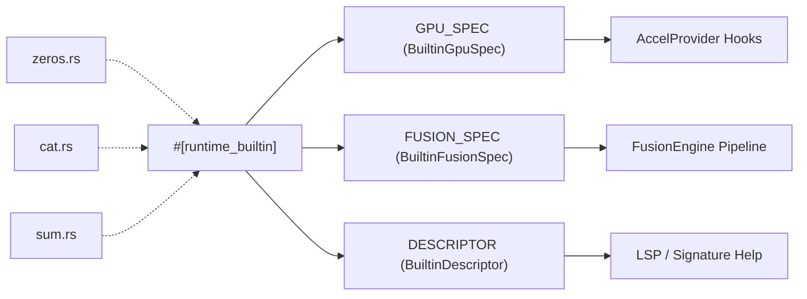
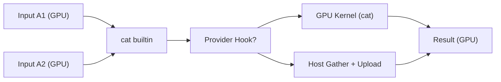

# Array & Math Built-ins

<details>
<summary>Relevant source files</summary>

- [crates/runmat-accelerate/src/native_auto.rs](https://github.com/runmat-org/runmat/blob/82685330/crates/runmat-accelerate/src/native_auto.rs)
- [crates/runmat-macros/src/lib.rs](https://github.com/runmat-org/runmat/blob/82685330/crates/runmat-macros/src/lib.rs)
- [crates/runmat-runtime/src/builtins/array/creation/colon.rs](https://github.com/runmat-org/runmat/blob/82685330/crates/runmat-runtime/src/builtins/array/creation/colon.rs)
- [crates/runmat-runtime/src/builtins/array/creation/eye.rs](https://github.com/runmat-org/runmat/blob/82685330/crates/runmat-runtime/src/builtins/array/creation/eye.rs)
- [crates/runmat-runtime/src/builtins/array/creation/fill.rs](https://github.com/runmat-org/runmat/blob/82685330/crates/runmat-runtime/src/builtins/array/creation/fill.rs)
- [crates/runmat-runtime/src/builtins/array/creation/linspace.rs](https://github.com/runmat-org/runmat/blob/82685330/crates/runmat-runtime/src/builtins/array/creation/linspace.rs)
- [crates/runmat-runtime/src/builtins/array/creation/logspace.rs](https://github.com/runmat-org/runmat/blob/82685330/crates/runmat-runtime/src/builtins/array/creation/logspace.rs)
- [crates/runmat-runtime/src/builtins/array/creation/meshgrid.rs](https://github.com/runmat-org/runmat/blob/82685330/crates/runmat-runtime/src/builtins/array/creation/meshgrid.rs)
- [crates/runmat-runtime/src/builtins/array/creation/ones.rs](https://github.com/runmat-org/runmat/blob/82685330/crates/runmat-runtime/src/builtins/array/creation/ones.rs)
- [crates/runmat-runtime/src/builtins/array/creation/rand.rs](https://github.com/runmat-org/runmat/blob/82685330/crates/runmat-runtime/src/builtins/array/creation/rand.rs)
- [crates/runmat-runtime/src/builtins/array/creation/randi.rs](https://github.com/runmat-org/runmat/blob/82685330/crates/runmat-runtime/src/builtins/array/creation/randi.rs)
- [crates/runmat-runtime/src/builtins/array/creation/randn.rs](https://github.com/runmat-org/runmat/blob/82685330/crates/runmat-runtime/src/builtins/array/creation/randn.rs)
- [crates/runmat-runtime/src/builtins/array/creation/randperm.rs](https://github.com/runmat-org/runmat/blob/82685330/crates/runmat-runtime/src/builtins/array/creation/randperm.rs)
- [crates/runmat-runtime/src/builtins/array/creation/range.rs](https://github.com/runmat-org/runmat/blob/82685330/crates/runmat-runtime/src/builtins/array/creation/range.rs)
- [crates/runmat-runtime/src/builtins/array/creation/true_false.rs](https://github.com/runmat-org/runmat/blob/82685330/crates/runmat-runtime/src/builtins/array/creation/true_false.rs)
- [crates/runmat-runtime/src/builtins/array/creation/zeros.rs](https://github.com/runmat-org/runmat/blob/82685330/crates/runmat-runtime/src/builtins/array/creation/zeros.rs)
- [crates/runmat-runtime/src/builtins/array/shape/cat.rs](https://github.com/runmat-org/runmat/blob/82685330/crates/runmat-runtime/src/builtins/array/shape/cat.rs)
- [crates/runmat-runtime/src/builtins/array/shape/circshift.rs](https://github.com/runmat-org/runmat/blob/82685330/crates/runmat-runtime/src/builtins/array/shape/circshift.rs)
- [crates/runmat-runtime/src/builtins/array/shape/diag.rs](https://github.com/runmat-org/runmat/blob/82685330/crates/runmat-runtime/src/builtins/array/shape/diag.rs)
- [crates/runmat-runtime/src/builtins/array/shape/flip.rs](https://github.com/runmat-org/runmat/blob/82685330/crates/runmat-runtime/src/builtins/array/shape/flip.rs)
- [crates/runmat-runtime/src/builtins/array/shape/fliplr.rs](https://github.com/runmat-org/runmat/blob/82685330/crates/runmat-runtime/src/builtins/array/shape/fliplr.rs)
- [crates/runmat-runtime/src/builtins/array/shape/flipud.rs](https://github.com/runmat-org/runmat/blob/82685330/crates/runmat-runtime/src/builtins/array/shape/flipud.rs)
- [crates/runmat-runtime/src/builtins/array/shape/horzcat.rs](https://github.com/runmat-org/runmat/blob/82685330/crates/runmat-runtime/src/builtins/array/shape/horzcat.rs)
- [crates/runmat-runtime/src/builtins/array/shape/ipermute.rs](https://github.com/runmat-org/runmat/blob/82685330/crates/runmat-runtime/src/builtins/array/shape/ipermute.rs)
- [crates/runmat-runtime/src/builtins/array/shape/kron.rs](https://github.com/runmat-org/runmat/blob/82685330/crates/runmat-runtime/src/builtins/array/shape/kron.rs)
- [crates/runmat-runtime/src/builtins/array/shape/permute.rs](https://github.com/runmat-org/runmat/blob/82685330/crates/runmat-runtime/src/builtins/array/shape/permute.rs)
- [crates/runmat-runtime/src/builtins/array/shape/repmat.rs](https://github.com/runmat-org/runmat/blob/82685330/crates/runmat-runtime/src/builtins/array/shape/repmat.rs)
- [crates/runmat-runtime/src/builtins/array/shape/reshape.rs](https://github.com/runmat-org/runmat/blob/82685330/crates/runmat-runtime/src/builtins/array/shape/reshape.rs)
- [crates/runmat-runtime/src/builtins/array/shape/rot90.rs](https://github.com/runmat-org/runmat/blob/82685330/crates/runmat-runtime/src/builtins/array/shape/rot90.rs)
- [crates/runmat-runtime/src/builtins/array/shape/squeeze.rs](https://github.com/runmat-org/runmat/blob/82685330/crates/runmat-runtime/src/builtins/array/shape/squeeze.rs)
- [crates/runmat-runtime/src/builtins/array/shape/tril.rs](https://github.com/runmat-org/runmat/blob/82685330/crates/runmat-runtime/src/builtins/array/shape/tril.rs)
- [crates/runmat-runtime/src/builtins/array/shape/triu.rs](https://github.com/runmat-org/runmat/blob/82685330/crates/runmat-runtime/src/builtins/array/shape/triu.rs)
- [crates/runmat-runtime/src/builtins/array/shape/vertcat.rs](https://github.com/runmat-org/runmat/blob/82685330/crates/runmat-runtime/src/builtins/array/shape/vertcat.rs)
- [crates/runmat-runtime/src/builtins/array/sorting_sets/intersect.rs](https://github.com/runmat-org/runmat/blob/82685330/crates/runmat-runtime/src/builtins/array/sorting_sets/intersect.rs)
- [crates/runmat-runtime/src/builtins/array/sorting_sets/ismember.rs](https://github.com/runmat-org/runmat/blob/82685330/crates/runmat-runtime/src/builtins/array/sorting_sets/ismember.rs)
- [crates/runmat-runtime/src/builtins/array/sorting_sets/setdiff.rs](https://github.com/runmat-org/runmat/blob/82685330/crates/runmat-runtime/src/builtins/array/sorting_sets/setdiff.rs)
- [crates/runmat-runtime/src/builtins/array/sorting_sets/union.rs](https://github.com/runmat-org/runmat/blob/82685330/crates/runmat-runtime/src/builtins/array/sorting_sets/union.rs)
- [crates/runmat-runtime/src/builtins/array/sorting_sets/unique.rs](https://github.com/runmat-org/runmat/blob/82685330/crates/runmat-runtime/src/builtins/array/sorting_sets/unique.rs)
- [crates/runmat-runtime/src/builtins/builtins-json/complex.json](https://github.com/runmat-org/runmat/blob/82685330/crates/runmat-runtime/src/builtins/builtins-json/complex.json)
- [crates/runmat-runtime/src/builtins/builtins-json/mode.json](https://github.com/runmat-org/runmat/blob/82685330/crates/runmat-runtime/src/builtins/builtins-json/mode.json)
- [crates/runmat-runtime/src/builtins/close/mod.rs](https://github.com/runmat-org/runmat/blob/82685330/crates/runmat-runtime/src/builtins/close/mod.rs)
- [crates/runmat-runtime/src/builtins/common/concatenation.rs](https://github.com/runmat-org/runmat/blob/82685330/crates/runmat-runtime/src/builtins/common/concatenation.rs)
- [crates/runmat-runtime/src/builtins/common/elementwise.rs](https://github.com/runmat-org/runmat/blob/82685330/crates/runmat-runtime/src/builtins/common/elementwise.rs)
- [crates/runmat-runtime/src/builtins/common/indexing.rs](https://github.com/runmat-org/runmat/blob/82685330/crates/runmat-runtime/src/builtins/common/indexing.rs)
- [crates/runmat-runtime/src/builtins/common/matrix.rs](https://github.com/runmat-org/runmat/blob/82685330/crates/runmat-runtime/src/builtins/common/matrix.rs)
- [crates/runmat-runtime/src/builtins/common/mod.rs](https://github.com/runmat-org/runmat/blob/82685330/crates/runmat-runtime/src/builtins/common/mod.rs)
- [crates/runmat-runtime/src/builtins/common/test_support.rs](https://github.com/runmat-org/runmat/blob/82685330/crates/runmat-runtime/src/builtins/common/test_support.rs)
- [crates/runmat-runtime/src/builtins/math/elementwise/complex.rs](https://github.com/runmat-org/runmat/blob/82685330/crates/runmat-runtime/src/builtins/math/elementwise/complex.rs)
- [crates/runmat-runtime/src/builtins/math/elementwise/factorial.rs](https://github.com/runmat-org/runmat/blob/82685330/crates/runmat-runtime/src/builtins/math/elementwise/factorial.rs)
- [crates/runmat-runtime/src/builtins/math/elementwise/gamma.rs](https://github.com/runmat-org/runmat/blob/82685330/crates/runmat-runtime/src/builtins/math/elementwise/gamma.rs)
- [crates/runmat-runtime/src/builtins/math/elementwise/hypot.rs](https://github.com/runmat-org/runmat/blob/82685330/crates/runmat-runtime/src/builtins/math/elementwise/hypot.rs)
- [crates/runmat-runtime/src/builtins/math/elementwise/mod.rs](https://github.com/runmat-org/runmat/blob/82685330/crates/runmat-runtime/src/builtins/math/elementwise/mod.rs)
- [crates/runmat-runtime/src/builtins/math/elementwise/nextpow2.rs](https://github.com/runmat-org/runmat/blob/82685330/crates/runmat-runtime/src/builtins/math/elementwise/nextpow2.rs)
- [crates/runmat-runtime/src/builtins/math/elementwise/pow2.rs](https://github.com/runmat-org/runmat/blob/82685330/crates/runmat-runtime/src/builtins/math/elementwise/pow2.rs)
- [crates/runmat-runtime/src/builtins/math/elementwise/sign.rs](https://github.com/runmat-org/runmat/blob/82685330/crates/runmat-runtime/src/builtins/math/elementwise/sign.rs)
- [crates/runmat-runtime/src/builtins/math/reduction/all.rs](https://github.com/runmat-org/runmat/blob/82685330/crates/runmat-runtime/src/builtins/math/reduction/all.rs)
- [crates/runmat-runtime/src/builtins/math/reduction/any.rs](https://github.com/runmat-org/runmat/blob/82685330/crates/runmat-runtime/src/builtins/math/reduction/any.rs)
- [crates/runmat-runtime/src/builtins/math/reduction/max.rs](https://github.com/runmat-org/runmat/blob/82685330/crates/runmat-runtime/src/builtins/math/reduction/max.rs)
- [crates/runmat-runtime/src/builtins/math/reduction/mean.rs](https://github.com/runmat-org/runmat/blob/82685330/crates/runmat-runtime/src/builtins/math/reduction/mean.rs)
- [crates/runmat-runtime/src/builtins/math/reduction/median.rs](https://github.com/runmat-org/runmat/blob/82685330/crates/runmat-runtime/src/builtins/math/reduction/median.rs)
- [crates/runmat-runtime/src/builtins/math/reduction/min.rs](https://github.com/runmat-org/runmat/blob/82685330/crates/runmat-runtime/src/builtins/math/reduction/min.rs)
- [crates/runmat-runtime/src/builtins/math/reduction/nnz.rs](https://github.com/runmat-org/runmat/blob/82685330/crates/runmat-runtime/src/builtins/math/reduction/nnz.rs)
- [crates/runmat-runtime/src/builtins/math/reduction/prod.rs](https://github.com/runmat-org/runmat/blob/82685330/crates/runmat-runtime/src/builtins/math/reduction/prod.rs)
- [crates/runmat-runtime/src/builtins/math/reduction/std.rs](https://github.com/runmat-org/runmat/blob/82685330/crates/runmat-runtime/src/builtins/math/reduction/std.rs)
- [crates/runmat-runtime/src/builtins/math/reduction/sum.rs](https://github.com/runmat-org/runmat/blob/82685330/crates/runmat-runtime/src/builtins/math/reduction/sum.rs)
- [crates/runmat-runtime/src/builtins/math/reduction/var.rs](https://github.com/runmat-org/runmat/blob/82685330/crates/runmat-runtime/src/builtins/math/reduction/var.rs)
- [crates/runmat-runtime/src/builtins/stats/hist/histcounts.rs](https://github.com/runmat-org/runmat/blob/82685330/crates/runmat-runtime/src/builtins/stats/hist/histcounts.rs)
- [crates/runmat-runtime/src/builtins/stats/hist/histcounts2.rs](https://github.com/runmat-org/runmat/blob/82685330/crates/runmat-runtime/src/builtins/stats/hist/histcounts2.rs)
- [crates/runmat-runtime/src/builtins/stats/mod.rs](https://github.com/runmat-org/runmat/blob/82685330/crates/runmat-runtime/src/builtins/stats/mod.rs)
- [crates/runmat-runtime/src/builtins/stats/summary/mod.rs](https://github.com/runmat-org/runmat/blob/82685330/crates/runmat-runtime/src/builtins/stats/summary/mod.rs)
- [crates/runmat-runtime/src/builtins/stats/summary/mode.rs](https://github.com/runmat-org/runmat/blob/82685330/crates/runmat-runtime/src/builtins/stats/summary/mode.rs)
- [crates/runmat-runtime/src/builtins/stats/type_resolvers.rs](https://github.com/runmat-org/runmat/blob/82685330/crates/runmat-runtime/src/builtins/stats/type_resolvers.rs)
- [crates/runmat-runtime/tests/matrix_ops.rs](https://github.com/runmat-org/runmat/blob/82685330/crates/runmat-runtime/tests/matrix_ops.rs)

</details>

The RunMat runtime provides a comprehensive suite of built-in functions for array creation, shape manipulation, and mathematical reduction. These built-ins are designed with a "GPU-first" philosophy, utilizing specialized metadata to enable automatic offloading to GPU providers via `wgpu` or fused kernel execution when possible.

## Architecture & Registration

Built-ins are defined using the `#[runtime_builtin]` attribute macro, which registers the function into the global inventory and associates it with a `BuiltinDescriptor` [crates/runmat-macros/src/lib.rs #31-154](https://github.com/runmat-org/runmat/blob/82685330/crates/runmat-macros/src/lib.rs#L31-L154)

### Metadata Specification

Each math and array built-in typically defines two specialized specification structures:

1. `BuiltinGpuSpec`: Defines how the operation maps to GPU provider hooks (e.g., `zeros`, `cat`, `reduce_sum`) and its residency policy [crates/runmat-runtime/src/builtins/array/creation/zeros.rs #26-42](https://github.com/runmat-org/runmat/blob/82685330/crates/runmat-runtime/src/builtins/array/creation/zeros.rs#L26-L42)
2. `BuiltinFusionSpec`: Describes how the operation can be fused into a single GPU kernel. For example, `nnz` defines a `wgsl_body` that accumulates nonzero counts during a fused pass [crates/runmat-runtime/src/builtins/math/reduction/nnz.rs #174-198](https://github.com/runmat-org/runmat/blob/82685330/crates/runmat-runtime/src/builtins/math/reduction/nnz.rs#L174-L198)

### Built-in Registration Flow

The following diagram illustrates how a built-in moves from definition to runtime availability.

Built-in Entity Mapping



<details>
<summary>Rendered SVG</summary>

```svg
<svg id="mermaid-jkm66oot6v" xmlns="http://www.w3.org/2000/svg" xmlns:xlink="http://www.w3.org/1999/xlink" class="flowchart" style="max-width: 100%; touch-action: none; user-select: none; cursor: grab; min-height: fit-content; max-height: 100%;" viewBox="-0.006574761399804174 0 966.0131495227996 556" role="graphics-document document" aria-roledescription="flowchart-v2" preserveAspectRatio="xMidYMid meet"><style>#mermaid-jkm66oot6v{font-family:ui-sans-serif,-apple-system,system-ui,Segoe UI,Helvetica;font-size:16px;fill:#ccc;}@keyframes edge-animation-frame{from{stroke-dashoffset:0;}}@keyframes dash{to{stroke-dashoffset:0;}}#mermaid-jkm66oot6v .edge-animation-slow{stroke-dasharray:9,5!important;stroke-dashoffset:900;animation:dash 50s linear infinite;stroke-linecap:round;}#mermaid-jkm66oot6v .edge-animation-fast{stroke-dasharray:9,5!important;stroke-dashoffset:900;animation:dash 20s linear infinite;stroke-linecap:round;}#mermaid-jkm66oot6v .error-icon{fill:#333;}#mermaid-jkm66oot6v .error-text{fill:#cccccc;stroke:#cccccc;}#mermaid-jkm66oot6v .edge-thickness-normal{stroke-width:1px;}#mermaid-jkm66oot6v .edge-thickness-thick{stroke-width:3.5px;}#mermaid-jkm66oot6v .edge-pattern-solid{stroke-dasharray:0;}#mermaid-jkm66oot6v .edge-thickness-invisible{stroke-width:0;fill:none;}#mermaid-jkm66oot6v .edge-pattern-dashed{stroke-dasharray:3;}#mermaid-jkm66oot6v .edge-pattern-dotted{stroke-dasharray:2;}#mermaid-jkm66oot6v .marker{fill:#666;stroke:#666;}#mermaid-jkm66oot6v .marker.cross{stroke:#666;}#mermaid-jkm66oot6v svg{font-family:ui-sans-serif,-apple-system,system-ui,Segoe UI,Helvetica;font-size:16px;}#mermaid-jkm66oot6v p{margin:0;}#mermaid-jkm66oot6v .label{font-family:ui-sans-serif,-apple-system,system-ui,Segoe UI,Helvetica;color:#fff;}#mermaid-jkm66oot6v .cluster-label text{fill:#fff;}#mermaid-jkm66oot6v .cluster-label span{color:#fff;}#mermaid-jkm66oot6v .cluster-label span p{background-color:transparent;}#mermaid-jkm66oot6v .label text,#mermaid-jkm66oot6v span{fill:#fff;color:#fff;}#mermaid-jkm66oot6v .node rect,#mermaid-jkm66oot6v .node circle,#mermaid-jkm66oot6v .node ellipse,#mermaid-jkm66oot6v .node polygon,#mermaid-jkm66oot6v .node path{fill:#111;stroke:#222;stroke-width:1px;}#mermaid-jkm66oot6v .rough-node .label text,#mermaid-jkm66oot6v .node .label text,#mermaid-jkm66oot6v .image-shape .label,#mermaid-jkm66oot6v .icon-shape .label{text-anchor:middle;}#mermaid-jkm66oot6v .node .katex path{fill:#000;stroke:#000;stroke-width:1px;}#mermaid-jkm66oot6v .rough-node .label,#mermaid-jkm66oot6v .node .label,#mermaid-jkm66oot6v .image-shape .label,#mermaid-jkm66oot6v .icon-shape .label{text-align:center;}#mermaid-jkm66oot6v .node.clickable{cursor:pointer;}#mermaid-jkm66oot6v .root .anchor path{fill:#666!important;stroke-width:0;stroke:#666;}#mermaid-jkm66oot6v .arrowheadPath{fill:#0b0b0b;}#mermaid-jkm66oot6v .edgePath .path{stroke:#666;stroke-width:1px;}#mermaid-jkm66oot6v .flowchart-link{stroke:#666;fill:none;}#mermaid-jkm66oot6v .edgeLabel{background-color:#161616;text-align:center;}#mermaid-jkm66oot6v .edgeLabel p{background-color:#161616;}#mermaid-jkm66oot6v .edgeLabel rect{opacity:0.5;background-color:#161616;fill:#161616;}#mermaid-jkm66oot6v .labelBkg{background-color:rgba(22, 22, 22, 0.5);}#mermaid-jkm66oot6v .cluster rect{fill:#161616;stroke:#222;stroke-width:1px;}#mermaid-jkm66oot6v .cluster text{fill:#fff;}#mermaid-jkm66oot6v .cluster span{color:#fff;}#mermaid-jkm66oot6v div.mermaidTooltip{position:absolute;text-align:center;max-width:200px;padding:2px;font-family:ui-sans-serif,-apple-system,system-ui,Segoe UI,Helvetica;font-size:12px;background:#333;border:1px solid hsl(0, 0%, 10%);border-radius:2px;pointer-events:none;z-index:100;}#mermaid-jkm66oot6v .flowchartTitleText{text-anchor:middle;font-size:18px;fill:#ccc;}#mermaid-jkm66oot6v rect.text{fill:none;stroke-width:0;}#mermaid-jkm66oot6v .icon-shape,#mermaid-jkm66oot6v .image-shape{background-color:#161616;text-align:center;}#mermaid-jkm66oot6v .icon-shape p,#mermaid-jkm66oot6v .image-shape p{background-color:#161616;padding:2px;}#mermaid-jkm66oot6v .icon-shape .label rect,#mermaid-jkm66oot6v .image-shape .label rect{opacity:0.5;background-color:#161616;fill:#161616;}#mermaid-jkm66oot6v .label-icon{display:inline-block;height:1em;overflow:visible;vertical-align:-0.125em;}#mermaid-jkm66oot6v .node .label-icon path{fill:currentColor;stroke:revert;stroke-width:revert;}#mermaid-jkm66oot6v .node .neo-node{stroke:#222;}#mermaid-jkm66oot6v [data-look="neo"].node rect,#mermaid-jkm66oot6v [data-look="neo"].cluster rect,#mermaid-jkm66oot6v [data-look="neo"].node polygon{stroke:url(#mermaid-jkm66oot6v-gradient);filter:drop-shadow( 1px 2px 2px rgba(185,185,185,1));}#mermaid-jkm66oot6v [data-look="neo"].node path{stroke:url(#mermaid-jkm66oot6v-gradient);stroke-width:1px;}#mermaid-jkm66oot6v [data-look="neo"].node .outer-path{filter:drop-shadow( 1px 2px 2px rgba(185,185,185,1));}#mermaid-jkm66oot6v [data-look="neo"].node .neo-line path{stroke:#222;filter:none;}#mermaid-jkm66oot6v [data-look="neo"].node circle{stroke:url(#mermaid-jkm66oot6v-gradient);filter:drop-shadow( 1px 2px 2px rgba(185,185,185,1));}#mermaid-jkm66oot6v [data-look="neo"].node circle .state-start{fill:#000000;}#mermaid-jkm66oot6v [data-look="neo"].icon-shape .icon{fill:url(#mermaid-jkm66oot6v-gradient);filter:drop-shadow( 1px 2px 2px rgba(185,185,185,1));}#mermaid-jkm66oot6v [data-look="neo"].icon-shape .icon-neo path{stroke:url(#mermaid-jkm66oot6v-gradient);filter:drop-shadow( 1px 2px 2px rgba(185,185,185,1));}#mermaid-jkm66oot6v :root{--mermaid-font-family:"trebuchet ms",verdana,arial,sans-serif;}</style><g><marker id="mermaid-jkm66oot6v_flowchart-v2-pointEnd" class="marker flowchart-v2" viewBox="0 0 10 10" refX="5" refY="5" markerUnits="userSpaceOnUse" markerWidth="8" markerHeight="8" orient="auto"><path d="M 0 0 L 10 5 L 0 10 z" class="arrowMarkerPath" style="stroke-width: 1; stroke-dasharray: 1, 0;"></path></marker><marker id="mermaid-jkm66oot6v_flowchart-v2-pointStart" class="marker flowchart-v2" viewBox="0 0 10 10" refX="4.5" refY="5" markerUnits="userSpaceOnUse" markerWidth="8" markerHeight="8" orient="auto"><path d="M 0 5 L 10 10 L 10 0 z" class="arrowMarkerPath" style="stroke-width: 1; stroke-dasharray: 1, 0;"></path></marker><marker id="mermaid-jkm66oot6v_flowchart-v2-pointEnd-margin" class="marker flowchart-v2" viewBox="0 0 11.5 14" refX="11.5" refY="7" markerUnits="userSpaceOnUse" markerWidth="10.5" markerHeight="14" orient="auto"><path d="M 0 0 L 11.5 7 L 0 14 z" class="arrowMarkerPath" style="stroke-width: 0; stroke-dasharray: 1, 0;"></path></marker><marker id="mermaid-jkm66oot6v_flowchart-v2-pointStart-margin" class="marker flowchart-v2" viewBox="0 0 11.5 14" refX="1" refY="7" markerUnits="userSpaceOnUse" markerWidth="11.5" markerHeight="14" orient="auto"><polygon points="0,7 11.5,14 11.5,0" class="arrowMarkerPath" style="stroke-width: 0; stroke-dasharray: 1, 0;"></polygon></marker><marker id="mermaid-jkm66oot6v_flowchart-v2-circleEnd" class="marker flowchart-v2" viewBox="0 0 10 10" refX="11" refY="5" markerUnits="userSpaceOnUse" markerWidth="11" markerHeight="11" orient="auto"><circle cx="5" cy="5" r="5" class="arrowMarkerPath" style="stroke-width: 1; stroke-dasharray: 1, 0;"></circle></marker><marker id="mermaid-jkm66oot6v_flowchart-v2-circleStart" class="marker flowchart-v2" viewBox="0 0 10 10" refX="-1" refY="5" markerUnits="userSpaceOnUse" markerWidth="11" markerHeight="11" orient="auto"><circle cx="5" cy="5" r="5" class="arrowMarkerPath" style="stroke-width: 1; stroke-dasharray: 1, 0;"></circle></marker><marker id="mermaid-jkm66oot6v_flowchart-v2-circleEnd-margin" class="marker flowchart-v2" viewBox="0 0 10 10" refY="5" refX="12.25" markerUnits="userSpaceOnUse" markerWidth="14" markerHeight="14" orient="auto"><circle cx="5" cy="5" r="5" class="arrowMarkerPath" style="stroke-width: 0; stroke-dasharray: 1, 0;"></circle></marker><marker id="mermaid-jkm66oot6v_flowchart-v2-circleStart-margin" class="marker flowchart-v2" viewBox="0 0 10 10" refX="-2" refY="5" markerUnits="userSpaceOnUse" markerWidth="14" markerHeight="14" orient="auto"><circle cx="5" cy="5" r="5" class="arrowMarkerPath" style="stroke-width: 0; stroke-dasharray: 1, 0;"></circle></marker><marker id="mermaid-jkm66oot6v_flowchart-v2-crossEnd" class="marker cross flowchart-v2" viewBox="0 0 11 11" refX="12" refY="5.2" markerUnits="userSpaceOnUse" markerWidth="11" markerHeight="11" orient="auto"><path d="M 1,1 l 9,9 M 10,1 l -9,9" class="arrowMarkerPath" style="stroke-width: 2; stroke-dasharray: 1, 0;"></path></marker><marker id="mermaid-jkm66oot6v_flowchart-v2-crossStart" class="marker cross flowchart-v2" viewBox="0 0 11 11" refX="-1" refY="5.2" markerUnits="userSpaceOnUse" markerWidth="11" markerHeight="11" orient="auto"><path d="M 1,1 l 9,9 M 10,1 l -9,9" class="arrowMarkerPath" style="stroke-width: 2; stroke-dasharray: 1, 0;"></path></marker><marker id="mermaid-jkm66oot6v_flowchart-v2-crossEnd-margin" class="marker cross flowchart-v2" viewBox="0 0 15 15" refX="17.7" refY="7.5" markerUnits="userSpaceOnUse" markerWidth="12" markerHeight="12" orient="auto"><path d="M 1,1 L 14,14 M 1,14 L 14,1" class="arrowMarkerPath" style="stroke-width: 2.5;"></path></marker><marker id="mermaid-jkm66oot6v_flowchart-v2-crossStart-margin" class="marker cross flowchart-v2" viewBox="0 0 15 15" refX="-3.5" refY="7.5" markerUnits="userSpaceOnUse" markerWidth="12" markerHeight="12" orient="auto"><path d="M 1,1 L 14,14 M 1,14 L 14,1" class="arrowMarkerPath" style="stroke-width: 2.5; stroke-dasharray: 1, 0;"></path></marker><g class="root"><g class="clusters"><g class="cluster" id="mermaid-jkm66oot6v-Files" data-look="classic"><rect style="" x="232.06640625" y="8" width="497.390625" height="104"></rect><g class="cluster-label" transform="translate(464.20703125, 8)"><foreignObject width="33.109375" height="24"><div style="display: table-cell; white-space: nowrap; line-height: 1.5;" xmlns="http://www.w3.org/1999/xhtml"><span class="nodeLabel"><p>Files</p></span></div></foreignObject></g></g><g class="cluster" id="mermaid-jkm66oot6v-subGraph1" data-look="classic"><rect style="" x="32.8203125" y="444" width="899.484375" height="104"></rect><g class="cluster-label" transform="translate(427.921875, 444)"><foreignObject width="109.28125" height="24"><div style="display: table-cell; white-space: nowrap; line-height: 1.5;" xmlns="http://www.w3.org/1999/xhtml"><span class="nodeLabel"><p>Runtime Space</p></span></div></foreignObject></g></g><g class="cluster" id="mermaid-jkm66oot6v-subGraph0" data-look="classic"><rect style="" x="8" y="162" width="950" height="232"></rect><g class="cluster-label" transform="translate(408.5, 162)"><foreignObject width="149" height="24"><div style="display: table-cell; white-space: nowrap; line-height: 1.5;" xmlns="http://www.w3.org/1999/xhtml"><span class="nodeLabel"><p>Source Space (Rust)</p></span></div></foreignObject></g></g></g><g class="edgePaths"><path d="M388.219,229.899L352.349,235.916C316.479,241.933,244.74,253.966,208.87,263.483C173,273,173,280,173,283.5L173,287" id="mermaid-jkm66oot6v-L_A_B_0" class="edge-thickness-normal edge-pattern-solid edge-thickness-normal edge-pattern-solid flowchart-link" style=";" data-edge="true" data-et="edge" data-id="L_A_B_0" data-points="W3sieCI6Mzg4LjIxODc1LCJ5IjoyMjkuODk4NzkwMzIyNTgwNjV9LHsieCI6MTczLCJ5IjoyNjZ9LHsieCI6MTczLCJ5IjoyOTF9XQ==" data-look="classic" marker-end="url(#mermaid-jkm66oot6v_flowchart-v2-pointEnd)"></path><path d="M483,241L483,245.167C483,249.333,483,257.667,483,265.333C483,273,483,280,483,283.5L483,287" id="mermaid-jkm66oot6v-L_A_C_0" class="edge-thickness-normal edge-pattern-solid edge-thickness-normal edge-pattern-solid flowchart-link" style=";" data-edge="true" data-et="edge" data-id="L_A_C_0" data-points="W3sieCI6NDgzLCJ5IjoyNDF9LHsieCI6NDgzLCJ5IjoyNjZ9LHsieCI6NDgzLCJ5IjoyOTF9XQ==" data-look="classic" marker-end="url(#mermaid-jkm66oot6v_flowchart-v2-pointEnd)"></path><path d="M577.781,229.899L613.651,235.916C649.521,241.933,721.26,253.966,757.13,263.483C793,273,793,280,793,283.5L793,287" id="mermaid-jkm66oot6v-L_A_D_0" class="edge-thickness-normal edge-pattern-solid edge-thickness-normal edge-pattern-solid flowchart-link" style=";" data-edge="true" data-et="edge" data-id="L_A_D_0" data-points="W3sieCI6NTc3Ljc4MTI1LCJ5IjoyMjkuODk4NzkwMzIyNTgwNjV9LHsieCI6NzkzLCJ5IjoyNjZ9LHsieCI6NzkzLCJ5IjoyOTF9XQ==" data-look="classic" marker-end="url(#mermaid-jkm66oot6v_flowchart-v2-pointEnd)"></path><path d="M173,369L173,373.167C173,377.333,173,385.667,173,394C173,402.333,173,410.667,173,419C173,427.333,173,435.667,173,443.333C173,451,173,458,173,461.5L173,465" id="mermaid-jkm66oot6v-L_B_E_0" class="edge-thickness-normal edge-pattern-solid edge-thickness-normal edge-pattern-solid flowchart-link" style=";" data-edge="true" data-et="edge" data-id="L_B_E_0" data-points="W3sieCI6MTczLCJ5IjozNjl9LHsieCI6MTczLCJ5IjozOTR9LHsieCI6MTczLCJ5Ijo0MTl9LHsieCI6MTczLCJ5Ijo0NDR9LHsieCI6MTczLCJ5Ijo0Njl9XQ==" data-look="classic" marker-end="url(#mermaid-jkm66oot6v_flowchart-v2-pointEnd)"></path><path d="M483,369L483,373.167C483,377.333,483,385.667,483,394C483,402.333,483,410.667,483,419C483,427.333,483,435.667,483,443.333C483,451,483,458,483,461.5L483,465" id="mermaid-jkm66oot6v-L_C_F_0" class="edge-thickness-normal edge-pattern-solid edge-thickness-normal edge-pattern-solid flowchart-link" style=";" data-edge="true" data-et="edge" data-id="L_C_F_0" data-points="W3sieCI6NDgzLCJ5IjozNjl9LHsieCI6NDgzLCJ5IjozOTR9LHsieCI6NDgzLCJ5Ijo0MTl9LHsieCI6NDgzLCJ5Ijo0NDR9LHsieCI6NDgzLCJ5Ijo0Njl9XQ==" data-look="classic" marker-end="url(#mermaid-jkm66oot6v_flowchart-v2-pointEnd)"></path><path d="M793,369L793,373.167C793,377.333,793,385.667,793,394C793,402.333,793,410.667,793,419C793,427.333,793,435.667,793,443.333C793,451,793,458,793,461.5L793,465" id="mermaid-jkm66oot6v-L_D_G_0" class="edge-thickness-normal edge-pattern-solid edge-thickness-normal edge-pattern-solid flowchart-link" style=";" data-edge="true" data-et="edge" data-id="L_D_G_0" data-points="W3sieCI6NzkzLCJ5IjozNjl9LHsieCI6NzkzLCJ5IjozOTR9LHsieCI6NzkzLCJ5Ijo0MTl9LHsieCI6NzkzLCJ5Ijo0NDR9LHsieCI6NzkzLCJ5Ijo0Njl9XQ==" data-look="classic" marker-end="url(#mermaid-jkm66oot6v_flowchart-v2-pointEnd)"></path><path d="M325.957,87L325.957,91.167C325.957,95.333,325.957,103.667,325.957,112C325.957,120.333,325.957,128.667,325.957,137C325.957,145.333,325.957,153.667,337.908,161.79C349.858,169.914,373.76,177.828,385.711,181.786L397.661,185.743" id="mermaid-jkm66oot6v-L_H_A_0" class="edge-thickness-normal edge-pattern-dotted edge-thickness-normal edge-pattern-solid flowchart-link" style=";" data-edge="true" data-et="edge" data-id="L_H_A_0" data-points="W3sieCI6MzI1Ljk1NzAzMTI1LCJ5Ijo4N30seyJ4IjozMjUuOTU3MDMxMjUsInkiOjExMn0seyJ4IjozMjUuOTU3MDMxMjUsInkiOjEzN30seyJ4IjozMjUuOTU3MDMxMjUsInkiOjE2Mn0seyJ4Ijo0MDEuNDU4NDU4NTMzNjUzOCwieSI6MTg3fV0=" data-look="classic" marker-end="url(#mermaid-jkm66oot6v_flowchart-v2-pointEnd)"></path><path d="M485.238,87L485.238,91.167C485.238,95.333,485.238,103.667,485.238,112C485.238,120.333,485.238,128.667,485.238,137C485.238,145.333,485.238,153.667,485.088,161.334C484.937,169.001,484.636,176.002,484.485,179.503L484.334,183.004" id="mermaid-jkm66oot6v-L_I_A_0" class="edge-thickness-normal edge-pattern-dotted edge-thickness-normal edge-pattern-solid flowchart-link" style=";" data-edge="true" data-et="edge" data-id="L_I_A_0" data-points="W3sieCI6NDg1LjIzODI4MTI1LCJ5Ijo4N30seyJ4Ijo0ODUuMjM4MjgxMjUsInkiOjExMn0seyJ4Ijo0ODUuMjM4MjgxMjUsInkiOjEzN30seyJ4Ijo0ODUuMjM4MjgxMjUsInkiOjE2Mn0seyJ4Ijo0ODQuMTYyMTg0NDk1MTkyMywieSI6MTg3fV0=" data-look="classic" marker-end="url(#mermaid-jkm66oot6v_flowchart-v2-pointEnd)"></path><path d="M640.043,87L640.043,91.167C640.043,95.333,640.043,103.667,640.043,112C640.043,120.333,640.043,128.667,640.043,137C640.043,145.333,640.043,153.667,628.092,161.79C616.142,169.914,592.24,177.828,580.289,181.786L568.339,185.743" id="mermaid-jkm66oot6v-L_J_A_0" class="edge-thickness-normal edge-pattern-dotted edge-thickness-normal edge-pattern-solid flowchart-link" style=";" data-edge="true" data-et="edge" data-id="L_J_A_0" data-points="W3sieCI6NjQwLjA0Mjk2ODc1LCJ5Ijo4N30seyJ4Ijo2NDAuMDQyOTY4NzUsInkiOjExMn0seyJ4Ijo2NDAuMDQyOTY4NzUsInkiOjEzN30seyJ4Ijo2NDAuMDQyOTY4NzUsInkiOjE2Mn0seyJ4Ijo1NjQuNTQxNTQxNDY2MzQ2MiwieSI6MTg3fV0=" data-look="classic" marker-end="url(#mermaid-jkm66oot6v_flowchart-v2-pointEnd)"></path></g><g class="edgeLabels"><g class="edgeLabel"><g class="label" data-id="L_A_B_0" transform="translate(0, 0)"><foreignObject width="0" height="0"><div style="display: table-cell; white-space: nowrap; line-height: 1.5; max-width: 200px; text-align: center;" xmlns="http://www.w3.org/1999/xhtml" class="labelBkg"><span class="edgeLabel"></span></div></foreignObject></g></g><g class="edgeLabel"><g class="label" data-id="L_A_C_0" transform="translate(0, 0)"><foreignObject width="0" height="0"><div style="display: table-cell; white-space: nowrap; line-height: 1.5; max-width: 200px; text-align: center;" xmlns="http://www.w3.org/1999/xhtml" class="labelBkg"><span class="edgeLabel"></span></div></foreignObject></g></g><g class="edgeLabel"><g class="label" data-id="L_A_D_0" transform="translate(0, 0)"><foreignObject width="0" height="0"><div style="display: table-cell; white-space: nowrap; line-height: 1.5; max-width: 200px; text-align: center;" xmlns="http://www.w3.org/1999/xhtml" class="labelBkg"><span class="edgeLabel"></span></div></foreignObject></g></g><g class="edgeLabel"><g class="label" data-id="L_B_E_0" transform="translate(0, 0)"><foreignObject width="0" height="0"><div style="display: table-cell; white-space: nowrap; line-height: 1.5; max-width: 200px; text-align: center;" xmlns="http://www.w3.org/1999/xhtml" class="labelBkg"><span class="edgeLabel"></span></div></foreignObject></g></g><g class="edgeLabel"><g class="label" data-id="L_C_F_0" transform="translate(0, 0)"><foreignObject width="0" height="0"><div style="display: table-cell; white-space: nowrap; line-height: 1.5; max-width: 200px; text-align: center;" xmlns="http://www.w3.org/1999/xhtml" class="labelBkg"><span class="edgeLabel"></span></div></foreignObject></g></g><g class="edgeLabel"><g class="label" data-id="L_D_G_0" transform="translate(0, 0)"><foreignObject width="0" height="0"><div style="display: table-cell; white-space: nowrap; line-height: 1.5; max-width: 200px; text-align: center;" xmlns="http://www.w3.org/1999/xhtml" class="labelBkg"><span class="edgeLabel"></span></div></foreignObject></g></g><g class="edgeLabel"><g class="label" data-id="L_H_A_0" transform="translate(0, 0)"><foreignObject width="0" height="0"><div style="display: table-cell; white-space: nowrap; line-height: 1.5; max-width: 200px; text-align: center;" xmlns="http://www.w3.org/1999/xhtml" class="labelBkg"><span class="edgeLabel"></span></div></foreignObject></g></g><g class="edgeLabel"><g class="label" data-id="L_I_A_0" transform="translate(0, 0)"><foreignObject width="0" height="0"><div style="display: table-cell; white-space: nowrap; line-height: 1.5; max-width: 200px; text-align: center;" xmlns="http://www.w3.org/1999/xhtml" class="labelBkg"><span class="edgeLabel"></span></div></foreignObject></g></g><g class="edgeLabel"><g class="label" data-id="L_J_A_0" transform="translate(0, 0)"><foreignObject width="0" height="0"><div style="display: table-cell; white-space: nowrap; line-height: 1.5; max-width: 200px; text-align: center;" xmlns="http://www.w3.org/1999/xhtml" class="labelBkg"><span class="edgeLabel"></span></div></foreignObject></g></g></g><g class="nodes"><g class="node default" id="mermaid-jkm66oot6v-flowchart-A-0" data-look="classic" transform="translate(483, 214)"><rect class="basic label-container" style="" x="-94.78125" y="-27" width="189.5625" height="54"></rect><g class="label" style="" transform="translate(-64.78125, -12)"><rect></rect><foreignObject width="129.5625" height="24"><div style="display: table-cell; white-space: nowrap; line-height: 1.5; max-width: 200px; text-align: center;" xmlns="http://www.w3.org/1999/xhtml"><span class="nodeLabel"><p>#[runtime_builtin]</p></span></div></foreignObject></g></g><g class="node default" id="mermaid-jkm66oot6v-flowchart-B-1" data-look="classic" transform="translate(173, 330)"><rect class="basic label-container" style="" x="-130" y="-39" width="260" height="78"></rect><g class="label" style="" transform="translate(-100, -24)"><rect></rect><foreignObject width="200" height="48"><div style="display: table; white-space: break-spaces; line-height: 1.5; max-width: 200px; text-align: center; width: 200px;" xmlns="http://www.w3.org/1999/xhtml"><span class="nodeLabel"><p>GPU_SPEC (BuiltinGpuSpec)</p></span></div></foreignObject></g></g><g class="node default" id="mermaid-jkm66oot6v-flowchart-C-3" data-look="classic" transform="translate(483, 330)"><rect class="basic label-container" style="" x="-130" y="-39" width="260" height="78"></rect><g class="label" style="" transform="translate(-100, -24)"><rect></rect><foreignObject width="200" height="48"><div style="display: table; white-space: break-spaces; line-height: 1.5; max-width: 200px; text-align: center; width: 200px;" xmlns="http://www.w3.org/1999/xhtml"><span class="nodeLabel"><p>FUSION_SPEC (BuiltinFusionSpec)</p></span></div></foreignObject></g></g><g class="node default" id="mermaid-jkm66oot6v-flowchart-D-5" data-look="classic" transform="translate(793, 330)"><rect class="basic label-container" style="" x="-130" y="-39" width="260" height="78"></rect><g class="label" style="" transform="translate(-100, -24)"><rect></rect><foreignObject width="200" height="48"><div style="display: table; white-space: break-spaces; line-height: 1.5; max-width: 200px; text-align: center; width: 200px;" xmlns="http://www.w3.org/1999/xhtml"><span class="nodeLabel"><p>DESCRIPTOR (BuiltinDescriptor)</p></span></div></foreignObject></g></g><g class="node default" id="mermaid-jkm66oot6v-flowchart-E-7" data-look="classic" transform="translate(173, 496)"><rect class="basic label-container" style="" x="-105.1796875" y="-27" width="210.359375" height="54"></rect><g class="label" style="" transform="translate(-75.1796875, -12)"><rect></rect><foreignObject width="150.359375" height="24"><div style="display: table-cell; white-space: nowrap; line-height: 1.5; max-width: 200px; text-align: center;" xmlns="http://www.w3.org/1999/xhtml"><span class="nodeLabel"><p>AccelProvider Hooks</p></span></div></foreignObject></g></g><g class="node default" id="mermaid-jkm66oot6v-flowchart-F-9" data-look="classic" transform="translate(483, 496)"><rect class="basic label-container" style="" x="-109.046875" y="-27" width="218.09375" height="54"></rect><g class="label" style="" transform="translate(-79.046875, -12)"><rect></rect><foreignObject width="158.09375" height="24"><div style="display: table-cell; white-space: nowrap; line-height: 1.5; max-width: 200px; text-align: center;" xmlns="http://www.w3.org/1999/xhtml"><span class="nodeLabel"><p>FusionEngine Pipeline</p></span></div></foreignObject></g></g><g class="node default" id="mermaid-jkm66oot6v-flowchart-G-11" data-look="classic" transform="translate(793, 496)"><rect class="basic label-container" style="" x="-104.3046875" y="-27" width="208.609375" height="54"></rect><g class="label" style="" transform="translate(-74.3046875, -12)"><rect></rect><foreignObject width="148.609375" height="24"><div style="display: table-cell; white-space: nowrap; line-height: 1.5; max-width: 200px; text-align: center;" xmlns="http://www.w3.org/1999/xhtml"><span class="nodeLabel"><p>LSP / Signature Help</p></span></div></foreignObject></g></g><g class="node default" id="mermaid-jkm66oot6v-flowchart-H-12" data-look="classic" transform="translate(325.95703125, 60)"><rect class="basic label-container" style="" x="-58.890625" y="-27" width="117.78125" height="54"></rect><g class="label" style="" transform="translate(-28.890625, -12)"><rect></rect><foreignObject width="57.78125" height="24"><div style="display: table-cell; white-space: nowrap; line-height: 1.5; max-width: 200px; text-align: center;" xmlns="http://www.w3.org/1999/xhtml"><span class="nodeLabel"><p>zeros.rs</p></span></div></foreignObject></g></g><g class="node default" id="mermaid-jkm66oot6v-flowchart-I-13" data-look="classic" transform="translate(485.23828125, 60)"><rect class="basic label-container" style="" x="-50.390625" y="-27" width="100.78125" height="54"></rect><g class="label" style="" transform="translate(-20.390625, -12)"><rect></rect><foreignObject width="40.78125" height="24"><div style="display: table-cell; white-space: nowrap; line-height: 1.5; max-width: 200px; text-align: center;" xmlns="http://www.w3.org/1999/xhtml"><span class="nodeLabel"><p>cat.rs</p></span></div></foreignObject></g></g><g class="node default" id="mermaid-jkm66oot6v-flowchart-J-14" data-look="classic" transform="translate(640.04296875, 60)"><rect class="basic label-container" style="" x="-54.4140625" y="-27" width="108.828125" height="54"></rect><g class="label" style="" transform="translate(-24.4140625, -12)"><rect></rect><foreignObject width="48.828125" height="24"><div style="display: table-cell; white-space: nowrap; line-height: 1.5; max-width: 200px; text-align: center;" xmlns="http://www.w3.org/1999/xhtml"><span class="nodeLabel"><p>sum.rs</p></span></div></foreignObject></g></g></g></g></g><defs><filter id="mermaid-jkm66oot6v-drop-shadow" height="130%" width="130%"><feDropShadow dx="4" dy="4" stdDeviation="0" flood-opacity="0.06" flood-color="#000000"></feDropShadow></filter></defs><defs><filter id="mermaid-jkm66oot6v-drop-shadow-small" height="150%" width="150%"><feDropShadow dx="2" dy="2" stdDeviation="0" flood-opacity="0.06" flood-color="#000000"></feDropShadow></filter></defs><linearGradient id="mermaid-jkm66oot6v-gradient" gradientUnits="objectBoundingBox" x1="0%" y1="0%" x2="100%" y2="0%"><stop offset="0%" stop-color="#333" stop-opacity="1"></stop><stop offset="100%" stop-color="hsl(-120, 0%, 3.3333333333%)" stop-opacity="1"></stop></linearGradient></svg>
```

</details>

Sources: [crates/runmat-macros/src/lib.rs #31-154](https://github.com/runmat-org/runmat/blob/82685330/crates/runmat-macros/src/lib.rs#L31-L154) [crates/runmat-runtime/src/builtins/array/creation/zeros.rs #26-42](https://github.com/runmat-org/runmat/blob/82685330/crates/runmat-runtime/src/builtins/array/creation/zeros.rs#L26-L42) [crates/runmat-runtime/src/builtins/math/reduction/nnz.rs #174-198](https://github.com/runmat-org/runmat/blob/82685330/crates/runmat-runtime/src/builtins/math/reduction/nnz.rs#L174-L198)

---

## Array Creation Built-ins

Creation built-ins support MATLAB-standard dimension arguments (e.g., `zeros(m, n)` or `zeros([m n])`) and the `"like"` syntax for matching the class and residency (CPU/GPU) of a prototype [crates/runmat-runtime/src/builtins/array/creation/zeros.rs #139-161](https://github.com/runmat-org/runmat/blob/82685330/crates/runmat-runtime/src/builtins/array/creation/zeros.rs#L139-L161)

### Core Generators

| Function | Description | GPU Support |
| --- | --- | --- |
| zeros | Allocates an array of all zeros. | Custom generator hook crates/runmat-runtime/src/builtins/array/creation/zeros.rs#28 |
| ones | Allocates an array of all ones. | Custom generator hook |
| colon | Generates arithmetic progressions (start:step:stop). | Delegates to linspace hooks crates/runmat-runtime/src/builtins/array/creation/colon.rs#41-54 |
| linspace | Linearly spaced vectors. | Native provider hook |
| rand / randn | Uniform/Normal random distributions. | GPU-side RNG where supported |
| eye | Identity matrix. | Custom generator |

### The Colon Operator (`:`)

The `colon` built-in handles complex logic for floating-point tolerance (`f64::EPSILON`) and character sequence generation [crates/runmat-runtime/src/builtins/array/creation/colon.rs #22-38](https://github.com/runmat-org/runmat/blob/82685330/crates/runmat-runtime/src/builtins/array/creation/colon.rs#L22-L38) It is treated as a "fusion sink," meaning it terminates any upstream fusion chain to materialize the sequence [crates/runmat-runtime/src/builtins/array/creation/colon.rs #56-65](https://github.com/runmat-org/runmat/blob/82685330/crates/runmat-runtime/src/builtins/array/creation/colon.rs#L56-L65)

Sources: [crates/runmat-runtime/src/builtins/array/creation/zeros.rs #1-199](https://github.com/runmat-org/runmat/blob/82685330/crates/runmat-runtime/src/builtins/array/creation/zeros.rs#L1-L199) [crates/runmat-runtime/src/builtins/array/creation/colon.rs #1-144](https://github.com/runmat-org/runmat/blob/82685330/crates/runmat-runtime/src/builtins/array/creation/colon.rs#L1-L144)

---

## Shape & Concatenation

RunMat implements highly optimized concatenation and reshaping that preserves GPU residency whenever possible.

### Concatenation Logic (`cat`, `horzcat`, `vertcat`)

The `cat` built-in family supports mixed numeric/logical types and uses `ResidencyPolicy::NewHandle` to ensure the resulting concatenated buffer lives on the same device as its inputs [crates/runmat-runtime/src/builtins/array/shape/cat.rs #23-36](https://github.com/runmat-org/runmat/blob/82685330/crates/runmat-runtime/src/builtins/array/shape/cat.rs#L23-L36)

- `vertcat`: Delegates to `cat(1, ...)` [crates/runmat-runtime/src/builtins/array/shape/vertcat.rs #15-29](https://github.com/runmat-org/runmat/blob/82685330/crates/runmat-runtime/src/builtins/array/shape/vertcat.rs#L15-L29)
- `horzcat`: Delegates to `cat(2, ...)` [crates/runmat-runtime/src/builtins/array/shape/horzcat.rs #18-32](https://github.com/runmat-org/runmat/blob/82685330/crates/runmat-runtime/src/builtins/array/shape/horzcat.rs#L18-L32)

### Shape Manipulation

| Function | Logic | Fusion Behavior |
| --- | --- | --- |
| reshape | Changes dimensions without changing data. | Metadata-only change; transparent to fusion. |
| permute | Reorders dimensions. | Often triggers a physical transpose on GPU. |
| diag | Extracts or creates diagonal matrices. | Sink; terminates fusion. |
| repmat | Replicates and tiles an array. | Native GPU hook for tiling. |

Data Flow: Concatenation



<details>
<summary>Rendered SVG</summary>

```svg
<svg id="mermaid-hmujmq3k5ki" xmlns="http://www.w3.org/2000/svg" xmlns:xlink="http://www.w3.org/1999/xlink" class="flowchart" style="max-width: 100%; touch-action: none; user-select: none; cursor: grab; min-height: fit-content; max-height: 100%;" viewBox="-0.0540269679299854 0 1078.67055393586 180.65625" role="graphics-document document" aria-roledescription="flowchart-v2" preserveAspectRatio="xMidYMid meet"><style>#mermaid-hmujmq3k5ki{font-family:ui-sans-serif,-apple-system,system-ui,Segoe UI,Helvetica;font-size:16px;fill:#ccc;}@keyframes edge-animation-frame{from{stroke-dashoffset:0;}}@keyframes dash{to{stroke-dashoffset:0;}}#mermaid-hmujmq3k5ki .edge-animation-slow{stroke-dasharray:9,5!important;stroke-dashoffset:900;animation:dash 50s linear infinite;stroke-linecap:round;}#mermaid-hmujmq3k5ki .edge-animation-fast{stroke-dasharray:9,5!important;stroke-dashoffset:900;animation:dash 20s linear infinite;stroke-linecap:round;}#mermaid-hmujmq3k5ki .error-icon{fill:#333;}#mermaid-hmujmq3k5ki .error-text{fill:#cccccc;stroke:#cccccc;}#mermaid-hmujmq3k5ki .edge-thickness-normal{stroke-width:1px;}#mermaid-hmujmq3k5ki .edge-thickness-thick{stroke-width:3.5px;}#mermaid-hmujmq3k5ki .edge-pattern-solid{stroke-dasharray:0;}#mermaid-hmujmq3k5ki .edge-thickness-invisible{stroke-width:0;fill:none;}#mermaid-hmujmq3k5ki .edge-pattern-dashed{stroke-dasharray:3;}#mermaid-hmujmq3k5ki .edge-pattern-dotted{stroke-dasharray:2;}#mermaid-hmujmq3k5ki .marker{fill:#666;stroke:#666;}#mermaid-hmujmq3k5ki .marker.cross{stroke:#666;}#mermaid-hmujmq3k5ki svg{font-family:ui-sans-serif,-apple-system,system-ui,Segoe UI,Helvetica;font-size:16px;}#mermaid-hmujmq3k5ki p{margin:0;}#mermaid-hmujmq3k5ki .label{font-family:ui-sans-serif,-apple-system,system-ui,Segoe UI,Helvetica;color:#fff;}#mermaid-hmujmq3k5ki .cluster-label text{fill:#fff;}#mermaid-hmujmq3k5ki .cluster-label span{color:#fff;}#mermaid-hmujmq3k5ki .cluster-label span p{background-color:transparent;}#mermaid-hmujmq3k5ki .label text,#mermaid-hmujmq3k5ki span{fill:#fff;color:#fff;}#mermaid-hmujmq3k5ki .node rect,#mermaid-hmujmq3k5ki .node circle,#mermaid-hmujmq3k5ki .node ellipse,#mermaid-hmujmq3k5ki .node polygon,#mermaid-hmujmq3k5ki .node path{fill:#111;stroke:#222;stroke-width:1px;}#mermaid-hmujmq3k5ki .rough-node .label text,#mermaid-hmujmq3k5ki .node .label text,#mermaid-hmujmq3k5ki .image-shape .label,#mermaid-hmujmq3k5ki .icon-shape .label{text-anchor:middle;}#mermaid-hmujmq3k5ki .node .katex path{fill:#000;stroke:#000;stroke-width:1px;}#mermaid-hmujmq3k5ki .rough-node .label,#mermaid-hmujmq3k5ki .node .label,#mermaid-hmujmq3k5ki .image-shape .label,#mermaid-hmujmq3k5ki .icon-shape .label{text-align:center;}#mermaid-hmujmq3k5ki .node.clickable{cursor:pointer;}#mermaid-hmujmq3k5ki .root .anchor path{fill:#666!important;stroke-width:0;stroke:#666;}#mermaid-hmujmq3k5ki .arrowheadPath{fill:#0b0b0b;}#mermaid-hmujmq3k5ki .edgePath .path{stroke:#666;stroke-width:1px;}#mermaid-hmujmq3k5ki .flowchart-link{stroke:#666;fill:none;}#mermaid-hmujmq3k5ki .edgeLabel{background-color:#161616;text-align:center;}#mermaid-hmujmq3k5ki .edgeLabel p{background-color:#161616;}#mermaid-hmujmq3k5ki .edgeLabel rect{opacity:0.5;background-color:#161616;fill:#161616;}#mermaid-hmujmq3k5ki .labelBkg{background-color:rgba(22, 22, 22, 0.5);}#mermaid-hmujmq3k5ki .cluster rect{fill:#161616;stroke:#222;stroke-width:1px;}#mermaid-hmujmq3k5ki .cluster text{fill:#fff;}#mermaid-hmujmq3k5ki .cluster span{color:#fff;}#mermaid-hmujmq3k5ki div.mermaidTooltip{position:absolute;text-align:center;max-width:200px;padding:2px;font-family:ui-sans-serif,-apple-system,system-ui,Segoe UI,Helvetica;font-size:12px;background:#333;border:1px solid hsl(0, 0%, 10%);border-radius:2px;pointer-events:none;z-index:100;}#mermaid-hmujmq3k5ki .flowchartTitleText{text-anchor:middle;font-size:18px;fill:#ccc;}#mermaid-hmujmq3k5ki rect.text{fill:none;stroke-width:0;}#mermaid-hmujmq3k5ki .icon-shape,#mermaid-hmujmq3k5ki .image-shape{background-color:#161616;text-align:center;}#mermaid-hmujmq3k5ki .icon-shape p,#mermaid-hmujmq3k5ki .image-shape p{background-color:#161616;padding:2px;}#mermaid-hmujmq3k5ki .icon-shape .label rect,#mermaid-hmujmq3k5ki .image-shape .label rect{opacity:0.5;background-color:#161616;fill:#161616;}#mermaid-hmujmq3k5ki .label-icon{display:inline-block;height:1em;overflow:visible;vertical-align:-0.125em;}#mermaid-hmujmq3k5ki .node .label-icon path{fill:currentColor;stroke:revert;stroke-width:revert;}#mermaid-hmujmq3k5ki .node .neo-node{stroke:#222;}#mermaid-hmujmq3k5ki [data-look="neo"].node rect,#mermaid-hmujmq3k5ki [data-look="neo"].cluster rect,#mermaid-hmujmq3k5ki [data-look="neo"].node polygon{stroke:url(#mermaid-hmujmq3k5ki-gradient);filter:drop-shadow( 1px 2px 2px rgba(185,185,185,1));}#mermaid-hmujmq3k5ki [data-look="neo"].node path{stroke:url(#mermaid-hmujmq3k5ki-gradient);stroke-width:1px;}#mermaid-hmujmq3k5ki [data-look="neo"].node .outer-path{filter:drop-shadow( 1px 2px 2px rgba(185,185,185,1));}#mermaid-hmujmq3k5ki [data-look="neo"].node .neo-line path{stroke:#222;filter:none;}#mermaid-hmujmq3k5ki [data-look="neo"].node circle{stroke:url(#mermaid-hmujmq3k5ki-gradient);filter:drop-shadow( 1px 2px 2px rgba(185,185,185,1));}#mermaid-hmujmq3k5ki [data-look="neo"].node circle .state-start{fill:#000000;}#mermaid-hmujmq3k5ki [data-look="neo"].icon-shape .icon{fill:url(#mermaid-hmujmq3k5ki-gradient);filter:drop-shadow( 1px 2px 2px rgba(185,185,185,1));}#mermaid-hmujmq3k5ki [data-look="neo"].icon-shape .icon-neo path{stroke:url(#mermaid-hmujmq3k5ki-gradient);filter:drop-shadow( 1px 2px 2px rgba(185,185,185,1));}#mermaid-hmujmq3k5ki :root{--mermaid-font-family:"trebuchet ms",verdana,arial,sans-serif;}</style><g><marker id="mermaid-hmujmq3k5ki_flowchart-v2-pointEnd" class="marker flowchart-v2" viewBox="0 0 10 10" refX="5" refY="5" markerUnits="userSpaceOnUse" markerWidth="8" markerHeight="8" orient="auto"><path d="M 0 0 L 10 5 L 0 10 z" class="arrowMarkerPath" style="stroke-width: 1; stroke-dasharray: 1, 0;"></path></marker><marker id="mermaid-hmujmq3k5ki_flowchart-v2-pointStart" class="marker flowchart-v2" viewBox="0 0 10 10" refX="4.5" refY="5" markerUnits="userSpaceOnUse" markerWidth="8" markerHeight="8" orient="auto"><path d="M 0 5 L 10 10 L 10 0 z" class="arrowMarkerPath" style="stroke-width: 1; stroke-dasharray: 1, 0;"></path></marker><marker id="mermaid-hmujmq3k5ki_flowchart-v2-pointEnd-margin" class="marker flowchart-v2" viewBox="0 0 11.5 14" refX="11.5" refY="7" markerUnits="userSpaceOnUse" markerWidth="10.5" markerHeight="14" orient="auto"><path d="M 0 0 L 11.5 7 L 0 14 z" class="arrowMarkerPath" style="stroke-width: 0; stroke-dasharray: 1, 0;"></path></marker><marker id="mermaid-hmujmq3k5ki_flowchart-v2-pointStart-margin" class="marker flowchart-v2" viewBox="0 0 11.5 14" refX="1" refY="7" markerUnits="userSpaceOnUse" markerWidth="11.5" markerHeight="14" orient="auto"><polygon points="0,7 11.5,14 11.5,0" class="arrowMarkerPath" style="stroke-width: 0; stroke-dasharray: 1, 0;"></polygon></marker><marker id="mermaid-hmujmq3k5ki_flowchart-v2-circleEnd" class="marker flowchart-v2" viewBox="0 0 10 10" refX="11" refY="5" markerUnits="userSpaceOnUse" markerWidth="11" markerHeight="11" orient="auto"><circle cx="5" cy="5" r="5" class="arrowMarkerPath" style="stroke-width: 1; stroke-dasharray: 1, 0;"></circle></marker><marker id="mermaid-hmujmq3k5ki_flowchart-v2-circleStart" class="marker flowchart-v2" viewBox="0 0 10 10" refX="-1" refY="5" markerUnits="userSpaceOnUse" markerWidth="11" markerHeight="11" orient="auto"><circle cx="5" cy="5" r="5" class="arrowMarkerPath" style="stroke-width: 1; stroke-dasharray: 1, 0;"></circle></marker><marker id="mermaid-hmujmq3k5ki_flowchart-v2-circleEnd-margin" class="marker flowchart-v2" viewBox="0 0 10 10" refY="5" refX="12.25" markerUnits="userSpaceOnUse" markerWidth="14" markerHeight="14" orient="auto"><circle cx="5" cy="5" r="5" class="arrowMarkerPath" style="stroke-width: 0; stroke-dasharray: 1, 0;"></circle></marker><marker id="mermaid-hmujmq3k5ki_flowchart-v2-circleStart-margin" class="marker flowchart-v2" viewBox="0 0 10 10" refX="-2" refY="5" markerUnits="userSpaceOnUse" markerWidth="14" markerHeight="14" orient="auto"><circle cx="5" cy="5" r="5" class="arrowMarkerPath" style="stroke-width: 0; stroke-dasharray: 1, 0;"></circle></marker><marker id="mermaid-hmujmq3k5ki_flowchart-v2-crossEnd" class="marker cross flowchart-v2" viewBox="0 0 11 11" refX="12" refY="5.2" markerUnits="userSpaceOnUse" markerWidth="11" markerHeight="11" orient="auto"><path d="M 1,1 l 9,9 M 10,1 l -9,9" class="arrowMarkerPath" style="stroke-width: 2; stroke-dasharray: 1, 0;"></path></marker><marker id="mermaid-hmujmq3k5ki_flowchart-v2-crossStart" class="marker cross flowchart-v2" viewBox="0 0 11 11" refX="-1" refY="5.2" markerUnits="userSpaceOnUse" markerWidth="11" markerHeight="11" orient="auto"><path d="M 1,1 l 9,9 M 10,1 l -9,9" class="arrowMarkerPath" style="stroke-width: 2; stroke-dasharray: 1, 0;"></path></marker><marker id="mermaid-hmujmq3k5ki_flowchart-v2-crossEnd-margin" class="marker cross flowchart-v2" viewBox="0 0 15 15" refX="17.7" refY="7.5" markerUnits="userSpaceOnUse" markerWidth="12" markerHeight="12" orient="auto"><path d="M 1,1 L 14,14 M 1,14 L 14,1" class="arrowMarkerPath" style="stroke-width: 2.5;"></path></marker><marker id="mermaid-hmujmq3k5ki_flowchart-v2-crossStart-margin" class="marker cross flowchart-v2" viewBox="0 0 15 15" refX="-3.5" refY="7.5" markerUnits="userSpaceOnUse" markerWidth="12" markerHeight="12" orient="auto"><path d="M 1,1 L 14,14 M 1,14 L 14,1" class="arrowMarkerPath" style="stroke-width: 2.5; stroke-dasharray: 1, 0;"></path></marker><g class="root"><g class="clusters"></g><g class="edgePaths"><path d="M176.328,38.328L180.727,38.328C185.125,38.328,193.922,38.328,204.991,42.163C216.06,45.997,229.401,53.666,236.071,57.5L242.742,61.335" id="mermaid-hmujmq3k5ki-L_A_C_0" class="edge-thickness-normal edge-pattern-solid edge-thickness-normal edge-pattern-solid flowchart-link" style=";" data-edge="true" data-et="edge" data-id="L_A_C_0" data-points="W3sieCI6MTc2LjMyODEyNSwieSI6MzguMzI4MTI1fSx7IngiOjIwMi43MTg3NSwieSI6MzguMzI4MTI1fSx7IngiOjI0Ni4yMDk1ODUzMzY1Mzg0NSwieSI6NjMuMzI4MTI1fV0=" data-look="classic" marker-end="url(#mermaid-hmujmq3k5ki_flowchart-v2-pointEnd)"></path><path d="M177.719,142.328L181.885,142.328C186.052,142.328,194.385,142.328,205.223,138.494C216.06,134.659,229.401,126.99,236.071,123.156L242.742,119.322" id="mermaid-hmujmq3k5ki-L_B_C_0" class="edge-thickness-normal edge-pattern-solid edge-thickness-normal edge-pattern-solid flowchart-link" style=";" data-edge="true" data-et="edge" data-id="L_B_C_0" data-points="W3sieCI6MTc3LjcxODc1LCJ5IjoxNDIuMzI4MTI1fSx7IngiOjIwMi43MTg3NSwieSI6MTQyLjMyODEyNX0seyJ4IjoyNDYuMjA5NTg1MzM2NTM4NDUsInkiOjExNy4zMjgxMjV9XQ==" data-look="classic" marker-end="url(#mermaid-hmujmq3k5ki_flowchart-v2-pointEnd)"></path><path d="M358.641,90.328L362.807,90.328C366.974,90.328,375.307,90.328,382.974,90.328C390.641,90.328,397.641,90.328,401.141,90.328L404.641,90.328" id="mermaid-hmujmq3k5ki-L_C_D_0" class="edge-thickness-normal edge-pattern-solid edge-thickness-normal edge-pattern-solid flowchart-link" style=";" data-edge="true" data-et="edge" data-id="L_C_D_0" data-points="W3sieCI6MzU4LjY0MDYyNSwieSI6OTAuMzI4MTI1fSx7IngiOjM4My42NDA2MjUsInkiOjkwLjMyODEyNX0seyJ4Ijo0MDguNjQwNjI1LCJ5Ijo5MC4zMjgxMjV9XQ==" data-look="classic" marker-end="url(#mermaid-hmujmq3k5ki_flowchart-v2-pointEnd)"></path><path d="M548.435,65.466L558.89,60.943C569.345,56.42,590.254,47.374,609.381,42.851C628.508,38.328,645.852,38.328,654.523,38.328L663.195,38.328" id="mermaid-hmujmq3k5ki-L_D_E_0" class="edge-thickness-normal edge-pattern-solid edge-thickness-normal edge-pattern-solid flowchart-link" style=";" data-edge="true" data-et="edge" data-id="L_D_E_0" data-points="W3sieCI6NTQ4LjQzNTIwODEwNjQ4MzQsInkiOjY1LjQ2NjQ1ODEwNjQ4MzM3fSx7IngiOjYxMS4xNjQwNjI1LCJ5IjozOC4zMjgxMjV9LHsieCI6NjY3LjE5NTMxMjUsInkiOjM4LjMyODEyNX1d" data-look="classic" marker-end="url(#mermaid-hmujmq3k5ki_flowchart-v2-pointEnd)"></path><path d="M548.435,115.19L558.89,119.713C569.345,124.236,590.254,133.282,606.354,137.805C622.453,142.328,633.742,142.328,639.387,142.328L645.031,142.328" id="mermaid-hmujmq3k5ki-L_D_F_0" class="edge-thickness-normal edge-pattern-solid edge-thickness-normal edge-pattern-solid flowchart-link" style=";" data-edge="true" data-et="edge" data-id="L_D_F_0" data-points="W3sieCI6NTQ4LjQzNTIwODEwNjQ4MzQsInkiOjExNS4xODk3OTE4OTM1MTY2M30seyJ4Ijo2MTEuMTY0MDYyNSwieSI6MTQyLjMyODEyNX0seyJ4Ijo2NDkuMDMxMjUsInkiOjE0Mi4zMjgxMjV9XQ==" data-look="classic" marker-end="url(#mermaid-hmujmq3k5ki_flowchart-v2-pointEnd)"></path><path d="M848.586,38.328L855.78,38.328C862.974,38.328,877.362,38.328,892.128,42.192C906.893,46.055,922.037,53.783,929.609,57.646L937.18,61.51" id="mermaid-hmujmq3k5ki-L_E_G_0" class="edge-thickness-normal edge-pattern-solid edge-thickness-normal edge-pattern-solid flowchart-link" style=";" data-edge="true" data-et="edge" data-id="L_E_G_0" data-points="W3sieCI6ODQ4LjU4NTkzNzUsInkiOjM4LjMyODEyNX0seyJ4Ijo4OTEuNzUsInkiOjM4LjMyODEyNX0seyJ4Ijo5NDAuNzQzMzg5NDIzMDc2OSwieSI6NjMuMzI4MTI1fV0=" data-look="classic" marker-end="url(#mermaid-hmujmq3k5ki_flowchart-v2-pointEnd)"></path><path d="M866.75,142.328L870.917,142.328C875.083,142.328,883.417,142.328,895.155,138.464C906.893,134.601,922.037,126.874,929.609,123.01L937.18,119.146" id="mermaid-hmujmq3k5ki-L_F_G_0" class="edge-thickness-normal edge-pattern-solid edge-thickness-normal edge-pattern-solid flowchart-link" style=";" data-edge="true" data-et="edge" data-id="L_F_G_0" data-points="W3sieCI6ODY2Ljc1LCJ5IjoxNDIuMzI4MTI1fSx7IngiOjg5MS43NSwieSI6MTQyLjMyODEyNX0seyJ4Ijo5NDAuNzQzMzg5NDIzMDc2OSwieSI6MTE3LjMyODEyNX1d" data-look="classic" marker-end="url(#mermaid-hmujmq3k5ki_flowchart-v2-pointEnd)"></path></g><g class="edgeLabels"><g class="edgeLabel"><g class="label" data-id="L_A_C_0" transform="translate(0, 0)"><foreignObject width="0" height="0"><div style="display: table-cell; white-space: nowrap; line-height: 1.5; max-width: 200px; text-align: center;" xmlns="http://www.w3.org/1999/xhtml" class="labelBkg"><span class="edgeLabel"></span></div></foreignObject></g></g><g class="edgeLabel"><g class="label" data-id="L_B_C_0" transform="translate(0, 0)"><foreignObject width="0" height="0"><div style="display: table-cell; white-space: nowrap; line-height: 1.5; max-width: 200px; text-align: center;" xmlns="http://www.w3.org/1999/xhtml" class="labelBkg"><span class="edgeLabel"></span></div></foreignObject></g></g><g class="edgeLabel"><g class="label" data-id="L_C_D_0" transform="translate(0, 0)"><foreignObject width="0" height="0"><div style="display: table-cell; white-space: nowrap; line-height: 1.5; max-width: 200px; text-align: center;" xmlns="http://www.w3.org/1999/xhtml" class="labelBkg"><span class="edgeLabel"></span></div></foreignObject></g></g><g class="edgeLabel" transform="translate(611.1640625, 38.328125)"><g class="label" data-id="L_D_E_0" transform="translate(-12.8671875, -12)"><foreignObject width="25.734375" height="24"><div style="display: table-cell; white-space: nowrap; line-height: 1.5; max-width: 200px; text-align: center;" xmlns="http://www.w3.org/1999/xhtml" class="labelBkg"><span class="edgeLabel"><p>Yes</p></span></div></foreignObject></g></g><g class="edgeLabel" transform="translate(611.1640625, 142.328125)"><g class="label" data-id="L_D_F_0" transform="translate(-10.3515625, -12)"><foreignObject width="20.703125" height="24"><div style="display: table-cell; white-space: nowrap; line-height: 1.5; max-width: 200px; text-align: center;" xmlns="http://www.w3.org/1999/xhtml" class="labelBkg"><span class="edgeLabel"><p>No</p></span></div></foreignObject></g></g><g class="edgeLabel"><g class="label" data-id="L_E_G_0" transform="translate(0, 0)"><foreignObject width="0" height="0"><div style="display: table-cell; white-space: nowrap; line-height: 1.5; max-width: 200px; text-align: center;" xmlns="http://www.w3.org/1999/xhtml" class="labelBkg"><span class="edgeLabel"></span></div></foreignObject></g></g><g class="edgeLabel"><g class="label" data-id="L_F_G_0" transform="translate(0, 0)"><foreignObject width="0" height="0"><div style="display: table-cell; white-space: nowrap; line-height: 1.5; max-width: 200px; text-align: center;" xmlns="http://www.w3.org/1999/xhtml" class="labelBkg"><span class="edgeLabel"></span></div></foreignObject></g></g></g><g class="nodes"><g class="node default" id="mermaid-hmujmq3k5ki-flowchart-A-0" data-look="classic" transform="translate(92.859375, 38.328125)"><rect class="basic label-container" style="" x="-83.46875" y="-27" width="166.9375" height="54"></rect><g class="label" style="" transform="translate(-53.46875, -12)"><rect></rect><foreignObject width="106.9375" height="24"><div style="display: table-cell; white-space: nowrap; line-height: 1.5; max-width: 200px; text-align: center;" xmlns="http://www.w3.org/1999/xhtml"><span class="nodeLabel"><p>Input A1 (GPU)</p></span></div></foreignObject></g></g><g class="node default" id="mermaid-hmujmq3k5ki-flowchart-C-1" data-look="classic" transform="translate(293.1796875, 90.328125)"><rect class="basic label-container" style="" x="-65.4609375" y="-27" width="130.921875" height="54"></rect><g class="label" style="" transform="translate(-35.4609375, -12)"><rect></rect><foreignObject width="70.921875" height="24"><div style="display: table-cell; white-space: nowrap; line-height: 1.5; max-width: 200px; text-align: center;" xmlns="http://www.w3.org/1999/xhtml"><span class="nodeLabel"><p>cat builtin</p></span></div></foreignObject></g></g><g class="node default" id="mermaid-hmujmq3k5ki-flowchart-B-2" data-look="classic" transform="translate(92.859375, 142.328125)"><rect class="basic label-container" style="" x="-84.859375" y="-27" width="169.71875" height="54"></rect><g class="label" style="" transform="translate(-54.859375, -12)"><rect></rect><foreignObject width="109.71875" height="24"><div style="display: table-cell; white-space: nowrap; line-height: 1.5; max-width: 200px; text-align: center;" xmlns="http://www.w3.org/1999/xhtml"><span class="nodeLabel"><p>Input A2 (GPU)</p></span></div></foreignObject></g></g><g class="node default" id="mermaid-hmujmq3k5ki-flowchart-D-5" data-look="classic" transform="translate(490.96875, 90.328125)"><polygon points="82.328125,0 164.65625,-82.328125 82.328125,-164.65625 0,-82.328125" class="label-container" transform="translate(-81.828125, 82.328125)"></polygon><g class="label" style="" transform="translate(-55.328125, -12)"><rect></rect><foreignObject width="110.65625" height="24"><div style="display: table-cell; white-space: nowrap; line-height: 1.5; max-width: 200px; text-align: center;" xmlns="http://www.w3.org/1999/xhtml"><span class="nodeLabel"><p>Provider Hook?</p></span></div></foreignObject></g></g><g class="node default" id="mermaid-hmujmq3k5ki-flowchart-E-7" data-look="classic" transform="translate(757.890625, 38.328125)"><rect class="basic label-container" style="" x="-90.6953125" y="-27" width="181.390625" height="54"></rect><g class="label" style="" transform="translate(-60.6953125, -12)"><rect></rect><foreignObject width="121.390625" height="24"><div style="display: table-cell; white-space: nowrap; line-height: 1.5; max-width: 200px; text-align: center;" xmlns="http://www.w3.org/1999/xhtml"><span class="nodeLabel"><p>GPU Kernel (cat)</p></span></div></foreignObject></g></g><g class="node default" id="mermaid-hmujmq3k5ki-flowchart-F-9" data-look="classic" transform="translate(757.890625, 142.328125)"><rect class="basic label-container" style="" x="-108.859375" y="-27" width="217.71875" height="54"></rect><g class="label" style="" transform="translate(-78.859375, -12)"><rect></rect><foreignObject width="157.71875" height="24"><div style="display: table-cell; white-space: nowrap; line-height: 1.5; max-width: 200px; text-align: center;" xmlns="http://www.w3.org/1999/xhtml"><span class="nodeLabel"><p>Host Gather + Upload</p></span></div></foreignObject></g></g><g class="node default" id="mermaid-hmujmq3k5ki-flowchart-G-11" data-look="classic" transform="translate(993.65625, 90.328125)"><rect class="basic label-container" style="" x="-76.90625" y="-27" width="153.8125" height="54"></rect><g class="label" style="" transform="translate(-46.90625, -12)"><rect></rect><foreignObject width="93.8125" height="24"><div style="display: table-cell; white-space: nowrap; line-height: 1.5; max-width: 200px; text-align: center;" xmlns="http://www.w3.org/1999/xhtml"><span class="nodeLabel"><p>Result (GPU)</p></span></div></foreignObject></g></g></g></g></g><defs><filter id="mermaid-hmujmq3k5ki-drop-shadow" height="130%" width="130%"><feDropShadow dx="4" dy="4" stdDeviation="0" flood-opacity="0.06" flood-color="#000000"></feDropShadow></filter></defs><defs><filter id="mermaid-hmujmq3k5ki-drop-shadow-small" height="150%" width="150%"><feDropShadow dx="2" dy="2" stdDeviation="0" flood-opacity="0.06" flood-color="#000000"></feDropShadow></filter></defs><linearGradient id="mermaid-hmujmq3k5ki-gradient" gradientUnits="objectBoundingBox" x1="0%" y1="0%" x2="100%" y2="0%"><stop offset="0%" stop-color="#333" stop-opacity="1"></stop><stop offset="100%" stop-color="hsl(-120, 0%, 3.3333333333%)" stop-opacity="1"></stop></linearGradient></svg>
```

</details>

Sources: [crates/runmat-runtime/src/builtins/array/shape/cat.rs #1-191](https://github.com/runmat-org/runmat/blob/82685330/crates/runmat-runtime/src/builtins/array/shape/cat.rs#L1-L191) [crates/runmat-runtime/src/builtins/array/shape/vertcat.rs #15-40](https://github.com/runmat-org/runmat/blob/82685330/crates/runmat-runtime/src/builtins/array/shape/vertcat.rs#L15-L40) [crates/runmat-runtime/src/builtins/array/shape/horzcat.rs #18-43](https://github.com/runmat-org/runmat/blob/82685330/crates/runmat-runtime/src/builtins/array/shape/horzcat.rs#L18-L43)

---

## Mathematical Reduction

Reduction built-ins (e.g., `sum`, `max`, `nnz`) support multi-dimensional reduction using either a single dimension `dim` or a vector of dimensions `vecdim` [crates/runmat-runtime/src/builtins/math/reduction/max.rs #71-77](https://github.com/runmat-org/runmat/blob/82685330/crates/runmat-runtime/src/builtins/math/reduction/max.rs#L71-L77)

### Reduction Modes

1. Dimension Reduction: Reduces along specific axes (e.g., `sum(A, 1)`).
2. All-Reduction: Reduces the entire array to a scalar (e.g., `sum(A, 'all')`) [crates/runmat-runtime/src/builtins/math/reduction/sum.rs #70-85](https://github.com/runmat-org/runmat/blob/82685330/crates/runmat-runtime/src/builtins/math/reduction/sum.rs#L70-L85)
3. NaN Handling: Supported via `"includenan"` or `"omitnan"` flags [crates/runmat-runtime/src/builtins/math/reduction/sum.rs #87-102](https://github.com/runmat-org/runmat/blob/82685330/crates/runmat-runtime/src/builtins/math/reduction/sum.rs#L87-L102)

### Optimization: `nnz` (Number of Nonzeros)

The `nnz` built-in is specifically optimized for fusion. Its `FUSION_SPEC` defines a WGSL template that checks for non-zero values (including NaNs, to match MATLAB semantics) during the reduction pass [crates/runmat-runtime/src/builtins/math/reduction/nnz.rs #174-198](https://github.com/runmat-org/runmat/blob/82685330/crates/runmat-runtime/src/builtins/math/reduction/nnz.rs#L174-L198)

| Function | Primary GPU Hook | Fusion Support |
| --- | --- | --- |
| sum | reduce_sum | Yes |
| prod | reduce_prod | Yes |
| max / min | reduce_max / reduce_min | Yes |
| nnz | reduce_nnz | Yes |

Sources: [crates/runmat-runtime/src/builtins/math/reduction/sum.rs #1-220](https://github.com/runmat-org/runmat/blob/82685330/crates/runmat-runtime/src/builtins/math/reduction/sum.rs#L1-L220) [crates/runmat-runtime/src/builtins/math/reduction/max.rs #1-215](https://github.com/runmat-org/runmat/blob/82685330/crates/runmat-runtime/src/builtins/math/reduction/max.rs#L1-L215) [crates/runmat-runtime/src/builtins/math/reduction/nnz.rs #111-198](https://github.com/runmat-org/runmat/blob/82685330/crates/runmat-runtime/src/builtins/math/reduction/nnz.rs#L111-L198)

---

## Sorting & Sets

Set operations like `setdiff`, `unique`, and `intersect` are implemented with support for both element-wise and row-wise (`'rows'`) operations [crates/runmat-runtime/src/builtins/array/sorting_sets/setdiff.rs #1-127](https://github.com/runmat-org/runmat/blob/82685330/crates/runmat-runtime/src/builtins/array/sorting_sets/setdiff.rs#L1-L127)

### Residency Management

Because set operations often involve complex branching and hash-based logic not easily parallelized in WGSL, these built-ins currently use `ResidencyPolicy::GatherImmediately` [crates/runmat-runtime/src/builtins/array/sorting_sets/setdiff.rs #40](https://github.com/runmat-org/runmat/blob/82685330/crates/runmat-runtime/src/builtins/array/sorting_sets/setdiff.rs#L40-L40) This ensures that if inputs are on the GPU, they are downloaded to the host, processed using Rust's standard library `HashSet`/`HashMap` collections, and the result is kept on the host unless specifically moved back [crates/runmat-runtime/src/builtins/array/sorting_sets/setdiff.rs #48-59](https://github.com/runmat-org/runmat/blob/82685330/crates/runmat-runtime/src/builtins/array/sorting_sets/setdiff.rs#L48-L59)

| Function | Logic | Key Options |
| --- | --- | --- |
| setdiff | Returns values in A not in B. | 'rows', 'stable', 'sorted' |
| unique | Returns unique values. | 'rows', 'occurrence' |
| union | Combined set of values. | 'rows', 'stable' |

Sources: [crates/runmat-runtime/src/builtins/array/sorting_sets/setdiff.rs #1-191](https://github.com/runmat-org/runmat/blob/82685330/crates/runmat-runtime/src/builtins/array/sorting_sets/setdiff.rs#L1-L191)
